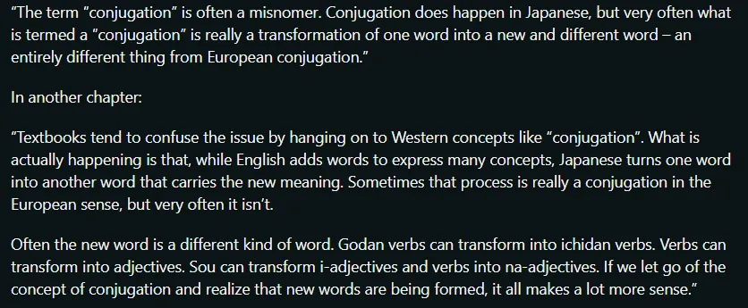
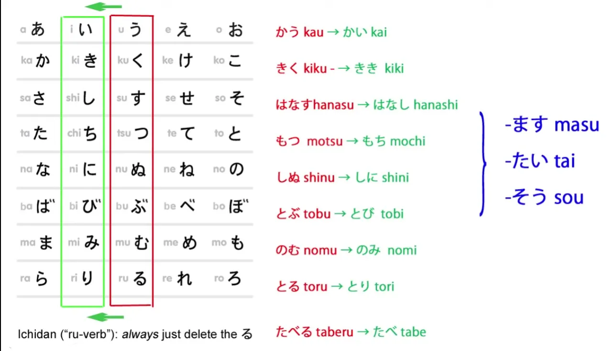
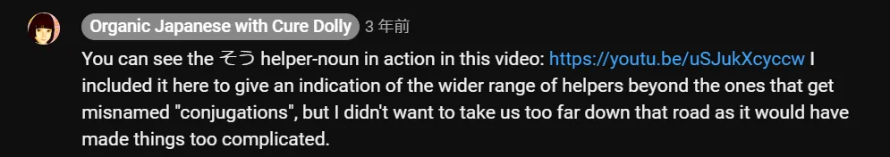
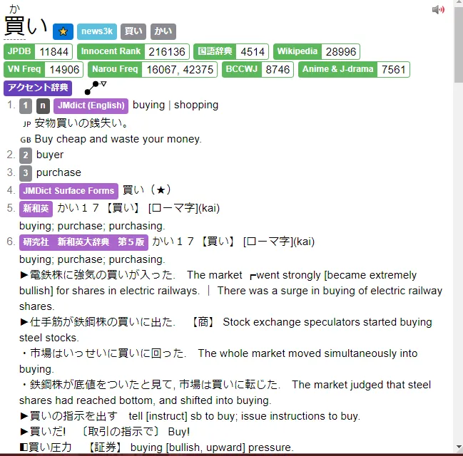
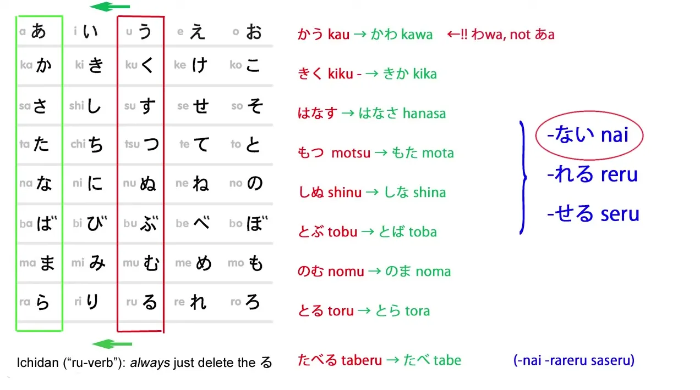
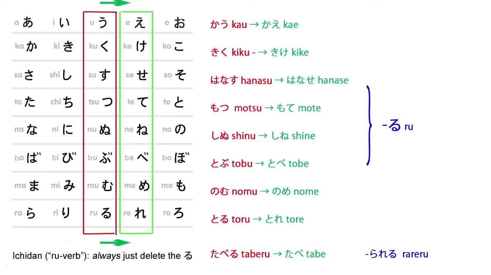
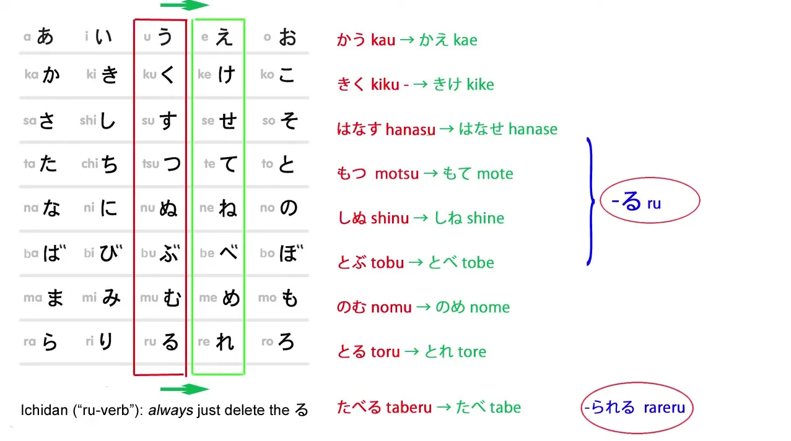
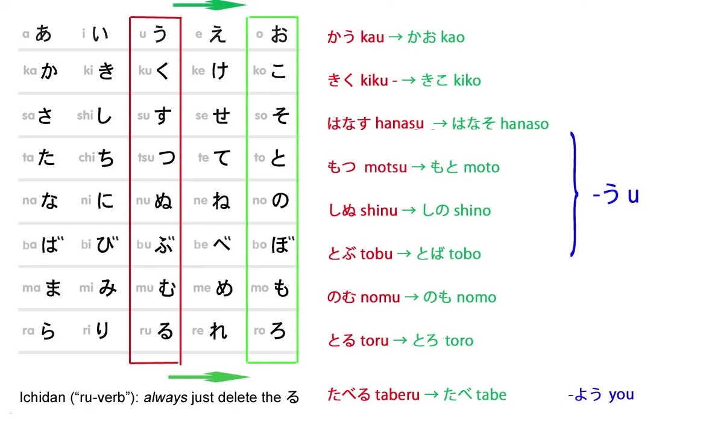

# **7.5. Спряжение**

[**Японское спряжение стало проще! Супер-простой ключ ко всем спряжениям.**](https://www.youtube.com/watch?v=FhyrskGBKHE&list=PLg9uYxuZf8x_A-vcqqyOFZu06WlhnypWj&index=8)

Сегодня мы поговорим о японском спряжении.

О каком именно спряжении? — спросите вы. Ну, обо всех. За исключением た- и て-форм, которые мы обсудим в другом видео[[81]](./81-global-principle-of-all-japanese-word-forms.md).

Почему мы разбираем их все сразу? Потому что можем. Потому что японское спряжение работает одинаково. Оно очень простое, очень логичное и очень последовательное, и очень-очень лёгкое для понимания.

Однако, когда мы заглядываем в учебник, у нас складывается впечатление, что существует множество различных правил и форм, которые нужно выучить для каждого конкретного спряжения. Почему так? Почему учебники делают это таким сложным, когда на самом деле это так просто?

Две причины. Первая в том, что они настаивают на этой **европейской концепции** спряжения. На самом деле, то, что мы делаем, вообще не является спряжением.

::: info
*Если вы действительно любите читать, под Уроком 13 есть ОЧЕНЬ длинное, [**интересное обсуждение**](https://www.youtube.com/watch?v=cvV6d-RETs8&lc=UgzXdC7vyB-XKN543tt4AaABAg) на эту тему, так что то, как вы это называете, зависит от вас; называть это спряжением нормально, особенно если это в основном так и называется, так что хотя бы ознакомьтесь с этим.*
:::

::: details Просто одна из моих сумбурных заметок о терминологии и другие размышления… (нажмите на стрелку, чтобы развернуть)
Лингвистически можно утверждать, что в японском языке действительно существует нечто вроде спряжения, но оно, кажется, сильно отличается от европейских языков, поэтому Долли, вероятно, избегает этого, чтобы мы не интерпретировали это таким образом и не запутались. Что касается того, почему большинство источников называют это спряжением.

Опять же, не воспринимайте это как окончательное утверждение, это просто для того, чтобы избежать некоторых ассоциаций, которые возникают со словом <code>спряжение</code> в контексте европейских языков, поскольку в японском языке существует форма спряжения, точно так же, как адъективные существительные — это, по сути, существительные, НО не собственные существительные (хотя это всего лишь одна из многих моделей).
Это просто для того, чтобы показать, что существует множество способов взглянуть на вещи, и это не строго чёрно-белое, это модель, и поскольку вы не можете объяснить всё сразу, вы упрощаете некоторые вещи.

---

Однако имейте в виду, что Долли иногда слишком негативно относится к учебникам (хотя некоторые из них действительны, учебники преследуют другие цели, и любой источник, который помогает вам начать массовое погружение, хорош) и иногда позиционирует себя как <code>лучший способ</code> освоения грамматики или использует такие кликбейтные заголовки в некоторых своих видео. Я не согласен с таким её подходом/подачей и отнёсся бы к этому с долей скептицизма. Поскольку Долли использует простые объяснения, чтобы сделать материал лёгким для понимания, некоторые вещи, которые она говорит, упрощены и подогнаны под её модель, а иногда она, по крайней мере, немного неточна/неправа, по крайней мере, судя по некоторым примерам, которые я слышал в обсуждениях в интернете и в некоторых Discord-каналах от людей, которые, казалось, имели более глубокое понимание японского, хотя я не буду делать никаких выводов, поскольку я далёк от того, чтобы быть авторитетом в чём-либо, связанном с японским, или делать такие выводы самостоятельно.

Если вы хотите узнать почему, посмотрите [**это обсуждение в Discord MoeWay**](https://discord.com/channels/617136488840429598/1170582570161950752). **Так что не воспринимайте Долли как истину в последней инстанции, а просто как полезный способ освоить основы японского, которые подтолкнут вас к погружению = что действительно важно.**

---

Мои объяснения — это всего лишь мои догадки и то, как я лично понимаю вещи, но они определённо не полностью точны, поскольку я не лингвист или что-то в этом роде (по крайней мере, пока нет и ещё очень долго нет, лол), так что, очевидно, то, что я говорю, также, вероятно, не совсем корректно и может быть неверным/неполным/упрощённым (поэтому я хочу, чтобы меня уведомляли обо всём, что я говорю неправильно, если вы заметите).

Но если утверждения верны и Долли действительно неправа хотя бы в некоторых случаях/частично, это всё равно в основном нормально, поскольку Долли здесь просто для того, чтобы представить самые основы, и там это не имеет большого значения, поскольку это можно <code>исправить</code> через погружение. Долли просто служит для того, чтобы подтолкнуть вас к погружению, а не показать вам полный японский; полный японский невозможно выучить, никакой язык невозможно… его можно приобрести только путём массового потребления и использования естественного, родного языка.

---

В лингвистике и грамматике всё непросто, и поэтому, если вы хотите объяснить это просто, вы должны пожертвовать некоторой точностью ради упрощения. Просто имейте в виду, что по мере углубления вещи становятся сложнее, и я бы воспринимал Долли просто как основу, а не как 100% правильную оценку японского, поскольку это, вероятно, даже невозможно, если вы не используете 100% родные японские продвинутые лингвистические источники и даже там есть расходящиеся мнения по некоторым вопросам, так что всё зависит от модели / фокуса.
:::

## Введение в спряжение

::: info
Вот что Долли говорит в своей книге <code>Unlocking Japanese</code> о спряжении, так что просто имейте это в виду:

:::

**То, что мы делаем постоянно, — это присоединяем простой вспомогательный глагол — или вспомогательное прилагательное, или вспомогательное существительное — к основам глагола.**

И как только мы увидим, как это работает, это станет очень-очень простым и лёгким для понимания.

Другая проблема в том, что они тратят много времени на объяснение изменений, которые происходят с точки зрения римской звуковой системы — алфавита. Но на самом деле это вызывает много путаницы и трудностей.

**Как только мы увидим это в тех терминах, в которых оно фактически существует, то есть в \*японской\* звуковой системе, всё станет очень логичным.**

Я бы сказала, что это на 100% последовательно, логично и просто — за исключением одного исключения во всей системе и двух неправильных глаголов, так что, возможно, лучше сказать, что это на 99,9% логично, последовательно и легко для понимания.

Хорошо. Итак, давайте я дам вам главную таблицу, которая покажет, как всё это работает.

チャートをください!

Итак, вот знакомая таблица японской каны со всеми звуками японского языка.

Я повернула её на бок, по причинам, которые скоро станут очевидны. Все японские глаголы заканчиваются одной из кан в среднем ряду — он выглядит как столбец, потому что я повернула его на бок. Это う-ряд — う, く, す, つ, ぬ и т.д.

Однако нет глагола, заканчивающегося на ゆ, поэтому мы можем убрать эти два столбца и упростить таблицу.

На самом деле, есть только один глагол, который заканчивается на ぬ — это しぬ, умирать — так что мы могли бы убрать и его, и сделать таблицу ещё проще, но я оставляю его для полноты.

Итак, **каждый глагол заканчивается одной из кан в красной рамке.** Давайте приведём пример каждого из возможных окончаний:
かう, покупать; きく, слышать; はなす, говорить; もつ, держать; しぬ, умирать; とぶ, летать; のむ, пить; とる, брать.

Теперь, как вы видите, есть четыре других возможных окончания, которые могли бы иметь глаголы, и на самом деле каждое из этих окончаний используется.

**И когда мы используем одно из других окончаний, глагол перестаёт быть глаголом и становится тем, что я называю «липкой основой», то есть основой, к которой мы что-то приклеиваем.**

## い-основа

Итак, вот い-основа.

::: info
Если вы задаётесь вопросом, почему そう здесь есть, но не упоминается. Это будет в Уроке 24. 
:::

С い-липкой основой мы меняем кану う-ряда на соответствующую кану い-ряда. Так, かう становится かい, きく становится きき, はなす становится はなし, и так далее.

Что же мы делаем с **い**-рядом липкой основы?

### Вспомогательный глагол ます

Ну, то, что вы все, я уверена, видели, это то, что мы можем присоединить вспомогательный глагол ます к い-ряду липкой основы.

**ます — это не спряжение. Это глагол. Это вспомогательный глагол, и он присоединяется к い-ряду липкой основы**. **Он не меняет значения глагола, но делает его формальным.** *(вежливым)*

Итак, かう — это обычная, неформальная версия, означающая «покупать»; かいます — это формальная версия. きく — это неформальная версия, «слышать»; ききます — это формальная версия.

### Вспомогательное прилагательное たい

Что ещё мы делаем с い-рядом липкой основы?

Ну, мы можем присоединить вспомогательное **прилагательное** たい. **たい — это вспомогательное прилагательное, которое означает «хотеть».**

Итак, かいたい означает «хотеть купить»; ききたい, «хотеть слышать»; はなしたい, «хотеть говорить», и так далее.

::: info
В то время как в английском это обычно переводится как глагол, в японском это прилагательное.
:::

### Преобразование глаголов в существительные

**Мы также используем い-ряд липкой основы для присоединения существительных, чтобы преобразовать глагол в новое существительное.**

Итак, かいもの, то есть «покупать-вещь»: это означает «покупки». のみもの, «пить-вещь», означает «напиток». はなしかた (かた означает «форма» или «вид»)... はなしかた означает «форма речи», «манера говорить».

Итак, теперь мы знаем, как присоединять всё это, за исключением так называемых <code>る-глаголов</code>, или итидан-глаголов, и они очень-очень просты, потому что всё, что вы когда-либо делаете с ними, это **просто отрезаете る, и у вас есть \*все\* возможные липкие основы итидан-глаголов.**

Итак, たべる становится たべ; たべます — это формальная форма глагола;
たべたい, хотеть есть; たべもの, «есть-вещь», еда.

::: info
Также существует существительное 買い (это существительное), которое означает «покупки», «покупка», «продукт» и т.д.
Так что оно похоже по значению, я не знаю, какая связь между ним и 買い物 или чем-то подобным, но просто чтобы вы знали, что есть несколько таких случаев. Это также показывает, что не каждое слово, заканчивающееся на い, автоматически является прилагательным, хотя подавляющее большинство таковыми являются... возможно, い было каким-то кандзи-существительным в прошлом, а теперь оно больше не принимает свою кандзи-форму???, кто знает…

:::

## あ-основа

Итак, теперь мы переходим к あ-ряду липкой основы, и здесь есть одно исключение.

И вы скажете: <code>Ах, языки! Полны исключений!</code>

**Это единственное исключение во всей системе**, и оно очень естественное, которое вы вполне можете понять.

Глагол, оканчивающийся на う, не становится <code>かあ</code>, **он становится <code>かわ</code>**, что гораздо легче произнести и понять в разговоре, не так ли?

Итак, かう не становится <code>かあない</code>, **он становится かわない.**

::: info
В комментариях под видео есть проницательный [**комментарий**](https://www.youtube.com/watch?v=FhyrskGBKHE&lc=UgzzF0FxyJJZX7z94Yp4AaABAg) от пользователя <code>pycage</code> о том, что это исключение на самом деле даже не является исключением, если рассматривать историю японского языка. Вы можете ознакомиться с ним, если вам интересно (o^▽^o) Но это довольно более продвинутое объяснение.
:::

Итак, для чего мы используем あ-окончание основы?

### Вспомогательное прилагательное ない

Я уже упоминала об этом[[7]](./7-negative-forms-and-adjectives-in-past-tense.md) — вероятно, наиболее распространённое использование — это присоединение вспомогательного прилагательного ない к липкой основе глагола.

**Оно присоединяется к あ-липкой основе**, так что かう, покупать, становится かわない, не покупать;
きく, слышать, становится きかない, не слышать;
はなす становится はなさない, не говорить, и так далее. Очень просто.

### Каузатив

Мы также используем あ-липкую основу для каузатива и так называемых <code>пассивных</code> форм глаголов *(рецептивных)*, и эти <code>спряжения</code> часто доставляют новичкам немало хлопот.

И я сделала видео *(позднее уроки)*, которые показывают, насколько они на самом деле просты, как они работают, что они означают, и насколько это на самом деле просто, если вы понимаете их такими, какие они есть.

Сегодня мы просто рассмотрим структуру.

Итак, каузативная форма глагола, которая означает **позволить кому-то что-то сделать или заставить кого-то что-то сделать**, образуется **путём присоединения вспомогательного глагола せる / させる к あ-ряду** липкой основы.

Теперь, я говорю せる / させる – что это значит?

**Ну, это означает, что на самом деле существует две формы этого вспомогательного глагола.**

せる присоединяется ко всем тем липким основам, с которыми мы работаем — ко всем тем, которые меняются.

::: info
Долли здесь имеет в виду годан-глаголы.
:::

А させる присоединяется к итидан — так называемому <code>る-глаголу</code> — липкой основе.

Там, где есть небольшое изменение во вспомогательном глаголе, мы всегда обнаруживаем, что более длинная версия присоединяется к итидан-глаголу, потому что этот глагол обычно короче.

---

У итидан-глагола мы отрезаем весь последний слог; у годан-глаголов, меняющихся липких основ, мы не отрезаем последний слог, мы меняем его на другой звук.

Итак, せる / させる образует каузативную форму глагола.

かう становится かわせる, позволить купить, заставить купить;
はなす становится はなさせる, позволить говорить, заставить говорить;

::: info
はなす — это годан-глагол, заканчивающийся на す, поэтому он меняется на あ-основу + せる, что выглядит так же, как итидан-каузативная форма させる. Долли объясняет подобные вещи в более поздних уроках.
:::

のむ, становится のませる, позволить пить, заставить пить;

и たべる становится たべさせる, позволить есть, заставить есть.

::: info
たべる — это итидан-глагол, поэтому он просто удаляет る и добавляет させる, чтобы образовать каузатив.
:::

### Рецептив / пассив

Так называемый пассив — который на самом деле не является пассивом *(об этом можно поспорить, но давайте пока придерживаться Долли)*, и у нас есть видео, которое поможет вам понять, что он на самом деле делает и насколько это на самом деле просто — так называемый пассив, **рецептивная форма**, образуется с помощью **вспомогательного глагола れる / られる**.

Итак, かう становится かわれる, что означает «быть купленным», «получить купленным» — **«получить купленным» лучше, потому что это ближе к тому, что на самом деле означает японский**, и вы поймёте это, когда посмотрите видео[[13]](./13-passive-conjugation-receptive-helper-verb.md);

きく становится きかれる, «быть услышанным»; のむ становится のまれる, «быть выпитым» — **я не имею в виду «стать пьяным», я имею в виду, как чашка кофе была выпита;** たべる становится たべられる, «быть съеденным».

---

Итак, как вы видите, на самом деле — помимо того одного исключения — нет множества разных способов присоединения этих элементов. Путаница возникает потому, что это представлено как *(<code>основанное на западной грамматике</code>)* спряжение и потому, что это объясняется так, как будто это было написано латинскими буквами.

Мы видим, что на самом деле это очень, очень регулярно.

Мы просто переходим к あ-ряду и добавляем вспомогательное прилагательное ない, вспомогательный глагол れる / られる, вспомогательный глагол せる / させる, и это так же просто.

## え-основа

Теперь мы переходим к え-ряду липкой основы.

Как и другие, это совершенно последовательно. Вы просто меняете кану う-ряда на соответствующую кану え-ряда.

Итак, かう становится かえ, きく становится きけ, はなす становится はなせ, и так далее.

### Потенциал

**Мы используем え-ряд липкой основы для создания потенциальной формы глаголов**, что означает, что вы <code>можете сделать</code> глагол.

Вспомогательный глагол, который приклеивается к え-ряду липкой основы, это る / られる.

**И да, хотя это просто る, всего один символ, это вспомогательный глагол** — если вы посмотрите его в японском словаре (не в японско-английском, а в настоящем японском словаре), вы найдёте る там как [助動詞]{じょどうし}, вспомогательный глагол — и у него есть эти две формы, る и られる.

**られる, как вы, возможно, заметили, совпадает с так называемым пассивом** *(рецептивом)*, れる / られる, так что итидан-форма пассива и потенциала одинаковы — но поскольку они используются очень по-разному, очень-очень мало случаев, когда вы могли бы их перепутать, так что это не проблема.

---

Итак, у нас есть かえる, «мочь купить»; きける, «мочь слышать»; はなせる, «мочь говорить», и так далее;
плюс たべられる, «мочь есть».
::: info
«мочь» в смысле <code>возможно / способен</code>, подробнее об этом в Уроке 10.
:::

## お-основа

Итак, теперь мы переходим к последней липкой основе, お-ряду липкой основы, и, как и в других случаях, это совершенно последовательно.

かう становится かお; きく становится きこ; はなす становится はなそ.

### Волитив

**И что мы делаем с этой липкой основой, так это присоединяем う, и, как вы знаете, う при присоединении к お обычно удлиняет お.**

Итак, かう не становится kao-u, **он становится かおう/kaō**;

::: info
Долли здесь имеет в виду произношение, не произнося отдельно o и u, а просто долгое o.
:::

きく становится きこう/kikō; はなす становится はなそう/hanasō.

Волитив имеет несколько применений, и я здесь говорю только о структуре, поэтому я просто использую одно из применений.

かう становится かおう, давайте купим; きく становится きこう, давайте послушаем, давайте услышим;
はなす становится はなそう, давайте поговорим.

**В итидан-форме мы добавляем よう к концу итидан-липкой основы.** *(И, конечно, удаляем る)*

Итак, たべる становится たべよう, давайте поедим.

**Одна особенность волитивной формы заключается в том, что вы также можете образовать её, изменив форму ます, чтобы использовать волитив в его формальном** *(вежливом)* **режиме.**

И когда вы это делаете, вы говорите ましょう вместо ます, и когда вы это делаете, вполне естественно, **вы используете い-ряд липкой основы, точно так же, как и с обычным ます.**

Итак, い**き**ましょう, давайте пойдём.