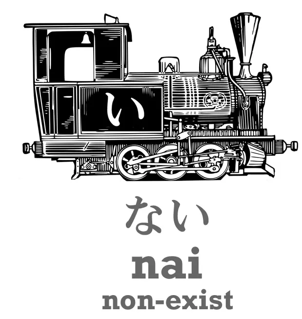
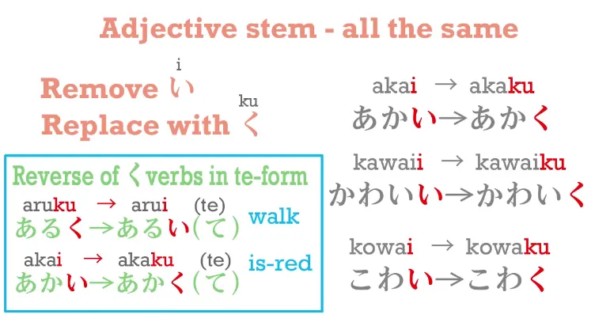
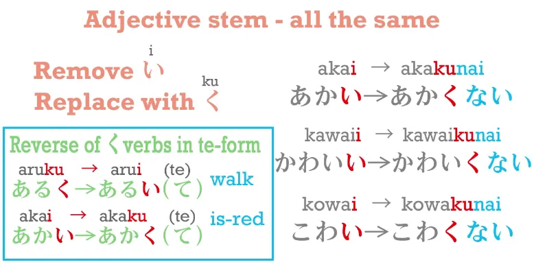
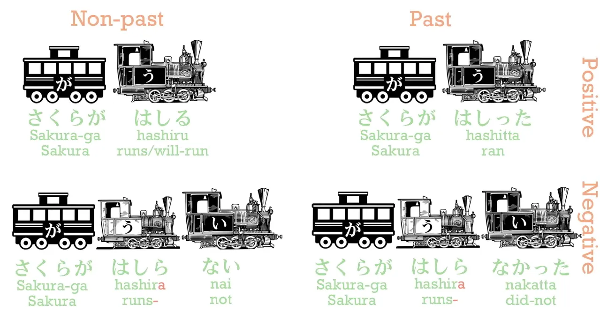
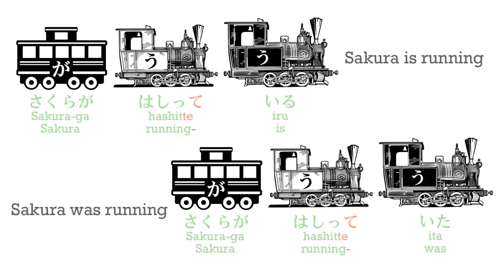
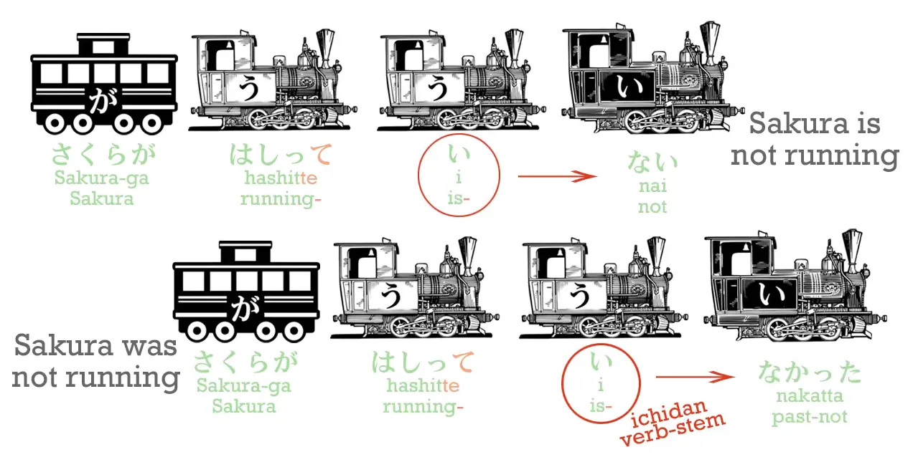
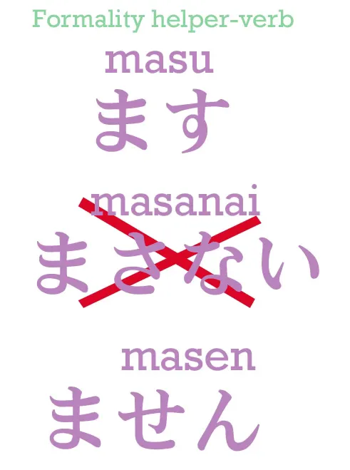

# **7. Отрицательные формы и прилагательные в прошедшем времени**

[**Урок 7: Секреты японских отрицательных глаголов и «спряжения» прилагательных**](https://www.youtube.com/watch?v=KIPhvGxp43c&list=PLg9uYxuZf8x_A-vcqqyOFZu06WlhnypWj&index=7)

Сегодня мы поговорим об отрицаниях. И для этого нам придётся раскрыть один из фундаментальных секретов японского языка, о котором школы и учебники почти никогда не рассказывают. Он делает весь японский язык намного, намного проще. Но прежде чем мы перейдём к этому, давайте рассмотрим фундаментальную основу японских отрицаний.

## Прилагательное に

**Фундаментальная основа отрицаний — это прилагательное <code>ない</code>.** Это прилагательное означает <code>не-существовать / не-быть</code>.

Слово для <code>существовать</code> для любого объекта, любой неодушевлённой вещи, неба, моря, вселенной, рисового зёрнышка, цветка, дерева, чего угодно, — это <code>ある</code>. Итак, если мы хотим сказать: <code>Есть ручка / Ручка существует</code>, мы говорим <code>ペンがある</code>. Но если мы хотим сказать, что ручки нет, мы говорим <code>ペンがない</code>.

Теперь, почему мы используем глагол для бытия и прилагательное для небытия? Потому что это происходит во всём японском языке. Всякий раз, когда мы ЧТО-ТО ДЕЛАЕМ, мы используем глагол. Будь то ходьба, пение, бег или что угодно — это глагол. **Но если мы этого не делаем, то мы присоединяем <code>ない</code> к глаголу, и это становится локомотивом предложения.** Итак, когда мы говорим, что мы **не** делаем что-то, **мы не используем глагол, мы используем прилагательное.**

Почему так? Потому что японский язык очень логичен. Когда мы что-то делаем, происходит действие. Это глагол. Но когда мы этого не делаем, никакого действия не происходит, и мы описываем состояние бездействия. Итак, это прилагательное. Хорошо.

Итак, если мы хотим сказать: <code>Ручки нет</code>, мы говорим <code>ペンがない.</code> Но что, если мы хотим сказать: <code>Это не ручка</code>? Это не совсем одно и то же, не так ли? Итак, как мы это скажем?

Если мы хотим сказать: <code>Есть ручка</code>, как мы знаем, мы говорим <code>これは (</code>これ<code> – </code>это<code>)... これはペンだ</code>. <code>Что касается этого, ручка = / Что касается этого, это ручка.</code>

::: info
В видео Долли допускает ошибку и показывает чёрный вагон <code>が</code> в <code>ペンだ</code>.
Я исправил(а) это с помощью своих «высокопрофессиональных» навыков в Paint (•̀o•́)ง… в любом случае, вот её комментарий.

:::

Но если мы хотим сказать: <code>Это не ручка</code>, мы говорим <code>これは *(zeroが)* ペンではない</code>.

Итак, что это значит? **Ну, <code>で</code> — это て-форма <code>だ</code> или <code>です</code>.** Итак, у нас всё ещё есть <code>これはペンだ</code> в форме <code>これはペンで</code>, а затем мы присоединяем <code>ない</code>. Итак, мы говорим: <code>Что касается этого, что касается бытия ручкой, этого нет / Это не ручка</code>. Хорошо.

## Отрицательные формы глаголов

Итак, теперь перейдём к самой большой части этого вопроса — глаголам. Чтобы поставить глагол в отрицательную форму, **мы должны присоединить <code>ない</code>,** **и мы делаем это, присоединяя его к あ-основе.**

Что это значит? Ну, давайте посмотрим на систему основ. Японская система глагольных основ — это самая простая, самая логичная и самая красивая система трансформации глаголов в этом мире. Она почти абсолютно регулярна. Как только вы узнаете, как это делать, вы сможете выполнить любую трансформацию (за исключением て- и た-форм, которые вы уже знаете).

Но школы и учебники не говорят вам этого. Вместо того чтобы рассказать вам это, они представляют каждое <code>спряжение</code>, как они его называют (а это на самом деле не спряжения)... они представляют каждое как отдельный случай с отдельными правилами, которые кажутся случайными. И поскольку они не рассказывают вам фундаментальную логику всей системы, и поскольку они описывают происходящие изменения так, как будто они были написаны латинским алфавитом, хотя на самом деле они написаны каной, это действительно так выглядит.

---

Студенты действительно думают, что им нужно рассматривать каждый случай как отдельный и изучать отдельные правила в каждом случае. А вам не нужно. Вам просто нужно знать систему основ.

Итак, давайте посмотрим на неё. Как мы уже узнали, каждый глагол оканчивается на одну из кан う-ряда. И я поворачиваю таблицу на бок здесь по причинам, которые вы скоро увидите. Итак, эти каны в красной рамке — это те, которыми может оканчиваться глагол. Это не каждая кана う-ряда, но большинство из них. Итак, у нас есть глаголы, такие как <code>かう</code> (покупать), <code>きく</code> (слышать), <code>はなす</code> (говорить), <code>もつ</code> (держать) и т.д.

Теперь, как вы видите, есть четыре других возможных способа, которыми может оканчиваться глагол. И каждый из этих четырёх способов используется, и они называются глагольными основами.

Сегодня мы рассмотрим только あ-основу, потому что именно она нам нужна для отрицания. Итак, чтобы образовать あ-основу, мы просто сдвигаем последнюю кану глагола из う-ряда в あ-ряд. Итак, <code>きく</code> (слышать) становится <code>きか</code>, <code>はなす</code> (говорить) становится <code>はなさ</code>, <code>もつ</code> (держать) становится <code>もた</code>, и так далее.

В этой системе есть только одно исключение — и когда я говорю это, я имею в виду всю систему, все основы — есть только это одно исключение, которое заключается в том, что **когда слово оканчивается на кану <code>う</code>, основа не меняется на <code>-あ</code>, она меняется на <code>わ</code>.** Итак, отрицательная форма <code>かう</code> — это не <code>かあない</code>, это <code>かわない</code>. И только в あ-основе у нас есть это исключение, так что это единственное исключение во всей системе, и вы можете понять, почему оно существует: <code>かあない</code> не так легко произнести, как <code>かわない</code>, не так ли?

**Все остальные абсолютно регулярны.** <code>きく</code> (слышать) становится <code>きかない</code> (не-слышать); <code>はなす</code> (говорить) становится <code>はなさない</code> (не-говорить); <code>もつ</code> (держать) становится <code>もたない</code> (не-держать), и так далее.

И как мы уже знаем, **с итидан-глаголами они всегда просто отбрасывают <code>-る</code> и добавляют то, что мы хотим добавить**, так что <code>たべる</code> (есть) становится <code>たべない</code> (не-есть). И это всё. Вот как мы делаем любой глагол отрицательным. Это очень, очень просто.

## Отрицательные формы прилагательных

Теперь, что насчёт прилагательных? Как мы делаем прилагательные отрицательными? Ну, когда мы делаем трансформацию с прилагательным, **мы всегда превращаем <code>-い</code> в конце его в <code>-く</code>:** <code>あかい</code> (является-красным) становится <code>あかく</code>; <code>かわいい</code> (является-милым) становится <code>かわいく</code>; <code>こわい</code> (является-страшным) становится <code>こわく</code>.

И это способ, которым мы делаем て-форму прилагательных: <code>あかく</code> становится <code>あかくて</code>.

**И это также способ, которым мы делаем отрицание:** <code>あかい</code> становится <code>あかくない</code> (не-красный).

Теперь, что интересно, это <code>-く</code> противоположно тому, что происходит в て-форме, не так ли? Если слово оканчивается на <code>-く</code>, в て-форме мы превращаем это <code>-く</code> в <code>-い</code>. **Но в прилагательном мы превращаем <code>-い</code> в <code>-く</code>.**

::: info
Долли здесь делает небольшую опечатку, в видео она пишет <code>かわいく</code> как <code>あわいく</code>. Я исправил(а) это.
:::

## Прилагательные в прошедшем времени

Если мы хотим поставить прилагательное в прошедшее время, **мы убираем <code>-い</code> и используем <code>-かった</code>.** Итак, <code>こわい</code> (является-страшным) становится <code>こわかった</code> (был-страшным). И поскольку <code>ない</code> также является い-прилагательным, когда мы ставим его в прошедшее время, мы также говорим <code>なかった</code>. Итак, если мы хотим сказать: <code>Сакура бегает</code>, мы говорим <code>さくらがはしる</code>; если мы хотим сказать: <code>Сакура не бегает</code>, мы говорим <code>さくらがはしらない</code>; если мы хотим сказать: <code>Сакура бегала (в прошлом)</code>, мы говорим <code>さくらがはしった</code> — потому что это годан-глагол;

::: info
Обратите внимание на <code>っ</code> перед <code>た</code> вместо просто <code>た</code>, как указано в Уроке 5, Годан-глаголы, Группа 1.*
:::

и если мы хотим сказать: <code>Сакура не бегала (в прошлом)</code>, мы говорим <code>さくらがはしらなかった</code>. <code>はしらない</code>, а затем мы ставим <code>ない</code> в прошедшее время: <code>はしらなかった</code>.

Теперь, как мы все знаем. <code>さくらがはしる</code> — довольно неестественный японский, так же как и довольно неестественный английский. Мы говорим <code>Sakura is running</code> в английском, а в японском мы говорим <code>さくらがはしっている</code>. Итак, если мы хотим поставить всё это в прошедшее время, что мы делаем? Ну, всё, что нам нужно сделать, это поставить этот <code>いる</code> в прошедшее время.

Итак, мы говорим <code>さくらがはしっていた</code> – <code>Сакура бегала</code>.

И если мы хотим сказать: <code>Сакура не бегала</code>, мы говорим <code>さくらがはしっていなかった</code>. Этот <code>いる</code> — простой итидан-глагол, поэтому мы просто отбрасываем <code>-る</code> и добавляем <code>た</code> *(положительное прошедшее)* или <code>ない</code> *(отрицательное)*, а в прошедшем времени — <code>なかった</code>. *(поскольку <code>ない</code> в прошедшем времени становится <code>なかった</code>)*

**Я всегда говорю, что японский язык похож на Лего.** **Как только вы знаете основные строительные блоки, вы можете построить что угодно.** **И в японском языке почти нет исключений.**

## Исключения

Во всём, о чём мы сегодня говорили, на самом деле есть всего два исключения. И я собираюсь представить их, чтобы вы знали всё, что вам нужно знать.

**Единственное реальное исключение из правила, по которому каждый глагол становится отрицательным путём добавления <code>ない</code>, — это глагол <code>ます</code>, который является вспомогательным глаголом, делающим слова формальными.** *(вежливыми)* **Мы добавляем его к い-основе глагола**, и мы рассмотрим い-основу позже, но я думаю, вы уже можете догадаться, что это такое.

Итак, <code>はなす</code> становится <code>はなします</code>, <code>きく</code> становится <code>ききます</code> и так далее. Когда вы ставите <code>ます</code> в отрицательную форму, он не становится <code>まさない</code>, как вы могли бы ожидать — **он становится <code>ません</code>.**

**Поскольку это формальная форма, она немного старомодна и использует старое японское отрицание <code>せん</code> вместо <code>ない</code>.**

::: info
Долли здесь снова делает опечатку в видео, я снова исправил(а) это.

:::

Единственное другое очевидное исключение заключается в том, что <code>いい</code>, прилагательное <code>[良]{い}い</code>, которое означает <code>является-хорошим</code>, имеет более старую форму, <code>[良]{よ}い</code>, которая всё ещё довольно часто используется. И **когда мы делаем любую трансформацию с <code>いい</code>, оно возвращается к <code>よい</code>**, поэтому в прошедшем времени мы не говорим <code>いかった</code>, **мы говорим** <code>**よ**かった</code> — и если вы много смотрели аниме, вы, вероятно, часто это слышали.

<code>よかった</code>, буквально <code>(zeroが)よかった</code> – <code>(Это) было хорошо / Всё хорошо получилось / Отлично</code>. И если вы хотите сказать, что что-то нехорошо, вы не говорите <code>いくない</code>, **вы говорите** <code>**よ**くない</code>. И это единственные исключения.