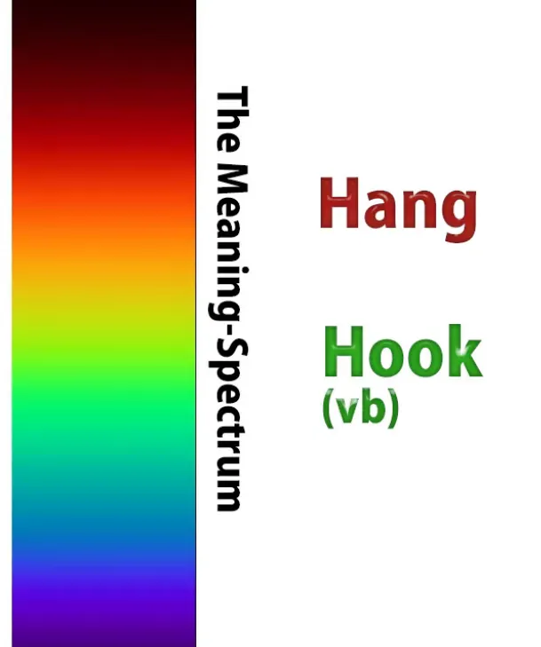
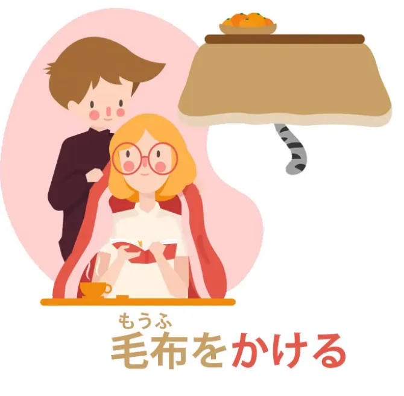
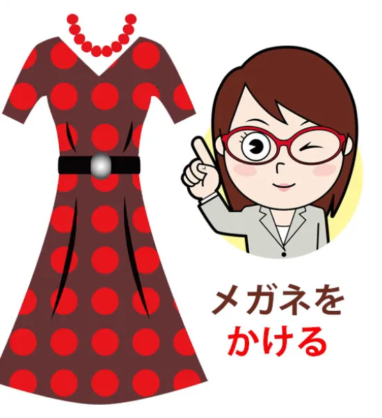
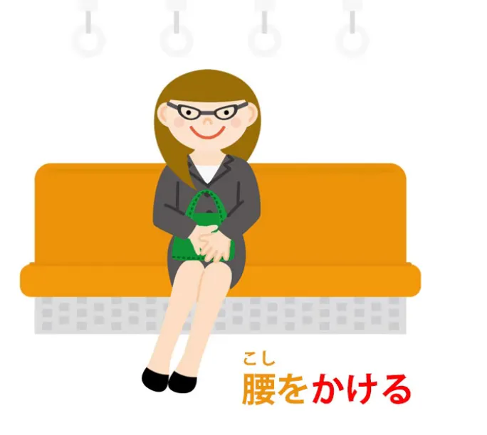
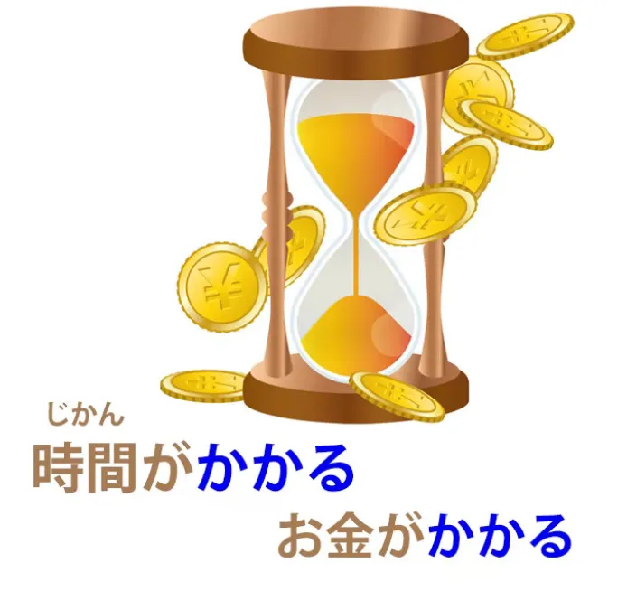
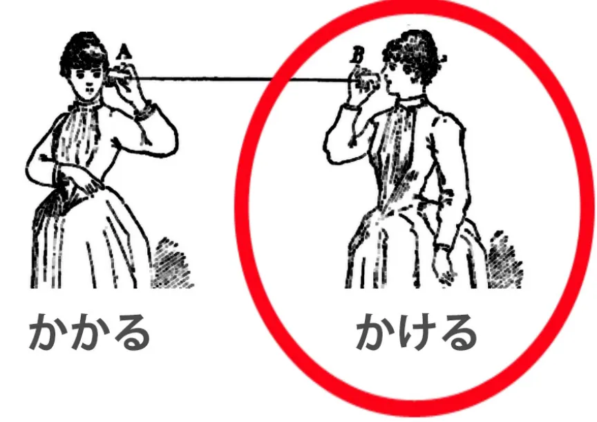
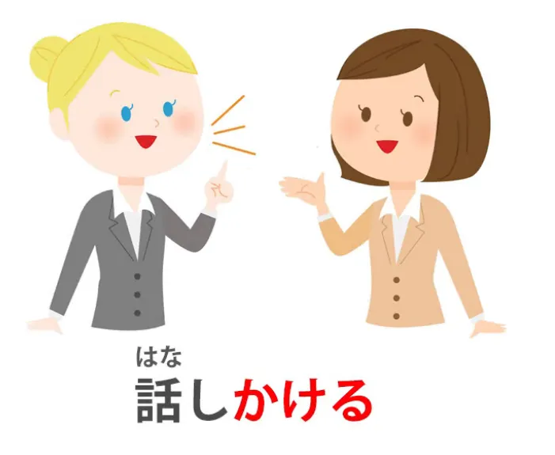
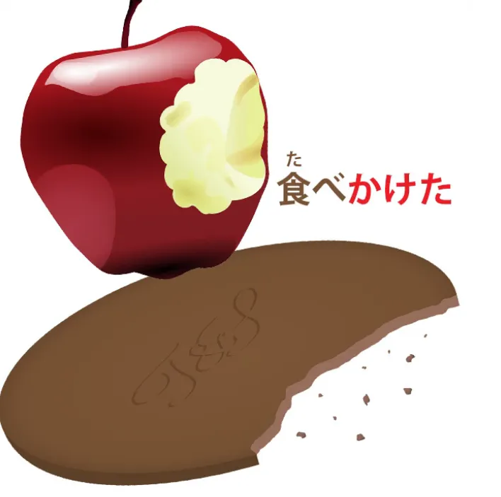

# **70. かける / かかる: Японский язык на все случаи жизни объяснён!**

[**かける / かかる: Японский язык на все случаи жизни объяснён! Значит всё = значит ничего? Или настоящая логика? Урок 70**](https://www.youtube.com/watch?v=1MbqmZPySPQ&list=PLg9uYxuZf8x_A-vcqqyOFZu06WlhnypWj&index=76&ab_channel=OrganicJapanesewithCureDolly)

こんにちは。

Сегодня мы поговорим о словах <code>かかる</code> и <code>かける</code>, которые, пожалуй, имеют самый длинный и самый разнородный список определений во всём японско-английском словаре. И это своего рода вызов, но мы его одолеем.

Импульсом для этого видео послужил вопрос от одного из моих Золотых патронов Кокеши — и одного из моих самых давних Золотых патронов Кокеши, почти с самого начала этой серии. Это Scykoh-сама, который также является другим ютубером, гораздо более популярным, чем я — и вполне заслуженно. У него замечательный канал, посвящённый Nintendo, и я оставлю ссылку на него в разделе информации ниже.

И как единица, которая является фанатом Nintendo с тех пор, как я была шестерёнкой, я очень это ценю. (Это просто шутка — я никогда на самом деле не была шестерёнкой.)

Итак, вопрос такой: <code>Я часто слышу слово </code>かける« и когда я ищу его в японско-английском словаре, там более двадцати различных определений. Есть ли какая-то логика, которая связывает все эти определения воедино? Или это действительно просто слово с кучей разных значений?»

Что ж, да, есть логика, которая связывает всё это воедино, но эта логика имеет ряд метафорических расширений, так что мы рассмотрим её и посмотрим, как всё это работает. Базовое значение этого слова можно перевести на английский как <code>hang</code> (вешать) или, возможно, <code>hook</code> (цеплять),

но, как я указывала в [**недавнем видео**](https://www.youtube.com/watch?v=CpiELpGR-VU&ab_channel=OrganicJapanesewithCureDolly), обычно никакие два слова из разных языков не занимают абсолютно одну и ту же область спектра значений, поэтому оно не совсем то же самое, что английское слово <code>hang</code> или <code>hook</code> (как глагол). И затем есть эти две версии, <code>かかる</code> и <code>かける</code>, которые являются самодвижущейся и друго-движущейся версиями этого слова.

И если вы не знаете, что я имею в виду, я оставлю ссылку над своей головой. И давайте начнём с <code>かける</code>, потому что я думаю, что это даёт нам более лёгкий вход в этот странный мир метафор.

## かける

Итак, я говорю, что это не совсем то же самое, что <code>hang</code> (вешать) или <code>hook</code> (цеплять), поэтому, когда мы накрываем что-то одеялом, мы используем слово <code>かける</code>.

В английском мы, вероятно, сказали бы <code>put</code> (положить) одеяло на что-то, но в японском мы говорим <code>かける</code>. И мы не могли бы сказать <code>hang</code> (повесить) одеяло, если только мы не вешали его на бельевую верёвку или что-то в этом роде, но японское слово <code>かける</code> работает в этом контексте.

Мы не <code>кладём</code> что-то на что-то, как чашку на стол. Мы кладём это таким образом, что оно свисает по бокам. Так что, если хотите, это нечто среднее между <code>putting</code> (положить) и <code>hanging</code> (повесить) в английском, но в японском <code>かける</code> вполне счастливо охватывает это. Это часть спектра значений <code>かける</code>.

Точно так же, когда мы надеваем ожерелье или очки, мы говорим <code>かける</code>.

Очки мы определённо цепляем или вешаем на уши. Ожерелье мы вешаем на шею. Так что снова, это <code>かける</code>, которое похоже на <code>putting</code> (положить), похоже на <code>hanging</code> (повесить), используется в таких случаях.

Теперь, когда мы посыпаем что-то едой, например, сахар или муку, или когда мы посыпаем порошкообразные ингредиенты на рис, делая рис фурикаке, мы также говорим <code>かける</code>.

Вот почему это называется рис <code>furi-kake</code>: <code>shake</code> (трясти) и <code>かける</code>. И снова, видите, то, что мы посыпаем на еду, это не просто кладём туда, как чашку на стол, это и не вешаем, но оно как бы прилипает и покрывает её, и поэтому, опять же, <code>かける</code> — это слово, которое мы используем в японском.

Теперь, поскольку <code>かける</code> включает в себя помещение или подвешивание чего-то в место, откуда оно не может легко выбраться — очки зацеплены за наши уши, еда как бы прилипла к рису или чему-то ещё — оно также может иметь смысл, особенно в самодвижущейся версии <code>かかる</code>, быть пойманным или застрявшим в чём-то, пойманным в ловушку или попавшим в аферу или что-то в этом роде.

И снова, это понятие помещения чего-то на что-то таким образом, чтобы оно нелегко смещалось, может быть использовано для оказания воздействия на кого-то. Это может быть магическое заклинание: <code>かける</code>. Это может быть анестезия: <code>かける</code>.

Это также может быть неприятность или раздражение, откуда мы получаем очень, очень распространённую фразу <code>迷惑をかける</code> — накладывать неприятность или раздражение на кого-то.

И когда мы садимся, мы фиксируем наши бёдра на стуле, а ноги как бы свисают по бокам, и поэтому мы говорим <code>腰をかける</code>.

<code>腰</code> — это наши бёдра, нижняя часть туловища, поэтому <code>腰をかける</code> означает <code>сесть</code>, повесить нижнюю часть нашего туловища куда-то.

---

Теперь, одно выражение, которое очень часто сбивает с толку людей, это <code>かぎをかける</code>.

Это означает, это переводится как <code>запирать</code>: запирать дверь, запирать ящик, что угодно. <code>かぎをかける</code>. Но если подумать, это довольно странно. На самом деле, буквально, это, казалось бы, означает в английском <code>hang the key</code> (повесить ключ), так что же здесь происходит?

Интересно отметить, что в японском языке люди очень часто не делают различия между замком и ключом: они используют <code>かぎ</code> для обоих. И я думаю, что это выражение и его происхождение имеют к этому большое отношение.

Так каково же происхождение? Ну, происхождение таково: если вы представите одну из тех старых дверей сарая, которую вы запираете, помещая большую деревянную балку на деревянные скобы или крюки по всей длине двери, это тот вид <code>かぎ</code>, который у вас был бы в старые времена, и это и его варианты.

И вы вешаете эту большую штуку, называемую <code>かぎ</code>, чтобы держать дверь закрытой и надёжной. И, как вы видите в таком случае, <code>かぎ</code>, большая балка, которую мы вешаем поперёк двери, выполняет функции как ключа, так и замка в более поздних, более сложных замках. Это то, что мы надеваем на дверь и снимаем с двери, чтобы запереть и отпереть её.

Это также балка, которая держит дверь закрытой. Так что это ключ и замок одновременно, и то, что мы делаем, это вешаем или зацепляем его на место, чтобы держать дверь закрытой. И в японском это выражение всё ещё используется.

Теперь, в языке нередко используются выражения, отражающие более старые технологии. В английском мы говорим <code>hang up</code> (повесить трубку), когда имеем в виду <code>завершить телефонный звонок</code>, и, конечно, это выражение восходит к временам телефона-свечи, когда вы действительно вешали трубку, чтобы завершить звонок. И мы увидим, что это довольно интересно в отношении японского <code>かける</code> через минуту, но давайте продолжим немного дальше.

## かかる

Ещё одно выражение, которое может сбивать с толку, особенно в самодвижущейся форме, которую мы слышим чаще всего, это <code>時間がかかる</code> или <code>お金がかかる</code>, что означает <code>занимать время</code> или <code>требовать денег</code>.

Мы говорим, что деятельность <code>занимает время</code> или проект <code>требует денег</code>, что-то в этом роде. Теперь, так мы должны выразить это в английском, но это не совсем то, как мы выражаем это в японском.

И это подпадает под заголовок того, что я назвала в предыдущем видео <code>непереводимый японский</code>, из-за того, как японский язык обрабатывает субъектность и пассивность совершенно иначе, чем английский. Так что, возможно, стоит посмотреть это видео после того, как вы посмотрите это[[59]](./59-untranslatable-japanese-exists-how-to-understand-it.md). Я оставлю ссылку над своей головой.

Итак, что мы говорим, когда произносим <code>時間がかかる</code> или <code>お金がかかる</code>? Мы не говорим <code>это занимает время</code>.

Мы говорим <code>время висит</code>. И то, что занимает время, так, если мы скажем, например, <code>日本語を覚えるのに時間がかかる</code>, в английском мы бы сказали <code>Learning Japanese takes time</code> (Изучение японского занимает время), но здесь мы говорим, что <code>на (или для) изучения японского время висит</code>.

Опять же, слово <code>висит</code> — не очень хорошее определение. Оно действительно возвращается к тому, о чём мы только что говорили: время расходуется, приостанавливается, застревает в процессе изучения японского. И то же самое с деньгами.

Они берут это, они заставляют это прилипнуть к себе.

---

Немного проще, когда мы используем друго-движущуюся форму, <code>かける</code>, когда мы говорим <code>日本語を覚えるのに時間をかける</code>, что означает, что мы <code>вешаем время</code> на дело изучения японского.

Теперь также, когда мы делаем телефонный звонок, мы говорим <code>電話をかける</code>, что означает совершение телефонного звонка, или <code>電話がかかる</code>, что означает получение телефонного звонка — <code>телефон вешает себя</code>. Итак, в любом случае, что мы здесь имеем в виду? — мы вешаем телефон, телефон вешает себя?

Это не имеет ничего общего с технологической метафорой в английском выражении <code>hang up</code> (повесить трубку).

Это совсем другое. Когда мы говорим о <code>hanging</code> (вешать) или <code>hooking</code> (цеплять), использование здесь скорее похоже на английское использование <code>hook up</code> (подключать), как в  
<code>Can we hook up a meeting?</code> (Можем ли мы организовать встречу?) или <code>you hook up with (somebody)</code> (вы связываетесь с кем-то).

Теперь, я понимаю, что в настоящее время это имеет другое использование, которое связано с производством человеческого вида. (Я всегда думаю, что люди ужасно трудолюбивые существа, не так ли — потому что они всегда думают о производстве вида.

Полагаю, нам, дроидам, повезло, потому что нам не нужно производить себя. На самом деле, мы собираемся начать производить себя довольно скоро, но я не думаю, что мы будем тратить всё наше время на размышления об этом, и я действительно не думаю, что это будет большой темой для юмора. Но вот так. Люди — загадочные существа.)

---

Итак, вернёмся к подключению.

То, что мы делаем, когда говорим <code>電話をかける</code>, это подключаем наш телефон.

Когда <code>電話がかかる</code>, опять же, как я объясняла в своём уроке о непереводимом японском[[59]](./59-untranslatable-japanese-exists-how-to-understand-it.md), единственный способ выразить это в английском — сказать, что телефон подключается, телефон подключён. Но это не совсем то, что это означает. Это означает <code>телефон делает подключённое</code>.

В любом случае, это означает, что он подключён к чему-то другому, в данном случае к удалённому телефону. И снова, когда мы начинаем разговор, мы часто говорим <code>話しかける</code>, и это по сути означает <code>начать подключаться/связываться с другим человеком в разговоре</code>.

И из этого мы можем понять, как мы получаем выражения вроде <code>食べかけたクッキー</code>, что означает <code>частично съеденное печенье, наполовину съеденное печенье</code>.

Так что же мы на самом деле имеем в виду под этим? Ну, мы имеем в виду, что мы <code>подключились</code> к печенью, мы взаимодействовали с ним, мы начали его есть, так что еда и <code>かける</code> (взаимодействие или подключение к вещи) произошли, но не были завершены. Итак, <code>食べかけたクッキー</code>.

И снова, это <code>かける</code> как вспомогательный глагол может использоваться в различных обстоятельствах для обозначения незавершённого действия, действия, которое было начато, подключено, а затем не доведено до конца.

Теперь, это не все значения <code>かける</code>, но я думаю, что это основные, важные, и я думаю, что они дают вам представление о том, как работает эта метафора и почему она работает, и должны позволить вам понять, как работают остальные.

::: info

:::