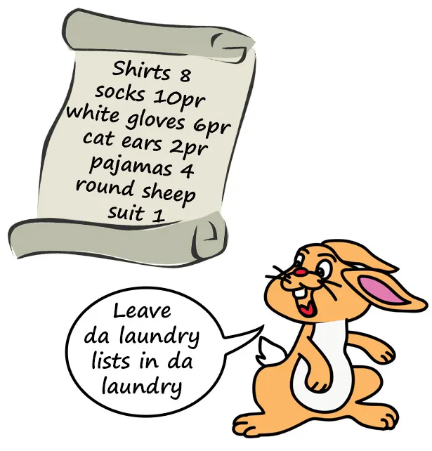
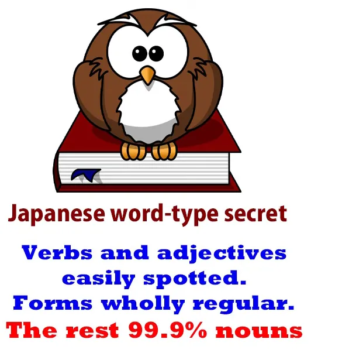
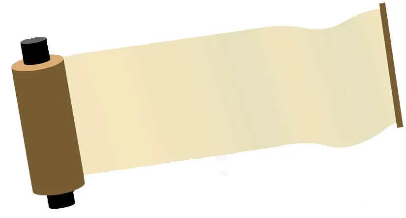
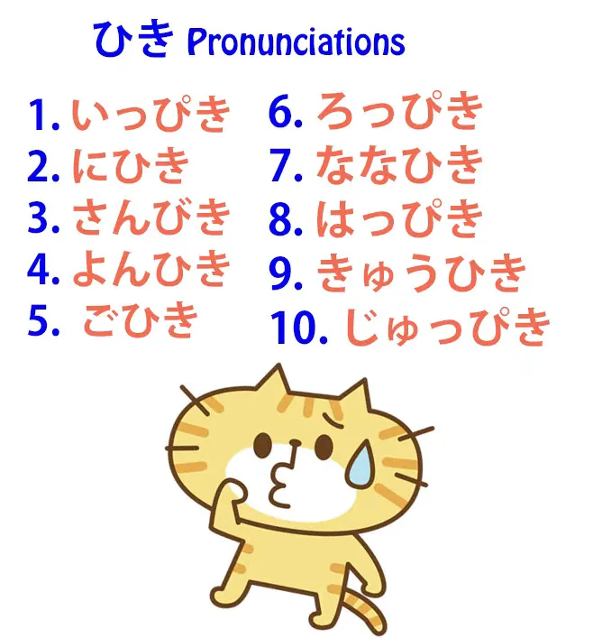
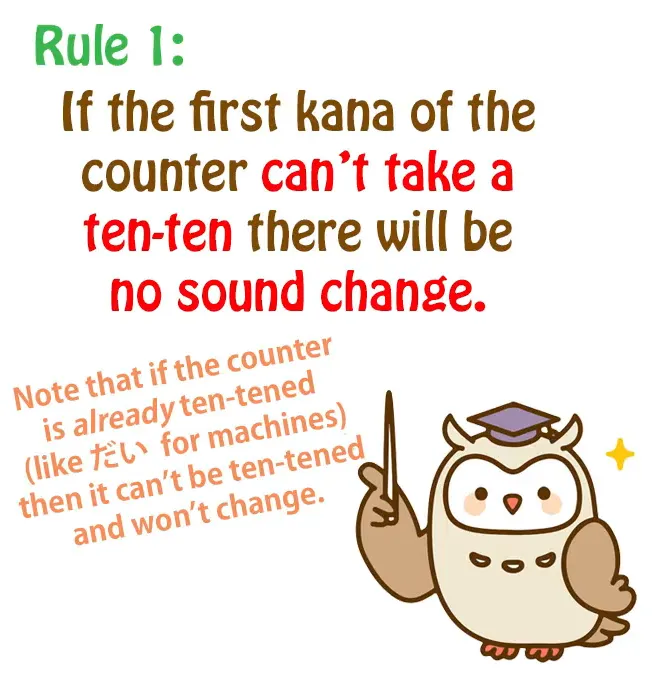
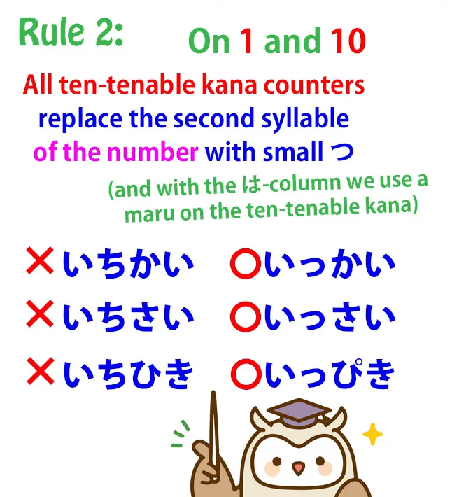
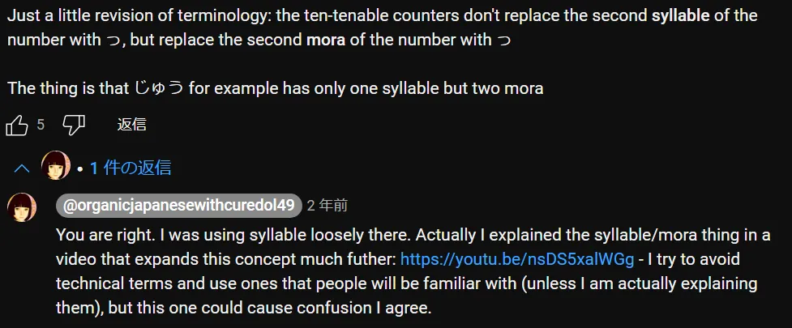
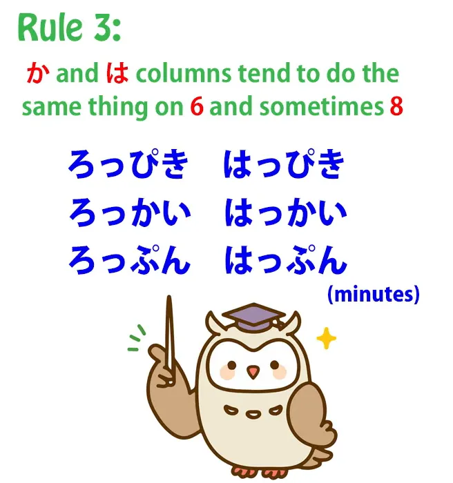

# **71. Японские счётные слова: 3 простых правила**

[**Японские счётные слова: 3 простых правила делают их лёгкими! Урок 71**](https://www.youtube.com/watch?v=OA78aKz0oIQ&list=PLg9uYxuZf8x_A-vcqqyOFZu06WlhnypWj&index=73&ab_channel=OrganicJapanesewithCureDolly)

こんにちは。

::: info
Здесь пригодятся Yomichan или Rikaichamp… Я решила использовать в основном формы кандзи, так как мне кажется, что так счётные слова будут видны лучше, даже если их будет сложнее читать.
:::
Сегодня мы поговорим о счётных словах в японском языке.

Как мы все знаем, учебники любят представлять японский язык как некий таинственный язык, полный совершенно случайных и иррациональных правил и элементов, которые мы просто обязаны выучить, потому что для них нет никакой особой причины. И, как вы все знаете, если вы следите за моими видеоуроками, в большинстве случаев это неправда. Большая часть того, что происходит в японском языке, совершенно разумна и логична, если вы просто знаете, как это работает, чего, похоже, не знают люди, пишущие учебники.

*(или, скорее, они знают, но упрощают для двуязычных учащихся, поскольку это всего лишь учебники…)*

Однако счётные слова могут показаться исключением из этого правила. Их очень много. Ужасно много счётных слов. В японском нельзя просто сказать <code>одна собака</code> или <code>два цветка</code> или <code>три птицы</code>.
Вы должны использовать счётное слово.

Так, мы говорим <code>一匹の犬 / いっぴきの犬</code> — <code>одна собака</code> — и счётное слово здесь <code>[匹]{ひき}</code>, которое в данном конкретном случае произносится как <code>ぴき</code>. *(Это счётное слово для мелких животных)*

Для <code>трёх птиц</code> мы говорим <code>三羽の鳥 / さんわの鳥</code>, а <code>[羽]{わ}</code> — это счётное слово *(для птиц…)*. Так что, похоже, нам придётся выучить ужасно много счётных слов, не так ли, просто чтобы сказать то, что в английском можно сказать числом и предметом. И их действительно очень много — десятки и десятки *(на самом деле, сотни (″ロ゛)*.

Так что это выглядит как проблема, не так ли? Но на самом деле это не такая уж большая проблема, как кажется.

Прежде всего, хотя счётных слов ужасно много, только около дюжины из них действительно часто используются *(Слава тебе, Господь Дио…ε=ε=┌(;￣▽￣)┘)*.

---

Во-вторых, в большинстве случаев мы можем избежать их, используя исконно японскую систему счёта, которая не требует счётных слов.

Так что, если мы используем систему счёта <code>一つ, 二つ, 三つ, 四つ, 五つ</code>, нам не нужны никакие счётные слова. Мы можем использовать их почти для всего — не для людей, не для мелких животных, но практически для всего остального мы можем использовать японскую систему счёта, если захотим.

Так что здесь важно, и я уверена, вы не удивитесь, услышав это от меня, что мы не будем начинать учить списки счётных слов.

Это, если позволите мне такое выражение, было бы просто контрпродуктивно. И есть несколько причин, почему нам это не нужно.

## Запоминать счётные слова не обязательно

Прежде всего, с точки зрения понимания японского языка, они вообще не представляют особых проблем. Если мы слышим, как кто-то произносит число и знакомый нам предмет, и между ними есть маленькое слово, мы знаем, что это счётное слово.

Так что мы знаем, что они сказали. Если они говорят <code>一輪の花</code>, мы знаем, что они говорят <code>один цветок</code>. <code>一... 花</code>, а <code>[輪]{りん}</code> должно быть счётным словом. *([輪]{りん}, счётное слово для колёс и цветов)*

Если мы слышим, как кто-то говорит <code>二羽の鳥</code>, мы знаем, что они говорят <code>две птицы</code>: <code>二... 鳥</code>, а <code>羽</code> — это счётное слово.

Если мы слышим, как кто-то говорит <code>三匹の猫 / さんびきの猫</code> — даже если бы мы знали <code>[匹]{ひき}</code>, но не знали, что при трёх оно становится <code>びき</code>, это не проблема, потому что мы знаем <code>三</code>, мы знаем <code>猫</code>, и мы знаем, что слова, которые стоят между числами и их объектом, будут счётными словами.

Стоит ли добавлять их в Anki? Да, стоит. Мы узнаем их со временем. Но нам не нужно беспокоиться об их изучении.

И, как я уже указывала, счётные слова не всегда произносятся одинаково, и это гораздо меньшая проблема, чем кажется, если мы понимаем, как это работает. И я поговорю об этом в конце, но это не так уж и важно. На самом деле гораздо важнее понять, как они работают структурно.

Есть два способа использования счётных слов, и именно второй из этих способов, я думаю, часто сбивает с толку иностранцев.

## Два способа использования счётных слов

Первый способ, на самом деле, довольно похож на английский. Так, когда мы используем <code>[匹]{ひき}</code> для животных или <code>[枚]{まい}</code> для листов бумаги, скажем так, это не так уж сильно отличается от того, как мы говорим <code>five heads of cattle</code> (пять голов скота) или <code>a dozen sheets of paper</code> (дюжина листов бумаги) в английском. Не совсем то же самое, но очень похоже.

### Второе использование

Использование, которое сбивает людей с толку, это когда мы говорим что-то вроде <code>猫が五匹います</code> *(счётное слово читается ひき)*.

И это будет переведено как <code>Там пять кошек</code>, и именно так мы бы сказали это в английском. В японском мы говорим что-то немного другое. И чтобы понять структуру, нам нужно это понять.

Итак, прежде всего, что за слово счётное слово? Какую часть речи оно представляет? Ну, это не глагол и не прилагательное.

Это не частица и не союз. Так что, в девяти случаях из десяти, что это за слово, если это не глагол, не прилагательное, не частица и не союз?

Что это? Это существительное!

Почти всегда это существительное, и это верно для счётных слов. Счётные слова — это существительные. Вот почему мы используем <code>の</code> после них.

Мы говорим <code>一輪の花</code>, <code>三匹の猫</code>, точно так же, как с любым другим существительным: <code>魔法の杖</code> — <code>волшебная палочка</code>; <code>三匹の猫</code> — <code>три кошки</code>.

---

Но когда мы говорим <code>猫が三匹いる</code> — <code>there are three cats</code> (там три кошки) в английском — что мы на самом деле говорим? —

Ну, здесь нужно понять, что счётные слова — это не обычные существительные. Это то, что я назвала в своём видео о специальных типах существительных[[41]](./41-5-key-facts-about-the-basic-structure-of-japanese.md), я назвала их <code>хитрыми существительными</code>, то есть <code>наречными существительными</code>.

Это существительные, которые обладают особым свойством — способностью изменять глаголы. И именно это здесь и происходит.

Когда мы говорим <code>猫が三匹います</code>, мы на самом деле говорим <code>кошки, три-мелких-животных-образно существуют</code>. Ну, это очень сложно в английском, не так ли? Мы могли бы сделать это немного проще, сказав <code>кошки три-образно существуют</code> или <code>кошки существуют втрое-образно</code>, но на самом деле из-за системы счётных слов мы говорим <code>кошки существуют три-мелких-животных-образно</code>.

Мы описываем, как они существуют. Они существуют способом, характерным для трёх мелких животных. Если бы их было четыре, они бы существовали способом, характерным для четырёх мелких животных.

Именно поэтому такие предложения должны заканчиваться глаголом. Глагол, изменяемый счётным словом, часто, как в этом случае, является глаголом бытия, но это не обязательно. Например, мы могли бы сказать <code>写真を三枚取った</code> — <code>Я взял фотографии три-плоских-вещи-образно</code>.

И хотя это сильно отличается от того, как мы выражаем это в английском, полезно и важно для структуры понимать, что именно это и происходит в японском.

Теперь, что насчёт изучения счётных слов и изучения изменений в их произношении, что действительно беспокоит людей.

---

Как я уже сказала, нам не нужно учить списки счётных слов. Мы будем подбирать счётные слова по мере нашего погружения в японский язык. Когда мы встречаем новое счётное слово в нашем чтении или в аниме с японскими субтитрами, мы можем добавить его в Anki и постепенно пополнять наш запас счётных слов.

Количество часто используемых счётных слов не так уж велико. У нас есть <code>枚</code> для плоских предметов, таких как листы бумаги или монеты. У нас есть <code>本</code> для длинных круглых предметов, <code>冊</code> для книг.

Это может показаться странным, потому что почему у нас есть <code>冊</code> для книг и <code>本</code> для длинных круглых предметов, когда <code>本</code> на самом деле означает <code>книга</code>?

---

Ну, это потому, что когда слово <code>本</code> только появилось и означало, среди прочего, книгу, в то время книги были длинными круглыми предметами. Это были свитки.

Так что книга считалась так же, как и другие длинные круглые предметы. Но позже, когда книги стали плоскими предметами со страницами, счётное слово было изменено на <code>冊</code>.

Итак, нам, вероятно, понадобится около дюжины счётных слов для повседневного использования, и мы освоим их достаточно быстро.

## Изменения в произношении счётных слов

Но что насчёт всех изменений в произношении?

Возьмём <code>[匹]{ひき}</code>, которое является счётным словом для мелких животных. Мы говорим <code>いっぴきの猫</code> — одна кошка, <code>にひきの猫</code> — две кошки; <code>さんびきの猫</code> — три кошки; <code>よんひきの猫</code> — четыре кошки; <code>ごひきの猫</code> — пять кошек; <code>ろっぴきの猫</code> — шесть кошек; <code>ななひきの猫</code> — семь кошек; <code>はっぴきの猫</code> — восемь кошек; <code>きゅうひきの猫</code> — девять кошек; <code>じゅっぴきの猫</code> — десять кошек.
::: info
よんひき в кандзи выглядит интересно :D 四匹.
:::

А у других счётных слов есть другие вариации. Так что это начинает казаться очень, очень сложным, но на самом деле вариаций не так уж много, и они следуют очень простому образцу.

### Ряды каны без изменений в произношении - ま, ら, わ (+ я думаю, な, や, если они существуют)

#### Правило 1

Прежде всего, если первая кана счётного слова не может принимать тэн-тэн *=〃(другое название для <code>[**дакутэн**](https://en.wikipedia.org/wiki/Dakuten_and_handakuten)</code>)*, то никаких вариаций вообще не будет.

Это сразу решает более половины проблемы.

---

Итак, если у нас есть счётные слова, такие как <code>枚</code>, счётное слово для плоских предметов, таких как монеты или листы бумаги. Можете ли вы поставить тэн-тэн на <code>枚</code>? Нет, не можете. Вы не можете поставить тэн-тэн ни на одну из колонок ま-み-む-め-も, и поэтому не может быть никаких вариантов для <code>枚</code>: <code>一枚, 二枚, 三枚, 四枚, 五枚</code> и так далее.

<code>輪</code>, счётное слово для цветов и колёс — Можете ли вы поставить тэн-тэн на <code>り</code>? Нет, не можете. Вы не можете поставить тэн-тэн ни на одну из колонок ら-り-る-れ-ろ, не так ли?

Так что мы знаем, что у <code>輪</code> не может быть никаких исключений: <code>一輪, 二輪, 三輪, 四輪</code> и т.д.

Или как насчёт <code>羽</code>, счётного слова для птиц? Можете ли вы поставить тэн-тэн на <code>羽</code>? Нет, не можете.

Так что и оно должно быть полностью регулярным: <code>一羽, 二羽, 三羽, 四羽...</code>

Итак, теперь мы избавились от ужасно большого количества счётных слов, не так ли? Все они просто прямолинейны и регулярны.

Что насчёт остальных?

### Ряды каны с изменениями в произношении - た, さ, か, は

Ну, на какие каны можно поставить тэн-тэн?

Это колонка た, колонка さ, колонка か и, конечно, колонка は, которая может иметь тэн-тэн, чтобы стать ば-び-ぶ-べ-ぼ, или мару *= ゜*, чтобы стать ぱ-ぴ-ぷ-ぺ-ぽ.

#### Правило 2

Что мы знаем об этом? Ну, во-первых, мы знаем, что в первом и последнем числах последовательности все они работают иначе, чем каны, не принимающие тэн-тэн, и все они работают одинаково друг с другом.

::: info
[**Ссылка на видео**](https://www.youtube.com/watch?v=nsDS5xalWGg&ab_channel=OrganicJapanesewithCureDolly), если вы захотите его посмотреть, так как его нет в транскрипции (я думаю).

:::
Так что, если мы возьмём <code>[階]{かい}</code>, счётное слово для этажей в здании, мы не говорим <code>いちかい</code> — мы говорим <code>いっかい</code>.

Если мы возьмём <code>[歳]{さい}</code>, счётное слово для лет возраста,
::: info
есть также 才, которое, кажется, является альтернативой <code>kid</code> для 歳 (но [**не является его упрощённой версией**](https://japanese.stackexchange.com/a/1844)).
**Однако 歳, кажется, единственное, что действительно используется в официальном общении.**
:::

мы не говорим <code>いちさい</code> — мы говорим <code>いっさい</code>.

Если мы возьмём <code>匹</code>, с которым мы уже имели дело, мы не говорим <code>いちひき</code> — мы говорим <code>いっぴき</code>. Так что это работает так же.

И с десятью, на другом конце базовой шкалы, мы не говорим <code>じゅうさい</code> — мы говорим <code>[十歳]{じゅっさい}</code>.
::: info
Словари также могут указывать, что его можно читать как <code>じっさい</code>, **[что кажется устаревшим](https://ja.hinative.com/questions/4546115#answer-12128924).**
:::
Мы говорим <code>[十階]{じゅっかい}</code>, десятый этаж; <code>じゅっぴきの猫</code>, десять кошек.

#### Правило 3

Теперь, ряды <code>か</code> и <code>は</code>, мы склонны делать то же самое с <code>六</code> и <code>八</code>.

Так что мы говорим <code>ろっぴき (六匹); はっぴき (八匹); ろっかい (六階); はっかい (八階)</code>. И когда мы это знаем, мы знаем почти всё.

#### Правило 4?

Иногда тэн-тэн также ставится на счётное слово при <code>さん</code>. Так что мы говорим <code>さんびき (三匹)</code> и мы говорим <code>さんがい (三階)</code>.

Но это не совсем регулярно. Не все говорят <code>さんがい</code>. И многие вариации не совсем регулярны.

Те, о которых я только что рассказала, довольно регулярны. Другие странные, как правило, не очень регулярны.

Итак, если вы это понимаете, это звучит немного сложно. Я бы не стала тратить слишком много времени на попытки выучить то, что я только что сказала, но имейте это в виду, потому что это просто немного облегчит усвоение, когда вы это увидите.

<code>いっぴき, にひき, さんびき</code> — что является тенденцией, которую имеет <code>さん</code>, конечно, только с канами, принимающими тэн-тэн — <code>ごひき</code> — это всегда будет то же самое — <code>ろっぴき</code>

<code>ななひき</code> — это всегда то же самое со всем — <code>はっぴき, きゅうひき, じゅっぴき</code>.

Возможно, даже на этом этапе это начинает иметь смысл. Это соответствует регулярному образцу. Они не разбросаны повсюду.

Есть несколько исключений, и почти все вещи, которые действительно являются исключениями из образца, который я вам преподала, как правило, необязательны. Не все носители японского языка будут использовать их постоянно в любом случае.

Они скажут <code>いっぴき</code>; они не скажут <code>いちひき</code>; они скажут <code>ろっぴき</code>; они не скажут <code>ろくひき</code>. Если вы ошибётесь и скажете <code>ろくひき</code>, это действительно не конец света.

Все поймут, что вы имеете в виду. Это просто будет звучать немного мило и по-иностранному.

И вы освоите это со временем, потому что это то, что вы слышите снова и снова, и это просто становится естественным.
::: info
Если вы будете много заниматься инпутом или погружением, вы в конечном итоге почувствуете это.
:::
И поскольку паттерны почти регулярны по всему диапазону тэн-тэн каны, вы начинаете понимать, что звучит правильно, так что без особых усилий по интенсивному обучению вы будете говорить это правильно в девяти случаях из десяти после разумного количества воздействия.

Так что это действительно не то, что вам нужно сидеть и учить. Вы можете сохранить свою пропускную способность для вещей, которые действительно важны…