# **72. Великий Соединитель (магия い-основы)**

[**Лучшие секреты японской структуры — Великий Соединитель (магия い-основы) | Урок 72**](https://www.youtube.com/watch?v=_qj9ZkAC2tE&list=PLg9uYxuZf8x_A-vcqqyOFZu06WlhnypWj&index=74&ab_channel=OrganicJapanesewithCureDolly)

こんにちは。

Сегодня мы поговорим об одном из самых универсальных аспектов японской структуры. Он охватывает ряд областей, которые можно сравнить с другими аспектами японской структуры, и это значительно упростит жизнь, если мы проведём эти сравнения, так что именно этим мы и займёмся. Это то, что не очень хорошо объясняется в большинстве учебников, в основном потому, что они не признают систему основ глаголов, которая абсолютно центральна для того, как работают японские глаголы.

Итак, то, о чём мы собираемся говорить, — это い-основа японских глаголов. В японском языке это называется <code>[連用形]{れんようけい}</code>, что означает <code>форма соединительного использования</code>.

И мы могли бы назвать её <code>Великим Соединителем</code>, потому что она выполняет целый ряд различных соединительных функций, о которых мы сейчас и поговорим.

В английском языке её иногда называют <code>ます-основой</code>, что не является неточным, потому что, конечно, она, среди многих других вещей, соединяет вспомогательный глагол <code>ます</code>. Мне не нравится это выражение, потому что оно проистекает из всей той экологии, где так называемая ます-форма глаголов, то есть глаголы, переведённые в い-основу и имеющие присоединённый к ним вспомогательный глагол <code>ます</code>, считались базовой формой глаголов.

Это не базовая форма глаголов. Это просто глаголы с одним из многих других вспомогательных элементов, присоединённых к ним. И если мы будем думать, что это базовая форма глаголов, мы очень запутаемся в том, что такое глаголы и как они работают.

И я делала видео об этом, так что если у вас есть какие-либо сомнения по этому поводу, вы можете его посмотреть. Итак, что же это за い-основа, эта <code>[連用形]{れんようけい}</code>, и почему она так важна? Ну, очевидно, это просто глагол, перешедший из своей базовой у-рядной формы в и-ряд.

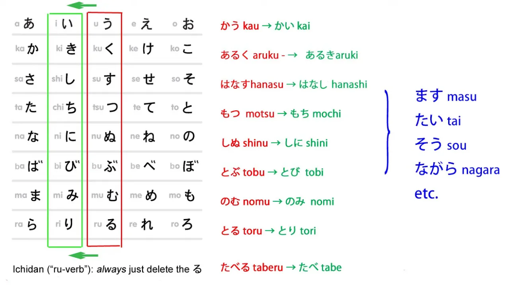

Так что глаголы, оканчивающиеся на <code>く</code>, заканчиваются на <code>-き</code>, глаголы, оканчивающиеся на <code>す</code>, заканчиваются на <code>-し</code>, и так далее.

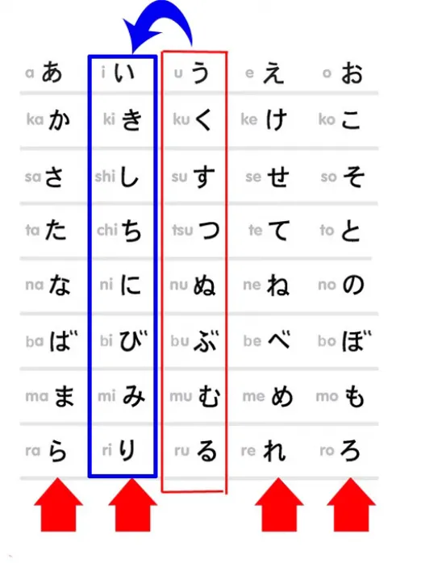

Поскольку это такой широкомасштабный структурный элемент, я собираюсь сравнить его с парой разных вещей. Первое, самое очевидное, с чем можно её сравнить, — это другие три основы глаголов.

Она, конечно, похожа на них, потому что, как и все они, используется для присоединения фундаментальных вспомогательных элементов. А под фундаментальными вспомогательными элементами я подразумеваю то, что иногда называют <code>спряжениями</code> в учебниках.

Как мы знаем, в японском языке нет такого понятия, как спряжение. *(или, скорее, в западном смысле)* Есть только четыре основы и различные вспомогательные глаголы, существительные и прилагательные, некоторые из которых произвольно называются <code>спряжениями</code>, а некоторые нет, и в зависимости от того, какой учебник вы читаете, вы, вероятно, получите немного другое представление о том, какие из них являются <code>спряжениями</code>, а какие нет, что совершенно естественно, потому что это в любом случае полностью произвольная категория — в японском языке нет такого понятия, как спряжение, так что всё это фантазия. И мы не обязательно ожидаем последовательности в фантазии.

---

Итак, い-основа, как мы знаем, соединяет вспомогательный глагол <code>ます</code>.

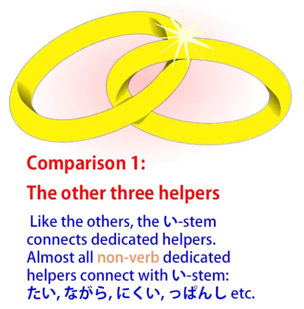

Она также соединяет различные, как мы можем их назвать, специализированные вспомогательные существительные и вспомогательные прилагательные. В целом, если мы собираемся присоединить вспомогательное прилагательное или вспомогательное существительное к глаголу, мы присоединим его к い-основе. Это не абсолютно, но происходит почти всегда.

Как мы знаем, вспомогательное прилагательное <code>-ない</code> присоединяется к あ-основе, но это необычно. Итак, мы можем присоединять различные вспомогательные прилагательные к い-основе.

Например, я возьму глагол <code>読む</code> в качестве нашей модели для большей части того, что мы делаем сегодня. Итак, давайте возьмём глагол <code>読む</code> и превратим его в い-основу <code>読み</code>, и мы можем присоединить прилагательные, такие как <code>やすい</code>: <code>読みやすい</code> (легко читать), <code>にくい</code>: <code>読みにくい</code> (трудно читать).

---

Мы также присоединяем такие вещи, как <code>ながら</code>.
<code>ながら</code> означает делать одно, одновременно делая другое, поэтому мы можем сказать <code>歩きながら読む</code> или <code>読みながら音楽を聴く</code>: то есть <code>читаю во время ходьбы</code>, <code>слушаю музыку во время чтения</code>.

---

Вспомогательный элемент <code>そう</code>, который даёт нам значение подобия, также присоединяется к глаголам с い-основой.

Итак, мы говорим <code>雨が降りそうだ</code> (похоже, будет дождь) / *Дождь кажется падающим.* И я говорила об этой <code>そう</code>-форме и различных связанных структурах в другом видео, на которое я дам ссылку.[[24]](./24-hearsay-guesses-そう-そうだ-そうです.md)

## Соединитель 連用形 и соединитель て-формы

Теперь это переходит в область, где мы можем начать сравнивать い-основу, <code>連用形</code>, Великий Соединитель, с て-формой. Конечно, て-форма — это другой великий соединитель.

Она соединяет всевозможные вещи.

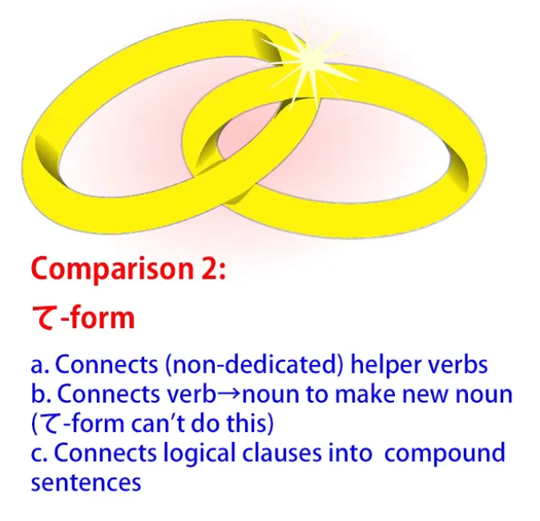

い-основа — это ещё больший соединитель: она может соединять большинство видов вещей, которые также соединяет て-форма, и может делать многое другое.

Итак, с て-формой мы часто соединяем вспомогательные глаголы, которые не являются специализированными вспомогательными элементами, которые имеют свою собственную жизнь вне их вспомогательной функции. Так мы говорим <code>持って来る</code>, что означает <code>принести</code> (держать + приходить); мы можем сказать <code>やって見る</code> (попробовать, буквально делать + смотреть).

### Составные глаголы

Теперь, таким же образом мы можем образовывать составные глаголы с い-основой. Например, мы говорим <code>振り回す</code> (размахивать).

И, возвращаясь к нашему другу <code>読む</code>, мы можем сказать <code>読み始める</code>, что означает <code>начать читать</code>, или <code>読み込む</code>, что означает читать + упаковывать, что на самом деле означает <code>загружать</code> в компьютерном смысле.

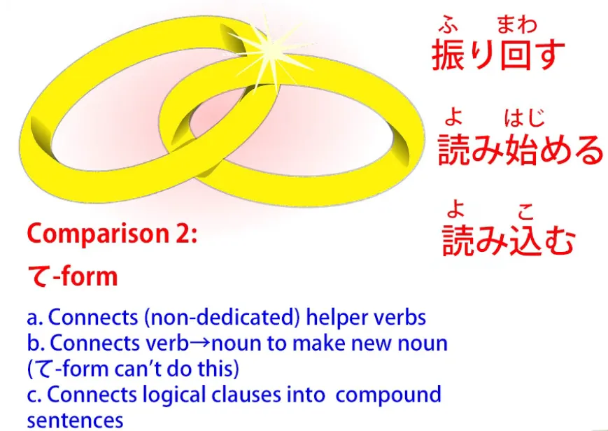

И я сделала целое видео об этом <code>込む</code>, которое вы можете посмотреть, если вам интересно.[[57]](./57-込む-komu-and-the-secret-of-multi-meaning-japanese-words.md) Я оставлю ссылку выше и в разделе информации ниже, вместе со всем остальным.

На экране загрузки компьютера вы часто увидите <code>読み込み中</code>, что интересно, потому что здесь вы видите, что у нас две い-основы, сложенные вместе. Само <code>読み込む</code> принимает い-основу и соединяется с <code>中</code> (середина).

Итак, <code>読み込み中</code> — это буквально читать + упаковывать + середина — <code>в процессе загрузки</code>. И это, конечно, существительное: <code>中</code> — это существительное, и любое составное слово принимает характер своего последнего элемента в японском языке.

Итак, <code>読み込み中</code> — это существительное, образованное путём соединения двух глаголов в い-основе и существительного.

### Соединение глаголов с существительными для образования новых существительных

И это подводит нас к тому, что い-основа может делать, а て-форма не может. А именно, соединять глаголы с существительными для образования новых существительных.

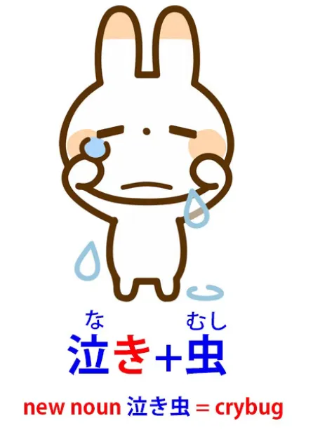

Так, например, у нас есть <code>泣き虫</code>: <code>泣き</code> — это い-основа глагола <code>泣く</code> (плакать), <code>虫</code> означает <code>насекомое</code>. Итак, <code>泣き虫</code> — это <code>плачущий жук</code>, что является японским термином для плаксы.

И, возвращаясь к нашему другу <code>読む</code>, мы можем иметь <code>読み方</code>:

<code>[方]{かた}</code> означает <code>форма, или манера, или способ</code> — вы, возможно, слышали о <code>方</code> в карате, боевом искусстве — так что <code>読み方</code> означает <code>форма, манера или способ чтения</code>, и обычно это означает произношение кандзи, способ чтения кандзи в определённом контексте.

Итак, い-основа обладает способностью て-формы образовывать составные слова и развивает её дальше, чем て-форма. И она также может выполнять ещё одну из фундаментальных функций て-формы, потому что, как мы знаем, て-форма может соединять две половины сложного предложения.

Мы могли бы сказать <code>お店に行ってパンを買った</code>.

Итак, у нас здесь две логические части: <code>Я пошёл в магазины</code> и <code>Я купил хлеб</code>. И вместо того, чтобы использовать <code>и</code>, как мы делаем в английском, мы используем て-форму.

::: info
Вы можете проверить [**это дерево комментариев**](https://www.youtube.com/watch?v=_qj9ZkAC2tE&lc=UgzBHAJNYjRy5GdLuE94AaABAg&ab_channel=OrganicJapanesewithCureDolly) под этим видео. Может быть полезно.
:::

Я сделала видео о сложных предложениях, на которое я дам ссылку.[[11]](./11-compound-sentences-くれる-あげる-and-more-uses-of-the-て-form.md)

Теперь, い-основа может делать то же самое. Мы можем сказать <code>お店に行きパンを買った</code>, что абсолютно то же самое, что и
<code>お店に行ってパンを買った</code>.

Мы не слышим это так часто, но это вовсе не редкость. Мы чаще увидим это в письменной форме, но если вы занимаетесь каким-либо погружением, если вы читаете книги, если у вас есть игры с большим количеством текста, а также в манге и аниме, вы столкнётесь с этим соединением сложных предложений с помощью い-основы.

Это ещё одна фундаментальная часть японского языка. Итак, вы видите, что い-основа может делать большую часть того, что может делать て-форма. В случае составных слов она не образует составные слова из тех же слов, что и て-форма, но она образует составные слова очень похожим образом.

## 連用形, дающая существительную форму глаголов (глагольные конструкции)

Но い-основа на этом не останавливается. Она может делать ещё одну очень важную вещь.

Она даёт нам существительную форму глаголов.

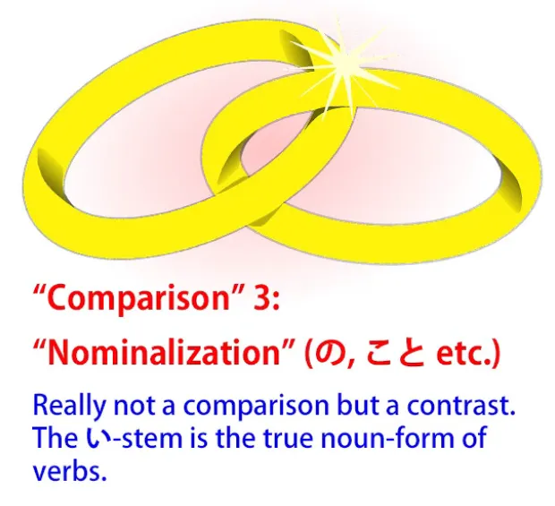

Мы уже говорили о том, что иногда называют номинализацией глаголов, то есть использованием <code>の</code> или <code>-こと</code> или других средств для объединения чего-либо глагольного в существительное. Однако это не совсем номинализация глаголов, поэтому я стараюсь избегать этой терминологии, потому что на самом деле мы здесь не превращаем глагол в существительное, а превращаем целую глагольную конструкцию в некое существительное.

Мы на самом деле не превращаем её в существительное.

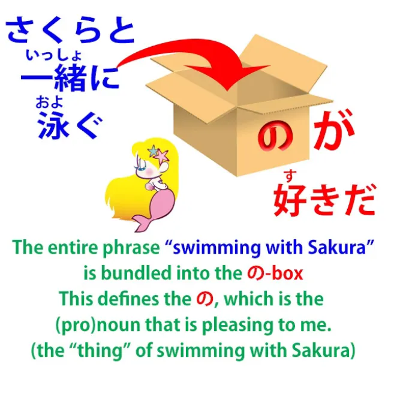

Что мы делаем, так это упаковываем её в коробку, созданную местоимением, таким как <code>の</code> или <code>-こと</code>, и я говорила в различных местах о помещении глагольных конструкций в <code>の</code>-коробку или в <code>こと</code>-коробку. В некоторых случаях, конечно, мы также можем буквально упаковывать в это местоимение один глагол, так что если мы говорим <code>泳ぐのが好きだ</code>, мы говорим <code>Я люблю плавать</code>, и это означает <code>Я люблю занятие плаванием</code>.

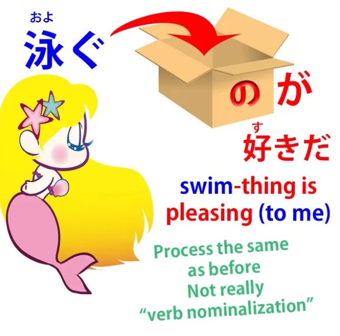

Но, опять же, это не то, что делает い-основа. い-основа даёт нам истинную существительную форму глагола.

И в английском языке она обычно представлена неизменным глаголом, так что глагольная форма и существительная форма идентичны в английском. В японском они не идентичны. В японском у нас есть базовая форма, у-оканчивающаяся форма глагола для глагола, а для существительной формы у нас есть い-основа.

Итак, давайте возьмём пример, чтобы вы поняли, о чём я здесь говорю. В английском у нас есть <code>rest</code>, слово <code>rest</code>, которое может быть глаголом или существительным. Мы используем глагол <code>rest</code>, когда говорим <code>I need to rest</code> (Мне нужно отдохнуть).

Мы используем существительное <code>rest</code>, когда говорим <code>I need a rest</code> (Мне нужен отдых).

Итак, если мы возьмём глагол <code>休む</code> в японском как своего рода грубый эквивалент <code>rest</code> в английском, у нас есть <code>休む</code>, который является глаголом <code>отдыхать</code>, и <code>休み</code>, который является существительным <code>отдых</code>. Итак, <code>休む</code> — это действие отдыха, глагол <code>отдыхать</code>; <code>休み</code> — это <code>отдых</code>, существительное <code>отдых</code>.

И мы используем это как само по себе, так и в составных словах, таких как <code>夏休み</code>, что означает <code>летние каникулы</code> или <code>летний перерыв</code>. И, как мы видим, мы бы не назвали это <code>summer rest</code> (летний отдых) в английском, но это потому, что, как мы уже обсуждали, очень редко японское слово охватывает точно ту же область спектра значений, что и английское слово.

Итак, слово <code>休み</code> может означать <code>отдых</code> буквально, как в лежании, отдыхе; оно может означать отсутствие в школе или на работе из-за болезни; оно может означать отпуск, как <code>夏休み</code>. Но суть в том, что глагольная форма — это <code>休む</code>, существительная форма — это <code>休み</code>.

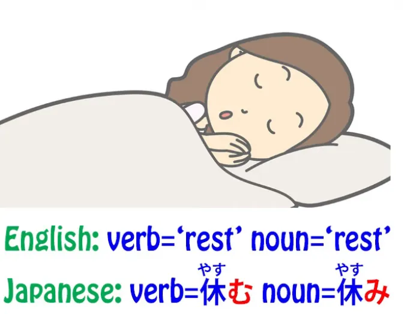

И почти любой глагол, который может иметь, логически, существительную форму, будет иметь эту существительную форму, представленную い-основой глагола. И очень часто они будут означать одно и то же в английском; иногда они будут отличаться.

Так, например, <code>痛む</code> означает <code>болеть</code>; <code>痛み</code> означает <code>боль</code>.

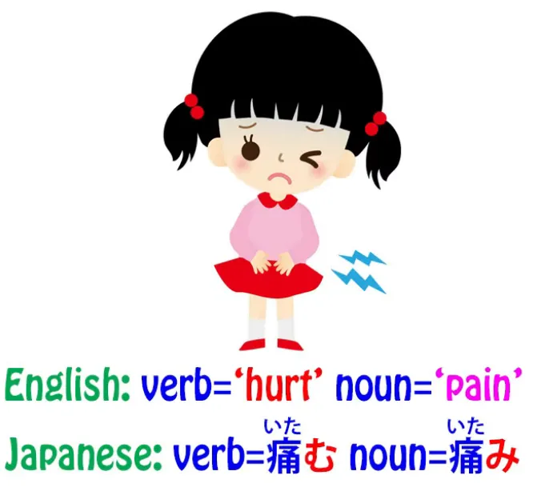

Опять же, у нас есть существительная форма <code>hurt</code> (болеть), которая является <code>pain</code> (боль). И это очень важно, потому что это не только даёт нам весь этот спектр глагольных существительных, но также играет роль в других структурах, которые очень редко объясняются в учебниках.

---

Итак, если мы говорим, например, <code>お店にパンを買いに行く</code> или <code>公園に遊びに行く</code>,

что мы имеем в виду под い-основой глагола <code>買う</code>, которая является <code>買い</code>, или い-основой глагола <code>遊ぶ</code>, которая является <code>遊び</code>? Мы имеем в виду существительное, поэтому, когда мы говорим <code>公園に遊びに行く</code>, мы отмечаем целевое место, куда мы идём — мы идём в парк, <code>公園</code> — а затем заявляем нашу цель. —

Наша цель — это действие игры, действие веселья, и это <code>遊び</code>. Так что буквально мы говорим <code>Я иду в парк для игры</code>.

Если мы говорим <code>お店にパンを買いに行く</code>, мы говорим <code>Я иду в магазины для покупки хлеба</code>. Вот как это структурировано, и я думаю, что очень немногие учебники на самом деле когда-либо объясняют, что то, что мы здесь используем, — это существительная форма глагола.

И это важно, потому что, как я учила в нашем уроке о логических частицах[[8b]](./8b-particles-explained.md), пять основных логических частиц могут присоединяться только к существительным. *(が, を, の, に, へ, で)*

::: info
Как Долли отмечает в Уроке 8b, <code>の</code> также является частью логических частиц,
:::

Так что, если не объясняется, что <code>遊び</code> здесь и <code>買い</code> здесь являются существительными, я не уверена, что большинство учащихся на самом деле думают о структуре.

---

И мы обнаружим в различных структурах, что используется существительная форма глагола, и структура имеет смысл только в том случае, если мы понимаем, что это существительная форма глагола.

Итак, вот у нас い-основа. Это Великий Соединитель, а также фундаментальная основа для образования существительных из глаголов. Таким образом, она имеет очень широкий спектр применений.

Она делает всё то, что может делать обычная основа, она делает всё то, что может делать て-форма, и она создаёт существительные из глаголов, которые используются как обычные существительные, такие как <code>痛み</code> (боль) или <code>休み</code> (отдых/некоторый отдых), а также для более глубоких структур, таких как <code>遊びに行く</code> (идти играть, идти для занятия игрой).

Если у вас есть какие-либо вопросы или комментарии *(опять же, хорошая идея прочитать комментарии к видео после)*, пожалуйста, оставьте их в комментариях ниже, и я отвечу, как обычно.

Я хотела бы поблагодарить моих патронов Gold Kokeshi и всех моих патронов и сторонников на Patreon и везде, кто делает всё это возможным.
::: info
В комментариях есть довольно интересный комментарий от некоего shary0 о て-форме.
Если кто-то хочет почитать об い-основе на более <code>учебниковом</code> языке — вот **[ссылка на источник](https://jref.com/articles/renyoukei.107/)**.

**Также, проверьте [это обсуждение в комментариях под этим видео.](https://www.youtube.com/watch?v=_qj9ZkAC2tE&lc=Ugy_D9a0k-_X9AujzO94AaABAg&ab_channel=OrganicJapanesewithCureDolly)**

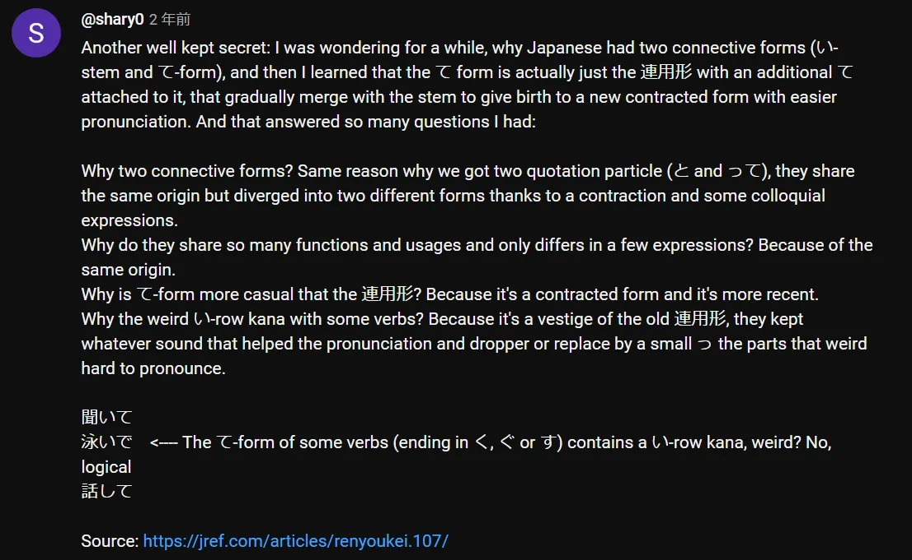
:::