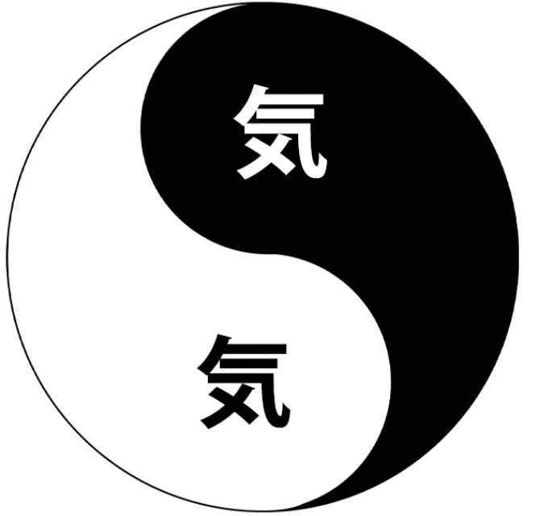
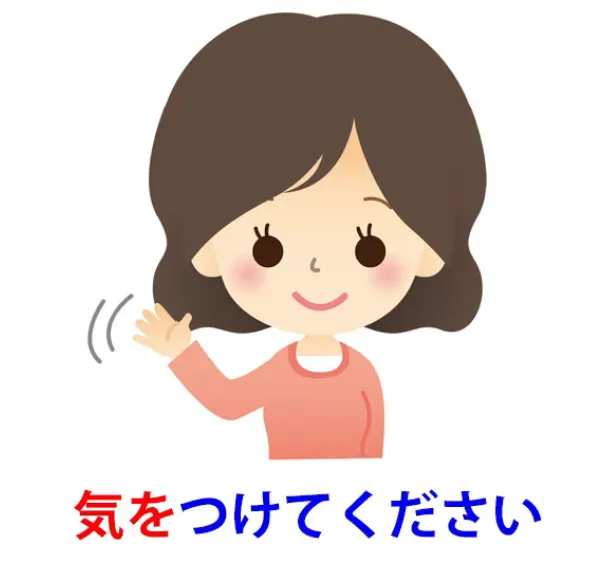
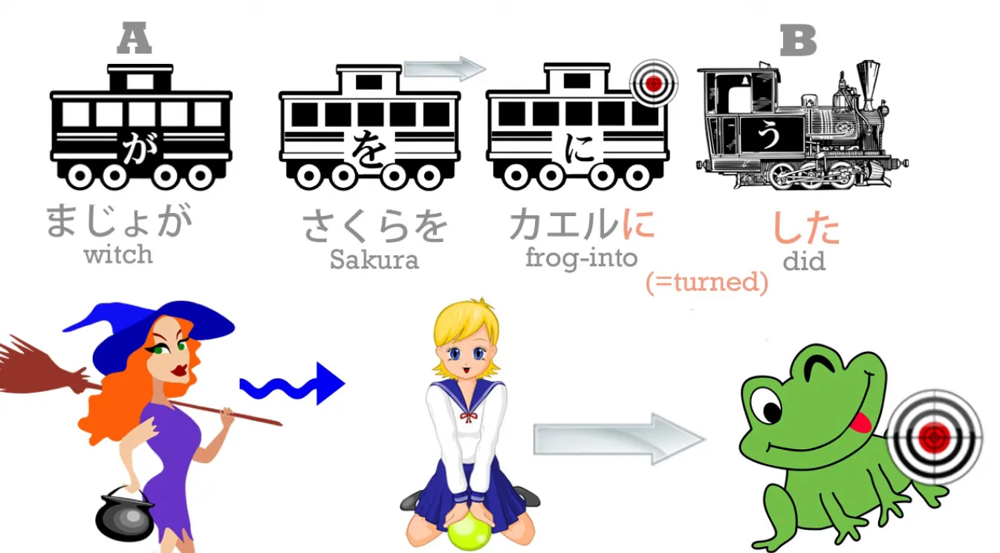
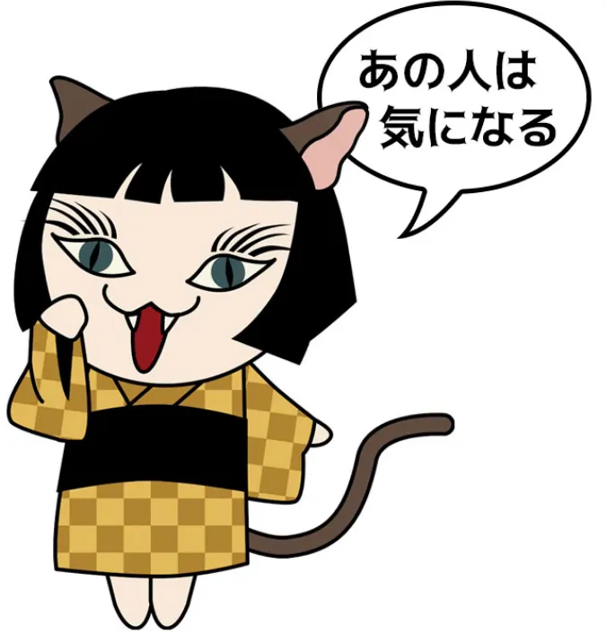
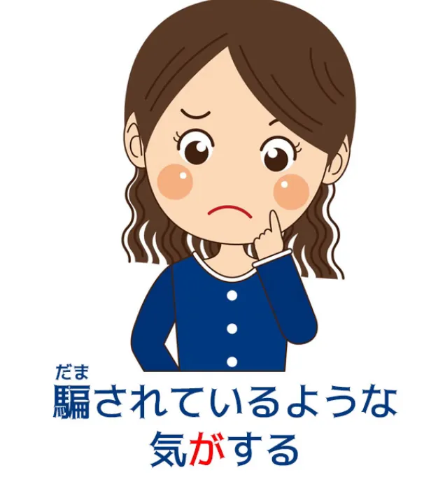

# **73. Секреты 気: 気になる, 気にする, 気がする, 気に入る и т.д.**

[**Секреты 気 Ki — 気になる, 気にする, 気がする, 気に入る и т.д. | Урок 73**](https://www.youtube.com/watch?v=ZHHd3nHkFb0&list=PLg9uYxuZf8x_A-vcqqyOFZu06WlhnypWj&index=75&ab_channel=OrganicJapanesewithCureDolly)

こんにちは。

Сегодня мы поговорим о слове <code>気</code> и различных выражениях, которые его включают, таких как <code>気にする</code>, <code>気がする</code>, <code>気になる</code>, <code>気に入る</code> и так далее.

Люди часто находят их запутанными и им трудно понять, как именно они структурированы, как они работают, как их использовать. И на это есть две причины. Первая — нам нужно понять, что на самом деле означает <code>気</code>.

А вторая — нам нужно очень твёрдое понимание логических частиц, если мы собираемся различать такие вещи, как <code>気にする</code>, <code>気になる</code>, <code>気がする</code>, друг от друга. И, конечно, если вы изучаете обычный японский по учебникам, у вас нет твёрдого понимания неизменной природы логических частиц, потому что если вас учат, что <code>コーヒーが好きだ</code> означает <code>Я люблю кофе</code>, вы никогда по-настоящему не поймёте, какова неизменная природа, например, частицы <code>が</code>.

И если у вас есть какие-либо сомнения относительно природы пяти основных логических частиц, я настоятельно рекомендую вам посмотреть это видео на эту тему[[8b]](./8b-particles-explained.md), потому что это сама основа японского языка. Если вы нечётко понимаете логические частицы, то вы нечётко понимаете японский язык, точка.

Хорошо. Так что же такое <code>気</code>? <code>気</code> пришло из китайского.

<s>Кандзи — это тот же кандзи, что и в <code>тай-чи</code>.</s>
::: info
Долли здесь ошиблась, <code>気</code> не используется в <code>太極</code>. К счастью, некий <code>nleseul</code> это проясняет, честь им и хвала.*

:::

Это даосская концепция, и, вероятно, она восходит к временам до того, что мы теперь знаем как даосизм. По сей день эта концепция используется в китайской медицине, китайских и японских боевых искусствах и других областях.

Это фундаментальный дух текучей энергии в человеке или чём-то ещё. Изначально это было связано с дыханием, и во многих языках <code>дыхание</code> и <code>дух</code> на самом деле являются одним и тем же словом. Латинское <code>spiritus</code>, греческое <code>pneuma</code>, ивритское <code>ruach</code>, санскритское <code>atma</code>: все они означают и дыхание, и дух.

Сейчас значение <code>気</code> как <code>дыхание</code> больше не активно, но это всё ещё этот текучий принцип духа внутри человека.

---

Если мы посмотрим на кандзи, интересно, что эта его часть 气 ***([Радикал 84](https://ru.wikipedia.org/wiki/%D0%A0%D0%B0%D0%B4%D0%B8%D0%BA%D0%B0%D0%BB_84))*** (которая также произносится <code>き</code>) означает пар или испарение. Так, <code>汽車</code> — это паровоз.

А затем у нас есть это <code>メ</code>, так сказать, и здесь <code>メ</code> действительно <code>указывает на место</code>. (気)

У нас есть фиксированная крестообразная часть и текучая, парообразная часть. И оба эти аспекта <code>気</code> важны, и вы никогда не сможете полностью разделить их, хотя мы можем двигаться от фиксированного конца шкалы к текучему концу шкалы.

Итак, чтобы привести примеры этих двух концов шкалы, давайте возьмём два выражения, которые вы почти наверняка знаете.

---

Первое — это <code>元気</code>, второе — <code>やる気</code>. Итак, <code>元気</code>, как вы знаете, это бодрость или здоровье. <code>元</code> означает изначальный, фундаментальный.

Итак, изначальная <code>気</code> человека здорова и бодра. Если что-то идёт не так, мы можем стать <code>病気</code> (больными или унылыми). И наша цель тогда — вернуть нашу <code>気</code> в её изначальное здоровое и бодрое состояние, восстановить нашу <code>元気</code>.

<code>やる気</code> — это воля к действию. То есть это дух действия, дух «встань и иди». И этот вид <code>気</code> — это не наша базовая <code>気</code>, которая в некотором смысле остаётся постоянной внутри нас. Это особая <code>気</code>, <code>気</code> для выполнения определённого действия.

Так что мы можем сказать

<code>海外で勉強する気がある</code>

И то, что мы здесь говорим, это то, что в нас существует определённая <code>気</code>, которая является <code>気</code> для обучения за границей. Так что в этом смысле <code>気</code> — это воля или склонность к выполнению определённого действия.

Когда мы говорим <code>気を付ける</code>, это буквально означает «прикрепи или приклей свой дух».

Так что если кто-то сказал <code>階段に気を付ける</code>, то буквально он говорит: «прикрепи свой дух к лестнице». В английском мы бы сказали <code>watch out for the staircase</code> (остерегайся лестницы) или <code>take care on the staircase</code> (будь осторожен на лестнице).

Прикрепите свой дух, своё сознание, свои чувства, свои мысли к лестнице; обратите на неё внимание; будьте осторожны. И это может быть не что-то конкретное. Очень часто люди говорят <code>気を付けて</code> (прикрепи свой дух). И это не прикрепление к чему-то конкретному, а прикрепление к тому, к чему уместно прикрепить; имейте ситуационную осведомлённость, как можно сказать на более современном жаргоне; будьте осторожны.

## 気になる & 気にする

Теперь, когда мы переходим к таким вещам, как <code>気になる</code> и <code>気にする</code> — мы уже рассматривали в предыдущем уроке <code>になる</code> и <code>にする</code>. *(не уверена, возможно, Урок 8 и 18)*

Так, например, если мы говорим <code>さくらがカエルになる</code>, мы говорим, что Сакура превращается в лягушку.

Если мы говорим <code>魔女がさくらをカエルにする</code>, мы говорим, что ведьма превращает Сакуру в лягушку.

И, конечно, мы знаем, кто что делает, благодаря логическим частицам. Так что же это значит, когда мы говорим о <code>気になる</code> и <code>気にする</code>?

Мы говорим, что что-то становится нашим духом. Что бы мы под этим подразумевали? Ну, чтобы это понять, нам нужно понять кое-что ещё. Нам нужно понять, что стать чувством, эмоцией, выражением эмоции — это то, что мы делаем в японском языке.

Мы не делаем этого в английском. Так, например, в песне AKB48 <code>Heavy Rotation</code> есть строчка:

<code>こんな気持ちになれるって僕はついているね</code>

И это означает <code>Что я мог бы стать этим чувством, мне повезло, не так ли?</code> В английском мы не говорим о <code>становлении</code> чувством, но в японском мы об этом говорим.

И я думаю, что это в некоторой степени связано с концепцией <code>気</code>, а также с буддийской идеей о том, что на самом деле нет никакого «я». То, чем мы являемся, не является фиксированной и абсолютной вещью. «Я» — это, по сути, меняющееся скопление действий и реакций, чувств и ощущений.

И поэтому мы можем временно стать определённым чувством. Вы можете даже стать, в японском, выражением чувства. Мы можем сказать <code>深刻な表情になる</code> — кто-то стал серьёзным или озабоченным лицом. На этот момент весь человек преобразился в это выражение серьёзности и озабоченности.

Итак, это то, что мы говорим, когда произносим <code>気になる</code> и <code>気にする</code>. Если мы говорим <code>あの人は気になる</code>, мы говорим, что этот человек превращается в мой дух.

Мой дух переформировывается, так сказать, определённая его часть, на определённый период, в форму или образ этого человека. Что это значит? Это значит, что этот человек, как бы мы сказали по-английски, занимает мои чувства.

Это может означать множество вещей. Это может означать, что мы обеспокоены или волнуемся за этого человека. Это может означать, что этот человек интригует нас. Это может означать, что мы чувствуем в этом человеке какую-то тайну. Или что бы то ни было, этот человек занимает наши чувства, наши ощущения, наши мысли; по-японски, становится нашими чувствами, нашими ощущениями, нашими мыслями, нашей <code>気</code>.

Важно отметить, что в грамматических справочниках и словарях мы часто видим: <code>**気になる** означает это</code>, <code>**気にする** означает то</code>, но важно понимать, что <code>気になる</code> само по себе ничего не значит. Как и <code>気にする</code>. <code>気になる</code> — это завершающая часть полного логического предложения.

<code>なる</code> — это локомотив, <code>気に</code> сообщает нам больше о локомотиве. Вагон А в случае с <code>気になる</code> — это то, что занимает наши мысли, то, что превращается в наш дух. Так что в этом случае <code>あの人</code> — это вагон А, и то, что мы говорим об этом человеке, то, что этот человек делает, — это превращение в наш дух.

Теперь, когда мы берём <code>気にする</code>, мы говорим <code>あの人を気にする</code>.

Так что теперь действующим лицом является не этот человек; действующим лицом являюсь я. Я превращаю этого человека в свой дух. Я беспокоюсь об этом человеке.

И это имеет два подтекста. Один заключается в том, что в некотором смысле мы совершаем насилие над нашим духом. Это не просто наш дух естественным образом становится этим человеком — мы делаем это. И это, как правило, придаёт ему немного более негативное значение.

В то время как <code>気になる</code> может охватывать весь спектр значений от интриги до беспокойства, <code>気にする</code> обычно означает беспокойство.

Теперь, другое следствие этого заключается в том, что мы контролируем это. Наш дух не просто превращается в этого человека. Мы превращаем наш дух в этого человека.

Именно поэтому вы часто слышите, как люди говорят <code>気にしないで</code> (не превращай это в свой дух). Было бы бессмысленно говорить <code>気にならないで</code>, потому что вы ничего не заставляете происходить. Ваш дух просто превращается в это.

Но <code>気にしないで</code> говорит вам контролировать то, что вы можете контролировать: <code>Не превращай это в свой дух; не беспокойся об этом; не волнуйся.</code>

Итак, у нас есть <code>気にする</code> и <code>気になる</code>.

## 気がする

А как насчёт <code>気がする</code>?

Опять же, частица даёт нам ключ к тому, что происходит. Когда мы говорим <code>気がする</code>, это <code>気</code>, сам дух, который действует. Это не что-то, что становится нашим духом, это не мы превращаем что-то в наш дух. Это наш дух делает что-то или определённый аспект нашего духа действует (<code>する</code>, делать или действовать).

Как нам это понять? Ну, опять же, нам нужно понять кое-что ещё в японском, прежде чем мы сможем правильно это понять. Когда мы используем выражения вроде <code>いい匂いがする</code> или <code>綺麗な音がする</code>, мы говорим <code>There's a good smell</code> (есть хороший запах), <code>There's a pretty sound / a pretty sound happened / a pretty sound acted</code> (есть красивый звук / красивый звук произошёл / красивый звук действовал).

Что мы подразумеваем под <code>する</code> в случае запаха или звука, так это единственное, что запах или звук могут делать: запах пахнет, а звук звучит. Когда мы говорим <code>匂いがする</code>, мы говорим, что запах действует, запах активен, я могу обнаружить запах.

<code>音がする</code>: звук действует, звук активен, я могу обнаружить звук. Когда мы говорим <code>気がする</code>, мы говорим, что определённый дух, определённая мысль, определённое сознание активно, я могу обнаружить это сознание, я могу обнаружить это чувство.

Итак, если мы говорим <code>騙されているような気がする</code>, мы говорим: «У меня такое чувство, что нас обманывают, у меня такое чувство, что нас обводят вокруг пальца» — такая <code>気</code>, такое чувство, активно.

Если мы говорим <code>強くなった気がする</code>, мы говорим <code>Я чувствую, что стал сильнее, я ощущаю, что стал сильнее</code> — этот дух, эта склонность эмоций, мыслей, активна так же, как активен запах или шум.

## 気に入る

Теперь, последнее, что, на мой взгляд, более запутанно, чем остальные, потому что, по сути, оно использует слово необычным образом, это <code>気に入る</code>.

Если мы говорим <code>それを気に入る</code>, мы говорим <code>Мне это нравится</code>.
::: info
<code>それが気に入る</code> также возможно. Как Долли приводит с <code>これを気に入る</code>.
:::

На самом деле, мы говорим, что я впускаю это в свою душу.

Что здесь сбивает с толку, так это то, что <code>入る/いる</code> используется не обычным образом. <code>入る</code> обычно означает «входить» или «приходить». И если мы говорим о том, чтобы что-то куда-то положить, мы говорим <code>入れる</code>.

Но в этом случае <code>入る</code>, вероятно, потому что это более старое употребление, которое закрепилось в языке в этой конкретной очень распространённой фразе, <code>入る</code> на самом деле означает «позволить войти в свой дух».

Итак, тот, кто делает <code>気に入る</code>, — это сам человек. И мы знаем, что это так, потому что именно так работают частицы. Мы всегда можем доверять частицам.

Если частицы говорят одно, а форма слова — другое, мы можем быть уверены в каждом случае, что частицы знают, о чём говорят, а значение слова могло измениться со временем.

<code>気に入る</code> — это то, что вы услышите в различных случаях, и его особая характеристика заключается в том, что его гораздо легче использовать в отношении других людей, чем такие вещи, как <code>欲しい</code> или <code>好き</code>.

Это не означает, что мы можем прямо заявлять, что нравится или не нравится другим людям, даже используя <code>気に入る</code>, но если мы собираемся говорить о чувствах других людей, спрашивать их об их чувствах, предполагать, какими могут быть их чувства, <code>気に入る</code> гораздо вежливее, чем использование таких терминов, как <code>たい</code> или <code>好き</code> или <code>欲しい</code>.

Так что вы очень часто будете видеть <code>気に入る</code> в отношении чувств других людей, а также своих собственных.

Итак, я надеюсь, что это немного прояснит всё использование <code>気</code>…
::: info
[**Буддийская концепция <code>не-я</code>**](https://ru.wikipedia.org/wiki/%D0%90%D0%BD%D0%B0%D1%82%D1%82%D0%B0) может быть хорошим материалом для изучения того, как работает японский язык.

:::