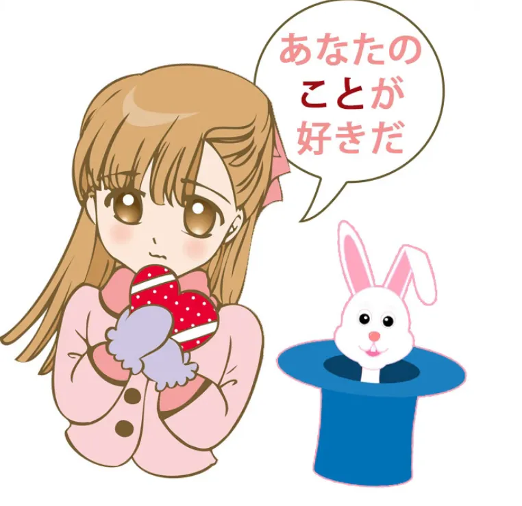
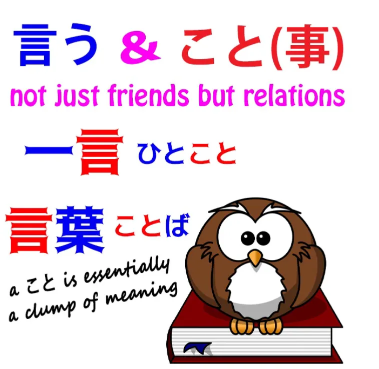
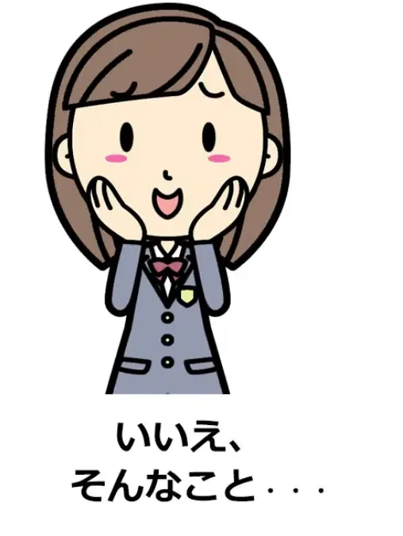
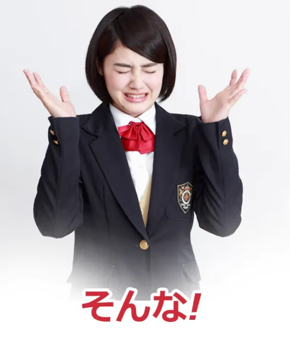

# **74. ЛЮБОВЬ и другие тайны こと! あなたのことが好き, 私のことが嫌い, ということ, そういうこと, どういうこと, そんなこと**

[**ЛЮБОВЬ и другие тайны こと! あなたのことが好き、私のことが嫌い、ということ、そういうこと、どういうこと、そんなこと | Урок 74**](https://www.youtube.com/watch?v=aoP6sFyTsIk&list=PLg9uYxuZf8x_A-vcqqyOFZu06WlhnypWj&index=76&ab_channel=OrganicJapanesewithCureDolly)

こんにちは。

Сегодня мы поговорим о некоторых тайнах слова <code>こと</code>. И это действительно может быть очень загадочным для иностранных студентов, потому что некоторые значения на самом деле невозможно перевести на английский или другие языки.

Мы можем их понять, но мы должны понимать их как японские концепции. Один из примеров — это когда мы сталкиваемся с выражениями вроде <code>あなたのことが好きだ</code>.

## あなたのことが好きだ

Итак, я думаю, мы все знаем, что это означает в разговорниках. Это означает, более или менее, <code>Я люблю тебя</code>. На самом деле, это не то, как мы бы сказали точную фразу <code>Я люблю тебя</code> по-японски, что было бы <code>愛してる</code>, и это выражение, хотя оно технически означает <code>Я люблю тебя</code>, почти никто никогда не использует его в японском.

<code>あなたのことが好きだ</code> довольно понятно, если бы это было просто <code>あなたが好きだ</code> (<code>Ты мне нравишься</code>), но на самом деле мы говорим, что мне нравится ваше <code>こと</code>.

Что же это на самом деле значит? Вероятно, лучший способ перевести это — сказать <code>Мне нравятся вещи в вас</code> или <code>Мне нравится то, что в вас есть</code>.

На практике это подразумевает, что мне нравятся такие вещи, как ваш смех, искорка в ваших глазах, ваша походка, то, как вы пьёте кофе, ваша забавная маленькая синяя шляпка, и подразумевается, что вы стали знакомы путём наблюдения или близости с различными вещами в человеке, и это постепенно накопилось в чувства любви.

Теперь, вы не можете сказать это по-английски, не написав маленькое эссе или песню кому-то, но в японском всё это заключено в этом <code>こと</code>.

Итак, мы могли бы сказать, что <code>こと</code> очень, очень гибкое, более гибкое, чем большинство гибких слов в японском. А концепция лингвистической гибкости очень, очень важна и полностью игнорируется в большинстве методов обучения языку.

То, что мы можем сказать гибким способом, — это не просто вопрос удобства. Это глубоко влияет на то, как мы выражаем себя и что мы, вероятно, на самом деле скажем. Вещи, которые могут быть сказаны гибким способом в определённом языке, — это те вещи, которые мы, скорее всего, на самом деле выразим и выразим регулярно.

И наоборот, вещи, которые культура особенно желает выразить, — это те вещи, которые становятся гибкими в языке. Итак, если вы хотите узнать больше о гибкости, пожалуйста, посмотрите моё видео на эту тему[[56]](./56-agility-deeper-secrets-of-は-and-の-particles.md).

Использование <code>koto</code> здесь менее прямое, как иногда говорят учебники. Это не просто вопрос меньшей прямоты. Оно избегает любого ощущения прямой физичности и имеет тенденцию придавать всё это значение постепенного расцвета любви через понимание вещей о человеке.

Это то, что японский язык хочет выражать достаточно часто, чтобы сделать это очень гибким для выражения.

## 私のことが嫌い

Аналогично, мы можем сказать что-то вроде <code>*(zeroは)*私のことが嫌いらしい</code> (<code>похоже, этот человек, или эти люди, находят моё **こと** неприятным</code>).

Почему мы так говорим? Ну, я думаю, во многом причина связана с образом мышления, который также означает, что мы не можем напрямую выражать чужие эмоции, что, конечно, является реальным фактом, который европейские языки склонны упускать из виду: тот факт, что мы никогда на самом деле не знаем чужих чувств или эмоций.

Аналогично, никто на самом деле не знает никого другого напрямую. Мы не можем по-настоящему знать другого человека. Мы не можем знать глубины его существа. Я уверена, многие из тех, кто смотрит это, предполагают, что я человек, притворяющийся андроидом.
Вот как мало мы можем знать о любом другом существе.

Поэтому, когда мы говорим о чём-то более глубоком, что затрагивает наши эмоции, а не простое знакомство с человеком, на самом деле нет смысла говорить о том, что это реакции на нас. Это не реакции на нас; это не реакции на наше истинное существо.

Это реакции на то, что они наблюдали в нашем поведении, нашей внешности, наших словах. И это, наше <code>こと</code>, — это то, что им может нравиться или не нравиться.

Теперь, там, где нет культурного фактора, <code>こと</code> в некоторых обстоятельствах может быть гораздо легче перевести и понять.

Так, например, если мы говорим <code>田中さんのこと</code> и у нас нет особой привязанности к Танака-сану, это в большинстве случаев довольно легко переводится как <code>дело Танака-сана / ситуация, касающаяся Танака-сана</code> или просто <code>тот факт, что с Танака-саном немного сложно иметь дело</code>.

Что мы на самом деле подразумеваем под <code>田中さんのこと</code>, будет зависеть от того, что слушатель знает об истории нас самих и господина Танаки. Так что это совсем не сложно.

## どういうこと, そういうこと & ということ

Но многие люди просили меня объяснить выражения вроде <code>どういうこと</code> и <code>そういうこと</code>, и я уже затрагивала их раньше[[20]](./20-directionals-それ-その-そんな-そう-etc.md), так что я просто немного повторю.

<code>[言]{い}う</code> и <code>こと</code> в некотором смысле принадлежат друг другу, потому что <code>こと</code> — это ситуация, обстоятельство, по умолчанию что-то, что на самом деле требует некоторого объяснения. И идея объяснения, идея выражения и идея <code>こと</code>, я думаю, всегда были очень близки в японском.

Вот почему кун-чтение кандзи, который мы используем в <code>言う</code>, другое кун-чтение, то, которое используется, когда это существительное, — это <code>こと</code>.
::: info
На всякий случай, кандзи 言 в кун-ёми может читаться как <code>い</code> или как <code>こと</code>, последнее обычно, когда это существительное. В <code>そう言う事</code>, <code>koto</code> — это кандзи 事, отличающийся от 言 - こと.
:::
Это не совсем то же самое <code>こと</code>, но, как мы знаем, если мы много знаем о японском и кандзи, часто существуют альтернативные кандзи для одного и того же слова.

Теперь, это не совсем одно и то же слово, но они связаны. И вот почему мы всегда получаем выражения вроде <code>そういうこと</code>, <code>どういうこと</code>, <code>ということ</code>, потому что <code>こと</code> — это что-то сказанное, что-то объяснённое, ситуация, которая требует слов.

Итак, вопрос <code>どういうこと</code> — это тот, который мы часто слышим. Он означает, в некотором смысле, <code>что за こと?</code>

И <code>что за...</code>, нас учат в Genki и других учебниках, это <code>どんな</code> по-японски, и это действительно так, но мы склонны использовать <code>どういう</code> чаще в случаях, когда либо может потребоваться больше объяснений, либо когда объяснение будет, возможно, немного менее ожидаемым.

---

Так, например, когда персонаж оказывается в странной ситуации или просто не знает, что происходит, потому что всё очень странно и неожиданно, она очень вероятно скажет <code>どういうこと</code> — «что это за вещь? Каким образом объясняется ситуация, которая здесь происходит или произошла?»

Аналогично, когда Катриэль Лейтон раскрывает дело, она говорит <code>そういうことでした</code> (<code>Так вот как объяснялась ситуация</code>).

И это переведено в прошедшее время, потому что идея в том, что она разгадала тайну, которая является постоянной тайной, другими словами, это было объяснение всё это время, и она только что его обнаружила.

Теперь, <code>そういうこと</code> или <code>どういうこと</code> не обязательно должно быть чем-то особенно заумным или сложным, но оно имеет тенденцию подразумевать большую глубину необходимого объяснения, чем простое <code>どんな</code>.

## そんなこと

С другой стороны, у нас также есть партнёр <code>どんな</code> — <code>そんな</code>, часто используемый с <code>こと</code>, и в этих случаях подразумевается, что хотя <code>こと</code> относительно легко понять или объяснить, у нас есть какая-то негативная реакция на это.

Теперь, это может быть отрицание, или это может быть протест, или разочарование. Так, например, если кто-то хвалит нас, вы можете сказать <code>そんなことがない</code> (<code>это неправда!</code>), потому что в японском вежливо отклонять похвалу.

И это настолько часто, что часто сокращается просто до <code>そんなこと</code> или даже просто <code>そんな、そんな</code>. Итак, мы говорим, что то, что вы сказали, эта ситуация, которую вы описываете обо мне, не соответствует действительности: я не достоин этой похвалы.

И мы также часто будем слышать, как персонажи или люди говорят просто <code>そんなこと</code> или просто <code>そんな</code>, и это подразумевает, что происходящее очень неудовлетворительно или что кто-то сказал что-то плохое или недоброе.

Итак, <code>そんなこと</code>, или чаще <code>そんな</code>, представляет собой негативную реакцию на ситуацию. И интересно то, что это явно незаконченное предложение. Вы собирались сказать что-то о <code>そんなこと</code>.

Но в отличие от многих японских незаконченных предложений, это, это <code>そんな</code> протеста, настолько укоренилось в языке, что на самом деле трудно закончить предложение. На самом деле трудно сказать, что человек мог бы сказать, если бы он закончил предложение, потому что оно почти никогда не заканчивается.

<code>そんな!</code> превратилось в протест против ужасности чего-либо само по себе…