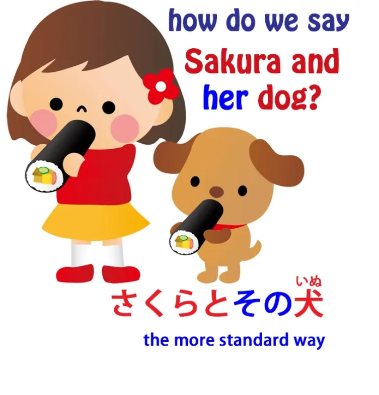
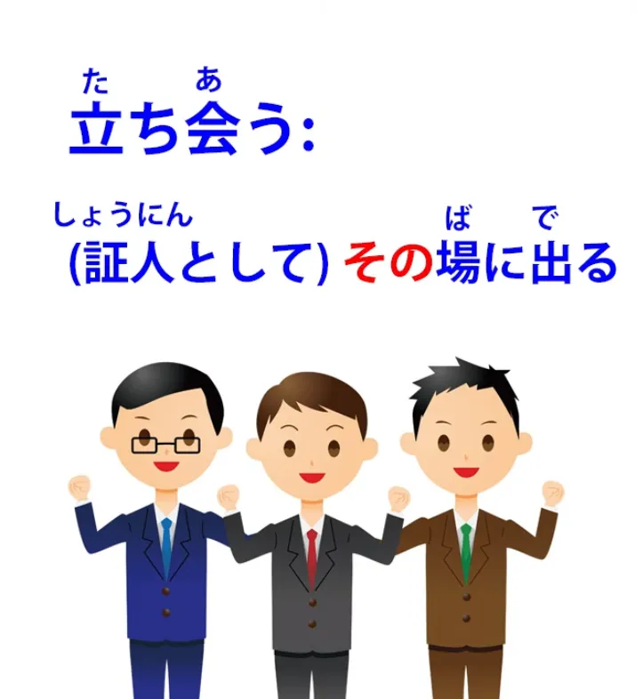
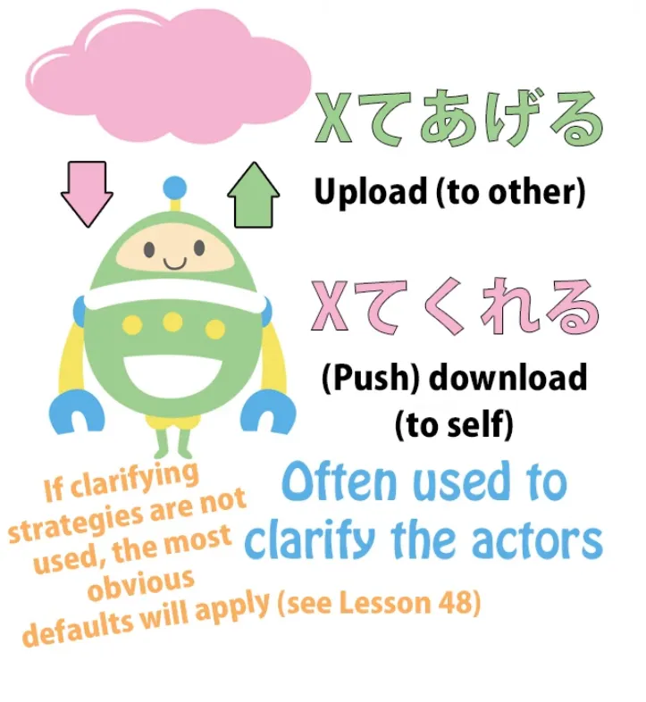
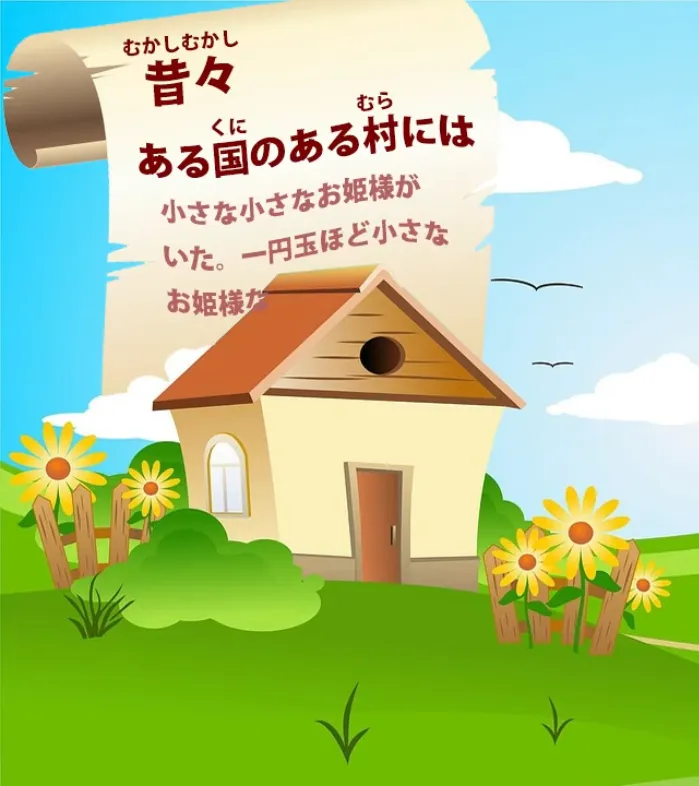

# **75. Японский — это НЕ английский: Как стратегии выражения отличаются | вежливый Эйхонго = грубый японский**

[**Японский — это НЕ английский: Как стратегии выражения отличаются | вежливый Эйхонго = грубый японский | Урок 75**](https://www.youtube.com/watch?v=UCmnwgCc54A&list=PLg9uYxuZf8x_A-vcqqyOFZu06WlhnypWj)

こんにちは。

Сегодня мы поговорим о стратегиях выражения в японском языке, которые настолько отличаются от их английских эквивалентов, что могут вызвать большие трудности, когда мы попадаем в реальный мир японского языка.

И эта трудность значительно усугубляется тем, как японский преподаётся в обычных учебниках и на веб-сайтах, а также всей моделью японского языка <code>英本語</code>, которая учит японскому, по сути, притворяясь, что он гораздо больше похож на английский, чем есть на самом деле, и <code>упрощая</code> японские выражения до эквивалентов типа <code>英本語</code>.

Итак, давайте начнём с одной из вещей, которая вызывает наибольшие трудности, потому что это нечто действительно фундаментальное для английского языка и чего не существует в японском.

И это — местоимения. В английском мы не можем составить умеренно сложное предложение, не используя местоимения вроде <code>it</code>. Если мы говорим о каком-либо объекте, от галактики Андромеды до насекомого, даже умеренно сложный отрывок о нём будет содержать <code>it</code> снова и снова.

И японский так не работает. На самом деле, я скажу нечто, что может показаться излишне радикальным. Я скажу, что в японском вообще нет простых местоимений, не в том смысле, в каком они понимаются в английском и других европейских языках. Это может показаться немного экстремальным, но позвольте мне объяснить, что я имею в виду.

## Местоимения <code>it</code>, <code>I</code> и <code>you</code> в японском

Прежде всего, давайте возьмём самое базовое местоимение, <code>it</code>. В японском нет эквивалентного слова для <code>it</code>. Нигде в японском вы не найдёте ничего, что соответствовало бы <code>it</code>, кроме нуля.

Единственный способ сказать то, что мы имеем в виду, когда просто говорим <code>it</code> в английском, — это ничего не говорить или ничего не писать: использовать нулевое местоимение.

Теперь вы можете сказать, что, хотя мы это принимаем, наверняка же существуют местоимения. В конце концов, большинство учебников начинаются с местоимения <code>私</code>. Почти каждое базовое предложение в базовом учебнике — это <code>私 то, 私 это, 私 ещё что-то</code>.

А те, что не такие, — это <code>あなた то, あなた это, и あなた ещё что-то</code>. Так что, разве в японском нет хотя бы базовых местоимений <code>you</code> и <code>I</code>? И ответ на это: <code>Нет, не в европейском смысле.</code>

В европейских языках всегда есть одно базовое, простое местоимение, которое означает <code>I</code>. Это эго-местоимение: <code>I</code> в английском, <code>ich</code> в немецком, <code>je</code> во французском, <code>yo</code> в испанском.

В японском нет эквивалента этому. Есть много способов сказать <code>I</code>: <code>私</code>, <code>僕</code>, <code>俺</code>, <code>あたい</code>, <code>わがはい</code>.

Все они на самом деле являются окольными способами обращения к себе. При обращении к человеку, с которым вы говорите, вы можете сказать <code>あなた</code>. Вы также можете сказать: <code>お前</code>, <code>手前</code>, <code>きさま</code>, <code>君</code> и различные другие вещи.

Другими словами, это базовое личное местоимение на самом деле не существует. И хотя мы можем определить <code>私</code> и <code>あなた</code> как самые базовые из них, это всё равно не то же самое, что европейское личное местоимение.

Большую часть времени мы его не используем. Все эти <code>私 то, 私 это, 私 ещё что-то</code> в учебниках до смешного неестественны. Если мы не пытаемся подчеркнуть какой-то конкретный момент, мы этого не говорим.

Обычное слово для <code>I</code> — это ноль. Обычное слово для <code>you</code> — это либо ноль, либо имя человека.

Ни одно из слов для <code>you</code>, которые я привела выше, включая <code>あなた</code>, не используется так уж часто, потому что, помимо прочего, они просто не очень вежливы. И это одна из примечательных вещей в учебниках, которые наносят огромный ущерб пониманию и усвоению японской структуры, заставляя вас прикреплять вспомогательный <code>-ます</code> к концу глаголов и позволяя вам верить, что это базовая форма глаголов, позволяя вам верить, что прилагательные требуют связки, хотя это не так

(и если вы хотите узнать больше о вреде, который <code>です/ます</code> наносит нашему базовому пониманию языка, если мы изучаем его до того, как изучим фундаментальный базовый японский, я сделала видео об этом, и я помещу ссылку над моей головой и в комментариях ниже) ([***Урок 17***](https://www.youtube.com/watch?v=ymJWb31qWI8&t=0s)).

---

Учебники делают это, что является чрезвычайно разрушительной вещью, по той причине, что, если вы поедете в Японию и не будете использовать <code>です/ます</code> с такими людьми, как ваш учитель, ваш работодатель или незнакомцы, которых вы встретите, они подумают, что вы грубы.

Теперь, это совершенно верно, но, конечно, пока вы не освоите язык на базовом уровне, вы ничего никому не скажете, а если и скажете, то это будет настолько неумело, что последнее, о чём они будут думать, это о том, прикрепляете ли вы украшения <code>です/ます</code> к концу своих предложений.

Но, нанеся этот ущерб изучению структуры, используя <code>です/ます</code>, они затем приступают к обучению вас обращаться к людям как <code>あなた</code>, что на самом деле грубее, чем не использовать <code>です</code> и <code>-ます</code>. Если вы не используете <code>です/ます</code> и ваш японский довольно плох, большинство людей просто предположат, что вы похожи на маленького японского ребёнка, который ещё не знает этих украшений. Если вы называете людей <code>あなた</code>, хотя они и сделают вам скидку, потому что вы иностранец, им, вероятно, будет трудно не поморщиться.

Вы не называете своего учителя <code>あなた</code>, вы не называете своего начальника <code>あなた</code>, вы не называете незнакомцев <code>あなた</code>, но даже с друзьями, с которыми вам не нужно использовать <code>です/ます</code>, вы тоже не называете их <code>あなた</code>.

Так почему же учебники, когда они фактически пропускают ваше понимание японской структуры через мясорубку, заставляя вас использовать <code>です/ます</code> слишком рано, затем приступают к обучению вас чему-то гораздо более грубому, чем неиспользование <code>です/ます</code>?

---

Ну, причина в том, что они готовы пожертвовать чем угодно, чтобы структурировать японский так, как будто это английский. В английском вы постоянно используете простое, нейтральное личное местоимение <code>you</code>, а в японском — нет. Но они, кажется, думают, что вы слишком глупы, чтобы это понять.

Они, кажется, думают, что если японские предложения не будут структурированы таким образом, чтобы они звучали неестественно, но ощущались вами как английское предложение, с <code>私 то, 私 это, あなた то, あなた это</code>, вы не сможете их понять.

Итак, в японском нет <code>it</code>, и на самом деле нет <code>you</code> или <code>I</code> в том смысле, в каком они есть в европейских языках. А как насчёт <code>he</code> и <code>she</code>? По крайней мере, есть <code>彼</code> и <code>彼女</code>, не так ли?

Ну, <code>彼</code> и <code>彼女</code> были введены в японский язык в конце периода Эдо и начале периода Мэйдзи для перевода европейских романов девятнадцатого века на японский язык. Вот для чего они были.

С тех пор они интегрировались в язык и иногда используются в повседневной речи, но далеко не так часто, как используется нулевое местоимение. На каждый случай использования <code>彼女</code> или <code>彼</code> для <code>he</code> или <code>she</code> приходится по крайней мере сто случаев, когда в этой роли используется нулевое местоимение.

Итак, что же нам делать, когда, например, мы хотим выразить принадлежность? Предположим, мы хотим сказать <code>Сакура и её собака</code>. Мы могли бы сказать <code>さくらと彼女の犬</code>.

Это грамматически правильный японский, но не очень обычный японский. Обычный способ сказать это был бы <code>さくらとその犬</code>.

И это слово <code>その</code> здесь очень важно.

## その

Нас учат, в самом начале *([**Урок 20**](https://www.youtube.com/watch?v=xLkY6whr7T4&ab_channel=OrganicJapanesewithCureDolly))*, что оно означает <code>that</code>, в смысле <code>that dog</code>, <code>that hat</code>, <code>that country</code>, и это так, но, как мы уже узнали, японские слова очень редко соответствуют точно той же части спектра значений, которой соответствуют их предполагаемые английские эквиваленты.

Если в английском мы говорим что-то вроде <code>that dog</code> или <code>that tree</code>, мы имеем в виду то, о чём мы говорим, то, что связано с текущим предметом. Но в японском это идёт значительно дальше.

Итак, <code>さくらとその犬</code> означает Сакура и собака, связанная с ней, другими словами, Сакура и её собака. И эта способность <code>その</code> выражать такие вещи, как принадлежность и связанность, порождает целый ряд стратегий. Но как только мы понимаем, что это значит, их гораздо легче понять.

Так, например, простой японский словарь Sanseido определяет слово <code>立ち会う</code>, которое на самом деле нельзя перевести каким-либо конкретным английским словом, потому что оно означает пойти в определённое место в качестве свидетеля или действовать в качестве свидетеля.

Определение Sanseido: <code>証人としてその場に出る</code>: в качестве свидетеля, пойти в это место. Ну, это самое близкое, что мы можем получить в английском, не становясь довольно запутанными.

Что здесь означает <code>that place</code>? Единственный способ правильно перевести это на английский — сказать что-то вроде <code>as a witness, go to the place which is whatever place is involved at the time – that place, the place to which you go as a witness</code>.

Таким образом, это открывает целый ряд применений <code>その</code>, которые на самом деле не имеют эквивалента в английском. <code>その</code> — это связанная вещь, вещь, о которой идёт речь в данный момент, вещь, принадлежащая человеку, о котором мы говорим, или что-то ещё, и это даёт стратегии, которые, по сути, вытесняют английские местоимения.

И есть различные другие стратегии, которые вытесняют местоимения.

Например, мы говорили в прошлом[[48]](./48-dealing-with-ambiguity-in-japanese.md) о <code>くれる</code> и <code>あげる</code>, и я думаю, что у нас часто складывается впечатление, что это имеет много общего с более личным чувством отношения.

Мы говорим не только о том, что сделано, но и о том, сделано ли это в качестве одолжения нам самим, сделано ли это в качестве одолжения кому-то другому, и тому подобное.

И это тоже важно. Но это также заменяет местоимения. Если мы скажем <code>教えてくれた</code>, то мы говорим <code>она научила меня</code>.

Мы знаем, что это сделал кто-то другой, потому что форма <code>-てくれる</code> может быть только чем-то, сделанным кем-то другим. Мы знаем, что они сделали это мне, потому что <code>くれる</code> означает либо меня, либо кого-то из моего круга.

Итак, мы можем сказать <code>教えてくれた</code>. В этом предложении нет ни <code>she</code>, ни <code>me</code>, но форма предложения говорит нам то, что местоимения сказали бы нам в английском.

Опять же, если мы скажем <code>殺してやる</code>, это означает <code>Я убью тебя</code>. И опять же, именно <code>-てやる</code> даёт нам и <code>you</code>, и <code>I</code>.

И, вообще говоря, если мы используем любое простое, не прошедшее действие, относящееся к будущему, действующим лицом по умолчанию будет <code>I</code>. Если мы скажем <code>今帰る</code>, это означает <code>Я иду домой сейчас</code>.

Как мы узнаем, что это <code>I</code>? Ну, во-первых, <code>I</code> — это по умолчанию, а во-вторых, мы предсказываем действие, которое находится в нашем собственном сознании.

Мы не можем предсказывать действия других, кроме как в особых обстоятельствах. Поэтому, если контекст не предполагает иного, это должно быть <code>I</code>: <code>Я иду домой сейчас.</code>

И несколько связанно с использованием <code>その</code>, у нас есть использование <code>ある</code>.

И истории часто начинаются с <code>ある日</code>, и люди часто задаются вопросом, почему <code>ある日</code>. <code>ある</code> просто означает <code>бытие</code>.

Теперь, как мы знаем, любой глагол или любое глагольное словосочетание может модифицировать любое существительное. Так почему же <code>ある日</code>? <code>ある</code> просто означает <code>существовать</code>. Так что <code>ある日</code> означает <code>существующий день</code>.

Теперь, когда история начинается с <code>ある日</code>, мы говорим <code>Однажды</code>. Если мы скажем <code>ある国のある村に</code>, мы говорим <code>В одной деревне, в одной стране</code>, и это ещё одна очень обычная завязка для истории. Но мы не говорим <code>a certain</code>, потому что стратегия выражения в японском отличается от английского.

---

В английском мы говорим <code>a certain...</code> — и что мы под этим подразумеваем?

Ну, мы имеем в виду, что место определённое. Мы знаем, где оно, мы знаем, что оно, мы просто вам не говорим. Что, если подумать, довольно странный способ выразиться. Единственная причина, по которой мы на самом деле говорим <code>a certain...</code>, заключается в том, что мы хотим представить это, ничего о нём не говоря.

И японский, который часто более логичен, чем английский, делает это самым логичным из возможных способов. Он ничего не говорит нам об этом, кроме того факта, что оно существует. И если бы оно не существовало, его бы там не было, не о чем было бы говорить, поэтому мы говорим абсолютный минимум, который можем сказать, — что оно существует.

Конечно, оно может даже не существовать в реальности, но оно существует по отношению к повествованию, поэтому оно существует:

<code>ある国のある村には...</code>

И в дополнение к этому, я хотела бы поговорить о <code>ある日のこと</code> или даже <code>ある国のこと</code>,

что опять же может начать историю.

## のこと

Почему мы здесь говорим <code>のこと</code>?

Ну, стоит помнить, что <code>[事]{こと}</code> означает не только ситуацию или обстоятельство, но и является своего рода родственником <code>[言]{こと}</code> из <code>言葉</code>.
::: info
См. Урок 74.
:::
<code>こと</code> — это вещь, обстоятельство, нечто, что вы не можете просто увидеть или потрогать, вам нужна словесная история или описание, чтобы передать это.

Итак, <code>ある日のこと</code> по сути означает <code>дело одного дня</code>. <code>ある村のこと</code> означает <code>дело одной деревни</code>. И мы говорим это, чтобы предварить историю. Мы говорим, что то, что последует, будет <code>делом одного дня / делом одной деревни</code>. И из-за родства с <code>言葉</code>, оно имеет лёгкий оттенок <code>история одной деревни / история одного дня</code>.

Итак, здесь у нас есть несколько стратегий выражения, которые очень отличаются от английских, их трудно понять, пока мы не узнаем, что они означают, и очень трудно понять, когда нас ввели в заблуждение, заставив думать, что японские стратегии выражения гораздо ближе к английским, чем они есть на самом деле.

*Ссылки из комментариев: [**Спектр значений, представленный в этом видео**](https://www.youtube.com/watch?v=CpiELpGR-VU), [**Как です・ます (desu/masu) подрывает раннее структурное понимание**](https://www.youtube.com/watch?v=ymJWb31qWI8&t=0s), [**Sono и его родственники (sono, sonna, sore, konna kono kore и т.д.)**](https://www.youtube.com/watch?v=xLkY6whr7T4)*