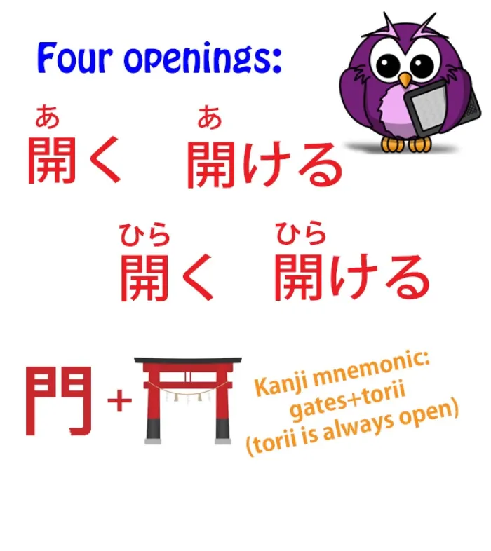
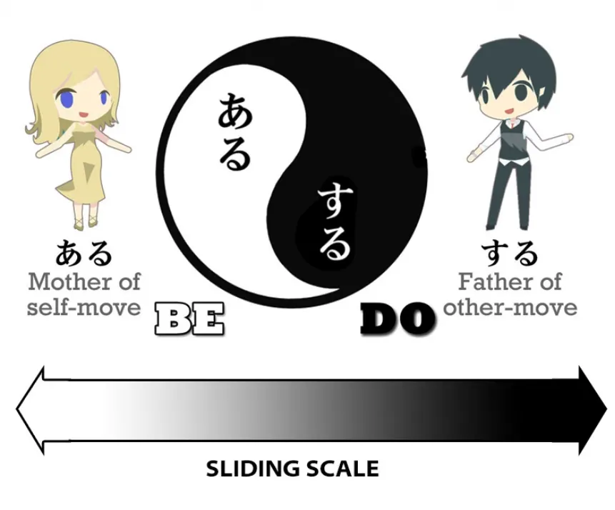
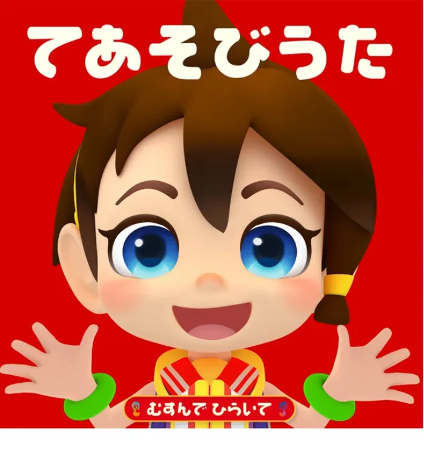
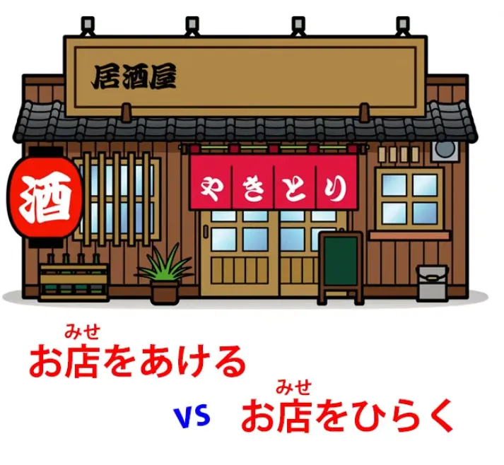

# **76. Правильное Открытие? | あく, あける, ひらく, ひらける, 開く, 開け**

[**Правильное Открытие? aku, akeru, hiraku, hirakeru | あく、あける、ひらく、ひらける、 開く、開け | Урок 76**](https://www.youtube.com/watch?v=QEInorgR6Rs&list=PLg9uYxuZf8x_A-vcqqyOFZu06WlhnypWj&index=78&pp=iAQB)

こんにちは。

Сегодня мы рассмотрим нечто, что важно само по себе, но также проливает свет на некоторые тонкости японского языка, которые очень полезно знать по мере нашего продвижения к более глубокому погружению. Итак, мы рассмотрим четыре различных способа сказать то, что в английском языке охватывается одним словом <code>open</code> (открывать/открываться).

Это <code>開く</code>, <code>開ける</code>, <code>開く</code>, <code>開ける</code>.

::: info
Они читаются как <code>あく</code>, <code>あける</code>, <code>ひらく</code> и <code>ひらける</code> соответственно, несмотря на одинаковые кандзи и окуригану. Долли уточняет это позже в уроке.
:::

Когда мы смотрим на них сначала, они выглядят как две пары самодвижущихся/другодвижущихся глаголов, не так ли? И до определённого момента это так.

Но это проиллюстрирует тонкость всей концепции самодвижущихся/другодвижущихся глаголов в японском языке, в отличие от гораздо более технического и чёткого различия между переходностью и непереходностью в английском и других западных языках.

Итак, если вы не знакомы с концепцией самодвижущихся и другодвижущихся глаголов (то, что на Западе обычно называют переходными и непереходными глаголами), я помещу ссылку на своё видео по этой теме над моей головой и в комментариях ниже.

Второе, что мы замечаем, это то, что при написании их кандзи вы на самом деле не видите разницы между <code>あく/あける</code> и <code>ひらく/ひらける</code>. Отчасти это потому, что они на самом деле взаимозаменяемы во многих случаях, и в целом, если это не тот случай, когда действительно необходимо использовать <code>ひらく/ひらける</code>, люди обычно читают <code>あく/あける</code>.

Но если автор хочет уточнить, что она использует <code>ひらく</code> для определённого эффекта (и мы рассмотрим некоторые из этих эффектов чуть позже), она напишет это хираганой, чтобы прояснить ситуацию.

Итак. Сначала возьмём верхние два: <code>あく・あける</code>. <code>あく</code> — это самодвижущийся глагол. <code>あける</code> — это другодвижущийся глагол. Оба они означают <code>открывать/открываться</code>. Итак, <code>あく</code>: дверь открывается, бутылка открывается; <code>あける</code>: открыть дверь, открыть бутылку.

По крайней мере, такова теория.

На практике мы часто слышим, как японцы говорят такие вещи, как <code>目を開く</code> (открыть глаза), что технически неверно с точки зрения грамматистов, потому что <code>開く</code> является самодвижущимся глаголом, а они используют его как другодвижущийся: открыть глаза.

Я в некоторой степени оспариваю грамматистов здесь, и я расскажу вам почему через мгновение, но вам следует придерживаться фактической грамматической модели, потому что существует лишь ограниченное число случаев, когда японцы действительно используют <code>開く</code> переходно (и я использую слово <code>переходно</code> здесь намеренно – вы поймёте почему через мгновение), и вы не хотите запоминать, какие это случаи.

Если вы используете <code>あける</code> как другодвижущуюся версию – открывая рот, открывая дверь, открывая что угодно – вы никогда не ошибётесь. Это всегда правильно.

Так почему же я оспариваю это официальное мнение, что <code>あける</code> должен быть непереходным? Ну, у меня есть небольшое ощущение, что японские грамматисты немного находятся под влиянием западного мышления и западных концепций переходности и непереходности.

Когда японцы говорят <code>目を開く</code>, я считаю, что инстинкт или чувство, стоящее за этим, заключается в том, что открытие глаз ближе к стороне <code>ある</code> на карте <code>ある・する</code>, о которой мы говорили в моём уроке о переходности.

Другими словами, открытие глаз ближе к самодвижению, ближе к состоянию, чем к действию, в отличие от открытия двери, открытия бутылки или какого-либо другого внешнего объекта.

Итак, это моё мнение на этот счёт, и вы можете игнорировать его, если хотите, но мы перейдём к некоторым другим тонкостям, которые никем не оспариваются, по мере нашего продвижения.

## 開く (ひらく & あく)

Итак, теперь давайте посмотрим на разницу между <code>あく</code> и <code>ひらく</code>.

Оба они означают <code>открывать/открываться</code>. <code>あく</code> официально является самодвижущимся, хотя мы видим, что здесь есть небольшая свобода; <code>ひらく</code> является как самодвижущимся, так и другодвижущимся вполне формально.

Разница между ними не имеет ничего общего с самодвижением или другодвижением. Она связана с типом открытия, о котором мы говорим.

Итак, если мы говорим об открытии бутылки, снятии крышки с коробки, что-либо подобное, это определённо <code>あける</code>. С другой стороны, если мы говорим о раскрытии цветка, это определённо <code>ひらく</code>.

Итак, то, что раскрывается, распахивается, — это <code>ひらく</code>. То, что просто становится открытым вместо закрытого, — это <code>あく・あける</code>.

И если вы любите японские детские песни, вы, возможно, слышали песню-игру с руками, которая звучит так: 「むすんでひらいててをうってむすんで」.

<code>むすんで</code> — это <code>結ぶ</code>, что означает <code>собранный или соединённый</code>, и это относится к закрытой руке. <code>開いて</code> относится к руке, которая раскрыта, как распустившийся цветок.

Существуют различные области, где эти два глагола взаимозаменяемы, но даже когда они взаимозаменяемы, они подчёркивают один аспект, а не другой.

Так, например, французская дверь может <code>あく</code> (открыться) или <code>ひらく</code> (распахнуться). Глаза обычно <code>あく</code>, но можно сказать, что они <code>ひらく</code>, и когда мы используем <code>ひらく</code> вместо <code>あく</code> в этих случаях, это похоже на то, как в фильме камера медленно приближается к чьим-то глазам, которые медленно открываются, или к дверям, которые медленно распахиваются.

Здесь больше ощущается сам процесс открытия, распахивания. Таким образом, это даёт тонкость, которой у нас нет в английском, и которую можно привнести в речь или письмо, просто выбрав <code>ひらく</code> вместо <code>あく</code>.

Теперь, когда мы переходим к более метафорическим или абстрактным значениям, различие снова становится важным. Например, мы можем сказать <code>店をあける</code> или <code>店をひらく</code>, и оба они означают <code>открыть магазин</code>, но <code>店をあける</code> подразумевает просто открытие утром для бизнеса или открытие после обеденного перерыва или что-то в этом роде, просто буквальное открытие магазина, просто открытие дверей, чтобы покупатели могли войти.

<code>店をひらく</code> подразумевает открытие магазина впервые, открытие для публики. Другими словами, раскрытие, как цветок, изменение из чего-то закрытого в нечто открытое.

И просто небольшое отступление: с зонтом, который также раскрывается, и вы могли бы быть склонны сказать <code>ひらく</code>, мы обычно не используем это, для открытия зонта обычно используется <code>さす</code>.

## 開ける (ひらける)

Теперь, что насчёт <code>ひらける</code>?

Японские грамматисты, или по крайней мере многие из них, фактически обозначают <code>ひらける</code> как самодвижущуюся версию <code>ひらく</code>.

Но это на самом деле не имеет никакого смысла, потому что <code>ひらく</code> сам по себе является как самодвижущимся, так и другодвижущимся. Так что же здесь на самом деле происходит? Это довольно интересно.

<code>ひらく</code>, который может быть как самодвижущимся, так и другодвижущимся, находится дальше на стороне <code>する</code> карты, чем <code>ひらける</code>. И что я имею в виду под этим?

Ну, некоторое время назад я сделала видео о том, что я называю непереводимым японским. И это о японских глаголах, которые действительно не могут быть воспроизведены в английском, потому что они выражают состояния, а не действия, таким образом, что просто не происходит в английском.

Очень простой и распространённый пример — <code>分かる</code>, который часто переводится английскими словарями и учебниками как <code>understand</code> (понимать).

Он, конечно, не означает <code>understand</code>, но когда вы получаете лучший перевод, он будет склоняться к <code>be understandable</code> (быть понятным) или <code>be clear</code> (быть ясным), и это гораздо ближе к тому, что на самом деле означает <code>分かる</code>, но истинное значение не может быть переведено на английский, потому что это на самом деле не прилагательное, как <code>clear</code> или <code>understandable</code>. Это глагол.

Итак, то, что мы на самом деле говорим, это <code>делать понятное / совершать акт понятности</code>, и это просто не имеет английского перевода. И есть много таких глаголов состояния, и я говорила о них в видео.

И <code>ひらける</code> действительно ближе к одному из них. <code>濡れる</code>, который часто переводится как <code>become wet</code> (стать мокрым), но на самом деле он не означает <code>become wet</code> – он может включать это, но подразумевает <code>существование в состоянии мокроты</code>.

Это может означать <code>стать мокрым, а затем продолжать быть мокрым</code>, или это может просто означать <code>быть мокрым</code>, но, конечно, это не <code>быть мокрым</code>, это на самом деле <code>делать мокрое</code>, что непереводимо на английский.

То же самое с <code>ひらける</code>. Так, он используется в случаях, когда, например, мы часто говорим <code>運が開ける</code>, что означает <code>удача открывается</code>.

Мы могли бы сказать <code>運が開く</code>, и это означало бы <code>удача раскрывается, как цветок, становится открытой</code>, но <code>ひらける</code> подразумевает не просто раскрытие, а продолжение существования в этом состоянии раскрытости.

Причина, по которой мы были бы более склонны сказать <code>店をひらく</code>, отчасти в том, что это более другодвижущийся глагол, чем <code>ひらける</code>, и мы фактически делаем это с магазином, мы его открываем; также потому, что акцент делается на этом акте открытия магазина.

<code>運がひらける</code>: акцент на фактическом открытии удачи менее важен, чем тот факт, что она изменится. С этого момента нам будет везти, тогда как сейчас нам не так везёт.

Итак, я думаю, это даёт нам представление не только о четырёх словах для <code>открывать/открываться</code> в японском и о том, как они работают, как они взаимодействуют. Часто они перекрываются друг с другом, и не имеет большого значения, какое из них вы используете.

В некоторых случаях это действительно важно, либо для того, что вы конкретно говорите, либо для нюанса, подтекста и атмосферы, которые вы хотите создать, произнося это.

*Ссылки в описании: [**Самодвижущиеся/другодвижущиеся глаголы: ось aru-suru**](https://www.youtube.com/watch?v=ELk1dqaEmyk&t=0s), [**Непереводимый японский**](https://www.youtube.com/watch?v=wLrK_YxdPoM), [**Песня-игра с руками むすんでひらいて**](https://www.youtube.com/watch?v=BSZC0WBldv4)*