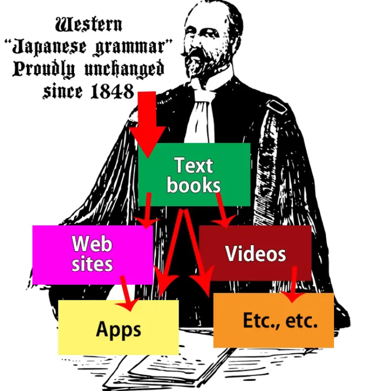
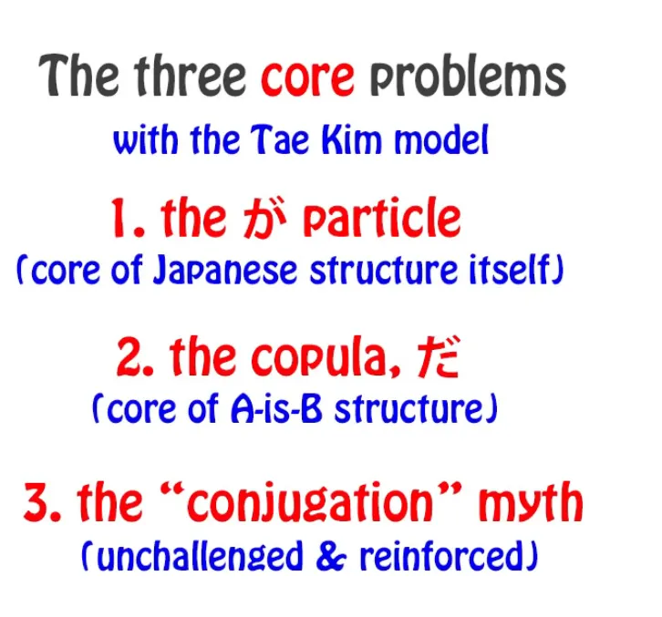
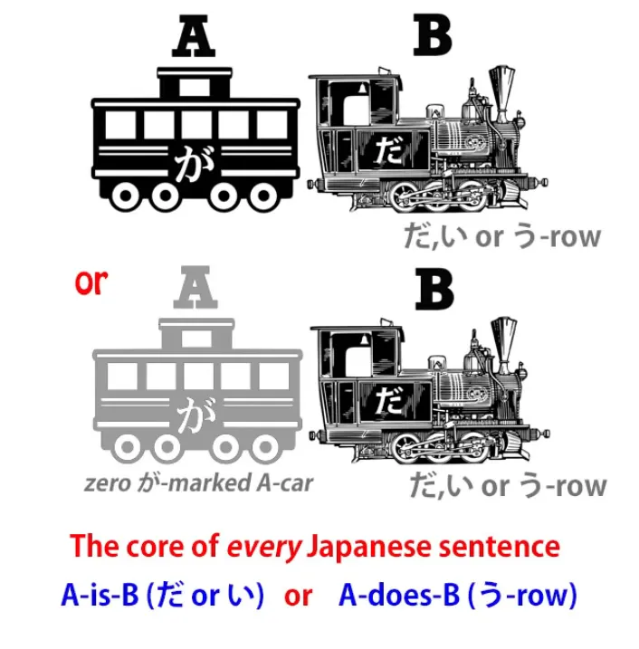
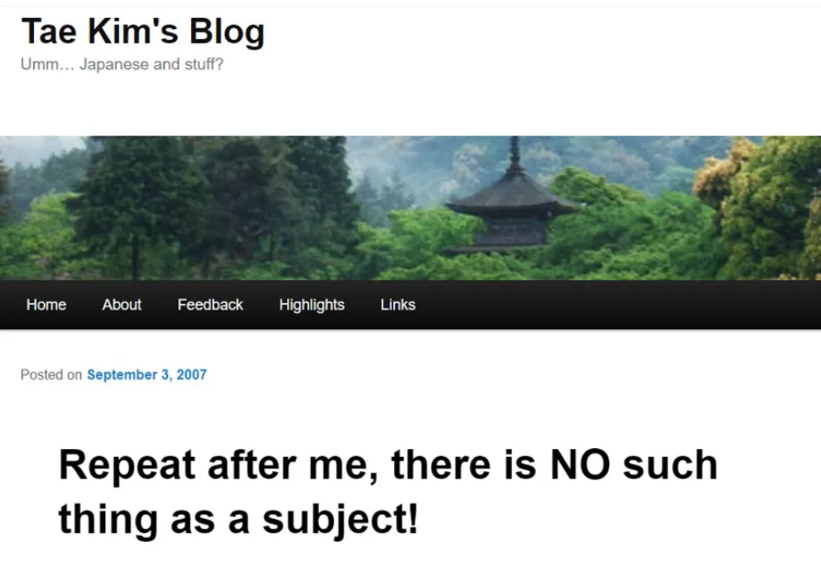
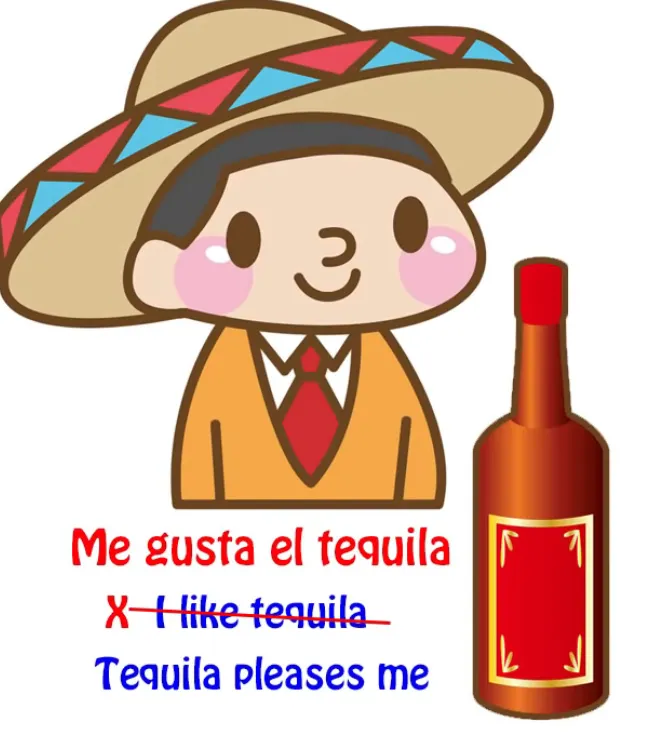
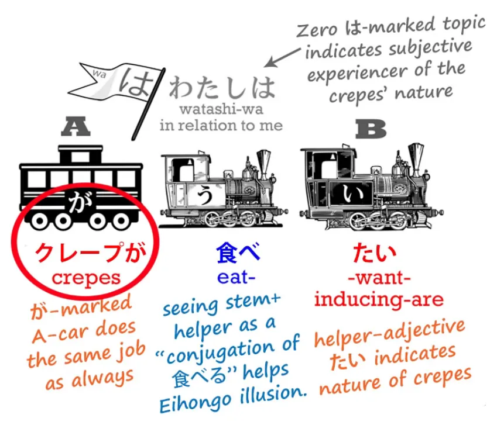
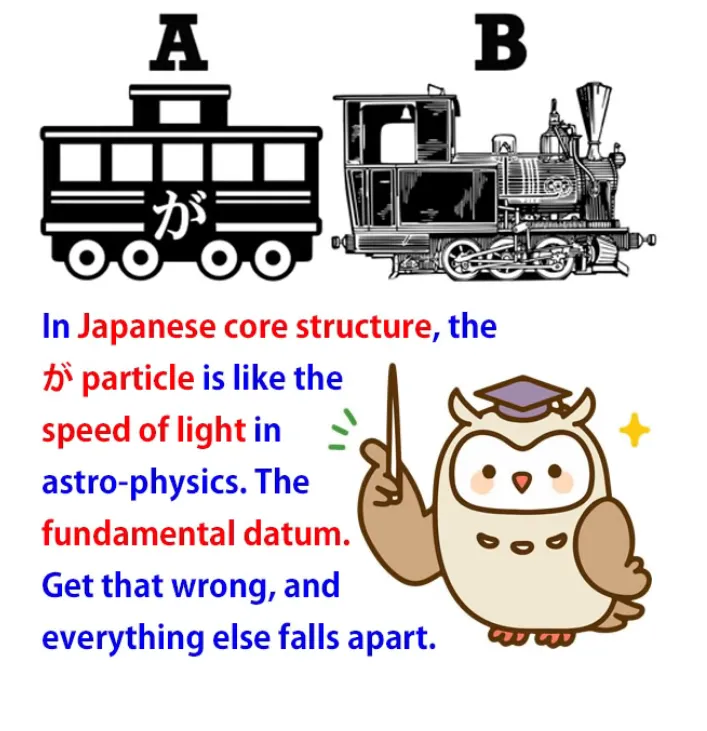

# **77. Реальная структура японского языка против Тэ Кима: Структурный обзор японской грамматики Тэ Кима**

[**Реальная структура японского языка против Тэ Кима — Структурный обзор японской грамматики Тэ Кима | Урок 77**](https://www.youtube.com/watch?v=-JuHi-yKGFc&list=PLg9uYxuZf8x_A-vcqqyOFZu06WlhnypWj&index=80&ab_channel=OrganicJapanesewithCureDolly)

こんにちは。

Сегодняшнее видео — первое, которое я действительно не решалась делать и о котором сомневалась, но я всё же решила его выпустить. Это видео, которое, я думаю, прольёт больше света для всех нас на структуру японского языка. И оно сделает это, подойдя к вопросу под немного другим углом и противопоставив его тому, с чем я обычно его не сравниваю.

Обычно я противопоставляю японский язык общепринятым моделям японской грамматики <code>Эйхонго</code>.

И некоторые люди на самом деле критиковали меня за то, что я слишком много критикую эти модели, за то, что я постоянно указываю на их недостатки, вместо того чтобы просто излагать то, что мне нужно изложить. И я делаю это по одной причине, и причина такова: общепринятая грамматика японского языка <code>Эйхонго</code>/западная грамматика японского языка действительно не менялась сотни лет, с тех пор как западные люди начали навязывать классическую европейскую грамматику японскому языку в попытке объяснить его другим западным людям.

И эти объяснения закреплены в самых престижных местах. Их преподают в университетах люди с длинными рядами букв после своих имён. Их преподают во всех стандартных учебниках, а затем они повторяются всеми, у кого есть веб-сайт или канал для изучения японского языка.

И из-за этого, из-за престижности и повсеместности этих моделей, когда люди слышат другие модели, они очень склонны задаваться вопросом, как их можно примирить. Старые модели <code>должны</code> быть верными, потому что они так престижны, и новая модель тоже звучит правдиво, так как же нам их объединить, как нам их примирить? И ответ, конечно, в том, что мы на самом деле не можем их примирить.

Если 2 плюс 2 равно 4, то они не могут также равняться 5.

И необходимо указать на это, потому что люди будут пытаться примирить их, если они не осознают этого, и это приведёт нас ко всевозможным логическим путаницам.

Итак, Тэ Ким-сэнсэй, о котором мы сегодня поговорим, был достаточно умён и храбр, чтобы увидеть фундаментальные недостатки в общепринятых западных моделях японского языка. Он видел, что они полны противоречий, несоответствий и нелогичностей, и он попытался создать модели, которые были бы более последовательными и логичными. Проблема в том, что в самых важных областях он, по сути, сохранил те части, которые были неверны, и попытался примирить с ними те части, которые были верны.

Таким образом, мы получили нечто, что во многих отношениях было хуже оригинальных моделей <code>Эйхонго</code>. Теперь я хочу прояснить, что я не пытаюсь каким-либо образом <code>очернить</code> Тэ Кима-сэнсэя. Я очень уважаю его и признаю, что он был едва ли не единственным человеком (помимо Джея Рубина), кто осознал проблему с общепринятым японским <code>Эйхонго</code> и имел смелость попытаться что-то с этим сделать.

::: info
Похоже, Джей Рубин был тем, на чём Долли основывала свои объяснения.
:::
Именно люди, которые осознают проблемы и пытаются их решить, двигают знание вперёд.

И этот процесс движения знания вперёд усеян экспериментами, которые не сработали, и моделями, которые в конечном итоге не выдержали проверки. Это не делает их глупыми. Они являются частью пути знания.

## Тэ Ким

Тэ Ким-сэнсэй имеет довольно много информации онлайн, и многое из того, что он говорит, полезно. Области, в которых мы должны оспаривать его модели, по сути, три, и, к сожалению, эти три настолько близки к самому ядру структуры языка, что они отбрасывают тень на всё остальное, потому что имеют логические последствия.

Итак, эти три, по сути:
частица <code>が</code>, которая является абсолютным стержнем японской структуры,
связка <code>だ</code>, которая необходима для всех не-прилагательных структур А-есть-Б, и миф о японском спряжении[[10]](./10-helper-verbs-the-potential-helper-verb.md).

Итак, как вы видите, это довольно грозная тройка, которая действительно отбрасывает тень на всё. Однако, если мы достаточно осведомлены о проблемах, всё ещё возможно использовать хотя бы часть работы Тэ Кима.

И его подход к погружению на самом деле ближе к тому, во что верю я, чем что-либо ещё, что я видела. Итак, давайте рассмотрим три проблемы. Первая — это частица <code>が</code>.

## Частица が

Итак, частица <code>が</code>, как я уже объясняла в различных случаях ранее, является абсолютным ядром японского языка[[1]](./1-the-basic-types-of-sentences.md).

Вы не можете иметь предложение без частицы <code>が</code>, даже если вы не всегда её видите. Иногда она присутствует только как логическая сущность. Но она всегда там, и если у нас её нет, у нас нет предложения. Всё просто.

---

Что делает частица <code>が</code>, так это отмечает подлежащее предложения, то есть то, о чём мы что-то говорим. Мы либо говорим <code>А есть Б</code>, либо <code>А делает Б</code>. То, что является А-вагоном, — это подлежащее предложения, тот, кто является, или тот, кто делает в предложении.

Частица <code>が</code> отмечает это. Она никогда не может отмечать что-либо ещё. Но общепринятый японский язык путает это, неправильно понимая некоторые японские предложения до такой степени, что приходится говорить, что <code>が</code> лишь иногда отмечает подлежащее предложения; в других случаях она отмечает дополнение.
Теперь это нонсенс, и я продемонстрировала, что это нонсенс.

<code>が</code> никогда не отмечает ничего, кроме подлежащего. Тэ Ким пытается примирить эту проблему, говоря, что <code>が</code> не отмечает подлежащее, и даже заходит так далеко, что утверждает, что в японском языке нет такого понятия, как подлежащее, и что говорить о подлежащем — это просто навязывание европейских концепций языку.

Теперь, правда в том, что каждый человеческий язык имеет подлежащее, которое мы называем А-вагоном, и сказуемое, которое мы называем Б-локомотивом. Всё, что мы говорим, когда говорим это, — это то, что каждый человеческий язык может сказать что-то о чём-то. Он может взять определённую вещь и сказать о ней определённую вещь.

Определённая вещь, которую он берёт, называется <code>подлежащим</code>. Определённая вещь, которую он о ней говорит, — это сказуемое *(=в основном всё, кроме подлежащего)*. Всё просто.

Если у нас нет подлежащих и сказуемых, у нас нет языка в каком-либо развитом смысле этого слова. Всё, что мы можем делать, если не можем сказать определённую вещь об определённой вещи, — это издавать звуки, выражающие, что мы счастливы, или грустны, или злы, или напуганы, точно так же, как это делают животные. Без подлежащих и сказуемых нет языка.

Всё просто. Разные языки могут обращаться с ними очень по-разному, но концепции должны присутствовать.

---

Итак, что же побуждает Тэ Кима-сэнсэя заявлять, что японский язык настолько отличается от любого человеческого языка, что у него нет подлежащего? Ну, по иронии судьбы, это тот факт, что он не может избавиться от грамматического подхода <code>Эйхонго</code>, который постоянно навязывает английскую структуру японскому языку. Это потому, что они не могут представить (и, по-видимому, Тэ Ким-сэнсэй тоже не может представить), что японцы когда-либо могли бы убрать эго из сердца субъективного предложения.

Итак, пример, который он использует, чтобы <code>доказать</code>, что в японском языке нет подлежащего, — это фраза <code>クレープが食べたい</code>, которая, конечно, во всех учебниках переводится как <code>Я хочу есть крепы</code>.

::: info
Объяснение Тэ Кима-сэнсэя.
:::
И, как обычно в английском, тот, кто испытывает субъективность, эго, помещается в центр.

Это подлежащее, это деятель: <code>Я хочу есть крепы.</code> И, конечно, крепы отмечены частицей <code>が</code>, и они не являются подлежащим, не так ли? Значит, <code>が</code> не отмечает подлежащее. В этом Тэ Ким-сэнсэй и общепринятый японский <code>Эйхонго</code> едины.

Японский <code>Эйхонго</code> объясняет это, говоря, что <code>が</code> лишь иногда отмечает подлежащее. Тэ Ким-сэнсэй объясняет это, говоря, что во всём языке нет подлежащего. Но простая причина обоих этих утверждений — полная неспособность даже рассмотреть тот факт, что японский язык может использовать иные выражения, чем английский, и что возможно убрать эго из центра утверждения о субъективности.

Теперь, странность в этом заключается в том, что нам даже не нужно заходить так далеко, как японский, чтобы знать, что это происходит постоянно. Это происходит в испанском. <code>Me gusta el Tequila</code> не означает <code>Я люблю текилу</code>, хотя все учебники скажут вам, что это так.

Это означает <code>Текила доставляет мне удовольствие</code>.

Теперь, возможно, английский не хочет так выражаться, но испанский выражается именно так. <code>クレープが食べたい</code> означает <code>Крепы являются вызывающими желание съесть (у меня)</code>.

Опять же, возможно, английский не хочет так выражаться, но японский выражается именно так. Частица <code>が</code> делает то, что она всегда делает. Она отмечает подлежащее, деятеля, А-вагон предложения.

Просто подлежащее, деятель, А-вагон предложения в японском языке не то же самое, что было бы, если бы англичанин попытался выразить то же самое чувство.

Подлежащее предложения — это крепы. Именно они вызывают желание съесть у того, кто испытывает это чувство. И если мы это понимаем, нам не нужно говорить, что <code>が</code> отмечает подлежащее лишь иногда.

Мы можем видеть, что <code>が</code> отмечает подлежащее всегда. И нам не нужно начинать говорить, что в японском языке нет такого понятия, как подлежащее.

Потому что единственный язык, в котором нет такого понятия, как подлежащее, — это язык <code>ван-ван</code> и <code>нян-нян</code>.
::: info
Поскольку я не смогла найти о них ничего, я почти уверена, что это была шутка (￣□￣」)
:::
Человеческий язык должен иметь подлежащие и сказуемые, иначе он перестаёт быть языком.

## Метафизическая ловушка

Теперь, некоторые из вас могут спросить, как я могу говорить, что моя модель — это истина?

::: info
И да, лингвистика на самом деле тоже научная область.
:::
Что вся общепринятая японская грамматика неверна, и Тэ Ким-сэнсэй, которого я признаю очень выдающимся умом, также создаёт модели, которые неверны?

И ответ на это: я вовсе этого не говорю.

---

Не существует такой вещи, как истина в структуре языка или лингвистике, точно так же, как не существует истины в науке. У людей метафизический склад ума. Они хотят нарративов и хотят истины и лжи.

Оба эти понятия унаследованы от глубоких и древних метафизических интуиций. И я здесь ничего не говорю о том, истинны ли эти интуиции или ложны. Всё, что я говорю, это: если они истинны, то ни наука, ни лингвистика не являются местами, где их следует искать.

Если у нас есть модель, которая непоследовательна и должна постоянно подгоняться правилами и исключениями, чтобы она работала, или у нас есть модель, которая слишком расплывчата, чтобы быть очень полезной, а затем у нас есть модель, которая точна, последовательна и работает всегда, мы, вероятно, скажем, что эта третья модель является истинной. Но на самом деле это попадание в метафизическую ловушку. Я сама иногда могу так говорить, но давайте будем совершенно ясны: это просто уловка языка.

По сравнению с непоследовательной моделью или расплывчатой моделью, последовательная и точно предсказывающая модель не <code>истиннее</code>, но она более полезна. Наука не говорит нам истину. Она предсказывает вещи. Она говорит нам, что когда мы делаем А и Б, результатом будет В.

Это не имеет ничего общего с истиной, метафизикой, нарративами или чем-либо ещё, это просто метод предсказания. И если мы можем предсказывать вещи, мы можем делать полезные вещи с этими предсказаниями. Точно так же и с языком.

Таким образом, общепринятая модель достаточно непоследовательна, чтобы во многих случаях не соответствовать своему назначению, по крайней мере, если мы не можем найти лучшую модель для её замены. Ответ Тэ Кима-сэнсэя на это — создать модель настолько расплывчатую, что она неопровержима.

Теперь, когда мы говорим о моделях или теориях, быть опровергаемым может звучать как нечто негативное, но это не так. Это позитив.

Потому что если нет обстоятельств, при которых теория может быть опровергнута, то, по сути, она на самом деле ничего не значит. Теории работают, определяя явления; то есть, устанавливая их границы: устанавливая условия, при которых они применимы, и условия, при которых они неприменимы. Если мы создаём теорию, которая применима при всех возможных условиях, то она на самом деле ничего не значит.

Если вы дадите мне предмет и спросите, что это, если я скажу, что это шарик, или коробка, или веточка, вы можете проверить или опровергнуть это утверждение. Если я скажу, что это предмет, вы не сможете это опровергнуть, потому что всё является предметом, но, с другой стороны, я не сказала вам ничего стоящего.
::: info
Эта часть выше была действительно хороша. Она показывает, что лингвистика — это не просто чёрное и белое, здесь нет только <code>правильных</code> и <code>неправильных</code> идей — скорее, <code>более полезных</code> и <code>менее полезных</code> идей для КОНКРЕТНОГО человека. Для некоторых объяснение Тэ Кима-сэнсэя работает гораздо лучше, чем объяснение Долли, и это нормально… если человек продолжает учиться/погружаться, он в конечном итоге поймёт, как язык действительно работает, даже если сначала ему давали противоречивую информацию — благодаря тому, как наш мозг перестраивается и решает языковые проблемы с помощью естественных паттернов, логики и т. д.
:::
---

Что Тэ Ким делает с частицей <code>が</code>, так это называет её <code>частицей-идентификатором</code>. Теперь, если бы вы пошли немного дальше, это могло бы быть полезно. Идентифицирует ли она подлежащее? Идентифицирует ли она дополнение?

Идентифицирует ли она какую-то совершенно другую категорию? И ответ: нам не говорят. Всё, что Тэ Ким-сэнсэй должен нам сказать, это то, что она указывает на то, что говорящий хочет идентифицировать что-то неопределённое.

Теперь, эта расплывчатость может показаться не очень разрушительной, но на самом деле она очень разрушительна, потому что, по сути, лишает нас возможности что-либо определять.

Мы не можем понять, как работает ядро японского предложения, потому что у нас нет частицы <code>が</code>. Мы не можем говорить о различии между логическими и нелогическими частицами[[8b]](./8b-particles-explained.md), такими как тематические маркеры <code>は</code> и <code>も</code>, потому что у нас нет ключевой логической частицы.

Если нам придётся строить теорию вокруг этой неопределённой <code>が</code>, то у нас будет очень неопределённая теория. Таким образом, мы, по сути, создали структуру, которая с самого начала отрицает основную структуру японского языка. И как только мы это сделали, мы логически обнаруживаем, что вынуждены делать другие вещи, которые ещё больше отдаляют теорию от полезности и предсказательности.

Итак, в нашем следующем уроке[[78]](./78-breaking-the-core-tae-kim-vs-the-copula-japanese-structure-based-critical-review.md) мы рассмотрим, что произошло со связкой <code>だ</code> в теории Тэ Кима-сэнсэя и некоторые другие последствия.

Теперь, ещё раз, я не пытаюсь очернить Тэ Кима-сэнсэя. На самом деле, причина, по которой я выделила его, заключается в том, что он единственный человек, который действительно бросил вызов общепринятой модели <code>Эйхонго</code> на достаточно глубоком уровне, чтобы дать нам другую перспективу, другой угол для оценки японской структуры.

И только потому, что он настолько важен и настолько умён, я приняла трудное решение сделать это видео и следующее.
::: info
Повторюсь, Долли НЕ принижает Тэ Кима-сэнсэя и НЕ говорит, что её подход превосходит его, потому что язык — это не чёрное и белое... Это просто сравнение понимания Долли с пониманием Тэ Кима.
И совершенно нормально иметь разные точки зрения на вещи в языке. Это постоянно происходит в лингвистике. Это ни в коем случае не предназначено для того, чтобы вызывать недоброжелательность или насмешки.
*Мы все разные, и для каждого из нас работает что-то своё, так что в этом есть польза.*
:::