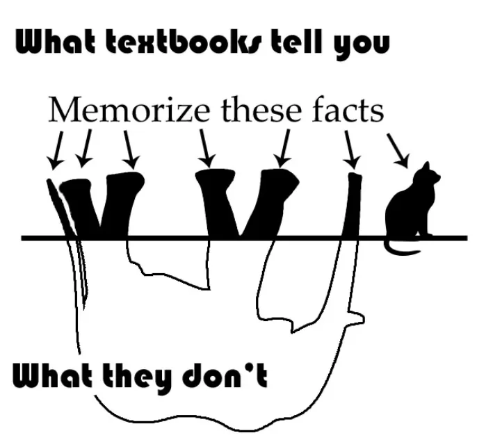
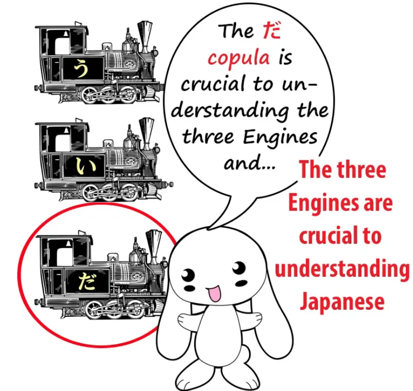
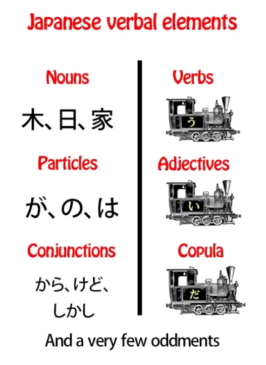
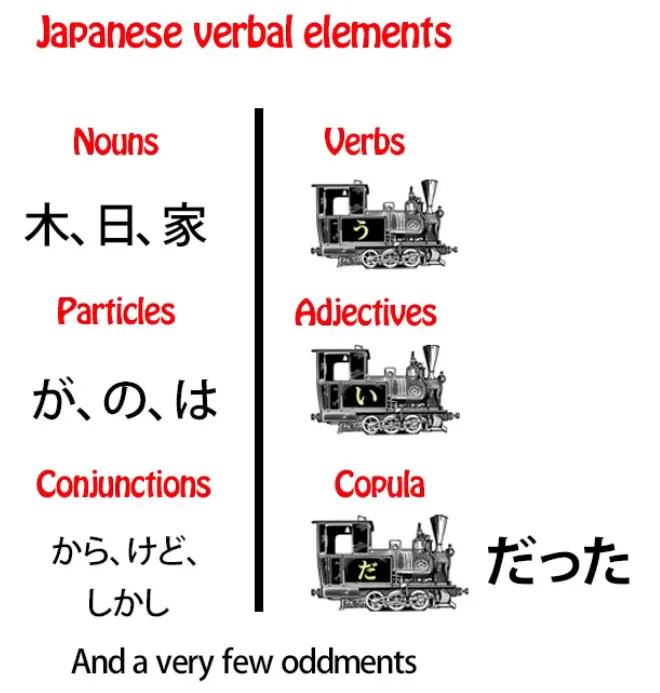
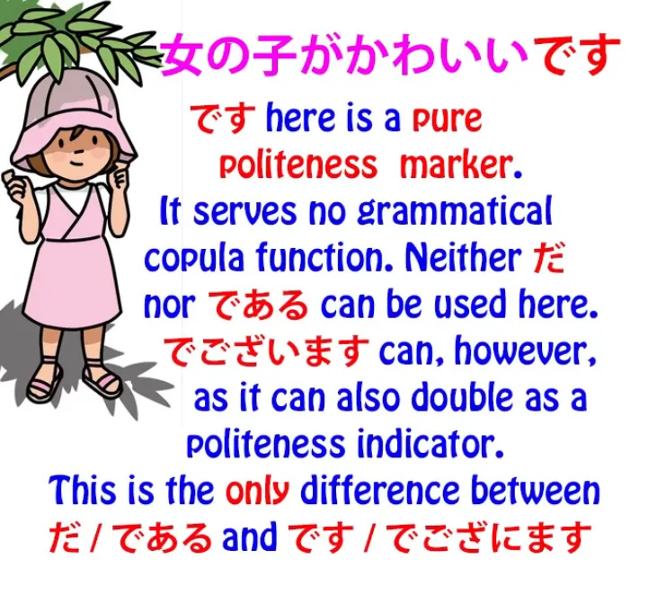
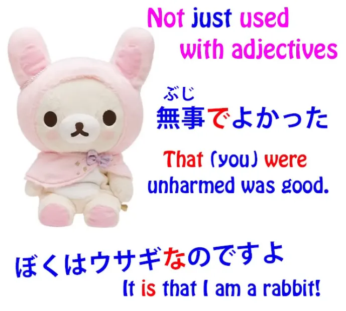

# **78. Разрушая ядро: Тэ Ким против связки | Критический обзор японской грамматики на основе структуры**

[**Разрушая ядро: Тэ Ким против связки | Критический обзор японской грамматики на основе структуры | Урок 78**](https://www.youtube.com/watch?v=u2RBlHxD7fk)

こんにちは。

Сегодня мы поговорим о ядре японской структуры, и мы рассмотрим его под другим углом, противопоставив его тому, с чем мы обычно его не сравниваем.

А именно, мы рассмотрим, что Тэ Ким-сэнсэй делает с ним. На прошлой неделе мы рассмотрели, что Тэ Ким-сэнсэй делает с частицей <code>が</code>, которая является абсолютным ядром и центром каждого логического японского предложения.

Сегодня мы рассмотрим, что он делает со <code>だ</code>.

И в некотором смысле это параллельно тому, что он делает с <code>が</code>.

## Связка だ (& です)

То есть, он, по сути, размывает её до небытия, лишает её логической функции и наделяет её некой расплывчатой функцией.

Итак, почему он это делает? Опять же, по сути, по той же причине: потому что общепринятая грамматическая интерпретация <code>Эйхонго</code> — это нелогичный беспорядок, и Тэ Ким-сэнсэй хочет его привести в порядок.

Но, по сути, он снова берёт ту часть, которая неверна, и пытается примирить с ней ту часть, которая верна. В итоге мы получаем нечто, что на самом деле более вредно и менее полезно, чем та мешанина <code>Эйхонго</code>, которую мы имели изначально, которая, по крайней мере, содержала в себе часть реальной структуры японского языка, пусть и довольно нелогичным и беспорядочным образом.

И он также отрицает, что <code>だ</code> и <code>です</code> на самом деле одно и то же, и это по трём причинам.

Во-первых, если вы отрицаете функцию связки, то не имеет особого значения, чем они являются. Во-вторых, <code>です</code> немного эксцентрична.

Она делает одну вещь, которую не делает <code>だ</code>. Всего одну вещь.

Но также потому, что японская модель <code>Эйхонго</code> настолько запутана и настолько привязана к мифу о так называемом <code>японском спряжении</code>, которого не существует, что она заставляет эту одну эксцентричность <code>です</code> выглядеть как нечто большее, чем одна.

---

Кажется, будто она повсюду, хотя на самом деле у неё всего одна эксцентричность — что немного сбивает с толку, но когда вы видите её такой, какая она есть, это всего лишь одна вещь.

Итак, насколько важно, чтобы мы неправильно понимали связку <code>だ</code>?

Она не является центральной для каждого японского предложения, как частица <code>が</code>, так ли это плохо? Ну, на самом деле, да, потому что она убирает ещё один из абсолютных столпов понимания японской структуры.

А именно, понимание трёх локомотивов и трёх ядер предложений.

---

Есть только три способа, которыми может заканчиваться логическое японское предложение: глаголом, прилагательным или существительным + связка. Оно не может заканчиваться существительным само по себе; оно может заканчиваться только существительным + связка.

И это фундаментально важно, и мы скоро к этому вернёмся, но я просто отмечу здесь, что часть рассуждений Тэ Кима о том, что связка является всего лишь декларативной — она на самом деле не делает ничего логического и грамматического, она просто подчёркивает то, что мы хотим сказать — заключается в том, что в **непринуждённой** речи <code>だ</code> иногда опускается.

Теперь, важно понимать, что **это не означает, что она не нужна**. В английском мы часто говорим такие вещи, как <code>Got up early this morning</code> (Встал рано этим утром), <code>Fancy a cup of coffee?</code> (Хочешь чашечку кофе?), <code>Call that a rabbit? Looks more like a teddy bear in a rabbit suit to me!</code> (Называешь это кроликом? По мне, так больше похоже на плюшевого мишку в костюме кролика!).

И во всех этих случаях мы знаем, все знают, что предложения не являются полностью грамматически правильными. Вы должны сказать: <code>I got up early this morning</code>, <code>Do you fancy a cup of coffee?</code>, <code>Do you call that a rabbit? It looks more like a teddy bear in a rabbit suit to me!</code>

Это совершенно естественно. Все языки опускают необходимые грамматические элементы, когда они легко понятны \[слушателю\] в очень непринуждённой речи. Вы не можете делать это в эссе, в официальном письме или в юридическом документе, но вы можете делать это в непринуждённой речи.

---

В японском языке не только опускается связка, но и **половина частиц может быть опущена в очень непринуждённой речи**. И я не думаю, что кто-либо утверждает, что они не нужны.

Итак, **в настоящем грамматическом японском языке** вы можете закончить предложение только одним из этих трёх способов. Оно может заканчиваться глаголом, оно может заканчиваться прилагательным, или оно может заканчиваться связкой, и **связка всегда должна быть присоединена к существительному**, потому что так работает связка.

И, как мы знаем, связка сообщает нам, что А есть Б. <code>さくらが日本人**だ**</code> означает <code>Сакура **является** японцем</code>.

Это работает только в одну сторону. Японец не обязательно Сакура. Сакура — японец.

Вот что нам сообщает предложение со связкой.

---

Теперь, если мы посмотрим на все элементы в японском языке, все глагольные элементы, их не так уж много.

В отличие от английского, в отличие от европейских языков, их действительно очень мало.

Есть глаголы, прилагательные и связка, а кроме того, у нас есть существительные — почти всё, что не является глаголом или прилагательным, является существительным.

Есть также частицы, и есть некоторые союзы, такие как <code>なら</code> и <code>けれど</code>. Почти всё остальное, что не является глаголом или прилагательным, на самом деле является существительным. Есть несколько исключений, но их очень мало.

Итак, почему мы делим их таким образом? С одной стороны у нас глаголы, прилагательные и связка; с другой стороны у нас существительные, частицы и союзы.

Причина в том, что когда мы разделяем их таким образом, помимо того факта, что у нас есть три локомотива вместе, эти три локомотива обладают ещё одной характеристикой, ещё одним качеством.

Все они — <code>用言</code>, все они — трансформирующиеся глагольные элементы, то есть, все они могут грамматически изменяться.
::: info
Долли не даёт форму кандзи для 「ようげん」, но я практически уверена, что это именно она.
:::
Они не изменяются так сильно, как заставляют нас верить традиционный японский язык или Тэ Ким-сэнсэй. Они не спрягаются.

Но **они изменяют последнюю кану** (в паре случаев немного больше, чем последнюю кану), а затем, в случае глаголов и прилагательных, **они могут присоединять вспомогательные глаголы, вспомогательные прилагательные и вспомогательные существительные**. И это фундаментальная основа того, как работает японский язык.

В другом столбце у нас существительные, частицы и союзы, и они никогда не изменяются. **Существительное никогда не изменяется грамматически**. Оно никогда не подвергается каким-либо трансформациям или модификациям для грамматических целей.

**Частицы никогда не изменяются**. Они присоединяются к существительным, но всегда остаются неизменными.

Союзы, такие как <code>から</code> и <code>けれど</code>, не изменяют свою форму для грамматических целей. Единственные глагольные элементы, которые это делают в японском, — это три локомотива: глаголы, прилагательные и связка.

Но если вы посмотрите на традиционные учебники и веб-сайты по японской грамматике, вы в большинстве случаев не узнаете, что **связка является одним из этих грамматически трансформирующихся элементов**. Мы знаем, что глаголы таковы. Мы знаем, что прилагательные таковы.

Мы знаем, что <code>だ</code> может фактически переходить в прошедшее время и становиться <code>だった</code>, но мы не осознаём, что это полностью, хотя и немного ограниченный, но модулирующий элемент.

Тот факт, что мы знаем, что у неё есть одна модуляция, только ещё больше запутывает всё. Это выглядит как странность. Но это не странность.

**Как и глаголы с прилагательными, связка является полностью трансформирующимся элементом.** **У неё есть て-форма**, точно так же, как у глаголов и прилагательных. **И эта て-форма — <code>で</code>**, и **это та же самая て-форма, будь то версия <code>だ</code> или версия <code>です</code>**.

**И у неё есть соединительная форма** *(な)*, которая используется, когда она стоит перед существительным, которое она модифицирует, а не после существительного, которое она модифицирует.

Мы можем сказать: <code>女の子は綺麗**だ**</code> (девочка **красивая**), или мы можем сказать: <code>綺麗**な**女の子</code>. И когда мы меняем это таким образом, <code>だ</code> становится <code>な</code>.

**Если мы хотим связать два адъективных существительных вместе, мы используем て-форму связки.** И это то же самое, что мы делаем с прилагательными.

Если мы хотим сказать <code>Сакура маленькая и красивая</code>, мы говорим <code>さくらが小さくて綺麗だ</code>. Если мы хотим сказать <code>Сакура красивая и маленькая</code> (красивая, <code>綺麗</code>, — это существительное, адъективное существительное — мы знаем, что это существительное, потому что оно может быть написано полностью кандзи, и почти всё, что написано двумя или более кандзи, и почти всё, что написано одним кандзи, всегда является существительным), мы говорим <code>さくらが綺麗**で**小さい</code>.

Если мы хотим сказать <code>Сакура полна энергии</code>, мы говорим <code>さくらが元気だ</code>. Если мы хотим сказать <code>Сакура полна энергии и красива</code>, мы говорим <code>さくらが元気**で**綺麗だ</code>.
::: info
Я полагаю, что поскольку связка присоединяется к существительному, именно поэтому у нас есть как て-форма связки 「で」 после <code>元気</code>, так и обычная форма связки <code>だ</code> в конце после <code>綺麗</code>. То есть, по сути, две связки, но одна из них также связывает существительные вместе. Но это лишь моё предположение, так что отнеситесь к нему с долей скептицизма.
:::
И вы видите, мы сделали в точности то же, что делаем с прилагательными.

**С прилагательными**, если мы хотим связать два прилагательных вместе, мы ставим первое в て-форму: <code>さくらが小さく**て**かわいい.</code>
::: info
Если я правильно понимаю, て — это адъективная соединительная форма связки, как <code>で</code>, а последняя い в <code>かわいい</code> — это простая форма связки прилагательного, как дано в уроке 6.
:::
---

Если мы хотим связать **два адъективных существительных** с присоединённой к ним связкой, **мы превращаем первую связку в её て-форму**, которая есть <code>で</code>.

Теперь, по какой-то причине учебники никогда этого не объясняют. Они пытаются сказать нам, что адъективные существительные — это какая-то странная вещь, называемая <code>な-прилагательным</code>, к которой прикреплена эта штука под названием <code>な</code> без какой-либо причины, которую мы могли бы понять, хотя когда она стоит в конце предложения, у неё есть <code>だ</code>, как у любого другого существительного.

И затем, когда мы хотим связать два вместе, большинство людей, я думаю, всерьёз считают, что частица <code>で</code>, без какой-либо возможной объяснимой причины, используется для этой цели.

Конечно, **это не частица <code>で</code>**; **это て-форма связки <code>だ</code> или <code>です</code>**.

И я думаю, что именно тот факт, что это никогда не объясняется, позволяет Тэ Киму-сэнсэю верить, что <code>だ</code> — это просто декларатив. Если бы это был декларатив, зачем бы ему нужна была て-форма? Зачем вам нужна て-форма для того, что по сути является просто глагольным восклицательным знаком?

Зачем вам нужна мягкая соединительная форма для того, что по сути является просто глагольным восклицательным знаком? Не нужна.

Но поскольку традиционный японский <code>Эйхонго</code> никогда не даёт нам понять, что на самом деле происходит, что **<code>な</code> — это предсоединительная форма <code>だ</code>**, что **<code>で</code> в этих случаях — это て-форма связки <code>だ</code>**, поскольку он никогда этого не объясняет, это позволяет даже такому умному человеку, как Тэ Ким-сэнсэй, неправильно понять, чем на самом деле является <code>だ</code> и что она на самом деле делает.

И сделав это, мы действительно потеряли понимание трёх фундаментальных локомотивов каждого японского предложения.

И я должна сказать, что **<code>だ</code> и <code>です</code> на самом деле не единственные две формы связки** в современном японском языке. Это наиболее распространённые формы, но **есть также две другие.**

## Форма связки である

Иногда мы используем <code>である</code>, что является своего рода ископаемым.

**Это старая форма связки**, и она **используется в формальных, но не обязательно вежливых контекстах.** Так, например, её можно использовать в газетных репортажах, где она просто формальна и объективна, не особо вежлива.

Знаменитый роман <code>Я — кошка</code> на японском языке звучит как <code>我輩は猫である</code>, и причина, по которой он использует <code>我輩</code> для <code>я</code> и <code>である</code> для связки, передаёт на японском, так, как не может передать английский перевод, характер данной кошки, которая обладает личностью довольно <code>偉そう</code>, довольно самодовольного джентльмена, который называет себя <code>我輩</code> и использует довольно архаичную и формальную, но не особо вежливую связку <code>である</code>.
::: info
У <code>わがはい</code> есть две формы — <code>我輩</code> и <code>吾輩</code>, они в основном идентичны, но, по-видимому,
[**кажется, что <code>吾輩</code> немного менее напыщенная/сдержанная, а <code>吾</code> не является 常用漢字.**](https://chigai-hikaku.com/?p=49060)
:::

## Форма связки でございます

Другая связка, которую мы часто услышим, это <code>でございます</code>, и **это ультравежливо**.

**Это 敬語**, и вы услышите это в японских отелях и подобных местах.

**Все они являются формами связки**,
и **все они имеют одну и ту же て-форму, <code>で</code>**, **и одну и ту же соединительную форму, <code>な</code>**.

## Эксцентричность です и ます

Теперь, другая вещь, я думаю, которая позволяет представить, что <code>です</code> — это не та же связка, что и <code>だ</code>, заключается в том, что **<code>です</code> и <code>ます</code> обе немного эксцентричны** — и я сделала целое видео об этом. **[[17]](./17-polite-japanese-and-the-volitional.md)**

И именно по этой причине, потому что их эксцентричность на самом деле нарушает наше понимание фундаментальной основной японской грамматики — как только мы к этому привыкнем, достаточно легко добавлять <code>です</code> и <code>ます</code>, но лучше оставить их в покое сначала, потому что **они делают то, чего не делают никакие другие современные японские слова**.

---

И **одна вещь, которую <code>です</code> делает в этом случае, это то, что она может быть добавлена к прилагательным**. Так мы говорим <code>女の子がかわいい**です**</code>.

::: info
Хотя это будет затронуто в Уроке 79. Это не просто случайный пустой маркер.
:::
Теперь, **эта <code>です</code> не действует как связка**. **Это просто маркер формальности.**

И **причина, по которой она там, заключается в том, что не существует формальной версии локомотива-прилагательного**. И это происходит только в этом одном случае, и это происходит только потому, что у прилагательных нет другого способа формализовать себя, и каким-то образом японский язык остановился на идее использования формальной связки в качестве маркера формальности в этом конкретном случае.

Другие, **невежливые формы связки, <code>だ</code> и <code>である</code>,** **не ставятся в конец прилагательных.**

И, конечно, дело не только в прилагательных. **Соединительная форма связки и て-форма связки используются** **в различных местах в японском языке для образования множества различных конструкций.**

И я включила некоторые из них в видео *(должно быть, Урок 40)*, ссылку на которое я оставлю над своей головой и в разделе информации ниже, если вы захотите немного углубиться.

И если мы не знаем, что у связки есть て-форма или соединительная форма, то у нас будет много трудностей в понимании того, что на самом деле делают эти конструкции.

И если мы будем следовать традиционной японской грамматике <code>Эйхонго</code>, мы, вероятно, не будем этого знать, а если мы будем следовать Тэ Киму-сэнсэю, мы даже не будем знать, что существует связка. И это сделает всевозможные конструкции чрезвычайно сложными.

## Вопрос о спряжении

И здесь мы действительно должны затронуть другую проблему с Тэ Кимом, которая на самом деле не хуже, чем учебники <code>Эйхонго</code>, но и не лучше.

И это то, что он, как и они, принимает миф о <code>японском спряжении</code>. Он верит, что японские глаголы спрягаются, хотя на самом деле они лишь изменяют одну кану и присоединяют вспомогательные существительные, глаголы и прилагательные.
::: info
Скорее, с точки зрения западной языковой структуры и логики. Лингвистически, я думаю, можно было бы поспорить, действительно ли в японском языке нет или есть определённый вид спряжения…
В общем, в конечном итоге это не имеет значения, пока к японскому языку подходят как к японскому.
:::

И это становится важным в данном конкретном случае, потому что это создаёт впечатление, что эта эксцентричность <code>です</code> охватывает более широкий диапазон, чем на самом деле.

Если я скажу, что <code>です</code> используется только как пустой маркер формальности для прилагательных, кто-то, кто следует либо традиционному японскому, либо Тэ Киму, может сказать: «Ну, это не только прилагательные. Это также происходит со спрягаемыми глаголами, например, **<code>食べないです</code>** или **<code>食べたいです</code>**.

Они же не прилагательные, не так ли? Они спрягаемые глаголы».

И ответ на это, конечно, да, **они прилагательные**. **Они не спрягаемые глаголы.** В японском языке нет спрягаемых глаголов.

**<code>ない</code> — это вспомогательное прилагательное, которое присоединяется к основе <code>食べる</code>**. **<code>たい</code> — это другое вспомогательное прилагательное, которое присоединяется к основе <code>食べる</code>**. И я объяснила всё это в своём видео о японской системе основ.[[7.5]](./7-5-conjugation.md)

**Эти вспомогательные элементы выглядят как прилагательные, они функционируют во всех отношениях как прилагательные**, и на это есть веская причина. **Они являются прилагательными.**

Итак, **версия <code>です</code> как пустого маркера формальности** не присоединяется ко всем видам разных слов. Она **присоединяется только к одному виду слов, и это прилагательные.**

И это указывает нам, как одна логическая ошибка в японском языке на самом деле порождает другие. Поскольку мы не понимаем, что связка модулирует, это может привести к гораздо большей ошибке: что связки вообще нет.

Поскольку мы не понимаем систему основ и вспомогательных элементов и верим, что японские глаголы спрягаются, мы можем верить, что пустой маркер формальности <code>です</code> используется в широком диапазоне различных ситуаций, хотя на самом деле он используется только в одной ситуации.

Теперь, как я уже говорила, **я не пытаюсь нападать на Тэ Кима-сэнсэя**. **Он проделал огромную исключительную работу**, и тот факт, что он неправильно понял многое в японском, по сути, объясняется тем, что **он увидел, что не так с традиционной японской грамматикой <code>Эйхонго</code>, и попытался привести её в порядок.**

К сожалению, вместо того чтобы выбросить это в мусорное ведро, он смёл это на ковёр в гостиной. Но **это не потому, что он нелогичен**. Это потому, что он логичен, и он просто не понял, что именно происходит.

И это неудивительно, потому что никто этому не учит, никто никому не говорит.

Так что я надеюсь, что я помогла немного прояснить ситуацию здесь.
::: info
Снова попробовала подчёркивания, в этом стиле, мне кажется, это выглядит довольно хорошо и может помочь лучше выделить важные части. Но вы, конечно, можете сообщить мне своё мнение об этом (o≧▽゜)o
:::