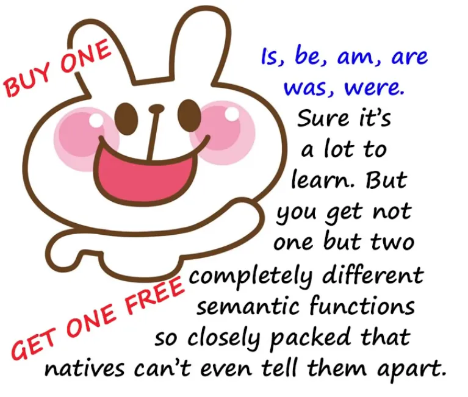
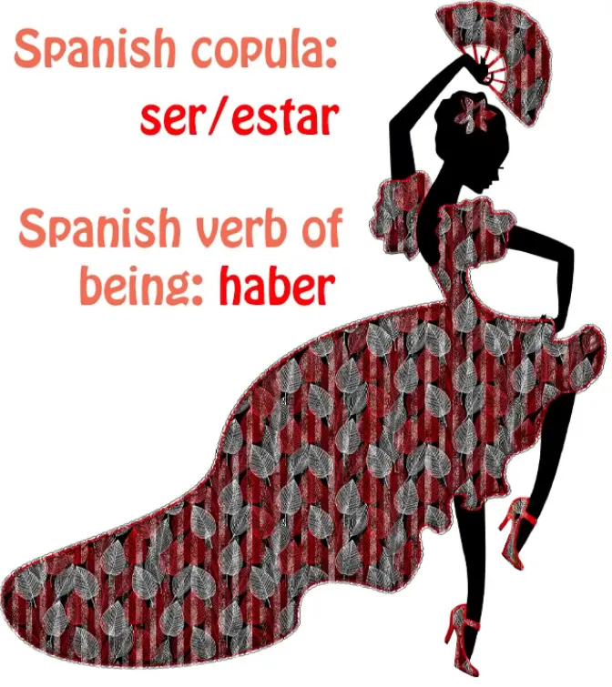
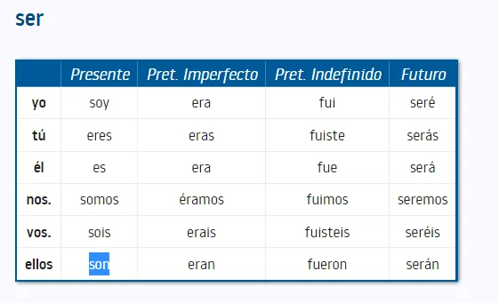
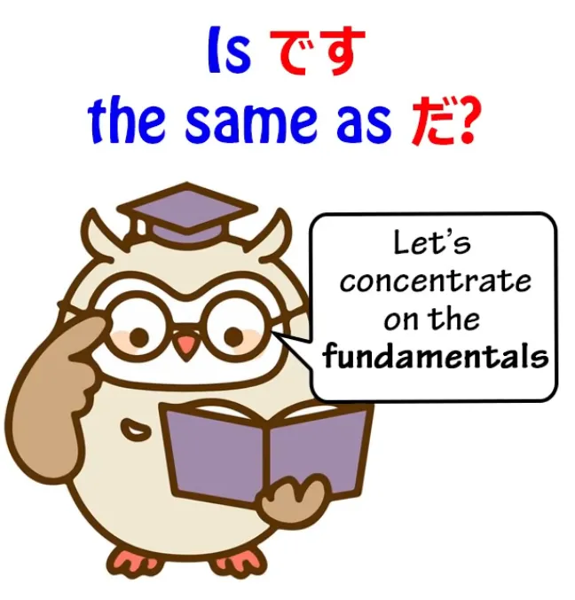
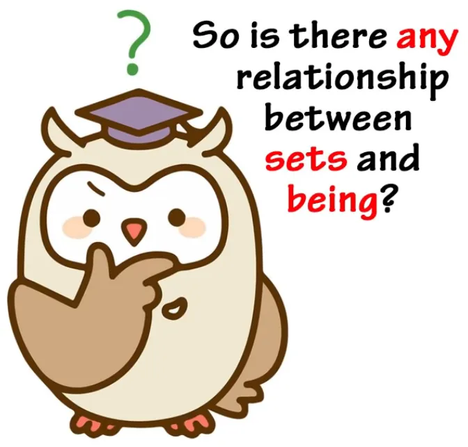
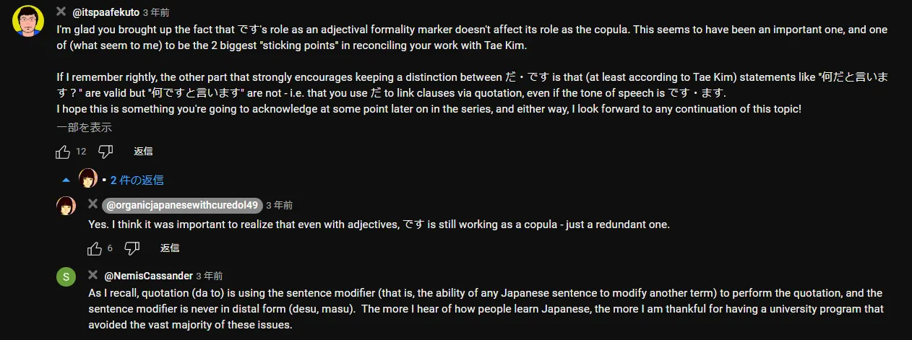

# **79. Более глубокий секрет связки**

[**1/3 всех японских предложений разгадана! Более глубокий секрет связки. +Заблуждение Тэ Кима | Урок 79**](https://www.youtube.com/watch?v=euHYPcMoao4&list=PLg9uYxuZf8x_A-vcqqyOFZu06WlhnypWj&index=81&ab_channel=OrganicJapanesewithCureDolly)

こんにちは。

Сегодня мы поговорим о чём-то абсолютно ключевом для основной структуры японского языка. Мы недавно обсуждали это в связи с Тэ Кимом-сэнсэем и тем, как он нарушает наше понимание этой конкретной вещи. Это связка, и она действительно управляет огромным количеством того, что мы можем сказать и передать в самом языке. Это крайне важно для того, как мы концептуализируем мир.

Тэ Ким никогда не использует «С-слово», <code>связка</code>, и в этом большая часть проблемы. Но некоторые могут спросить не столько, почему Тэ Ким не использует, сколько, почему я использую. В конце концов, я стараюсь избегать технической лингвистической и грамматической терминологии насколько это возможно.

Я нечасто использую слово <code>**грамматический субъект**</code>; ещё реже я использую слово <code>**предикат**</code>. **Я предпочитаю говорить <code>А-вагон</code> и <code>Б-локомотив</code>.**

Так мы все знаем, о чём говорим. Так почему же я использую это абстрактное и довольно ужасное слово, <code>связка</code>?

## Что такое «связка»

Ну, причина в том, что в английском языке нет выделенной связки, поэтому англоговорящим может быть довольно трудно понять, что именно такое связка. Мне приходится вводить эту функцию как нечто само по себе. Когда Тэ Ким говорит о связочных выражениях, он называет их выражениями <code>состояния бытия</code>, и в этом действительно ключ ко всей проблеме.

Итак, что такое связка, и почему в английском языке нет выделенной связки, и почему это так важно? Давайте начнём с <code>что такое связка?</code>

Самый простой способ определить связку — это то, что **она является односторонним знаком равенства**.

**Она говорит нам, что А есть Б**, **хотя Б не обязательно есть А**. Так, <code>さくらは日本人**です**</code>. *(Очевидно, <code>だ</code> тоже)* Сакура **является** японцем; **японец не обязательно является Сакурой.**

Это простое объяснение. Но если мы копнём немного глубже, **то, что связка на самом деле делает, это помещает вещи в множества**.

<code>さくらは日本人**です**</code> **означает, что Сакура принадлежит к множеству <code>японец</code>**.

И это фундаментально важно для языка, который является инструментом, используемым людьми для концептуализации мира, вещей, которые они видят вокруг себя, видимой и воспринимаемой вселенной. Помещение вещей в категории — это наш самый фундаментальный способ взаимодействия с ними. **Роза принадлежит к множеству <code>цветок</code>**.

**Цветок принадлежит к множеству <code>растущие вещи</code>**. **Растущие вещи принадлежат к множеству <code>живые вещи</code>**. **Живые вещи принадлежат к множеству <code>вещи</code>**.

Всё время мы помещаем вещи в множества, и это наш способ их концептуализации. Мы могли бы очень мало сказать о чём-либо, если бы не могли помещать вещи в множества.

Итак, **это, по сути, то, что делает связка**. **Она даёт нам очень простой, прямой, непритязательный способ поместить что угодно в множество в любое время, определить в любое время множество, к которому что-то принадлежит.**

---

**Теперь, множество может состоять только из одного элемента. В этом случае знак равенства работает в обе стороны.** Так, например, если я говорю <code>Тот человек там — Сакура</code>, ну, тот конкретный человек там и Сакура — это один и тот же человек.

**Сакура — это множество из одного элемента, к которому принадлежит тот человек там, и только тот человек там.** **По крайней мере, эта конкретная Сакура.** **Мы, очевидно, не говорим обо всех людях по имени Сакура**.

Итак, вот что делает связка. Почему так много путаницы вокруг неё? Разве это не относительно простая функция? Ну да, это простая функция.

Основная проблема здесь, как очень часто бывает с западными заблуждениями о японском языке, заключается не в японском, а в природе самого английского языка. **В английском, как я уже сказала, нет выделенной связки.**

**У него есть связка. Каждый язык должен иметь связку.** Если бы у нас не было чего-то, что выполняло бы связочную функцию, мы просто не смогли бы помещать вещи в множества, а это означает, что мы были бы очень ограничены в нашей способности концептуализировать вещи.

**Итак, что делает английский язык, так это удваивает глагол бытия со связкой.** **Глагол бытия — это то, что просто сообщает нам, что что-то существует.** **У него есть различные формы: <code>is / am / are / was</code> и т.д.**

Итак, если мы говорим <code>I **am** an American</code> (Я **являюсь** американцем), это работает **связка**. Мы говорим, что **я принадлежу к множеству под названием <code>американцы</code>**. Если мы говорим <code>I think, therefore I am</code> (Я мыслю, следовательно, я существую), мы используем глагол бытия.

**Мы не говорим ничего о том, кто я, к какому множеству я принадлежу.** Мы просто говорим, что поскольку я мыслю, мы можем уверенно заявить, что я существую.

Теперь, поскольку в английском языке нет двух отдельных слов для этих двух концепций, это на самом деле не доставляет особых проблем носителям английского языка или иностранцам, которые выучили английский хотя бы частично через погружение, потому что через некоторое время всё становится ясно благодаря использованию и опыту, но **это вызывает проблемы, когда английский пытается рассматривать языки, которые имеют отдельную связку.** Японский, очевидно, один из таких, и испанский — другой.

---

**Испанский язык имеет две связки, <code>ser</code> и <code>estar</code>**: <code>ser</code>, которая сообщает нам о постоянном множестве, к которому что-то принадлежит, и <code>estar</code>, которая сообщает нам об относительно временном множестве, к которому что-то принадлежит. Это различие, которое большинство языков не делает.

**Но важное различие здесь заключается в том, что <code>ser</code> и <code>estar</code> не то же самое, что <code>haber</code>, который является глаголом бытия.**

Итак, если мы говорим <code>Estos **son** huevos</code> (Эти **есть** яйца), мы говорим <code>These **are** eggs</code> (Эти **являются** яйцами); *(«son» здесь должно быть связкой)*

если мы говорим <code>**Hay** huevos</code> (Есть яйца), мы говорим <code>Eggs **exist**</code> (Яйца **существуют**) — два совершенно разных вида утверждений. Как я уже сказала, **в английском мы не путаемся между этими двумя видами утверждений, но когда мы пытаемся применить английские объяснения к языкам, которые имеют разные слова для связки и глагола бытия, часто возникает путаница.**

## だ и です — одна и та же связка

Теперь, некоторые из тех, кто комментировал моё видео о Тэ Киме против связки, не были полностью убеждены моим аргументом, что <code>です</code> и <code>だ</code> — это одно и то же, потому что Тэ Ким так сильно утверждает обратное. Я думаю, я опровергла большинство из них. Я не опровергла все, потому что не стремилась быть исчерпывающей.

И я не буду рассматривать эти аргументы здесь, потому что считаю их второстепенными. Я, по сути, рассмотрю их в видео в довольно ближайшем будущем, **но суть здесь в том, что принимать аргументы вроде <code>да не обязательно нужна в этом случае, а дес нужна</code> как способ поддержания более широкого аргумента о том, что <code>да</code> и <code>дес</code> не одно и то же, — это переворачивать всё с ног на голову и наизнанку.**

**Важно не то, что <code>да</code> и <code>дес</code> функционируют немного по-разному так или иначе, что <code>да</code> можно опустить здесь, а <code>дес</code> нельзя опустить там, и тому подобное.** Это совершенно второстепенно по отношению к тому факту, что **они обе являются связкой**.

И фундаментальный аргумент против этого заблуждения прост: мы знаем, что **каждый язык должен иметь связку.** **Без связочной функции вы не сможете сказать и половины того, что язык абсолютно должен сказать.** У вас не будет настоящего языка.

**У вас будет сломанный язык, если у вас нет никакой связочной функции.** Теперь, японский иногда говорит на <code>丁寧語</code> (на <code>です/ます</code>, то есть *= вежливый язык*) и иногда говорит на простом, обычном японском. **Связка в одном — это <code>です</code>** *(вежливая)***; связка в другом — это <code>だ</code>.** *(обычная)*

Теперь, если вы собираетесь утверждать, что они не одно и то же, следовательно, что одна из них не является связкой, тогда вы должны придумать, что такое связка, как в обычном языке, так и в <code>丁寧語</code> (языке <code>です/ます</code>), потому что **обе формы должны иметь связку.** **У вас нет языка без связки**, поэтому вы обязаны, если вы говорите, что они не одно и то же, сказать нам, где находится связка в обеих этих формах речи.

И, конечно, Тэ Ким никогда не решает эту проблему, потому что он, кажется, на самом деле не понимает, что существует связка в отличие от того, что он называет <code>состоянием бытия</code>.

## Связка против состояния бытия

Теперь, ещё одна вещь, которую люди могут поднять, это то, что они могут сказать: «Ну, конечно, это не просто случайность, что английский использует состояние бытия для обозначения связки. Разве эти две вещи не связаны довольно тесно? В конце концов, **в более старых формах японской связки, таких как <code>である</code> и <code>でございます</code>, состояние бытия играет роль. <code>ある</code> и <code>ございます</code> — это слова состояния бытия, хотя <code>で</code> превращает их в связку.**»

И ответ на это — абсолютно да. И причины этого кроются в человеческом восприятии онтологии, то есть науки или философии самого бытия. Люди склонны верить, что множество, к которому принадлежит вещь, является фундаментальным для её бытия.

**И в некотором смысле это, безусловно, правда.** **Мы определяем что-то по множеству, к которому оно принадлежит, и его существование как бытия, которым оно является, в отличие от любого другого бытия, фундаментально связано с множеством, к которому оно принадлежит.** Роза принадлежит к множеству <code>цветок</code>. Как только мы это знаем, мы можем предположить о ней всевозможные вещи.

Мы можем не знать точно, как она выглядит, но мы можем сказать, что у неё, вероятно, есть стебель, лепестки, листья, она растёт в земле и т.д. и т.п. **Таким образом, множество, к которому что-то принадлежит, имеет решающее значение для его существования как этого конкретного бытия, а не другого бытия.**

---

**Но понимание того, что состояние бытия и множество, к которому что-то приписывается, семантически связаны, не означает, что мы должны их путать.** Когда мы говорим <code>I **am** an American</code> (Я **являюсь** американцем), **мы не имеем в виду то же самое под <code>am</code>, что и когда говорим <code>I think, therefore I **am**.</code>** (Я мыслю, следовательно, я **существую**.)

**Если мы верим, что японская связка, которая выражается через <code>だ</code> или <code>です</code>, и состояние бытия, которое выражается через <code>いる</code> или <code>ある</code>, на самом деле одно и то же, мы просто потеряли фундаментально важное различие в японском языке.** Конечно, Тэ Ким-сэнсэй в это не верит, но в то же время ему очень трудно прояснить, в чём заключается различие, и именно так мы можем в конечном итоге думать, что <code>да</code> и <code>дес</code> не одно и то же.

**Есть несколько случаев, когда <code>да</code> может быть опущена, иногда грамматически, иногда неграмматически, что не относится к <code>дес</code>**, это правда, **но это не влияет на тот факт, что они обе являются связкой.**

## Один случай, когда <code>です</code> не функционирует как связка

**Есть один случай, когда <code>です</code> используется там, где она не функционирует как связка, и это случай с прилагательными.** Как я продемонстрировала в том предыдущем видео[[78]](./78-breaking-the-core-tae-kim-vs-the-copula-japanese-structure-based-critical-review.md), **прилагательные — это единственный случай, когда <code>です</code> используется, и это не связка, это просто пустой маркер формальности** *(вежливости)*.

### <code>です</code> в прилагательных — это не просто случайный маркер вежливости

Но есть ещё один момент, который мы должны здесь рассмотреть, а именно то, что хотя в этих случаях — то есть, **в случае с прилагательными и ни в каком другом случае** (это происходит только в случае с прилагательными, как я продемонстрировала в том видео) — **хотя в случае с прилагательными верно сказать, что <code>です</code> является пустым маркером формальности, это не просто случайный пустой маркер формальности.**

***Как я упоминала ранее, <code>です / ます</code> — это скорее маркеры вежливости, а не формальности.*** ***Они являются частью <code>丁寧語</code> (вежливого языка). Поэтому точнее называть их вежливыми.***

Как мы знаем, **существует только два типа предложений: предложения «А есть Б» и предложения «А делает Б»**, и **в японском языке есть два типа предложений «А есть Б»**, а именно, **прилагательные предложения**, **которые в своей простой форме должны заканчиваться на <code>-い</code>**, и **связочные предложения**, которые должны **заканчиваться на <code>だ</code> или <code>です</code>.**

::: info
 НА ВСЯКИЙ СЛУЧАЙ, [**это**](https://japanese.stackexchange.com/questions/43244/why-cant-%e3%81%a0-be-used-after-an-i-adjective/43246#43246) и [**это**](https://japanese.stackexchange.com/a/97338), возможно, будет полезно не путать <code>-い</code> с собственно связкой, такой как <code>だ</code>, а скорее с предикативным суффиксом для ПРИЛАГАТЕЛЬНЫХ, который сам по себе может завершать предложение.  
Он показывает «Х есть / = это адъективное качество», например, вероятно, почему он сам по себе несёт связочную функцию.  
Именно поэтому <code>だ</code> не используется с ним, так как это избыточно, поскольку <code>-い</code> уже по сути подразумевает это.  
Долли объясняет это так — несёт связочную функцию внутри себя и, вероятно, поэтому <code>да</code> не используется.

Но существуют разные точки зрения, которые вы можете проверить, поискав по этому вопросу: некоторые называют <code>-い</code> «своего рода связкой», другие нет, некоторые даже сомневаются, есть ли в японском языке прилагательные вообще.  
Но в целом не имеет значения, как это называется, важно то, что вы понимаете, как это работает в языке и как это правильно используется. Поскольку [**не все слова, оканчивающиеся на <code>-い</code>, автоматически являются прилагательными**](https://jisho.org/search/%E6%B4%97%E3%81%84), так как может быть скрытая форма кандзи и т.д. Хотя в 98% случаев это прилагательное.

В основном, Долли здесь, чтобы дать вам основы, если вы углубляетесь, вещи редко бывают простыми и универсальными. Язык — очень сложная конструкция и не совсем так работает.  
Например, почему существует так много способов его изучения, интерпретации и объяснения. Выберите то, что подходит вам.
:::

**Итак, что происходит, когда мы ставим <code>です</code> в конце прилагательного предложения, так это то, что мы удваиваем связочную функцию.** Сказать <code>さくらは**かわいい**です</code> — это как сказать <code>*(Говоря о)* Сакуре *(она)* **является-милой** является</code>. Сказать <code>ペンが**赤い**です</code> — это по сути сказать <code>Ручка **является-красной** является</code>.

Мы удваиваем эту связочную функцию. **Так что, хотя <code>です</code> является пустым маркером формальности, это не просто случайный маркер формальности.** Он делает то, что иногда делается в языках, а именно, *(он)* **действует как избыточность** — **говоря одно и то же дважды.**

::: info
 Я понимаю, что поскольку это избыточность, мы можем сказать, что это не связка, которая строго используется для выполнения связочной функции придаточного предложения или предложения, а скорее её основное назначение в том, что она придает этот аспект вежливости связке в <code>-い</code>, чтобы показать, что предложение вежливое.
 :::

*Это всё ещё связка во всех смыслах, но поскольку <code>-い</code> имеет схожую функцию, она в основном показывает вежливость.*

**И это единственный реальный случай, когда <code>です</code> делает что-то отличное от <code>да</code>.**

::: info
Рекомендуется, как обычно, читать комментарии [**под видео**](https://www.youtube.com/watch?v=euHYPcMoao4&list=PLg9uYxuZf8x_A-vcqqyOFZu06WlhnypWj&index=82&ab_channel=OrganicJapanesewithCureDolly). Увеличьте, если что.

:::