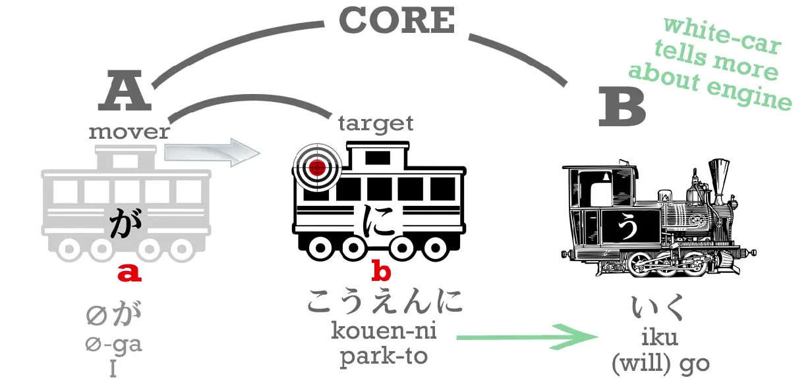
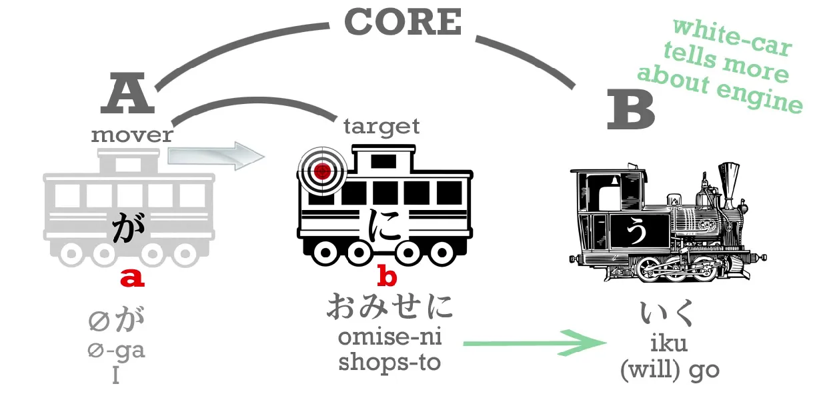
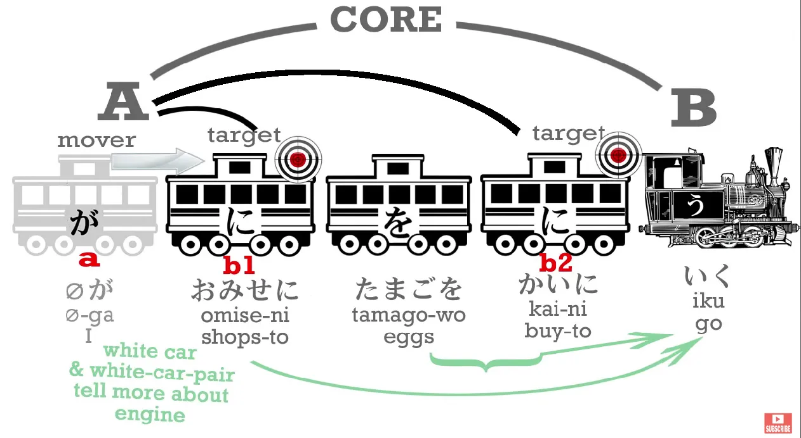
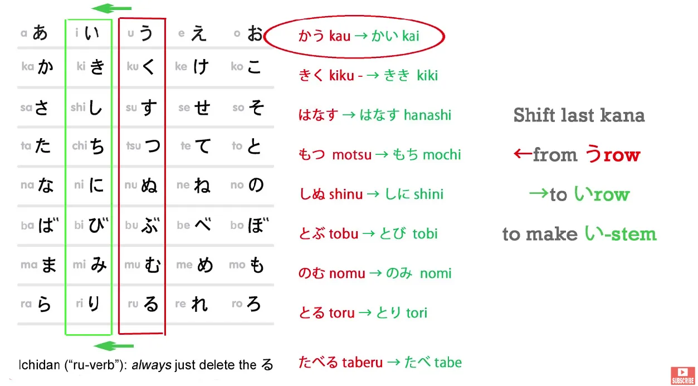
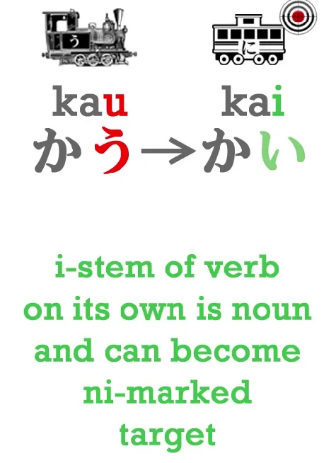
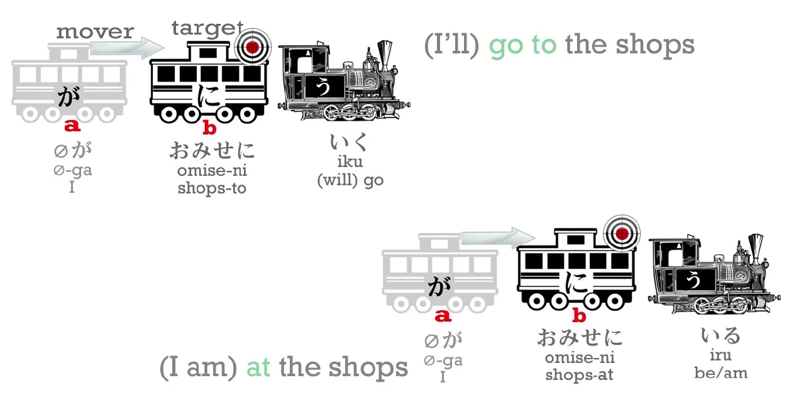
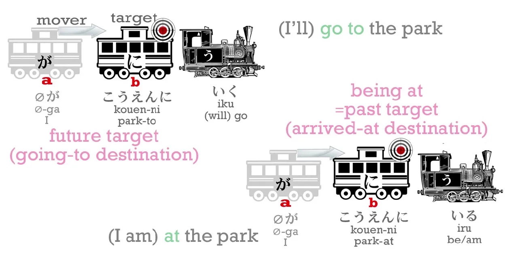
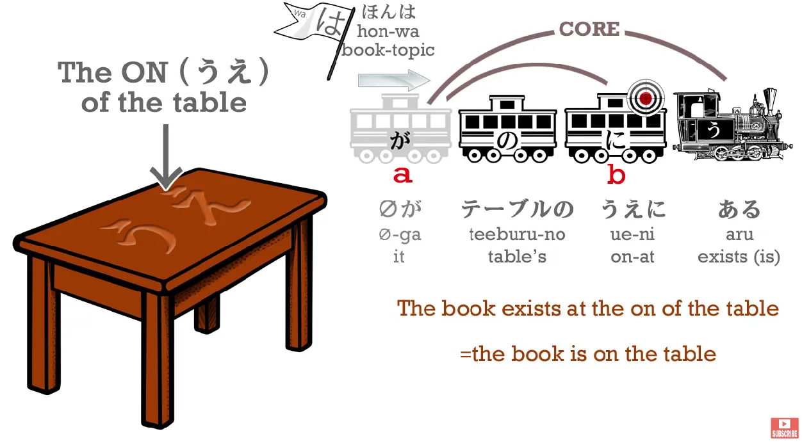
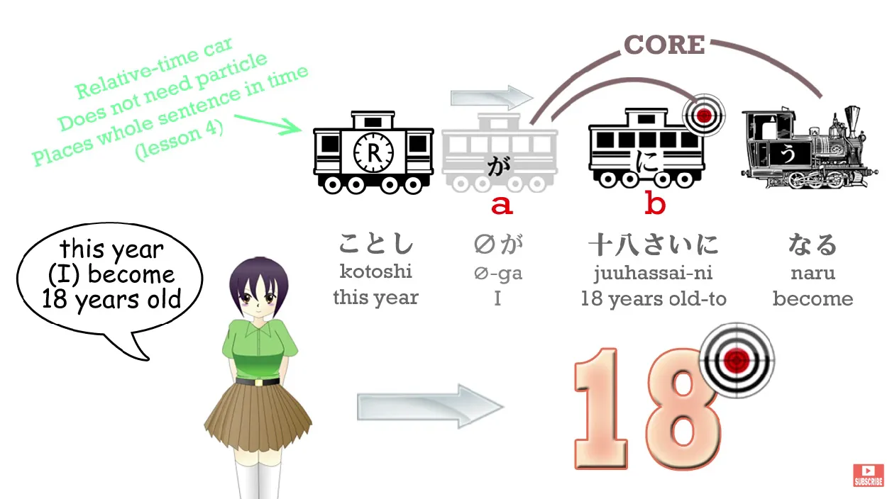
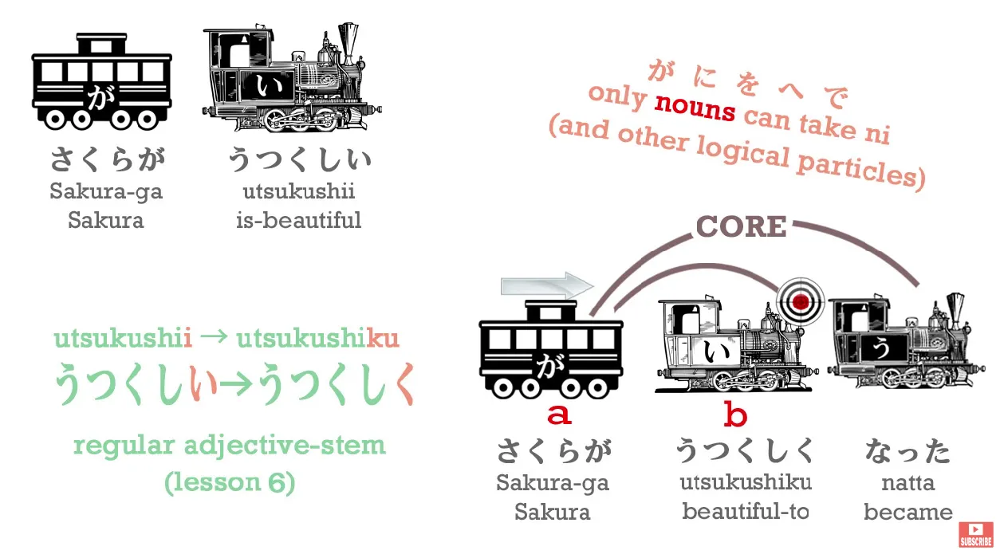

# **8. Частицы に и へ**

[**Урок 8: Местоположение, цель и трансформация — ключи к частицам ni и he**](https://www.youtube.com/watch?v=uqlQYrE2oFM&list=PLg9uYxuZf8x_A-vcqqyOFZu06WlhnypWj&index=9)

## Частица に

こんにちは。

Сегодня мы поговорим о частице <code>に</code>, и тем самым мы повысим свой уровень. Что я имею в виду? За последние семь уроков мы изучили довольно много базовых структур японского языка. Теперь мы можем сказать довольно много, если у нас есть словарный запас. Но всё, что мы можем сказать, очень и очень конкретно.

Мы можем говорить о совершении действий и о том, чтобы быть чем-то, что, конечно, является ядром каждого предложения. Но нам также нужно иметь в своём распоряжении и более сложные концепции. Такие вещи, как цель, намерение и трансформация. Итак, сегодня мы рассмотрим использование частицы <code>に</code>, некоторые из которых всё ещё очень конкретны, а некоторые начинают уводить нас в эти более сложные области.

Мы ведь уже рассматривали частицу <code>に</code>, не так ли? И **мы знаем, что в логическом предложении она указывает на конечную цель действия.** Так, <code>(zeroが)さくらにボールをなげた</code> означает <code>Я бросил мяч в Сакуру</code>.

Мяч отмечен частицей <code>を</code>, потому что это то, что я на самом деле бросил. Я отмечен частицей <code>が</code>, видите вы меня или нет, потому что я тот, кто совершил действие броска. **Но Сакура отмечена частицей <code>に</code>, потому что она является целью этого действия, в данном случае — в самом прямом смысле.**

Теперь, **частица <code>に</code> почти всегда указывает на цель того или иного рода. Итак, если мы куда-то идём, что-то куда-то отправляем или что-то куда-то кладём, мы используем <code>に</code> для этого <code>куда-то</code>. То есть, если А направляется в Б, то Б отмечается частицей <code>に</code>. Б — это пункт назначения, цель этого движения.**

Поэтому, если я иду в парк, я говорю <code>(zeroが)こうえんにいく</code>.

Если я иду в магазин, я говорю <code>(zeroが)おみせにいく</code>.

**Итак, буквальный, физический пункт назначения или цель движения отмечается частицей <code>に</code>. Однако мы также можем отмечать и более тонкую цель.**

Так, мы можем сказать <code>(zeroが)おみせにたまごを**かいに**いく</code>. Это означает <code>Я иду в магазин, **чтобы купить** яйца</code>.

<code>おみせ</code> — это <code>магазин(ы)</code>. <code>Магазин</code> — это <code>みせ</code>, и мы добавляем к нему вежливый префикс <code>お</code>, потому что мы выражаем уважение людям, которые помогают нам иметь все те прекрасные вещи, которые нам посчастливилось иметь. <code>たまご</code> — это яйца. Возможно, если вы достаточно взрослый, вы помните <code>たまごっち</code>/Tamagotchi, маленького яичного человечка, которого вы растили.

**А <code>かい</code> — это い-основа глагола <code>かう</code> (покупать).** い-основа — это очень особенная основа, она может делать много вещей, **а также может просто стоять сама по себе.**

<code>かいにいく</code> означает <code>[иду], чтобы купить, с целью покупки</code>.

---

Вы можете сказать: <code>Я думал(а), что логические частицы, такие как <code>に</code>, <code>が</code> и <code>を</code>, могут указывать только на существительные</code>. И это абсолютно верно. Потому что **одна из вещей, которую может делать い-основа глагола, когда она стоит сама по себе, — это превращать этот глагол в эквивалентное существительное.**

::: info
См. Урок 7.5, い-основа, преобразование глаголов
:::

(Она может делать и кое-что ещё, но об этом я расскажу в другой раз.)

Таким образом, **<code>かい</code>, действие покупки, является существительным.** Точно так же, как в английском, если мы говорим <code>I like swimming</code> (Я люблю плавание), <code>swimming</code> (плавание) — это существительное, это то, что я люблю. И если мы говорим <code>I go to the shop for the purpose of buying eggs</code> (Я иду в магазин с целью покупки яиц), то это <code>buying</code> (покупка) также является существительным, это то, за чем мы идём. И <code>かい</code> — это то же самое.

---

**Итак, <code>かい</code> — это то, что мы собираемся делать, и это существительное, и оно отмечено частицей <code>に</code>.** Таким образом, вы видите, что в этом предложении у нас две цели:

магазины — <code>おみせ</code> — это фактическая физическая цель нашего похода, место, **а покупка яиц — это причина нашего похода, так что это эмоциональная цель, волевая цель, более тонкий вид цели**, чем физическое место, куда мы идём, но всё же цель. **И в одном предложении возможно иметь две цели, обе отмеченные частицей <code>に</code>.** И это именно то, что мы здесь делаем.

**Таким образом, <code>に</code> указывает нам на цель действия в самом прямом смысле, а также на волевую цель, фактическую цель нашего действия.**

Теперь, возвращаясь к более конкретным вещам, **<code>に</code>, которая отмечает фактическую цель местоположения, куда мы идём, куда мы что-то кладём, может также отмечать место, где человек или вещь НАХОДИТСЯ.**

Так, я могу сказать: <code>おみせにいく</code> – <code>Я иду в магазин / Я пойду в магазин</code>, и мы можем сказать: <code>おみせにいる</code> – <code>Я в магазине</code>.

<code>こうえんにいく</code> – <code>Я пойду в парк</code>; <code>こうえんにいる</code> -<code>Я в парке</code>.

Видите, **это тоже цель, потому что для того, чтобы вещь где-то находилась, она должна была туда когда-то попасть. Таким образом, <code>に</code> может отмечать не только будущую цель, место, куда я пойду, но и прошлую цель, место, куда я пришёл и где я всё ещё нахожусь.**

---

И **мы также используем это для неодушевлённых предметов**: <code>ほんはテーブルのうえにある</code> – <code>Книга находится на столе</code>. <code>うえ</code> — это существительное, и в данном случае оно означает <code>«на» стола</code>. <code>うえ</code> может означать <code>вверх</code> или <code>над</code>, в этом случае оно означает <code>на</code>, и **это всегда существительное**, поэтому в данном случае <code>«на» стола</code> — это место, где находится книга:

**прошлая цель книги, к которой она переместилась и в которой она теперь остаётся**. **Так что <code>に</code> также может обозначать место, где находится вещь, её прошлую цель.**

### に для обозначения цели трансформации

И последний аспект <code>に</code>, который я хочу рассмотреть, заключается в том, что **<code>に</code> также может обозначать цель трансформации.**

Точно так же, как если A идёт в B, <code>に</code> отмечает B, место, куда он идёт, **если A превращается в B, становится B, то <code>に</code> также отмечает B**, то, чем он становится, то, во что он превращается.

Так, если я скажу, <code>さくらはかえるになった</code>... <code>かえる</code> — это <code>лягушка</code>, а <code>なる</code> — это близкий родственник <code>ある</code>: <code>ある</code> означает <code>быть</code>; <code>なる</code> означает <code>становиться</code>.

Итак, <code>さくらはかえるになった</code> – <code>Сакура стала лягушкой / Сакура превратилась в лягушку</code>, **и <code>に</code> отмечает то, чем она стала, то, во что она превратилась.**

Вы, возможно, думаете: <code>Хм, как часто в наши дни люди превращаются в лягушек?</code> И я соглашусь, что не очень часто. Однако, **это очень важная вещь для изучения, потому что существуют различные более повседневные вещи, которые превращаются в другие вещи, а также мы используем эту форму выражения гораздо чаще в японском, чем в английском.**

---

Например, <code>ことし(zeroが)十八さいになる</code>: <code>ことし</code> — это <code>этот год</code>, <code>[十八]{じゅうはっ}さい</code> — это <code>18 лет</code>. Итак, мы говорим: <code>В этом году (мне) исполняется 18</code>. *Или, как дано в оригинале: <code>В этом году (я) 18 лет-в становиться</code>.*

В английском мы бы сказали это немного по-другому: мы могли бы сказать <code>I turn 18</code> или <code>I'll be 18</code>, но в японском мы говорим <code>Я стану 18-летнего возраста</code>.

И если день становится пасмурным, мы можем сказать <code>あとで(zeroが)くもりになる</code> (<code>くもり</code> — это <code>пасмурная погода</code>; <code>くも</code> — это облако, <code>くもり</code> — состояние пасмурности, и оба они являются существительными).

Мы говорим, <code>くもりになる</code>, что означает <code>становиться пасмурным</code>. *Или, как дано в оригинале: <code>Пасмурным-в становиться</code>.* В английском мы могли бы так сказать. Мы, скорее всего, скажем <code>get cloudy</code> или что-то в этом роде, но в японском мы очень часто используем эту форму речи <code>становиться</code> – <code>になる</code>. Так что это важная вещь для изучения.

### に в случае с прилагательными (т. е. использование их в качестве наречий)

**И здесь я должна добавить, что в случае с прилагательными это работает немного по-другому.** Итак, если мы хотим сказать <code>Сакура красивая</code>, мы говорим <code>さくらがうつくしい</code> (<code>уつくしい</code> означает <code>является-красивой</code>), но если мы хотим сказать <code>Сакура стала красивой</code>, **мы не можем использовать <code>に</code>, потому что <code>うつくしい</code> — это не существительное.** Это не вагон, **это локомотив**, не так ли?

::: info
<code>うつくしい</code> — это прилагательное/い-локомотив.
:::

Так что же нам делать?

Мы делаем то, что обсуждали на прошлой неделе: **мы превращаем это прилагательное в его основу.** То есть **мы убираем <code>い</code> (-i) и добавляем <code>く</code> (-ku).**

::: info
Основа — <code>うつくし</code>, затем добавляется <code>く</code>.
:::

  

::: info
<code>く</code> превращает <code>うつくしい</code> в наречие/наречное существительное. Подробнее об этом в Уроке 41.

:::

И это всё, что нам нужно сделать. Вот как мы это используем: <code>さくらがうつくしくなった</code> – <code>Сакура стала красивой</code>.

<code>なった</code> — это прошедшее время от <code>なる</code>, потому что <code>なる</code> — это глагол первого спряжения (godan) (он должен быть глаголом первого спряжения, потому что он не оканчивается на <code>-いる</code> или <code>-える</code>, он оканчивается на <code>-ある</code>).

Итак, теперь мы знаем несколько способов выражения более тонких концепций, таких как намерение, цель, трансформация, и мы повысили свой уровень.

## Частица へ

Прежде чем мы закончим, я просто дам вам ещё один вагон, который мы раньше не видели, и это вагон-<code>へ</code>. И это очень, очень просто. Частица <code>へ</code> — как вы видите, это кана <code>へ</code> (he), но когда мы используем её как частицу, мы просто произносим её как <code>え</code>. И это очень простая частица. Она мастер одного трюка. И она дублирует одно, и только одно, из применений <code>に</code>.

Поэтому, когда мы говорим, куда мы идём — <code>А идёт в Б</code>, — мы отмечаем Б частицей <code>ни</code>. **Мы также можем отметить его частицей <code>へ</code>.**

**И это единственное, что делает <code>へ</code>.** Как я уже сказала, это мастер одного трюка. **Она даже не может отметить место, куда что-то пришло и где всё ещё находится. Она всегда отмечает только место, куда что-то направляется.**

::: info
направление, подробнее об этом в 8b.
:::

<code>へ</code> очень проста, и хорошо иметь в своём арсенале ещё одну частицу, ещё один вагон, не так ли?