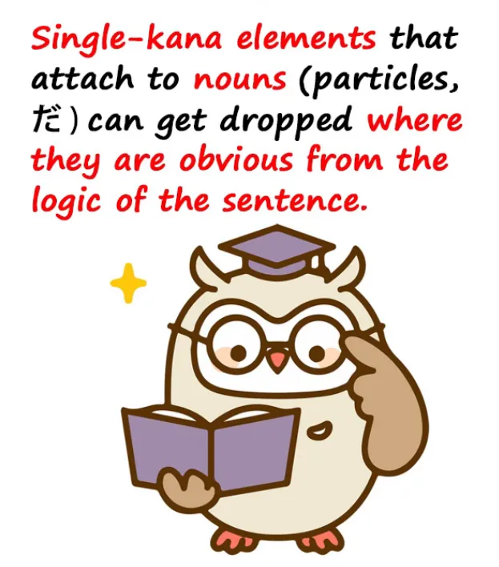
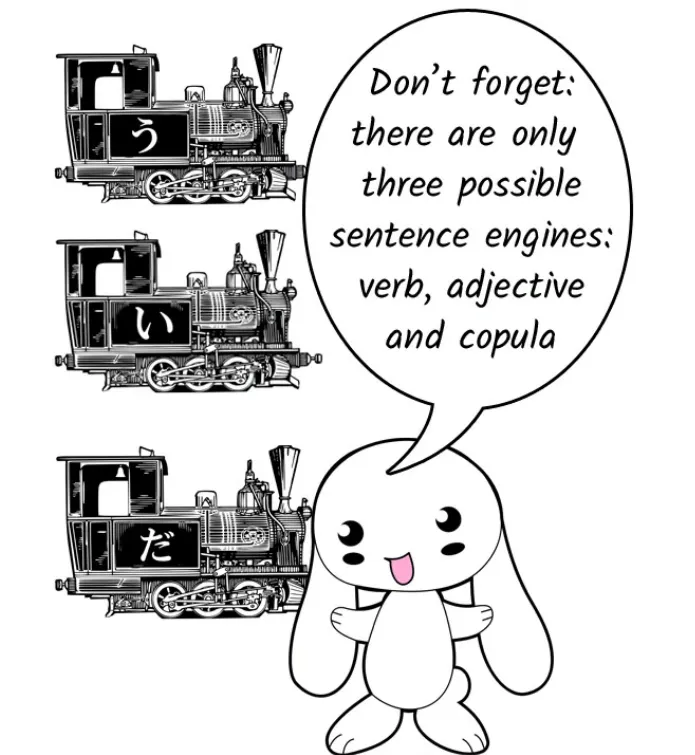
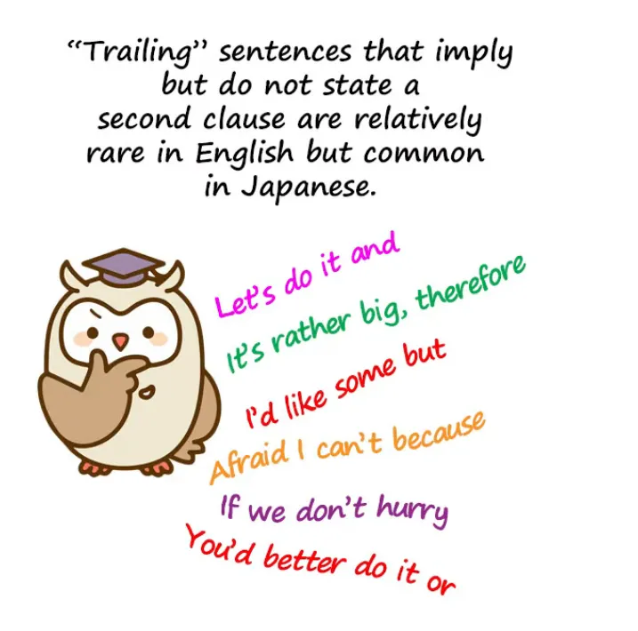

# **80. Опущенные частицы и неформальные опущения**

[**Поймите японский, даже когда они опускают части! Опущенные частицы и неформальные опущения | Урок 80**](https://www.youtube.com/watch?v=wamt3AAJI6M&list=PLg9uYxuZf8x_A-vcqqyOFZu06WlhnypWj&index=82&ab_channel=OrganicJapanesewithCureDolly)

こんにちは。

Как только мы начинаем серьёзно погружаться в настоящий японский материал и потреблять его, часто разговорный и неформальный, а не учебный японский, одна из проблем, с которой сталкиваются многие, — это мысль:
«Боже мой, они пропускают половину того, что собираются сказать! Они опускают это и оставляют то, и как нам, по-вашему, догадаться, о чём они вообще говорят?»

На самом деле, это не такая уж большая проблема, как может показаться на первый взгляд, но нам нужно знать, что происходит и на что обращать внимание.

Итак, **прежде всего давайте поговорим об опущениях в языке.**

**В языке существует принципиально два вида опущений:**

**допустимые опущения и недопустимые опущения.**

## Допустимые опущения

**Допустимые опущения — это когда совершенно грамматически верно**

**в рамках конкретного языка что-то опустить.**

Это происходит и в английском. Например, если мы говорим по-английски <code>The night we met</code>, это считается грамматически правильной фразой. На самом деле мы имеем в виду <code>The night **that** we met</code>.

И **во французском или испанском вы так не можете.**

**Вы не можете опустить это <code>that</code>, которое во французском или испанском будет <code>que</code>.**

**Но в английском — можете.**

В английском это часть правил английской грамматики, что все поймут, что вы имеете в виду, и вам разрешено это опускать. **Вы можете использовать это в академической работе или юридическом документе.**

**Вы можете использовать это где угодно. Это не неграмматично.**

Это не недопустимое опущение. **Это допустимое опущение.**

### Нулевое местоимение

Итак, это происходит **в японском языке**, и **очень, очень распространённый пример**, конечно же, **это нулевое местоимение.**

Если мы говорим <code> *(zeroが)* 疲れた</code>, что означает <code>устал(а)</code>, **мы имеем в виду <code>Я устал(а)</code>**, и **это стопроцентно допустимый, грамматически правильный японский.**

**Вы можете использовать это в академическом эссе, юридическом документе или где угодно.**

**Это воспринимается как абсолютно грамматически правильный японский.**

**Нет никаких сомнений в том, что вы имеете в виду.**

Во-первых, потому что **нулевое местоимение всегда по умолчанию означает <code>Я</code>**, а во-вторых, потому что японский, как мы знаем, очень строг в том, что мы можем говорить только о вещах, которые мы действительно способны знать.

Поэтому мы не можем говорить о чьём-то эмоциональном состоянии. **Мы не можем говорить о том, что кто-то другой что-то любит или не любит.**

**Мы можем только сказать, что они, кажется, любят или не любят это.**

**И мы не можем сказать, что кто-то другой устал.**

Поэтому <code>疲れた</code> может означать только <code>**zeroが**疲れた/ **私が**疲れた</code>.

Итак, **это допустимое опущение.**

## Недопустимые опущения

Но во всех языках также происходит много недопустимых опущений, и **в неформальной речи**, в отличие от очень формальной, **это совершенно допустимо**.

Так что, **строго говоря, это недопустимо, но с точки зрения обычной, повседневной, неформальной речи — допустимо.**

Итак, какие существуют виды принятых, но строго недопустимых опущений?

В основном, три вида.

### Опущение частей слов или фраз

Первый — это когда мы опускаем части слов или фраз.

Так, например, вместо <code>している</code> (делаю / делает) мы говорим <code>してる</code>; вместо <code>しておく</code> (сделать и оставить) мы говорим <code>しとく</code>.

Теперь, **эти «недопустимые» формы настолько регулярны, что они ничем не отличаются от использования** **<code>shouldn't</code> или <code>hadn't</code> вместо <code>should not</code> или <code>had not</code> в английском.**

**Вы можете использовать их почти везде, но не в самых формальных обстоятельствах.**

Чуть ниже по шкале у нас есть такие вещи, как <code>分かんない</code> вместо <code>分からない</code>, или <code>つまんない</code> вместо <code>つまらない</code>.

Итак, это один тип, и хотя может потребоваться некоторое время, чтобы привыкнуть к этим выражениям, как только вы их узнаете, они не сложнее ничего другого.

---

**Ещё одна вещь, которая часто опускается, — это всё, что присоединяется к существительному.**

Как я уже говорила, **японский — это очень существительно-центричный язык.**

И, как вы знаете[[8b]](./8b-particles-explained.md), **к существительным всегда что-то прикрепляется**:

**логическая частица, чтобы сказать нам, какую роль они играют в предложении**,

**иногда нелогическая частица, а иногда связка**.

Итак, **почти все они могут быть опущены в определённый момент.**

**Если без маркера ясно, какую роль существительное играет в предложении**,

**мы можем в неформальной речи**, не в формальной, а в неформальной речи, **опустить этот маркер.**

---

**Маркеры, которые опускаются чаще всего, — это** **<code>が</code>, <code>を</code>**, а также **нелогический маркер темы <code>は</code>**, и, конечно, **связка <code>だ</code>.**

Так, например, если я скажу <code>私アンドロイド</code>, **я опустила то, что, вероятно, было бы <code>は</code> после моего имени.**

**Я также опустила <code>だ</code> после <code>アンドロイド</code>**.

Теперь, если вы знаете, что я представляюсь или говорю что-то о себе, нет никаких сомнений в том, что здесь происходит.

И... я не хочу слишком сильно возвращаться к теме Тэ Кима-сэнсэя, я сделала серию из трёх частей о вещах, которым Тэ Ким-сэнсэй учит, но которым на самом деле не должен учить, и я дам ссылку на неё[[77]](./77-real-japanese-structure-vs-tae-kim-structural-review-of-tae-kim-s-japanese-grammar.md)[[78]](./78-breaking-the-core-tae-kim-vs-the-copula-japanese-structure-based-critical-review.md)[[79]](./79-deeper-secret-of-the-copula.md), но здесь я сделаю замечание, которое я не сделала там, **а именно, что Тэ Ким-сэнсэй говорит, что поскольку <code>だ</code> часто опускается, а <code>です</code> не опускается,** *(по его словам)* они на самом деле не одно и то же, они не обе являются связками.

### Почему <code>だ</code> часто опускается, а <code>です</code> — нет

И я подробно разбирала это и объясняла, какой беспорядок это создаёт в японском, если игнорировать связку, так что не буду повторяться.

Но суть, которую я хочу здесь отметить, заключается в том, что причина, по которой <code>だ</code> может опускаться там, где <code>です</code> не может, двояка.

Прежде всего, **почему <code>だ</code> может опускаться так часто?**

Ну, если бы учебники учили нас базовой структуре японского, это было бы очевидно, но, конечно, они этого не делают.

**Самое основное в японской структуре — это то, что японское предложение может заканчиваться только одним из трёх способов.**

И я думаю, вы знаете, что это за три способа, не так ли? Давайте скажем это вместе.

**Японское предложение может заканчиваться только глаголом, прилагательным или существительным со связкой.**

Теперь, как только мы это знаем, мы понимаем, почему связка может быть опущена очень легко.

**Как я уже говорила, частицы и связка опускаются** **там, где очевидно, чем были существительные без их маркировки.** Вот когда они опускаются.

---

Итак, **если существительное стоит в конце предложения, мы знаем, что это не глагольное предложение.**

**Мы знаем, что это не прилагательное предложение.**

**Мы знаем, что это существительное со связкой.**

И **поскольку мы это знаем, мы можем, если хотим, опустить связку.**

И это, я думаю, причина, по которой Тэ Ким-сэнсэй поддаётся искушению сказать, что <code>だ</code> — это декларатив, своего рода словесный восклицательный знак.

Он говорит, что люди используют <code>だ</code>, когда хотят подчеркнуть то, что говорят.

Ну, **в этом есть доля правды, потому что факт в том,** **что в неформальной речи вы всегда можете опустить связку и при этом быть понятыми,** **поэтому, если вы говорите на том уровне неформальности, где вы, вероятно, опустили бы её,** **то когда вы её включаете, это означает, что вы хотите подчеркнуть то, что говорите.**

---

**На самом деле, это не так просто, потому что многие люди не опускают её,** **не все опускают её постоянно.** Это немного сложнее, **но идея о том, что это декларатив, по крайней мере, содержит то зерно истины,** **что поскольку вы можете опустить её практически в любое время в неформальной речи,** **вы часто включаете её, потому что хотите подчеркнуть.**

Итак, если легко опустить связку, когда это <code>だ</code>, **почему нелегко опустить её, когда это <code>です</code>?**

Тэ Ким-сэнсэй превращает это в целый аргумент в пользу того, что <code>だ</code> и <code>です</code> — это две разные вещи, но если вы подумаете, совершенно очевидно, почему <code>だ</code> опускается (я уже объяснила это) и почему <code>です</code> — нет.

**<code>です</code> не опускается, потому что это формальная речь.**

**Во-первых, в формальной речи мы опускаем меньше.**

Мы не опускаем так много вещей в формальном предложении, как в неформальном. **Но даже если мы говорим формальной речью на свободном уровне,** **где мы можем опускать вещи из предложения,** **мы не опустим <code>です</code>.**

Почему нет?

Потому что есть только одна вещь, которая делает 丁寧語 (речь уровня <code>です</code>/<code>ます</code>) 丁寧語, **и это тот факт, что мы добавляем вспомогательный глагол <code>ます</code> в конец глагольных предложений** **и связку <code>です</code> в конец существительных со связкой** **и даже, избыточно, в конец прилагательных предложений.**

**Так что вы не можете в 丁寧語 опустить <code>です</code>, не опустив при этом 丁寧語.**

Всё так просто.

---

Итак, **существуют различные правила о том, когда вы можете, а когда не можете** **опускать такие вещи, как <code>を</code>, из неформального предложения.**

::: info
Очевидно, это шутка… на всякий случай (ノ\*°▽°\*)
:::

**Теоретически вы можете опустить что-либо, когда это не нужно.**

**На практике есть места, где это кажется естественным,** **и другие места, где это не кажется естественным.**

Если вы хотите знать правила для этого, иногда они очень сложны, и даже когда они очень сложны, они не всегда работают.

Но вам не нужно это знать.

Почему вам не нужно это знать?

Ну, давайте подумаем об этом.

**Вам нужно знать, что их можно опускать, и вам нужно знать, что** **их опускают в тех местах, где вы действительно можете понять, что они должны были быть.**

Как только вы это узнаете, вы не будете плавать в океане странной неопределённости, где вещи опускаются, и вы понятия не имеете, что это такое.

**Что вам не нужно, так это уметь воспроизводить очень неформальный японский** **точно так, как это делают японцы.**

И **это единственная причина, по которой вам нужно было бы изучать эти странные списки правил.**

Если вы просто используете все частицы всё время, иногда, особенно когда вы говорите на неформальном японском, ваш японский будет звучать немного неестественно.

Ну, и что с того?

**Язык, на котором говорят иностранцы, обычно звучит немного неестественно, не так ли?**

Вы, вероятно, замечали это в английском.

**Если вы собираетесь много использовать японский, постепенно, понемногу,** **вы привыкнете к местам, где вы можете естественно опускать вещи.**

**Если вы не собираетесь много использовать японский,** **зачем вам сидеть и учить кучу правил,** **чтобы притвориться, что вы естественно освоили японский,** **когда вы не только не освоили, но и не собираетесь этого делать?**

---

**Так что мой совет вам: <code>Учите японский естественно</code>.**

**Не пытайтесь запоминать наборы правил, когда всё, что они могут сделать, — это заставить вас казаться более привыкшими к японскому, чем вы есть на самом деле.**

**Но на практике они даже этого не сделают, потому что вы будете совершать ошибки.**

**Важно понять, как вещи опускаются в японском, почему они опускаются в японском, и как их понимать, когда они были опущены.**

::: info
Действительно отличный совет, Долли (o≧▽゜)o
:::

### Опущение целых придаточных предложений

Другой вид вещей, которые опускаются, третья категория опускаемых вещей, — это, по сути, целые придаточные предложения.

**Люди часто заканчивают предложение て-формой** **или окончанием типа <code>потому что</code> или <code>но</code>.**

---

И **что они делают в этих случаях, так это подводят** **ко второму придаточному предложению, которое добавило бы больше информации,** **но они не произносят это придаточное предложение.**

И это может служить различным целям.

**Это может намекать на что-то, что они не хотят говорить.**

**Это может намекать на что-то, что, по их мнению, слишком очевидно, чтобы это нужно было говорить.**

**Или это может быть использовано просто для смягчения того, что вы говорите прямо сейчас,** **или, возможно, для небольшого усиления.**

Я говорила об этом в других местах и дам ссылки на те места, где я это делала[[63]](./63-wild-sentence-enders-in-real-life-japanese-かい-だい-ぜ-ぞ-さ-から-し-ちょうだい.md).

Но это основные принципы опущения в японском языке, и как только вы их узнаете, всё это становится гораздо менее запутанным.