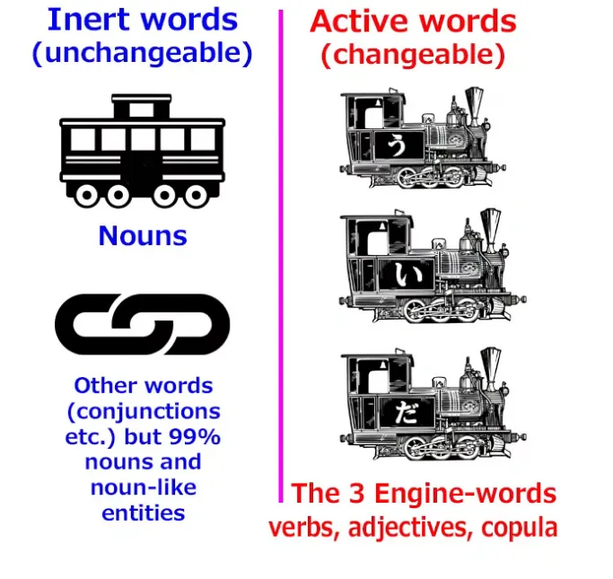
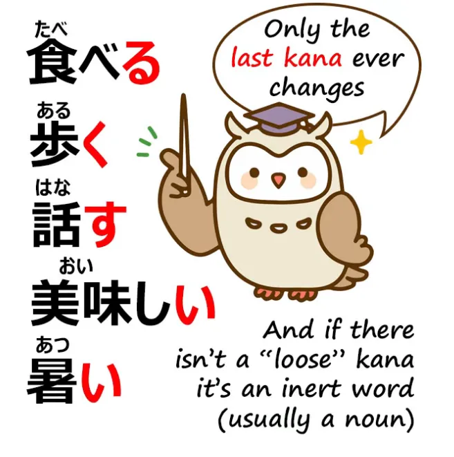
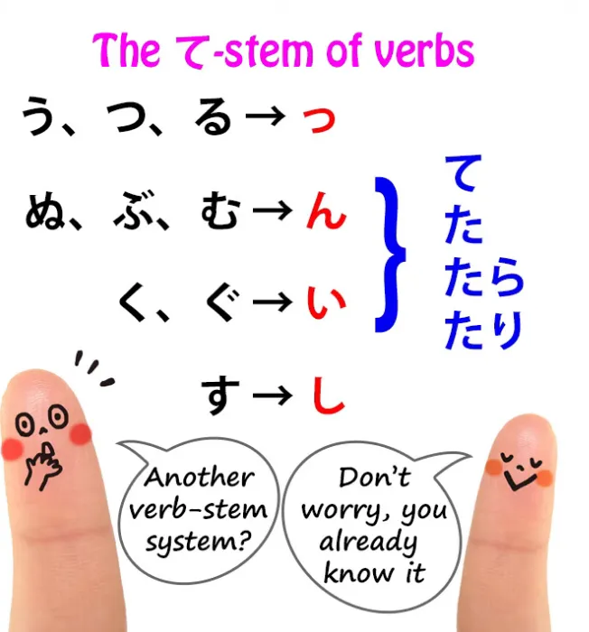
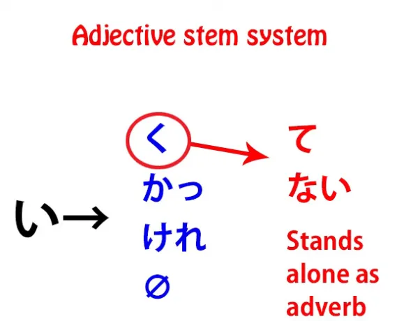
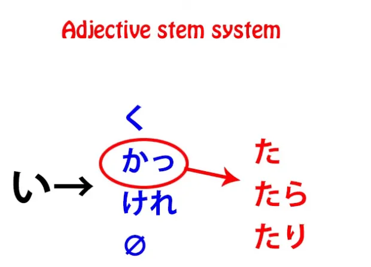
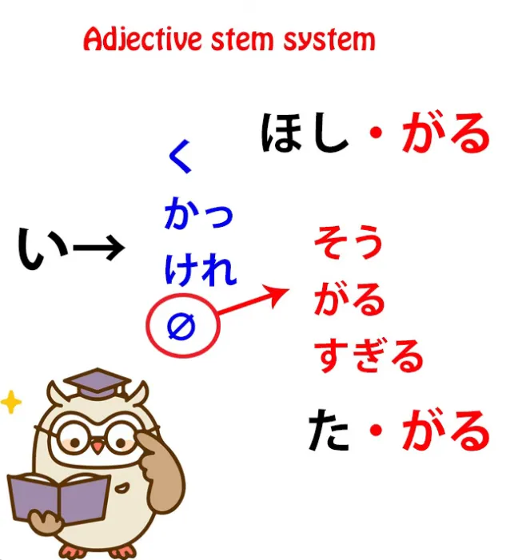
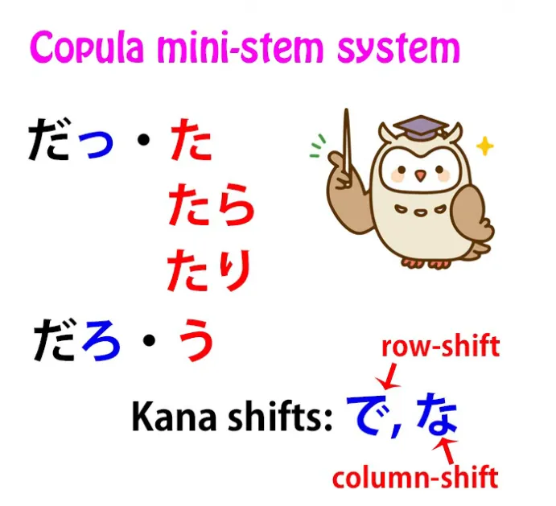

# **81. Глобальный принцип всех японских словоформ.**

[**Наконец-то! ПОЛНАЯ структура японского языка! Глобальный принцип всех японских словоформ. Урок 81**](https://www.youtube.com/watch?v=uoj5l8-Ppws&list=PLg9uYxuZf8x_A-vcqqyOFZu06WlhnypWj&ab_channel=OrganicJapanesewithCureDolly)

こんにちは。

Сегодня мы поговорим о том, о чём никогда раньше не говорили, а именно об общей, глобальной, космической структуре японского языка. Мы касались этого в прошлом, но я никогда раньше не говорила о его полноте. И есть причина, по которой я этого не делала, к которой мы вернёмся через минуту.

То, о чём мы будем говорить, начинается с того, что вы уже знаете, — с системы основ. Если вы хоть немного следили за моими уроками, вы знаете, что в японском языке нет спряжения.

::: info
Как вы знаете, не воспринимайте это как окончательное утверждение, это просто способ избежать некоторых ассоциаций, которые возникают со словом <code>спряжение</code> в контексте европейских языков, поскольку в японском языке существует форма спряжения, как показано на скриншоте из книги Долли в примечании к Уроку 7.5.
*Глаголы лишь немного меняют одну кану в конце,*
:::

**меняя её с каны ряда <code>う</code> на одну из четырёх других рядов.**

**А затем мы присоединяем различные виды вспомогательных элементов: вспомогательные существительные, вспомогательные глаголы, вспомогательные прилагательные.**

Но то, что я не объяснила в то время, когда вводила это, заключается в том, что это идёт гораздо дальше. Я оставила вас думать, возможно, что <code>て</code>-форма, как её называют, и прилагательные имеют нечто вроде незначительного спряжения, которое немного похоже на **европейское спряжение** и на то, чему учат учебники. Это неправда.

Я не говорила об этом слишком много в то время, потому что, думаю, прежде чем вы правильно усвоите основы, это могло бы показаться немного сложным и трудным для восприятия. Но теперь давайте рассмотрим это как следует.

## Активные и статичные/инертные слова

Как вы знаете, **в японском языке есть два вида слов**, а именно: **активные, изменяемые слова и статичные** *(инертные)* **слова.**

**Активные, изменяемые слова состоят из трёх видов слов, которые могут образовывать локомотив предложения**, то есть **глаголы, прилагательные и связка**.

**Статичные слова — это почти все существительные, и они никогда не меняются.** Они не могут измениться никаким образом.

---

Итак, **все слова, которые могут меняться, меняются абсолютно одинаково**. Мы должны знать о них две вещи. **Первое — это то, что в базовой форме слова ничего не меняется, кроме последней каны**.

Это кана ряда <code>う</code> в глаголе или <code>い</code> в прилагательном.

**Ничто до этого не может измениться.** Это так же фиксировано, установлено и инертно, как существительное. Только эта последняя кана может когда-либо измениться, **и к ней затем могут быть присоединены элементы.**

**Второе, что нужно знать, это то, что все они меняются в соответствии с системой основ и вспомогательных элементов.** Итак, хотя я ввела <code>て</code>-форму так, будто это была <code>форма</code>, своего рода морфинг или спряжение всего слова, **на самом деле это собственная система основ и вспомогательных элементов.**

**В настоящей японской грамматике, преподаваемой японцам японцами,** **<code>-た</code> и <code>-て</code> рассматриваются как вспомогательные элементы, как самостоятельные сущности, которые присоединяются к основе слова.**

Так что, по сути, **глаголы имеют не одну систему основ, а две системы основ.** И отчасти поэтому я не вводила это сразу, потому что поначалу это кажется немного ошеломляющим.

## Система <code>て</code>-основы

Вторую систему основ, то есть <code>て</code>-основу, вы уже знаете. Мы кратко её рассмотрим.

### Группа <code>う-つ-る</code>

**Есть группа <code>う-つ-る</code>, и она меняет последнюю кану, <code>う</code>, <code>つ</code> или <code>る</code>,** **на маленькую <code>っ</code>, а затем мы можем добавить <code>-た</code> или <code>-て</code>.**

### Группа <code>ぬ-ぶ-む</code>

**Есть группа <code>ぬ-ぶ-む</code>: она меняет последнюю кану, <code>ぬ</code>, <code>む</code> или <code>ぶ</code>, на <code>ん</code>,** и **влияние мягкости этих кан и самой <code>ん</code>** **эвфонически влияет на <code>-て</code> или <code>-た</code>, превращая их в <code>で</code> или <code>-だ</code>.**

### Группа <code>く-ぐ</code>

**<code>く</code> и <code>ぐ</code> превращаются в <code>い</code>** — и мы сейчас заметим, **что эта связь между <code>い</code> и канами ряда <code>か</code>, <code>か-き-く-け-こ</code>,** **продолжает играть роль в прилагательных.**

Мы рассмотрим это через минуту.

**<code>く</code> и <code>ぐ</code> превращаются в <code>い</code>, а в случае с <code>ぐ</code>, этот тэн-тэн <code>〃</code> на <code>く</code>, этот мягкий звук,** **снова оказывает эвфонический эффект на следующие за ним <code>-て</code> или <code>-た</code>, превращая их в <code>で</code> или <code>-だ</code>.**

### Группа <code>す</code>

**И наконец, <code>す</code> в <code>て</code>-форме делает то же самое, что и при образовании <code>い</code>-основы** **в обычной системе основ: оно становится <code>し</code>.**

---

Итак, вот у нас вторая система основ глаголов, **<code>て</code>-основа**, и **мы используем её не только для <code>-те</code> и <code>-та</code>, но и для добавления вспомогательных элементов, таких как условные <code>-тара</code> и <code>-тари</code>.**

## Система основ прилагательных

**Прилагательные также имеют свою собственную систему основ. Прилагательные фактически имеют четыре основы.**

**Вы можете образовывать основы прилагательных, отбрасывая <code>い</code>, точно так же, как мы отбрасываем <code>る</code> в итидан-глаголах,** **или изменяя эту <code>い</code> на одну из трёх кан ряда <code>ка</code>: <code>ка</code>, <code>ке</code> или <code>ку</code>.**

---

И, как мы уже говорили, **существует связь между канами ряда <code>ка</code> и <code>и</code>**, поэтому в <code>те</code>-основе глаголов, глаголы, оканчивающиеся на <code>ку</code>, <code>ки</code> превращается в <code>и</code>, и то же самое с версией с тэн-тэном <code>〃</code>, <code>гу</code>.

**Итак, у нас есть четыре основы для прилагательных: отбрасывание <code>и</code> или превращение её в <code>ка</code>, <code>ке</code> или <code>ку</code>.**

### <code>ку</code>-основа

**<code>ку</code>-основа присоединяет вспомогательное прилагательное <code>-най</code>, отрицая прилагательное,**

а также если она стоит сама по себе — и, как мы знаем, основы иногда могут стоять сами по себе.

**Итак, <code>и</code>-основа глагола сама по себе становится существительным.** **<code>э</code>-основа сама по себе образует повелительное наклонение.**

**<code>ку</code>-основа прилагательного сама по себе превращает прилагательное в наречие.** Так, мы можем сказать <code>はやい くるま</code> (быстрая машина) или <code>**はやく** はしる</code> (бежать **быстро***, быстро — это наречие*).

**И <code>ку</code> также используется, конечно, для образования <code>те</code>-формы:** мы просто добавляем <code>-те</code> в конец <code>ку</code>.

### <code>ка</code>-основа (<code>ка</code>)

**<code>ка</code>-основа принимает небольшой дополнительный элемент, которым является маленькая <code>っ</code>, поэтому она становится <code>かっ</code>,** и мы используем это для присоединения вспомогательного элемента прошедшего времени <code>-та</code>,
поэтому мы говорим <code>-катта</code>: <code>おいしかった</code> (это было вкусно).

### <code>ке</code>-основа (<code>кере</code>)

**<code>ке</code>-основа также принимает дополнительный элемент, которым является <code>-ре</code>, так что у нас получается основа <code>-кере</code>,** **и к ней мы присоединяем вспомогательный элемент <code>-ба</code>, который является условной формой** (и я сделала целую серию видео об условных формах, таких как <code>-ба</code> и <code>-тара</code>, и я оставлю ссылку выше и в разделе информации ниже).[[30]](./30-japanese-conditionals-と.md)[[31]](./31-the-ば-れば-conditional.md)[[32]](./32-the-たら-なら-conditionals.md)[[33]](./33-limiting-terms-だけ-しか-ばかり-のみ.md)

### Нулевая основа

**Когда мы полностью отбрасываем <code>-и</code>, мы можем использовать это для присоединения таких элементов, как вспомогательное существительное <code>-со</code>,** **что означает, что что-то, кажется, обладает этим качеством,** а также **для присоединения вспомогательных глаголов, таких как <code>гару</code>.**

Так, к основе <code>**ほしい**</code> мы можем присоединить **<code>гару</code>**, чтобы получить <code>**хосигару**</code> (**проявлять признаки желания чего-либо, казаться желающим чего-либо**). Или к **вспомогательному элементу <code>тай</code>** мы можем отбросить эту <code>и</code> и присоединить <code>гару</code> и получить <code>**тагару**</code> (**проявлять признаки желания что-то сделать, казаться желающим что-то сделать**).

---

**Итак, как вы видите, прилагательные имеют свою собственную систему основ, к которой мы присоединяем различные вспомогательные элементы, как бы уменьшенную версию той, что есть у глаголов.**

## Связка

Теперь, что насчёт связки? Это другой динамический элемент, другой локомотив.

Итак, связка — это всего лишь одна кана *(<code>да</code> в данном случае)* для начала,
поэтому обычно мы что-то к ней добавляем.

**Мы можем добавить маленькую <code>っ</code>, чтобы получить основу <code>да~</code>**, *(Думаю, под ~ здесь подразумевается <code>っ</code> = <code>да</code>)* **к которой затем может быть добавлен вспомогательный элемент прошедшего времени <code>-та</code>, чтобы получить <code>датта</code>.** Мы можем добавить <code>-ро</code>, чтобы к ней можно было добавить вспомогательный элемент волеизъявления, чтобы получить <code>даро</code>.

**А в <code>те</code>-форме сама <code>да</code> меняется — конечно, имея только одну кану, <code>да</code> является последней каной —** **и она может стать <code>де</code>, чтобы образовать <code>те</code>-форму.** Она немного менее регулярна, чем другие, но это действительно потому, что **существует только одна связка**, поэтому у неё нет множества других элементов в той же группе, чтобы быть регулярной с ними.

## Итог

Итак, такова общая структура японского языка.

**Он имеет два вида слов: активные и пассивные слова, изменяемые и инертные слова.**

**Инертные слова** **не могут измениться никаким образом, но они могут присоединять частицы, которые сообщают нам, что они делают.** И, к счастью, **поскольку они вообще не меняются, в существительных нет ничего сложного.**

**Они всегда присоединяют одну и ту же частицу для выполнения одной и той же работы, независимо от того, о каком существительном идёт речь.** Гораздо проще, чем иностранные грамматические системы.

**Активные элементы — глаголы, прилагательные и связка — могут изменять только последнюю кану** **и всегда делают это в соответствии с системой основ и вспомогательных элементов.**

Когда мы это понимаем, всё становится намного легче концептуализировать и работать с этим.

