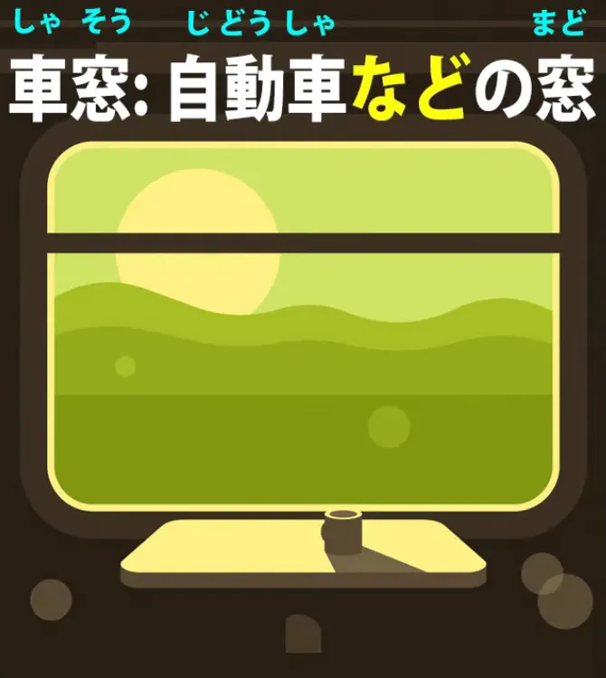
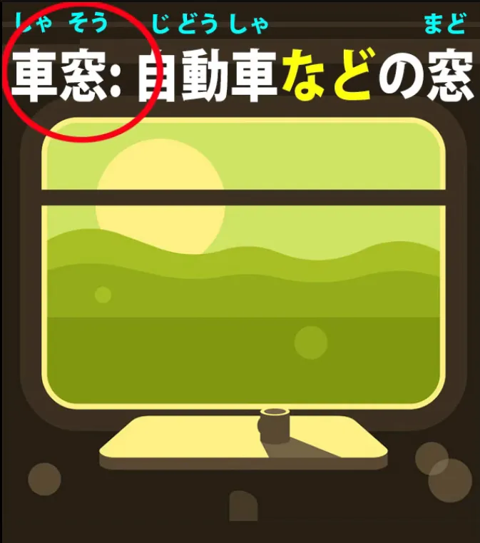
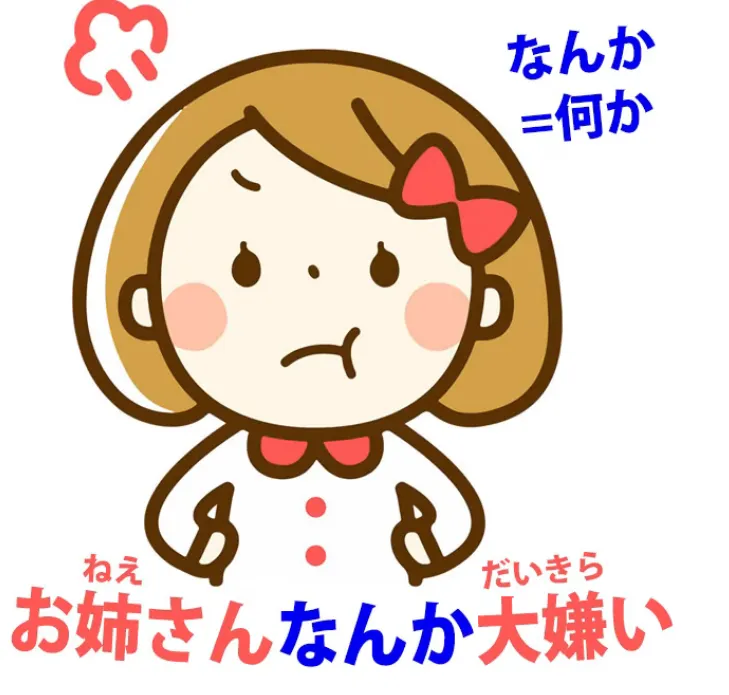
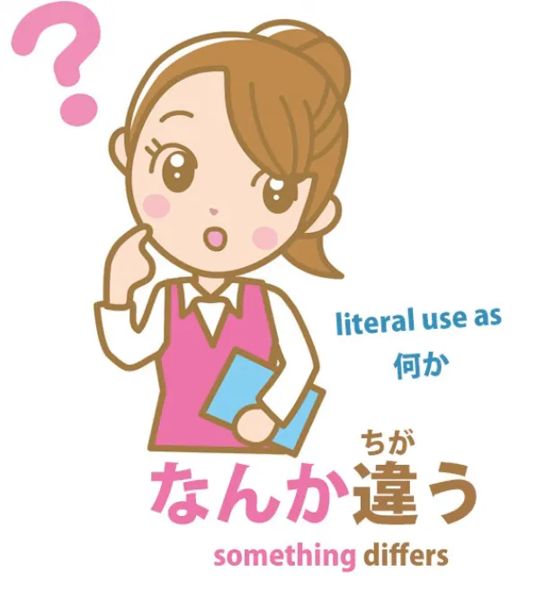
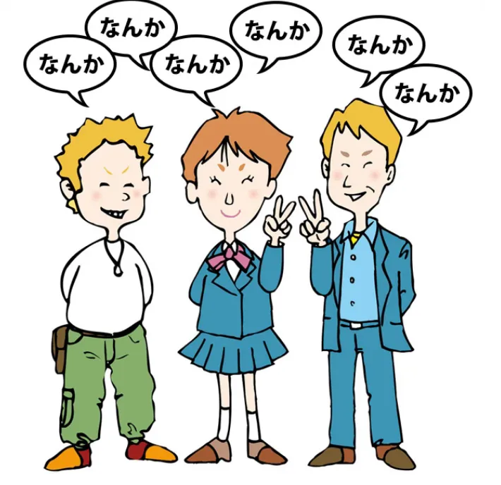
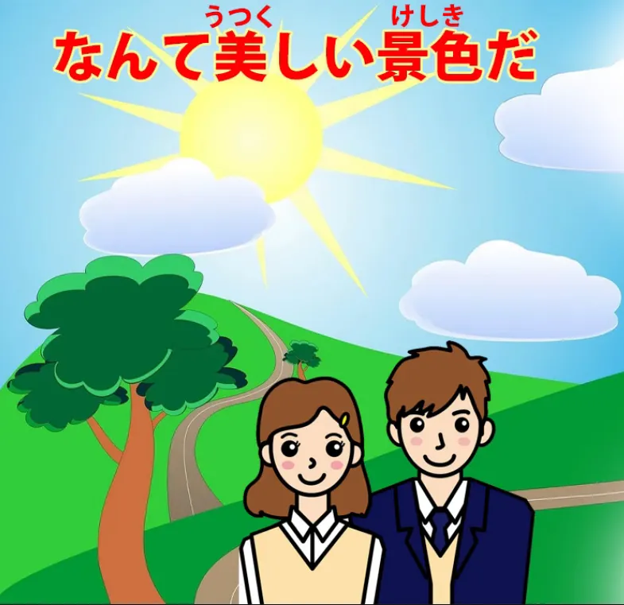

# **82. なんて、なんか、など: 3 распространённых слова, прояснённых.**

[**なんて Nante なんか Nanka など Nado: 3 распространённых слова, прояснённых. Урок 82**](https://www.youtube.com/watch?v=OlUG9ym-b4Y&list=PLg9uYxuZf8x_A-vcqqyOFZu06WlhnypWj&ab_channel=OrganicJapanesewithCureDolly)

こんにちは。

Сегодня мы поговорим о трёх словах, которые вы часто будете встречать при погружении в язык. **Они имеют довольно широкий спектр значений, а это значит, что словари не могут полностью охватить весь диапазон их смысла,** особенно когда они, как это часто бывает, используются в очень разговорной речи. И я хотела бы поблагодарить всех, кто сообщает мне, какие слова вызывают у них затруднения при погружении.

Это помогает мне понять, что и в каком порядке освещать. Многие хотели узнать о <code>なんて</code> и <code>なんか</code>. Так что, если у вас есть слова, которые доставляют вам проблемы, пожалуйста, напишите их в комментариях ниже. Очень полезно знать, что именно вызывает затруднения.

**Итак, эти три слова — <code>など</code>, <code>なんて</code> и <code>なんか</code>.** **Они имеют разные значения, но пересекаются в определённых областях.**

И самое простое из них — <code>など</code>, так что мы начнём с него.

## など

**<code>など</code> по сути означает примерно то же, что и <code>etcetera</code> (и так далее) в английском, но в официальной речи следует иметь в виду,** что **оно имеет более высокий статус, чем <code>etcetera</code> в английском.**

**В английском <code>etcetera</code> во многих случаях воспринимается как некая отмазка.** **Это способ не говорить точно, что вы имеете в виду.** **В японском оно имеет гораздо более высокий статус. Его спектр значений шире.**

**Вы встретите его как в полностью официальной письменной речи, так и в неформальной беседе и письме.** Это незаменимая часть языка.

---

В качестве примера его **официального использования** — словарное определение слова <code>車窓</code> — а <code>車窓</code> — это одно из тех слов, о которых я говорила [**в предыдущем видео**](https://www.youtube.com/watch?v=FaSPO5lL0yQ&t=0s&ab_channel=OrganicJapanesewithCureDolly), слова из двух или более кандзи, которые на самом деле не являются словами в английском смысле этого слова, то есть **они на самом деле являются фразами**.

**Они объединяют две известные сущности, которые известны, если мы достаточно изучали японский, в то, что в английском было бы просто фразой.** Так что мы можем добавить эти слова в наш Anki, если хотим напомнить себе об их существовании, но **мы не должны рассматривать их как совершенно новые сущности.**

**Они на самом деле просто как фразы, и эта очень близка к английской фразе <code>car window</code> (автомобильное окно), которая не является словом, это просто фраза.** Если мы знаем <code>car</code> (машина) и знаем <code>window</code> (окно), мы знаем, что такое <code>car window</code>.

Итак, если мы знаем <code>車</code> и знаем <code>窓</code>, и мы знаем он-чтения этих двух, которые <code>しゃ</code> и <code>そう</code>, то <code>しゃそう</code> на самом деле не представляет проблем, за исключением того, что **нам нужно помнить, что <code>しゃ</code>, он-чтение <code>[車]{くるま}</code>, относится к более широкому кругу транспортных средств.** <code>くるま</code> обычно просто означает <code>[自動車]{じどうしゃ}</code> (автомобиль), **в то время как <code>しゃ</code> может относиться к любому виду наземного транспортного средства.**

Велосипед — это <code>[自転車]{じてんしゃ}</code>, поезд — это <code>[電車]{でんしゃ}</code>, и так далее. И определение таково: <code>自動車**など**の窓</code>.

Так что, по сути, это означает <code>окно автомобиля, **и так далее**</code>, что **в данном случае означает любое наземное транспортное средство, имеющее окна**, то есть не <code>自転車</code>, а <code>電車</code>, и так далее: <code>окно транспортного средства</code>.

::: info
Обратите внимание, как <code>など</code> здесь используется сразу после <code>自転車</code> (даже перед частицей <code>の</code>).
<code>など</code>, кажется, используется непосредственно после своего существительного / именной фразы, как и любая другая частица (<code>など</code> тоже является частицей). Более того, однако, глядя на некоторые предложения из Yomichan, где оно используется, кажется, что оно имеет приоритет над логическими частицами, такими как <code>の</code>, <code>が</code>, <code>を</code>, в том смысле, что оно первым присоединяется к/после своего существительного, а логические частицы следуют за ним только после того, как оно присоединилось. Как видно выше или в предложении из Yomichan:
>大学では<code>**フランス語やドイツ語**</code>など<code>**を**</code>勉強した。
:::

И это <code>など</code> — очень типичное использование этого слова.
**Оно свободно используется как в официальном, так и в неформальном японском.**

### など в неформальном японском

**В неформальном японском <code>など</code> также имеет другое применение,** **которое пересекается с двумя другими словами, которые мы рассмотрим.** **Оно может использоваться для лёгкого уничижения или принижения слова, к которому оно присоединено.**

Теперь, <code>denigrate</code> (очернять) и <code>belittle</code> (принижать) — не совсем подходящие слова здесь, но я не думаю, что в английском есть абсолютно точные слова. **Оно бросает негативный свет, что в случае с <code>など</code> обычно означает пренебрежительное отношение или лёгкое неприятие того, о чём идёт речь.**

Так, мы можем сказать <code>タバコ**など**不要だ</code>, что означает <code>Мне не нужны сигареты</code>. А <code>タバコは不要だ</code> означало бы по сути то же самое **(обратите внимание, что <code>など</code> вытесняет другие частицы)**. *- так Долли подтверждает моё наблюдение выше, за исключением того, что здесь оно напрямую удаляет частицу <code>は</code>, вероятно, потому что это не логическая частица.*

---

**Единственная разница здесь в том, что <code>など</code> бросает этот слегка пренебрежительный свет на сигареты.** Так что мы могли бы прочитать это примерно так, на английском: <code>I don't need stuff like cigarettes</code> (Мне не нужны такие вещи, как сигареты). **На самом деле, это не означает этого буквально.**

**Оно не говорит, что мне не нужны сигареты, или сигары, или трубка, или кальян.** **Оно означает, что мне не нужна такая вещь — это то, что мне не нужно в моей жизни.** И, как я уже сказала, это использование пересекается с двумя другими нашими словами.

**Как <code>なんか</code>, так и <code>なんて</code> могут использоваться таким образом, бросая негативный свет на существительное, за которым они следуют.** **Самое сильное и наиболее разговорное из трёх — это <code>なんか</code>,** **а <code>なんて</code> находится где-то посередине.**

## なんか

**Итак, <code>なんか</code> на самом деле является сокращением от <code>[何]{なに}か</code> (что-то)**, но оно имеет довольно много разговорных применений.

И это уничижительное значение мы иногда очень сильно слышим в случаях, когда... ну, скажем, в аниме младшая сестра злится на свою старшую сестру. Она может сказать: <code>お姉ちゃん**なんか**大嫌い!</code> (Я очень ненавижу **таких, как** моя старшая сестра).

Конечно, **это не то, что она имеет в виду буквально.** **Она не имеет в виду, что ненавидит <code>таких, как</code> её старшая сестра,** **но, используя это выражение — <code>таких, как ты</code>, <code>таких, как моя старшая сестра</code> —** **вы бросаете очень пренебрежительный свет на то, о чём говорите.**

---

**Оно может быть мягче:** мы можем сказать <code>サッカー**なんか**興味がない</code> (У меня нет интереса **к таким вещам, как** футбол / Я не интересуюсь футболом). **И оно может быть ещё более мягко принижающим:** мы можем сказать <code>雨なんか平気だ</code>.

И то, что мы говорим здесь, это «*(Такой/Что-то вроде)* Дождь меня не беспокоит / Меня не тревожит *(такой/что-то вроде)* дождь / Я в порядке с *(таким/чем-то вроде)* дождём». **И <code>なんか</code> просто бросает этот слегка принижающий свет на дождь,** **указывая, как мало мы о нём беспокоимся.**

### なんか используется по отношению к себе

И **оно часто используется по отношению к себе**, как в <code>私なんか</code>, и **это часто используется для подчёркивания воспринимаемого низшего положения** **или сложного положения, в котором человек оказывается**, например, <code>私なんかまるで子供扱いだ</code> (Со мной обращаются прямо как с ребёнком).

### なんか — сокращение от [何]{なに}か

**Итак, фундаментальное значение <code>なんか</code>, как я уже сказала, на самом деле является** **сокращением от <code>[何]{なに}か</code>, что означает <code>что-то</code>.**

И **оно может использоваться просто как сокращение от <code>[何]{なに}か</code>**, например, в <code>**なんか**心配はある?</code>, что просто означает <code>**何か**心配はある</code> или (Есть ли **какое-то** беспокойство? Вас **что-нибудь** беспокоит?).

### なんか как <code>что-то</code>, <code>несколько</code> для придания расплывчатости

Теперь, **отсюда оно переходит к предварению вещей, как с <code>something</code> (что-то)** **или <code>somewhat</code> (несколько) в английском, чтобы сделать их немного более расплывчатыми.**

Так мы можем сказать <code>**なんか**違う</code> (**что-то** другое */ **что-то** отличается* — я не уверена, что именно, но что-то отличается).
<code>なんか違う.</code>

### なんか как <code>как-то / по какой-то причине</code>

Теперь, отсюда оно переходит к значению <code>как-то</code>. Так мы можем сказать <code>**なんか**好きじゃない</code> (**как-то** мне это не нравится / **По какой-то причине**, мне это не нравится).
<code>**なんか**好きじゃない</code>

### なんか в очень непринуждённой / небрежной речи как <code>типа</code> x

Теперь, отсюда становится хуже. **Оно становится ещё более расплывчатым.**

**Так что в очень непринуждённой и (я бы сказала) довольно небрежной речи,** **вы можете услышать <code>なんか</code> в начале предложения,** **а затем несколько раз в течение предложения: <code>なんか это, なんか то</code>.**

---

**И когда оно используется таким образом, оно на самом деле используется как <code>kinda</code> (типа) или <code>like</code> (как бы) в английском.** И, как и в английском, **это небрежный способ говорить.** **Это не хороший японский, но вы можете услышать, как люди так говорят в некоторых аниме и так далее.**

**Функция на самом деле, как и у <code>like</code> или <code>kinda</code> в английском, заключается** **просто в том, чтобы немного размыть вещи и** **освободить себя от необходимости выражаться точно.** Просто как бы говоришь, типа, всё, что как бы приходит в голову, типа — <code>なんか... なんか... なんか</code>.

Итак, **мы должны остерегаться этого очень свободного использования <code>なんか</code>** **и понимать, что оно на самом деле почти ничего не значит.**

## なんて

**<code>なんて</code> по сути является сокращением от <code>何って</code>**, и я делала другое видео об этом <code>-って</code>, которое является сокращением от <code>-と</code> или <code>-という</code>.[[18]](./18-って-は-mysteries-explained-おうとする-とする-として-という-っていう.md)

И то же самое с <code>なんて</code>. Итак, в своём простейшем и наиболее базовом использовании оно применяется, например, в выражении <code>**なんて**言った?</code>, что означает <code>**что** вы сказали?</code>

Носители английского языка могут быть склонны спросить <code>**なにを**いった?</code> (**что** вы сказали?). **Но это не естественный японский.**

Мы можем сказать <code>なんと言った</code>, но на самом деле **более естественно в непринуждённой речи** сказать <code>**なんて**言った?</code> (**что** это было, что вы сказали?), что не очень легко перевести на английский, потому что оно использует эту частицу цитирования *(<code>と</code>)*, хотя **в разговорной речи оно довольно сильно видоизменилось в <code>なんて</code>.**

### なんて как <code>Какой (это)</code> или <code>Какой (то)</code>

Теперь, вы также часто будете видеть его со значением <code>what</code> (какой) в английском, как в выражениях типа <code>**What a** nice day!</code> (Какой прекрасный день!), <code>**What a** stupid person!</code> (Какой глупый человек!), <code>**What a** beautiful flower!</code> (Какой красивый цветок!) и так далее.

**И это сокращение от <code>[何]{なん}という</code>, но чаще всего,** **даже в не особо непринуждённой речи, оно используется как <code>なんて</code>.** <code>**なんて**美しい景色だ!</code> (**Какой** прекрасный пейзаж!)

И, как и в английском, **это <code>なんて</code> может использоваться для выражения** **любой довольно сильной реакции на что угодно.** **Она может быть негативной; она может быть позитивной.** **Мы говорим <code>какой (это)</code> или <code>какой (то)</code>.**

### なんて используется в принижающей манере

Теперь, **оно также используется**, как мы уже говорили, **в этой принижающей манере, прикрепляясь к существительному.** Так, например, мы можем сказать <code>試験**なんて**嫌いだ</code> (Я ненавижу экзамены); <code>お金**なんて**いらない</code> (Мне не нужны деньги).

**Как и <code>なんか</code>, оно одновременно подчёркивает существительное, за которым следует,** **и указывает на негативное или пренебрежительное отношение к нему.**

### なんて используется для выражения удивления

**И оно также может использоваться в конце полного утверждения для выражения удивления.**

Так что **в этом смысле оно довольно похоже на первое**, которое мы рассмотрели, **<code>какой (это)</code> или <code>какой (то)</code>, которое стоит в начале.**

---

**Оно также может использоваться в конце для выражения удивления или в некоторых случаях недоверия или сомнения.** Так мы можем сказать <code>冬に燕を見る**なんて**</code> (увидеть ласточку зимой + <code>なんて</code>).

Что делает это <code>なんて</code>? Ну, **оно превращает всё это в выражение,** **довольно похожее на выражения <code>какой (это)</code> или <code>какой (то)</code>.**

**Так что мы говорим что-то вроде <code>Боже, только представьте, увидеть ласточку зимой!</code>**

---

**И это использование <code>なんて</code> в конце, после локомотива утверждения,** **может быть использовано как часть более длинного предложения.** Так, например, мы могли бы сказать <code>腹を立てる**なんて**君らしくない</code>.

Теперь, **<code>腹を立てる</code>** буквально означает <code>ставить свой желудок</code>, **но это выражение означает <code>злиться</code>.** **Так что всё это означает <code>злиться — это не в твоём духе</code>.**

И я говорила об этом <code>らしい</code> и <code>らしくない</code> в другом видео.[[25]](./25-らしい-vs-そうだ-そうです-っぽい-ppoi.md) Так что, если вы с ними не знакомы, я оставлю ссылку над моей головой и в разделе информации ниже.

---

Теперь, **мы можем убрать <code>なんて</code> здесь, и тогда, конечно, нам пришлось бы поставить частицу** и сказать: <code>腹を立てる**のは**君らしくない</code>. **Но <code>なんて</code> выражает наше удивление по этому поводу,** **потому что это не в духе данного человека.**

---

**И обратите внимание, что это не может быть принижающее <code>なんて</code>, которое присоединяется к существительным.** **Это присоединяется к полному утверждению,** **так что мы выражаем наше удивление по поводу того, что кто-то злится,** **а затем добавляем комментарий, что это не в её духе.**

### なんて как это расплывчатое という

И наконец, **мы можем использовать его таким образом, который более или менее возвращает нас** **к первоначальному значению <code>-という</code>, но добавляя к нему немного расплывчатости.**

Так что, если мы скажем <code>山田**なんて**人は知らない</code>, мы говорим <code>Я не знаю никого, **кого зовут** Ямада</code>. Теперь, **<code>なんて</code> здесь можно просто заменить на <code>-という</code>**: <code>山田**という**人は知らない</code>.

Так в чём же разница между использованием обычного <code>-という</code> и использованием <code>なんて</code>?

---

Ну, <code>山田**という**人は知らない</code> — это как просто сказать на английском <code>I don't know a person **called** Yamada</code> (Я не знаю человека, **которого зовут** Ямада). Но <code>山田**なんて**人は知らない</code> больше похоже на <code>I don't know any character **called** Yamada</code> (Я не знаю никакого персонажа **по имени** Ямада).

**Оно бросает гораздо больше сомнений и вопросов во всё это.**

Итак, мы рассмотрели основные применения этих трёх слов или выражений. Это не совсем исчерпывающе, но, я думаю, даёт вам основные ключи к тому, как они работают, что они означают и как используются.

::: info
Чёрт, довольно много подзаголовков в этом, хех (ノ\*°▽°\*)
Хотелось сделать поиск немного проще, если что. Также, это довольно интересно:

Извините за микроскопический шрифт, YouTube снова скрывает текстовые части, если я почему-то увеличиваю масштаб...
:::