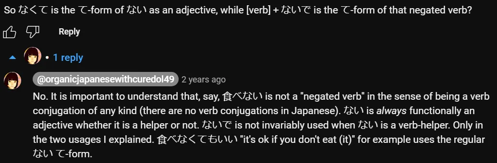
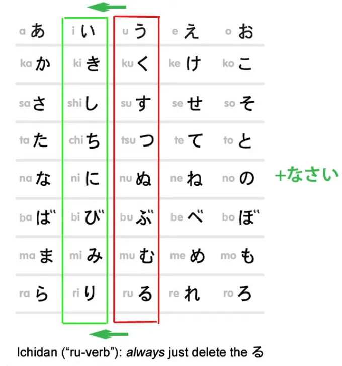
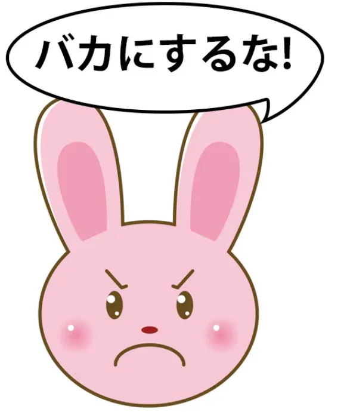
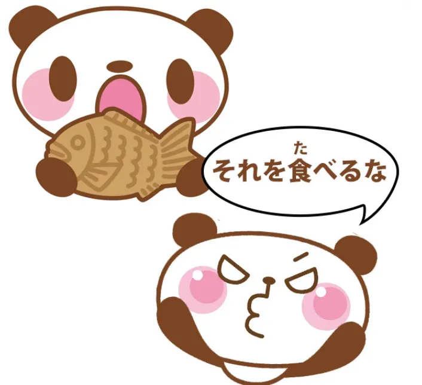
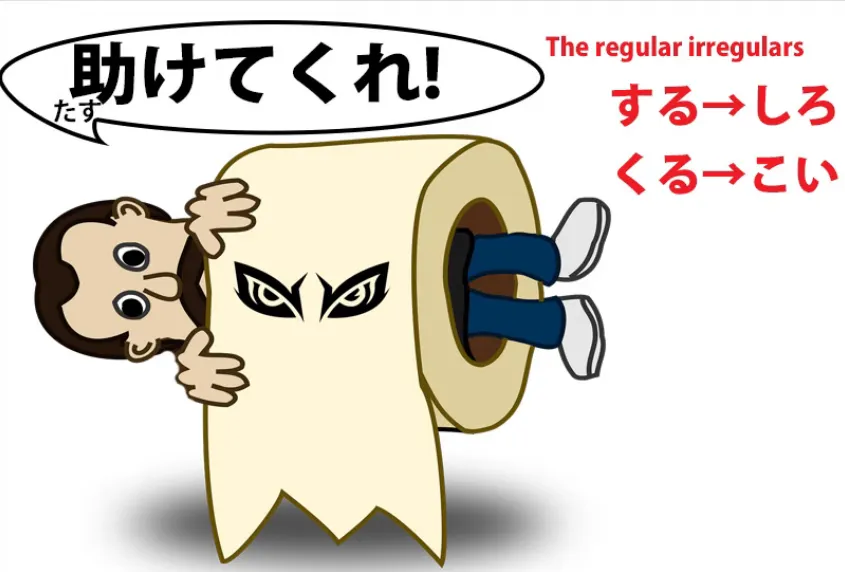
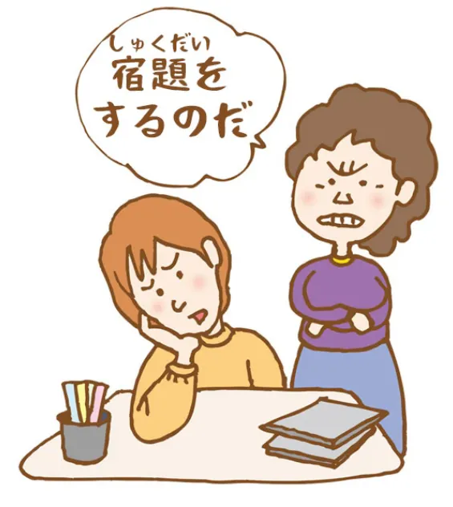
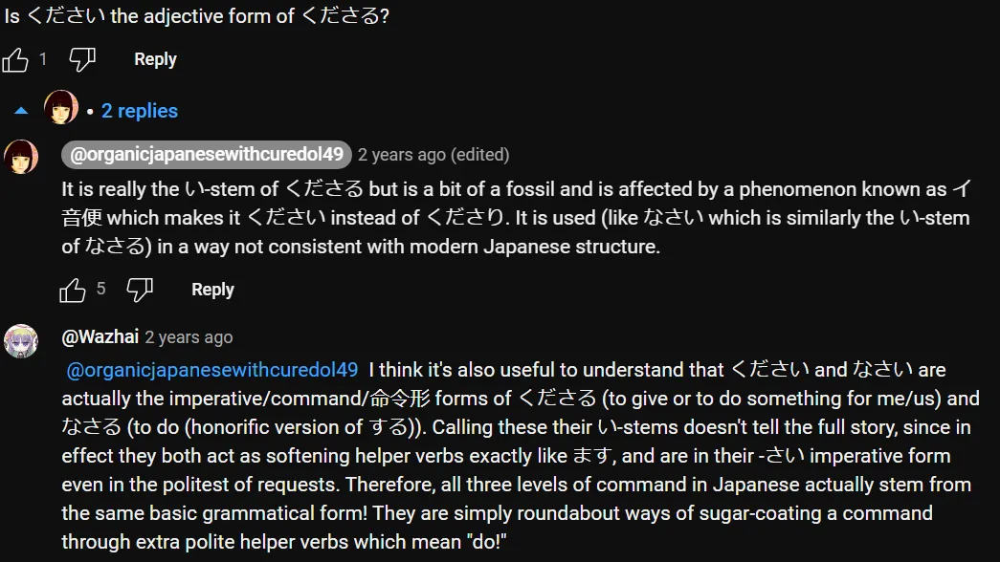
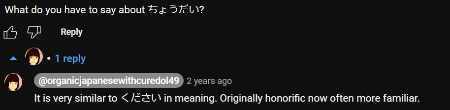

# **83. Три уровня повелительного наклонения в японском: て-форма, なさい, な-повелительное, императив.**

[**Три уровня повелительного наклонения в японском: て-форма, なさい, な-повелительное, императив. Урок 83**](https://www.youtube.com/watch?v=zayeW4AQ0Is&list=PLg9uYxuZf8x_A-vcqqyOFZu06WlhnypWj&index=90)

こんにちは。

Сегодня мы поговорим о способах формирования команд и просьб в японском языке. Вероятно, некоторые из них вы уже знаете, но, думаю, мы углубимся в некоторые моменты, о которых вы, возможно, не догадывались.

**Мы будем двигаться от наименее повелительных и интенсивных к наиболее**, поэтому начнём с того, что мы все знаем, — с て-формы.

## て-форма

Некоторые источники скажут вам, что て-форма сама по себе является формой команды или просьбы. **Это лишь наполовину правда. Это сокращение команды или просьбы.**

Если мы говорим <code>ちょっと待って</code> (подожди немного), **это сокращение** от <code>ちょっと待ってください</code> (подождите немного, пожалуйста).

И, вероятно, из-за этого она наименее вероятно будет оскорбительной, хотя **всё ещё является неформальной.**

Теперь, иногда вы услышите, как люди говорят не <code>ちょっと待って</code>, а <code>ちょっと待って**て**</code>. Что здесь происходит?

По сути, они говорят: <code>**Подожди немного, и я вернусь**</code>. **Подразумевается, что период ожидания закончится довольно скоро.**

И на самом деле это сокращение от <code>ちょっと待って**いて**</code>. Как мы знаем, <code>待っている</code> означает <code>существовать в состоянии ожидания</code>, <code>быть в ожидании</code> на английском. **Так что <code>ちょっと待ってて</code> на самом деле берёт это <code>待っている</code> и ставит его в て-форму**, **чтобы то, что вас просят или инструктируют сделать, было существованием в состоянии ожидания.**

И подразумевается, что **просто немного побудете в состоянии ожидания.** **И, конечно, это не обязательно должно быть ожидание, это может быть что угодно,** **но подразумевается, что просто сделайте это ненадолго, просто побудете в этом состоянии короткое время.**

---

**Если мы не говорим <code>ちょっと</code>** (а мы не обязательно это делаем), **ничто не указывает на короткое время, но это всегда подразумевается**, **когда вы говорите кому-то с помощью て-формы существовать в определённом состоянии.**

### て-форма со вспомогательным прилагательным ない

Ещё одна вещь, которую нужно знать о て-форме, используемой для того, чтобы сказать или попросить кого-то что-то сделать, заключается в том, что, как мы знаем, **эквивалентное отрицательное прилагательное любого глагола** **образуется путём простого присоединения вспомогательного прилагательного <code>ない</code> к あ-основе.**

**И вспомогательное прилагательное <code>ない</code> на самом деле необычно тем, что имеет две て-формы.** У него есть обычная て-форма, которая образуется так же, как любая другая て-форма, путём присоединения -て к く-основе, то есть <code>なくて</code>, **но у него также есть неправильная て-форма <code>ないで</code>.**

И при присоединении к глаголу это используется только в двух случаях.

#### ないで - неправильная て-форма от ない

Один случай — когда мы говорим <code>делать Б, не делая А</code>, так что <code>話さないで歩く</code> означает <code>идти, не разговаривая</code>. **Другой — когда мы формируем ту самую команду или просьбу в て-форме.**

И снова, это сокращение от <code>ないでください</code>. Так что, если мы говорим <code>**泣かないで**</code> (не плачь), **это использует эту вторую, специализированную て-форму от <code>ない</code>**, **которая специально предназначена для формирования отрицательных команд или просьб**, **а также для того другого использования, которое мы обсуждали.**

Иногда в аниме вы услышите, как кто-то кричит, когда к ней приближается монстр: <code>来ないで!</code> (не подходи).

В английском мы, вероятно, сказали бы <code>Держись подальше!</code> В японском мы говорим <code>来ないで!</code>

::: info

:::

## なさい

Теперь, следующий в нашей иерархии команд — <code>なさい</code>. **<code>なさい</code> присоединяется к い-основе глаголов**, и **когда вы присоединяете <code>なさい</code> к い-основе глагола, вы превращаете его в команду.**

Итак, <code>起きなさい</code> — это <code>вставай / просыпайся</code>; <code>落ち着きなさい</code> (успокойся, угомонись), **мы присоединяем <code>なさい</code> к い-основе <code>落ち着く</code>,** **что означает <code>успокоиться</code> или <code>угомониться</code>, и превращаем это в команду.**

---

**<code>なさい</code> — это своего рода команда, которую дают родители детям,** **учителя классу, и тому подобное.** **Она не является оскорбительной, если её даёт тот, кто имеет на это право.**

---

Так, например, в аниме <code>借りぐらしのアリエッティ</code> отец Ариэтти говорит <code>寝なさい</code>. **Это い-основа, которую, конечно, у итидан-глаголов мы образуем, просто** **убирая -る, от <code>寝る</code>** (спать или ложиться спать) **плюс <code>なさい</code>.**

### な - сокращение от なさい

**Что здесь может сбивать с толку, так это то, что существует сокращение от <code>なさい</code>,** **которое можно спутать с другим сокращением, означающим противоположное.** **И это сокращение — <code>な</code>.**

Когда мы присоединяем <code>な</code> **к い-основе глагола**, то мы на самом деле сокращаем <code>なさい</code>. **Так что, если мы говорим <code>準備しな</code>, мы говорим <code>準備しなさい</code> (готовься, приготовься)**: <code>準備する</code>, い-основа от <code>する</code>, <code>し</code> + <code>なさい</code> или <code>な</code>.

Само по себе это не особенно сбивает с толку. Что может сбить с толку, так это если мы скажем, например, <code>バカにするな</code> (не смейся надо мной, над ней);

<code>それを食べるな</code> (не ешь это! [может быть яд]). **Это означает противоположное!**

**Мы используем <code>な</code> как для команды что-то сделать,** **так и для команды что-то не делать.** Так как же нам их различить? К счастью, это очень просто.

**Если <code>な</code> присоединяется к い-основе, то это сокращение от <code>なさい</code>.**

**Это всегда так.**

---

**Если же оно не присоединяется к い-основе, а присоединяется ко всему логическому предложению,** **как в <code>それを食べるな</code>, то это не сокращение от <code>なさい</code>.** **На самом деле это более старая отрицательная форма, связанная с <code>ない</code>.**

Так что на самом деле, хотя поначалу они могут показаться запутанными, и, вероятно, они сбивают с толку, когда какой-нибудь учебник просто говорит вам выучить, к каким конкретным формам они прикрепляются, на практике это не так уж и запутанно.

**Один присоединяется только там, где <code>なさい</code> присоединился бы к い-основе,** **и это тот, который означает <code>なさい</code>!** **Другой завершает полное логическое предложение с помощью отрицающей <code>な</code>.**

::: info
Дополнительная информация, которую Долли даёт о なさい в комментариях

:::

## Настоящая повелительная форма / императив - 命令形

И теперь мы переходим к настоящей повелительной форме, <code>命令形</code> в японском языке.

**И она образуется очень просто: путём использования голой え-основы годан-глагола или,** **в случае итидан-глагола, мы, как всегда, убираем -る и заменяем его на -ろ.**

Так что вы можете услышать, как люди говорят в аниме <code>黙れ!</code> **Это глагол <code>黙る</code>** (молчать, быть тихим), **превращённый в команду:** **<code>Молчи!</code>**

**И это действительно довольно сильно.** **Это сильнее и потенциально более оскорбительно, чем <code>うるさい!</code>** (И [**я делала видео об <code>うるさい</code>**](https://www.youtube.com/watch?v=1jBOq1EHwvs), если вы хотите это изучить.)

**Она не является оскорбительной по своей сути,** 

::: info
форма 命令形
:::

**Если кто-то действительно имеет право отдавать приказы, он может её использовать.** **И люди, которые говорят грубо, могут использовать её среди друзей или с врагами.**

Вы можете часто слышать её в сёнэн-аниме, где люди склонны говорить грубо. **Она также может выражать срочность в некоторых случаях.** **Один из случаев, который вы часто услышите, это когда персонаж находится в серьёзной беде** **и кричит <code>助けてくれ！</code>, что похоже на <code>助けてください！</code>,** **но превращает это в настоящий приказ, команду.**

Теперь, очевидно, что кто-то в большой беде не пытается оскорбить или обидеть того, кто мог бы ему помочь. **Так что это <code>くれ</code> в данном случае выражает срочность ситуации.**

И всё же, даже здесь, я должна сказать, что слышала, как **только мужские персонажи используют это <code>助けてくれ</code>.** Женские персонажи, даже в самой крайней чрезвычайной ситуации, склонны довольствоваться <code>助けて!</code>

**И это показывает, насколько деликатна на самом деле настоящая повелительная форма <code>命令形</code>.** **<code>くれ</code> — это действительно единственная неправильная <code>命令形</code>, кроме** **двух обычных неправильных, которыми являются <code>する</code> и <code>くる</code>.**

**Итак, <code>くれる</code> (давать вниз / мне) становится <code>くれ</code>.**

::: info
Очевидно, как показано, くれ — это форма от **くれる**; а не от [来]{く}る (у этого [来]{こ}い)
:::
---

И, как видите, **это особенно щекотливое слово для использования,** **потому что вы просите об одолжении, но при этом требуете его,** **вы приказываете кому-то оказать вам одолжение.**

Теперь, для полноты картины, я бы сказала, что есть ещё два способа отдавать команды, которые в основном используются для других целей, но также могут быть использованы как повелительные формы.

## Окончание のだ / んだ

**Одно из них — окончание <code>のだ / んだ</code>, которое ставится в конце полного логического предложения,** и [**я делала видео об этом окончании <code>のだ / んだ</code>**](https://www.youtube.com/watch?v=lYvIOi8Q3I8), и я оставлю ссылку на него над моей головой и в разделе информации ниже.

Как я объясняю в видео, **оно имеет широкий спектр применений**, **но одно из них — превращение чего-либо в команду.** Так что, если мы говорим <code>宿題をする**のだ**</code>, мы буквально говорим <code>**Это то, что** (ты) делаешь (свою) домашнюю работу</code>.

Это будет чем-то вроде английского <code>You're going to do your homework</code> (Ты сделаешь свою домашнюю работу). **Это команда.**

## ように

**Также <code>ように</code>, которое в качестве окончания обычно больше ассоциируется с** **молитвами, прошениями и просьбами, также может формировать команду.**

::: info

:::
---

И главная причина, по которой я упоминаю их, заключается в том, что **если вы столкнётесь с ними** **в своём погружении и увидите что-то, что обычно делает что-то другое,** **выглядящее как команда, <code>のだ</code> или <code>ように</code>, то не удивляйтесь этому.** **В этих случаях это команда.**

::: info
Это может быть полезно:

:::
