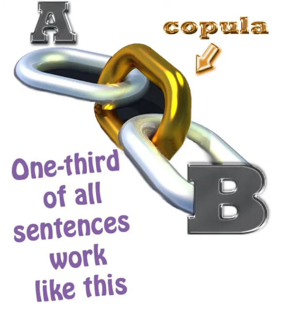
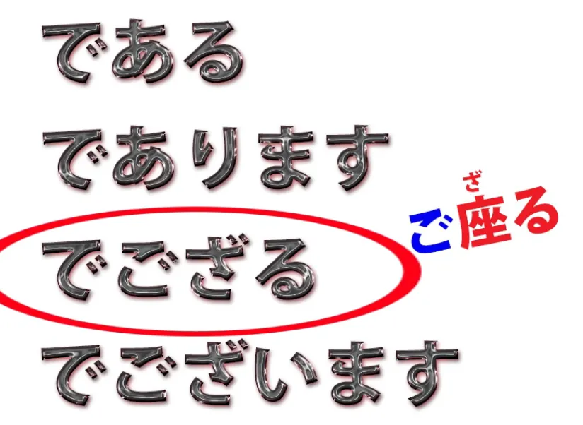
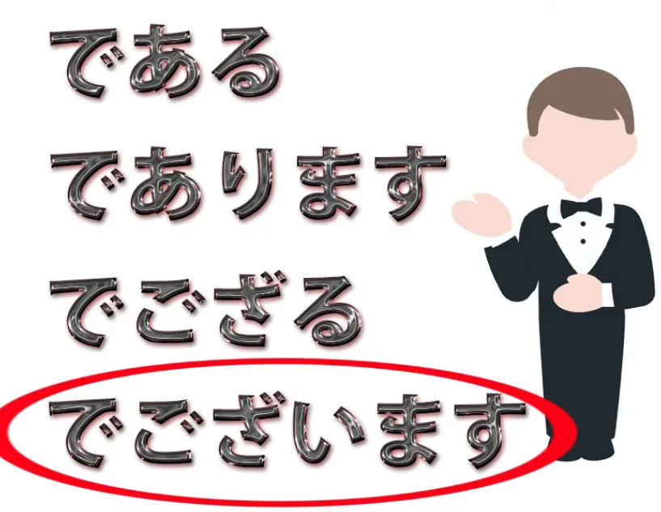
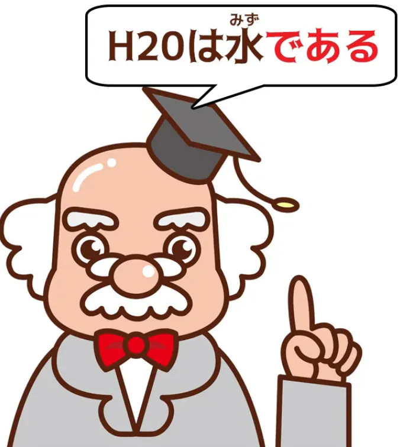
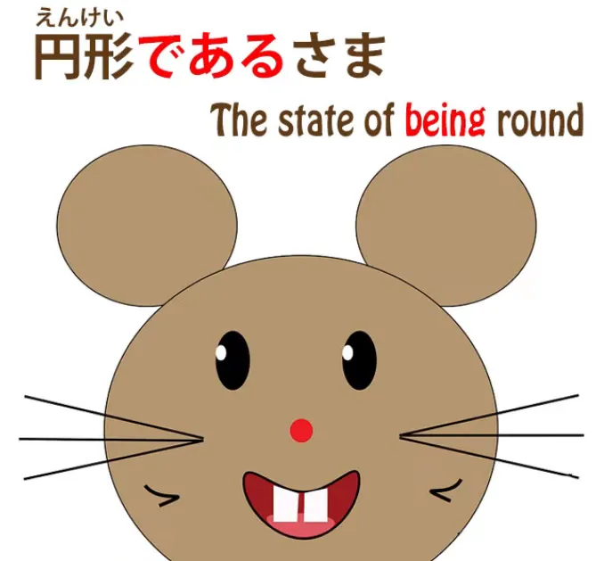
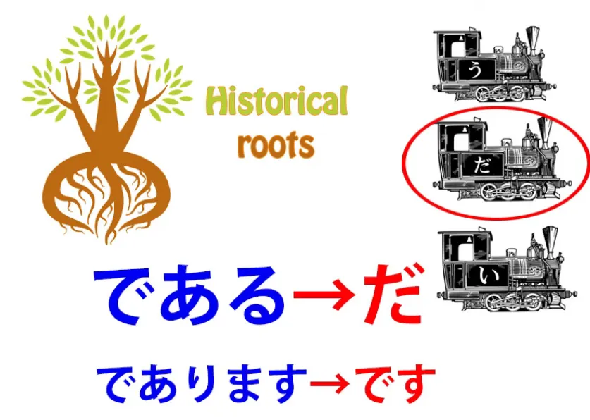
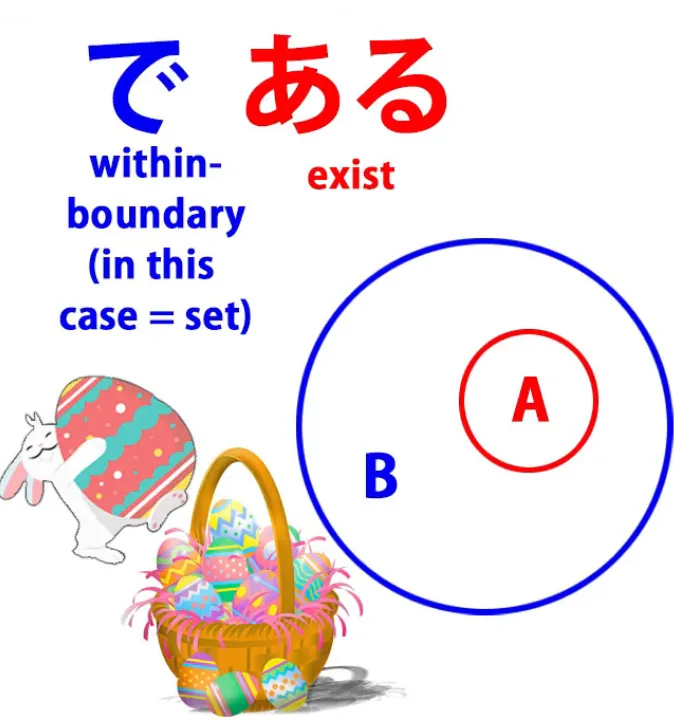
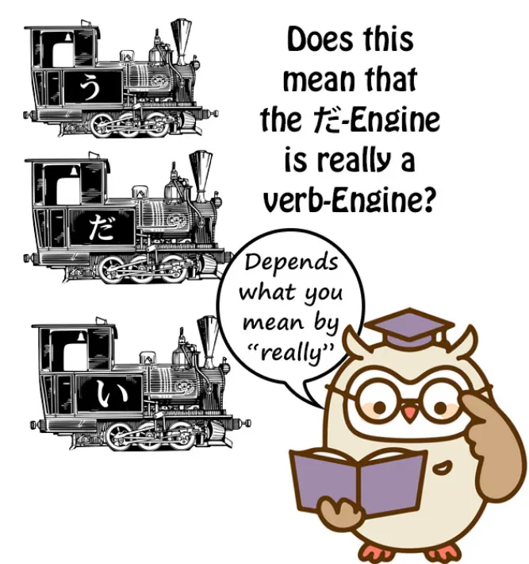
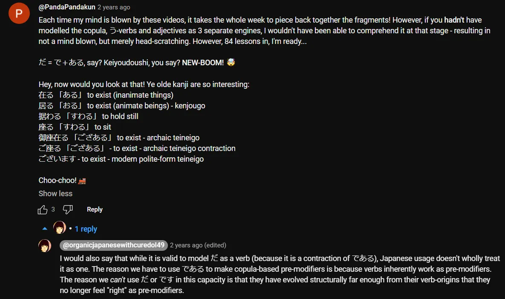
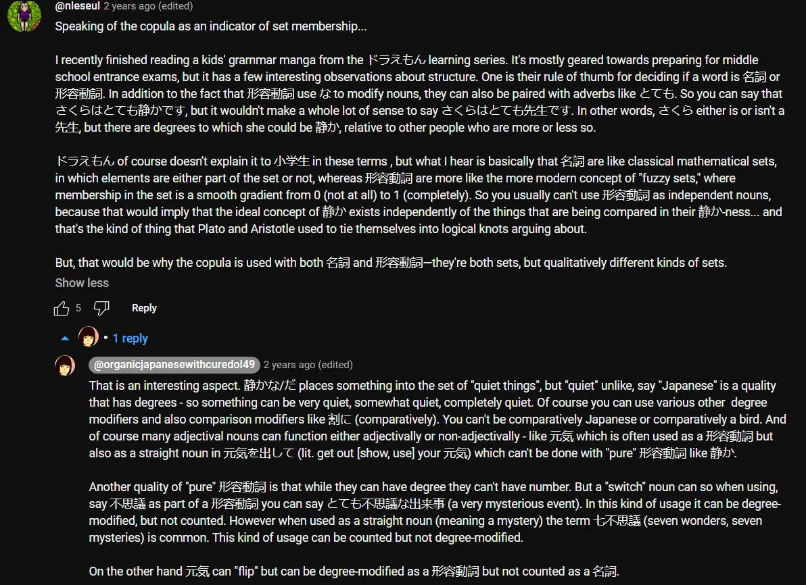

# **84. である и структура японского языка. Что нам говорят старые связки: である, であります, でござる, でございます**

[**De-aru и структура японского языка. Что нам говорят старые связки: である, であります, でござる, でございます | Урок 84**](https://www.youtube.com/watch?v=hS02cADsjfI&list=PLg9uYxuZf8x_A-vcqqyOFZu06WlhnypWj&ab_channel=OrganicJapanesewithCureDolly)

こんにちは。

Сегодня мы снова поговорим об элементе японского языка, который даёт нам ключ примерно к трети всех японских предложений, и это — связка.

::: info
Обратите внимание, как связка СВЯЗЫВАЕТ А (Подлежащее) и В (Сказуемое) — это её функция.
:::
Я уже довольно много говорила о связке раньше, и я оставлю ссылки в разделе информации ниже, чтобы вы могли ознакомиться с этим.[[40]](./40-3-pitfalls-in-japanese-and-how-to-avoid-them.md)[[41]](./41-5-key-facts-about-the-basic-structure-of-japanese.md)[[55]](./55-secrets-of-the-で-particle-why-do-we-say-みんなで行く-and-世界で一番.md)[[77]](./77-real-japanese-structure-vs-tae-kim-structural-review-of-tae-kim-s-japanese-grammar.md)[[79]](./79-deeper-secret-of-the-copula.md)

**Но сегодня я хочу рассмотреть менее распространённые версии связки**, которые вы довольно часто будете встречать при погружении в язык и которые поднимают определённые вопросы о структуре самой связки, на которые мы ответим.

**Это: <code>である</code>, <code>であります</code>, <code>でございます</code> и <code>でござる</code>.**

Итак, с последними тремя мы можем разобраться очень быстро, **потому что все они являются лишь вариантами первой — <code>である</code>.**

## であります

**<code>であります</code> — это, очевидно, <code>である</code> с присоединённым вспомогательным глаголом <code>ます</code>.**

## でござる

**<code>でござる</code> — <code>ござる</code> — это просто вежливая, кэйго-версия <code>ある</code>, глагола бытия.**

Как же глагол бытия сюда попал? Ну, об этом мы поговорим через минуту.

**<code>ござる</code> просто состоит из почтительного префикса <code>ご</code> плюс <code>[座]{ざ}る</code>,** **что изначально означает <code>сидящий</code>, но имеет расширенное значение <code>существующий</code>.**

::: info
座る обычно читается как すわる, но его онъёми — ざ, поэтому здесь ざる, потому что, я полагаю, это относится к его расширенному значению <code>существующий</code>?
:::
**Так что <code>ご[座]{ざ}る</code> — это просто <code>ある</code> в изысканной форме.**

**Вы почти не услышите <code>でござる</code>, потому что, будучи почтительной формой,** **в наши дни она почти всегда используется с присоединённым вспомогательным глаголом <code>ます</code>.**

Но вы можете услышать <code>ござる</code>, возможно, в исторических драмах и тому подобном. **Это самурайская речь.**

## でございます

**<code>でございます</code> — это форма связки, используемая в кэйго,** так что **вы услышите её в магазинах, в публичных объявлениях**, и вы услышите, как её используют персонажи в аниме и т.д., которые говорят очень почтительно, возможно, второстепенные злодеи, разговаривающие с главным злодеем.

Так что это, по сути, всё, что нам нужно сказать об этих трёх.

## である

**Но <code>である</code>, который является корнем всех их, — это то, на что нам нужно обратить внимание.**

Его можно назвать, в некотором смысле, **<code>прямой связкой</code>.**

**<code>だ</code> звучит неформально, <code>です</code> — вежливо, но <code>である</code> — это просто связка.**

**Мы видим его использование в контекстах, где мы просто объективны,** **таких как научные работы, газетные репортажи и тому подобное.** **Мы также увидим его использование в других контекстах, независимо от** **регистра письма, потому что оно обладает особым качеством.**

---

**Как мы знаем, <code>だ</code> и <code>です</code> могут использоваться только в конце логического предложения.** **Они являются окончаниями логических предложений и не могут использоваться для предмодификации существительного.** **Если мы хотим предмодифицировать существительное другим существительным, отмеченным связкой,** **мы можем сделать это только в том случае, если это адъективное существительное, потому что адъективные существительные** **могут использовать предмодифицирующую версию связки, которая является <code>な</code>.**

Мы можем сказать <code>花が**綺麗だ**</code> (цветок **красивый-есть**) или мы можем сказать <code>**綺麗な**花</code> (**красивый-есть** цветок).

И именно потому, что эта группа существительных — а я говорила о трёх группах особых существительных в другом видео, если вы хотите посмотреть[[41]](./41-5-key-facts-about-the-basic-structure-of-japanese.md) — **эта особая группа существительных, адъективные существительные, обладает свойством** **использовать предмодифицирующую форму связки, <code>な</code>.**

Это то, чего, кажется, не знают учебники. Они не говорят вам, что такое <code>な</code>, и говорят, что адъективные существительные на самом деле являются какой-то странной вещью, называемой <code>な-прилагательными</code>. Но это уже другой вопрос.

**Так что же нам делать, если мы хотим использовать существительное, отмеченное связкой,** **в качестве предмодификатора, и оно не является адъективным существительным?**

Мы не делаем этого очень часто, потому что можем обойти ситуацию, используя <code>の</code>. Но в некоторых случаях это либо не работает, либо просто не то, что мы хотим сделать.

Итак, предположим, мы хотим сказать <code>Сакура, **которая является** студенткой университета</code>. Мы можем сказать <code>大学生**の**さくら</code>, что означает <code>студентка университета Сакура</code>.

Но предположим, мы не хотим так говорить. **Предположим, мы на самом деле хотим сказать <code>Сакура, которая является студенткой университета</code>?** *(создать относительное придаточное)*

Это не совсем одно и то же, ни в японском, ни в английском. **Чтобы это сделать, мы должны использовать связку и** **мы должны использовать её как предмодификатор, поэтому мы должны использовать <code>である</code>.**

**Это наш единственный выбор. Мы не можем использовать <code>だ</code> или <code>です</code>,** **потому что они могут использоваться только в конце логического предложения.** **И мы не можем использовать <code>な</code>, потому что <code>大学生</code> не является адъективным существительным.**

---

Поэтому мы говорим <code>大学生**である**さくら</code>. *(Сакура, **которая является** студенткой университета)*

И вы увидите это иногда, особенно в письменных материалах.

---

**Но бывают случаи, когда у вас вообще нет выбора.** **Например, если вы хотите сказать <code>состояние быть круглым</code>**, вы бы сказали <code>円形**である**さま</code>.

Итак, **<code>さま</code> — это состояние или условие.** **Мы не можем здесь использовать <code>の</code>; <code>円形のさま</code> не очень подходит.**

Так что нам действительно приходится говорить <code>円形**である**さま</code>.

Итак, **когда я говорю, что <code>である</code> — это прямая связка,** не неформальная, не вежливая, а просто прямая связка, есть ещё одна причина для этого, **потому что в конечном итоге и исторически <code>だ</code> — это просто сокращение от <code>である</code>,** **а <code>です</code> — это сокращение от <code>であります</code>.**

Итак, если вы следили за моим курсом, если вы были обучены смотреть на японский язык структурно, есть определённые вопросы, которые это может заставить вас задать, и некоторые люди спрашивали меня.

Прежде всего, разве я не представляла связку как неделимую, особую единицу, один из трёх локомотивов, но **здесь она, кажется, состоит из двух элементов,** **<code>で</code> и <code>ある</code>, и очень похожа на глагол.**

Так что же здесь происходит? И затем, **почему в любом случае элементы <code>で</code> и <code>ある</code>** **складываются в концепцию связки?**

### Почему で & ある образуют связку

Итак, давайте сначала рассмотрим вторую часть, а затем первую.

Почему <code>で</code> плюс <code>ある</code> образуют концепцию связки? **Ну, как мы знаем, в японском языке есть два <code>で</code>.** **Есть частица <code>で</code>, а затем есть て-форма связки.**

Учебники вам этого не говорят. Они позволяют вам думать, что всё это частица <code>で</code>.

**Но, как мы знаем, есть два <code>で</code>.** **Итак, тот, с которым мы имеем дело здесь, — это, очевидно, частица <code>で</code>.**

::: info
Хм… забавно, что эта частица で также была одной из моих теорий относительно である (и だ)
:::
**Это не может быть て-форма связки, потому что фундаментальная связка** **не может состоять из двух элементов, один из которых уже является て-формой самой себя.**

И чтобы понять, что здесь происходит, почему <code>で</code> и <code>ある</code> складываются в связку, нам нужно знать две вещи.

Я сделала видео по обеим этим темам и также оставлю ссылки на них, но давайте просто кратко повторим здесь.
::: info
Трудно сказать, какие именно видео имела в виду Долли, но если так, то пересмотрите Уроки 40, 41, 55 и 79.
:::

#### Что на самом деле такое связка / что она делает

**Связка на самом деле — это то, что берёт два существительных, А и В,** **и говорит нам, что существительное А является частью множества, представленного существительным В.**

Вот что делает связка. **И это всё, что она делает.**

Итак, если мы говорим <code>さくらが日本人だ</code>, **мы говорим, что Сакура (существительное А) является частью множества Японцы (существительное В).**

**И иногда множество может состоять из одного элемента.** Так что, если мы говорим <code>Тот человек там **—** Сакура</code>, то мы говорим, что **тот человек там принадлежит к множеству из одного элемента, которым является Сакура.**

**Мы не говорим о других Сакурах.** **Мы говорим об этой конкретной Сакуре.**

---

#### Что на самом деле такое частица で / что она делает

**Итак, что же на самом деле делает частица <code>で</code>?**

Я сделала видео об этом и оставлю ссылку.[[55]](./55-secrets-of-the-で-particle-why-do-we-say-みんなで行く-and-世界で一番.md)

**Фундаментально частица <code>で</code> определяет предел, поле или параметр,** **в пределах которого происходит действие или преобладает состояние бытия.**

---

**Итак, простейшее использование <code>で</code> — это указание места, где происходит действие:** <code>**公園で**遊ぶ</code> (играть **в парке**) — **парк, который отмечен <code>で</code>, является полем, областью, параметрами, в пределах которых я играю;**

<code>**世界で**一番おいしいラーメン</code> (самый вкусный рамэн **в мире**) — **мир, отмеченный <code>で</code>, обозначает поле, область, в пределах которой этот рамэн является первым, номером один.**

---

**И в других случаях это распространяется немного дальше.** **Это может быть материал, из которого что-то сделано, инструмент, которым что-то сделано, и т.д.** **Во всех случаях это выделяет определённый параметр из других параметров,** **которые позволяют совершить действие.**

### Возвращаясь к である

Итак, когда мы берём <code>である</code>, это означает **существовать (ある) в пределах определённой границы или параметра;** другими словами, **существовать в пределах множества.**

**И это то, что говорит нам связка.** **Она говорит нам, в каком множестве, в какой границе что-то существует.**

Сакура **существует в пределах границы** японцев.

Если мы говорим <code>鷲が鳥**だ**</code> (орёл **есть** птица), мы говорим, что **орёл существует в пределах границы, в пределах параметра, в пределах множества <code>птицы</code>.**

И это то, что связка делает всегда. **Так что <code>である</code> — это очень точная конструкция связки.**

Итак, перейдём ко второму вопросу.

#### Является ли である / связка глаголом?

Второй вопрос: **означает ли это, что она на самом деле не является** **неделимым элементом японского языка, одним из трёх локомотивов?** **И означает ли это, что это глагол?**

**Потому что, очевидно, <code>ある</code> — это глагол, и именно потому, что** **<code>ある</code> — это глагол, мы можем использовать его как предмодификатор.**

Мы можем сказать <code>大学生**である**さくら</code>, потому что **вы всегда можете использовать глагол для предмодификации существительного.**

И ответ на этот вопрос заключается в том, что это вопрос моделирования.

Я моделирую японский язык определённым образом. **Его можно моделировать и другими способами.**

**В японской грамматике, преподаваемой японским студентам, связка рассматривается как глагол.** *(таким образом, связка имеет глагольную функцию = её теоретически можно рассматривать как особый вид глагола)*

---
И на самом деле **адъективное существительное плюс связка называется <code>形容動詞</code>,** **что означает адъективный глагол.**

**Часть <code>глагол</code> — это связка, которая к нему добавляется.**

Так что **<code>綺麗</code> — это не <code>形容動詞</code>;** <code>**綺麗な**</code> или <code>**綺麗だ**</code> **— это <code>形容動詞</code>**. **И часть <code>動詞</code>, глагольная часть, — это связка.**

---

**Но я не моделирую связку как глагол.** **И причина этого в том, что в нашей трёхлокомотивной структуре** **я ограничиваю термин <code>глагол</code> теми сущностями, которые оканчиваются на кану ряда う** **и делают всё то, что делают эти сущности: у нас есть четыре основы и т.д.**

::: info
Это ещё раз показывает, что существуют разные способы рассмотрения языка, и оба могут работать в своих системах, поэтому лучше быть в курсе обоих способов и использовать тот, который вам подходит.
:::
**Связка не работает так в современном японском языке. Она работает по-другому.**

<code>である</code> превратилась в самостоятельную сущность со своей собственной て-формой, которая у неё есть, со своей собственной соединительной формой, <code>な</code>, которая у неё есть.

**Мы могли бы, если бы захотели, моделировать все три локомотива как глаголы,** **потому что во многих отношениях прилагательные также похожи на глаголы.** **Но они не работают как сущности, оканчивающиеся на う, и не работают как связка.**

Итак, в моей модели японского языка, которая, я думаю, является лучшей для неносителей языка, изучающих японский, мы используем трёхлокомотивную структуру.

Мы рассматриваем глаголы, прилагательные и связку как три уникальные сущности.

::: info

:::

**Это не утверждение об этимологии японского языка.** **Это даже не утверждение о <code>настоящей истине</code> японской грамматики,** потому что в грамматике нет <code>настоящей истины</code>.

**Грамматика — это просто средство описания** **уже существующего явления, которым является язык.**

**Грамматика — это не исходный код языка.** **Грамматика — это попытка описать язык путём его моделирования.**

И я использую и рекомендую трёхлокомотивную модель. **Если вы предпочитаете другую модель, вы можете свободно её использовать.**

---

**Другая причина, по которой я сохраняю это различие, заключается в том, что очень важно** **не путать <code>で</code>, которая является て-формой связки, с частицей <code>で</code>,** **и очень важно не путать концепцию связки** **с глаголом бытия, <code>ある</code>.**

И это слишком легко происходит с англоговорящими или людьми, очень хорошо знакомыми с английским, **потому что в английском языке связка и глагол бытия** **представлены одним и тем же словом,** **и это <code>is</code> и его варианты <code>was</code>, <code>am</code>, <code>are</code> и т.д.**

Это одно и то же слово, но это не одна и та же концепция.

---

**Поэтому, когда мы говорим, что <code>だ</code> и <code>です</code> означают <code>is</code>,** **это сбивающий с толку способ смотреть на это.** **Они не означают <code>is</code> во всех обстоятельствах;** **они означают <code>is</code>, когда это связка.**

Итак, если мы говорим <code>That animal **is** a rabbit</code> (Это животное **—** кролик), это **связка**. **Мы помещаем <code>это животное</code> в множество <code>кролик</code>.**

---

Если мы говорим <code>There **is** a rabbit</code> (Там **есть** кролик), **это не связка, это глагол бытия.** **Мы говорим, что кролик существует, там, в том месте.**

Итак, поскольку эти две концепции очень легко спутать, и поскольку учебники и даже более продвинутые академические тексты очень, очень плохо справляются с их разграничением, **я считаю важным сохранять связку, которая является** **незнакомой концепцией в английском языке, потому что в английском нет выделенной связки,** **отдельно в трёхлокомотивной модели.**

::: info
Это довольно интересно, [**ссылка здесь**](https://www.youtube.com/watch?v=hS02cADsjfI&lc=Ugwa71x6w5weNeypWEh4AaABAg&ab_channel=OrganicJapanesewithCureDolly), если скриншот слишком трудно читать. Настоятельно рекомендую прочитать весь раздел комментариев под этим видео, так как там есть несколько интересных комментариев.

:::
