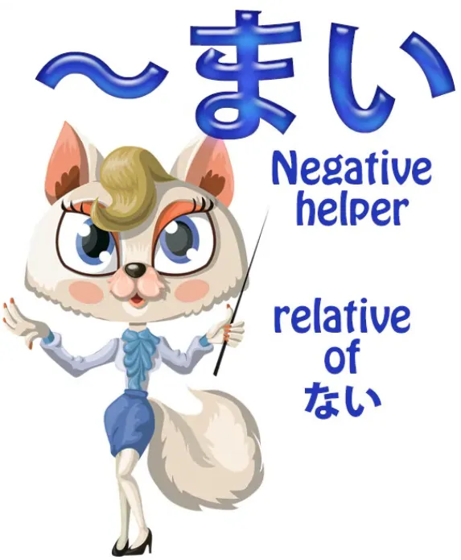
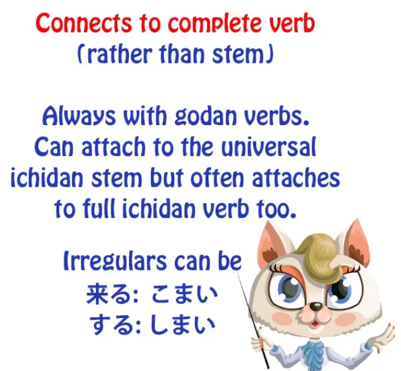
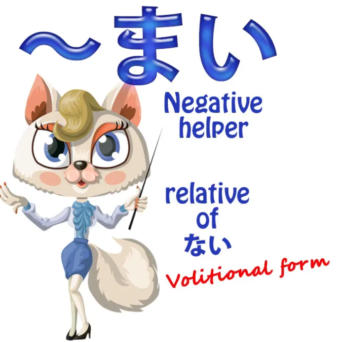
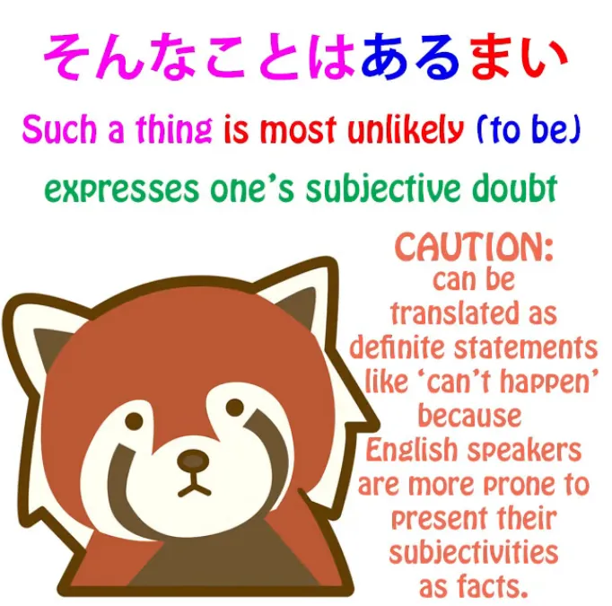
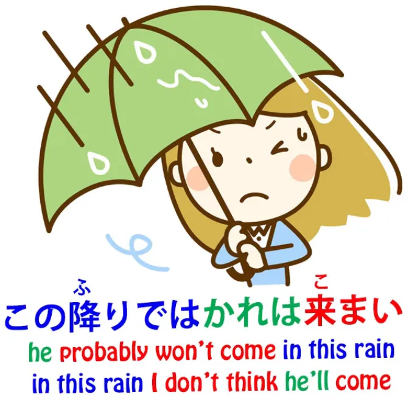
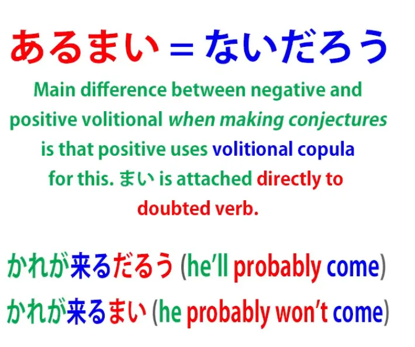
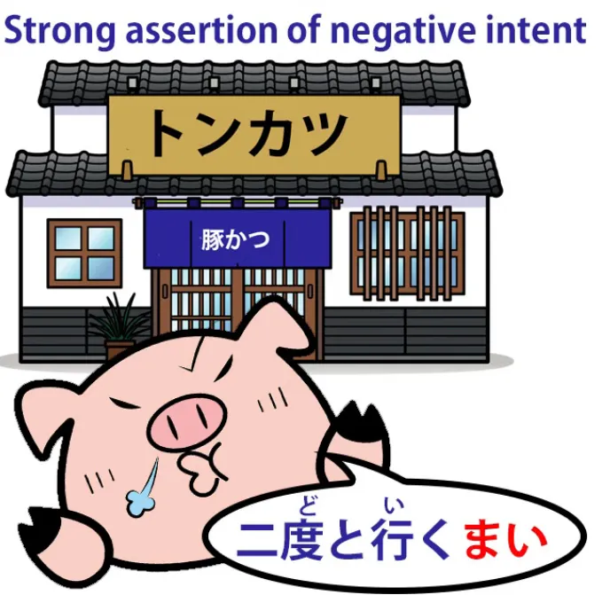
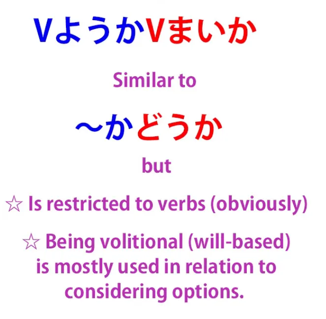
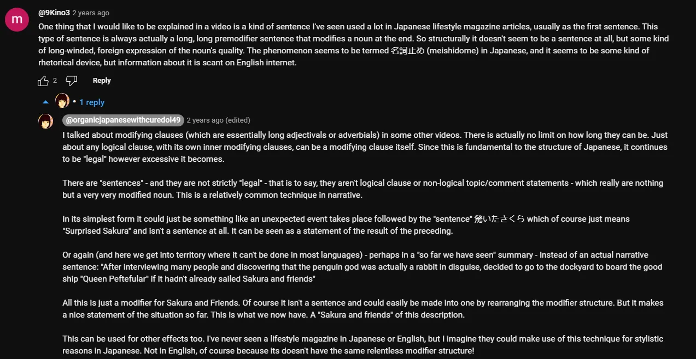

# **85. まい — отрицательный хелпер**

[**まい — отрицательный хелпер, который никогда не объясняют правильно | Урок 85**](https://www.youtube.com/watch?v=f4A9DK7Rtcw&list=PLg9uYxuZf8x_A-vcqqyOFZu06WlhnypWj&index=87&ab_channel=OrganicJapanesewithCureDolly)

こんにちは。

Сегодня мы поговорим о необычном, но не редком элементе японского языка, с которым вы непременно столкнётесь при погружении в язык. Он может сбивать с толку, потому что никто толком не объясняет, что это такое и что он делает — и, конечно, уж тем более не объясняет, почему. Несколько человек недавно спрашивали меня об этом, включая моего патрона Red Kokeshi Боба Наглера, который говорит: «Вы когда-нибудь делали видео о глаголе плюс <code>まい</code>? Я нигде не нашёл очень полезного объяснения, только списки с примерами и переводом, которые дают лишь некоторое представление».

Что ж, да, это примерно так и есть. Так что давайте сделаем это видео прямо сейчас.

## Что такое まい?

<code>まい</code> — это отрицательный хелпер, как <code>ず</code> и <code>ぬ</code>, о которых [**я недавно делала видео**](https://www.youtube.com/watch?v=E7Qop8dwP4w).

И, как и они, это своего рода реликт, один из тех элементов, который не совсем прижился в современном японском языке. Но он используется довольно часто, поэтому нам нужно его понять.

---

Первая необычная вещь в нём заключается в том, что, в отличие от большинства хелперов, **он не присоединяется к одной из основ глагола.**

**В большинстве случаев он прикрепляется прямо к концу глагола.** Так, если мы хотим присоединить его к <code>行く</code>, мы просто говорим <code>行くまい</code>.

**Это всегда так с годан-глаголами, потому что нет другого способа присоединить <code>まい</code>.**

**С итидан-глаголами мы можем присоединить его к универсальной итидан-основе** (как вы знаете, с итидан-глаголами мы всегда, что бы мы с ними ни делали, просто отбрасываем <code>-る</code> и добавляем то, что хотим). Так, например, <code>見る</code> может стать <code>[見]{み}まい</code>, **но так же часто это** <code>見るまい</code>.

**С двумя неправильными глаголами**, <code>来る</code> и <code>する</code>, **они могут быть** <code>来るまい</code> и <code>するまい</code>, **но они также могут быть** <code>こまい</code> и <code>しまい</code>.

---

Строго говоря, особенно в прошлом, использование итидан-глаголов целиком с <code>まい</code> на конце, вероятно, было неграмматичным, но сейчас это настолько широко распространено, что общепринято. Вы увидите это повсюду в телевизионных новостях или где угодно.

---

Так что же это за <code>まい</code>? Ну, **это на самом деле своего рода сестра вспомогательного прилагательного <code>ない</code>, которое является отрицающим прилагательным.** В чём разница между <code>まい</code> и <code>ない</code>, помимо способа присоединения?

Что ж, **<code>まい</code> на самом деле является волитивной формой.**

Обычно **прилагательные не имеют волитивных форм, но в данном случае мы имеем, и у неё есть определённые применения.**

---

**Как и <code>ない</code>, <code>まい</code> является прилагательным, но в отличие от <code>ない</code> и почти всех других прилагательных, оно никак не изменяется.**

**Вы не говорите <code>まくて</code> или <code>まかった</code>. Вы используете его только в его простой, неизменённой форме, <code>まい</code>,** так что это, в некотором смысле, статичный элемент в японском языке, а не активный.

**И это на самом деле вполне естественно, потому что то же самое происходит и с положительной волитивной формой, не так ли?** У нас есть て-формы и прошедшие формы хелперов, таких как рецессивный и каузативный, и, конечно, сам <code>ない</code>, но **у нас нет прошедших и て-форм и т.д. у волитивной формы.**

**<code>食べよう</code>: вы не ставите это в прошедшее время, у него нет て-формы, потому что это не имеет особого смысла с волитивной формой.**

## Что не может делать отрицательная волитивная форма

Так что же на самом деле делает отрицательная волитивная форма?

**Она не делает всего того, что делает положительная волитивная форма.**

**Вы не можете использовать её как призыв к действию:** <code>行きましょう</code> (давайте пойдём). *(этот пример — положительная волитивная форма)*

**Вы не можете сказать <code>行くまい</code> (давайте не пойдём) — это не означает этого.**

**Вы не можете использовать её для**, как я показывала в другом видео[[18]](./18-って-は-mysteries-explained-おうとする-とする-として-という-っていう.md), **формирования конструкции, которая означает «пытаться что-то сделать».**

Так что **вы не можете использовать <code>まい</code> в конструкциях типа «давайте-постараемся-не-делать».**

## Применения まい

Его применения довольно ограничены; у него есть пара прямых применений, а затем пара других применений, которые действительно очень полезны. Итак, давайте рассмотрим их.

### Использование まい для выражения маловероятности

**Его наиболее распространённое применение — это выражение маловероятности чего-либо.**

**Это волитивная отрицательная форма, поэтому точно так же, как мы можем высказывать предположения или оценки** — и **это очень часто используется с глаголом <code>ある</code>, поэтому мы говорим <code>あるまい</code>.**

<code>そんなことはあるまい</code> (это просто маловероятно / я вообще не думаю, что такое возможно).

**Но это работает точно так же с любым другим глаголом.**

<code>この降りでは彼はこまい</code> (В такой ливень, сомневаюсь, что он придёт).

И **это довольно тесно связано с другими субъективными прилагательными**, которые мы обсуждали в другом месте (и я дам ссылку на это),[[9]](./9-the-subject-of-the-japanese-sentence-expressing-desire-ほしい-たい-たがる.md) **такими как <code>欲しい</code>, которое выражает наше желание чего-либо, или <code>怖い</code>, которое выражает наш страх перед чем-либо.**

Как обычно, эти прилагательные указывают на то, что мы желаем, чего боимся и т.д. И **в данном случае они указывают на то, что мы считаем маловероятным.**

**Оно действительно представляет нашу субъективную оценку вероятности чего-либо.**

#### Точный японский эквивалент あるまい

Если мы хотим дать точный японский эквивалент, **<code>あるまい</code> напрямую эквивалентно <code>ないだろう</code> (не существует, я предполагаю) или <code>ないでしょう</code>**, а **<code>ではあるまい</code>** напрямую эквивалентно <code>ではないだろう</code>, <code>ではないでしょう</code>, <code>じゃないだろう</code>, <code>じゃないでしょう</code>, *(всем этим формам)*

другими словами, **<code>А не является В, я бы предположил, это кажется вероятным</code> и т.д.**

И **интересный момент здесь заключается в том, что**, как мы видим, **при этом предположительном использовании волитивной формы в её положительной, более обычной форме**, **мы не присоединяем волитивную форму напрямую к глаголу, о котором мы делаем предположение.**

Так что **мы не говорим <code>さくらはすぐに帰ろう</code>.**

**Это не означает <code>Сакура, вероятно, придёт</code>.**

**Мы говорим** <code>さくらはすぐに**来るでしょう** (или だろう)</code>, потому что так мы это делаем. **Мы делаем это с волитивной связкой, когда делаем такого рода предположения.**

---

**Но с <code>まい</code> мы можем присоединить его напрямую к глаголу**, как мы это сделали в предыдущем примере.

<code>そんなことは**あるまい**</code> напрямую эквивалентно <code>そんなことは**ないでしょう**</code>.

**И здесь нет места для двусмысленности, потому что <code>まい</code> имеет более ограниченный диапазон значений,** как мы только что обсуждали, **чем положительная волитивная форма**, поэтому мы не запутаемся, например, с призывом к действию, **потому что <code>まい</code> не делает призывов к бездействию.**

Итак, **наиболее распространённое использование <code>まい</code> — это отрицательное прилагательное этих предположительных конструкций с <code>でしょう / だろう</code>.**

### まい используется для выражения твёрдого решения или решимости не делать что-либо

**Однако он также используется для одной другой отрицающей структуры, которая напрямую эквивалентна положительной.**

Так мы можем сказать <code>二度と行くまい</code> (Я больше туда не пойду; буквально, я не пойду второй раз). Это другое распространённое значение.

**Когда оно не выражает вероятность или возможность, оно выражает твёрдое решение или решимость не делать что-либо.**

Теперь, помимо этих нескольких применений, есть также пара других распространённых конструкций, в которых используется <code>まい</code>, и вы почти наверняка их услышите.

### Использование положительной и отрицательной волитивной формы вместе

**Одна из них использует положительную и отрицательную волитивные формы вместе, означая «будет ли глагол выполнен или нет».**

Так, например, **<code>行こうか, 行くまいか</code>** означает **<code>пойду ли я или нет</code>.**

Теперь, **это очень похоже на конструкцию**, о которой мы говорили раньше и которую вы, вероятно, уже знаете[[39]](./39-the-か-particle-buried-questions-かな-もんか-かどうか.md), **<code>行くかどうか</code>**, что буквально означает **<code>пойду ли я или как</code>**, что в более естественном английском звучало бы как <code>whether I go or what</code>.

### Присоединение し к конструкции с まい

**Теперь, другая конструкция, которую вы часто услышите, образуется путём простого присоединения <code>し</code>, которое используется для перечисления причин чего-либо,** но, как мы обсуждали в другом месте[[63]](./63-wild-sentence-enders-in-real-life-japanese-かい-だい-ぜ-ぞ-さ-から-し-ちょうだい.md), **оно часто используется само по себе, чтобы просто подразумевать продолжение списка.**

И **это даёт конструкцию, которая несколько сопоставима с конструкцией <code>it isn't as if...</code> или <code>it isn't like...</code> в английском языке.**

Так, если мы скажем <code>金持ちでは**あるまいし**</code>, что примерно эквивалентно выражению **в английском языке** <code>it's **not as if** we're rich</code>, или <code>世界が終わるわけが**あるまいし**</code> (it's **not as if** the world is going to end).

::: info
В субтитрах видео не записано <code>が</code> после <code>わけ</code>, но Долли, кажется, произносит его, просто очень слабо, если внимательно прислушаться.
:::

**Вот как мы бы это выразили на английском.**

**На японском** это больше похоже на <code>это не **то**, что мы богаты **или что-то в этом роде**</code> **(это <code>し</code>, «что-то в этом роде»).** *(Я пытаюсь выделить части, но это ограничено, к счастью, картинка видео выше хорошо это показывает)*

**И волитивная форма снова отмечает отрицательную гипотезу.**

Кто-то может вести себя так, будто мир вот-вот рухнет, **но на самом деле это, вероятно, не так.** Мы можем казаться некоторым людям богатыми, **но, ну, мы, кажется, не такие, не так ли?**

Вот как работает хелпер <code>まい</code> в различных своих распространённых применениях…

::: info
Это может быть полезно, хотя и не относится к данной теме. Извините, если трудно читать, увеличьте здесь или [**посмотрите здесь**](https://www.youtube.com/watch?v=f4A9DK7Rtcw&lc=UgxlL8--buf4g_Gld_l4AaABAg&ab_channel=OrganicJapanesewithCureDolly)

:::