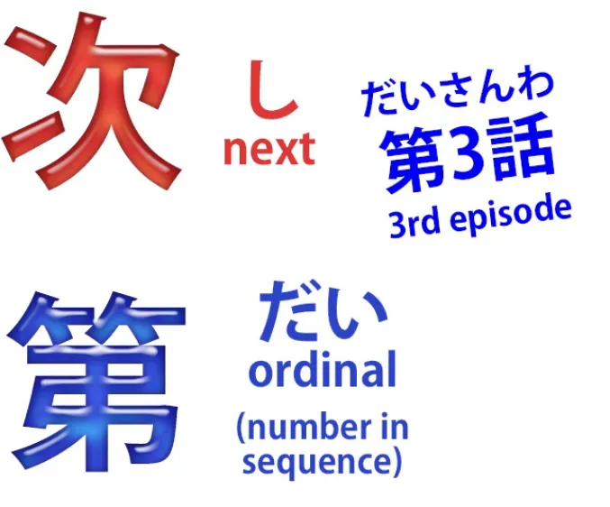
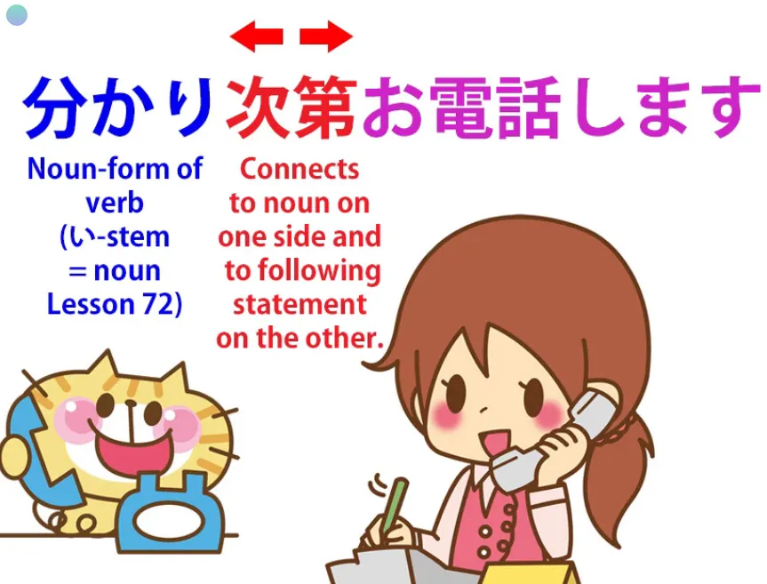
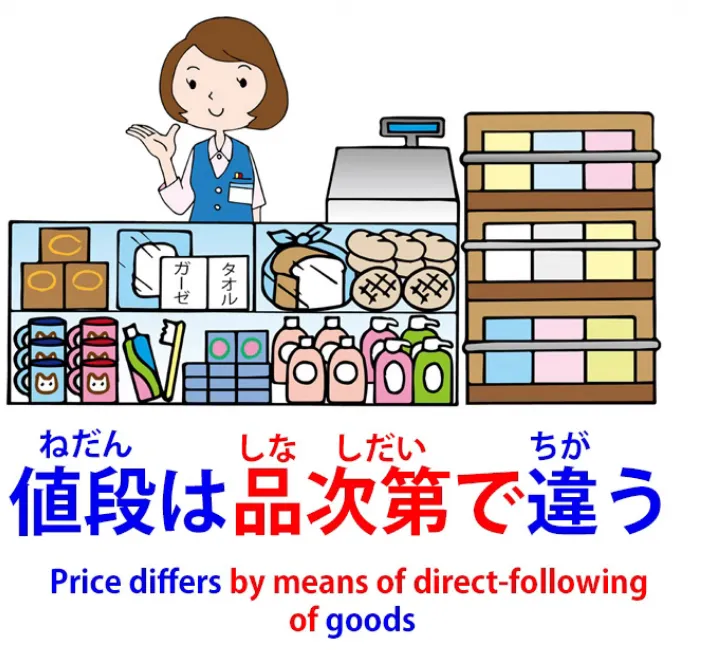
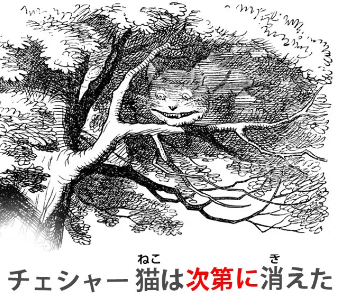
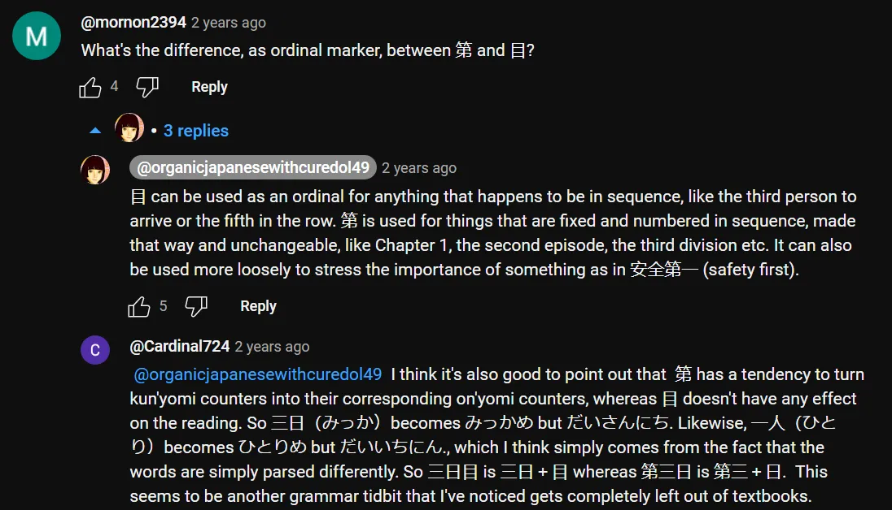

# **86. 次第 (shidai)**

[**次第 (shidai) - Что это на самом деле означает и как это на самом деле работает. Урок 86**](https://www.youtube.com/watch?v=yIv12DTlQl0&list=PLg9uYxuZf8x_A-vcqqyOFZu06WlhnypWj&index=90&ab_channel=OrganicJapanesewithCureDolly)

こんにちは。

Сегодня мы поговорим об одном из тех слов, у которого огромный список, казалось бы, несвязанных значений, если вы серьёзно относитесь к англо-японскому словарю, что делает его очень сложным. Но, как обычно в таких случаях, настоящая проблема заключается просто в попытке втиснуть квадратный колышек английского определения в круглое отверстие японского языка. Итак, если мы взглянем на это слово, мы сможем понять, что оно на самом деле означает и как оно на самом деле работает.

**Это слово — <code>次第</code>.**

**Согласно словарю**, оно может означать <code>в зависимости от</code>, <code>как только</code>, <code>немедленно после</code>, <code>в соответствии с</code>, <code>порядок</code>, <code>программа</code>, <code>приоритет</code>, <code>обстоятельства</code>, <code>ход событий</code>.

**А затем у нас есть то, что обычные учебники любят называть <code>грамматическим пунктом</code>: <code>次第に</code>, что означает <code>постепенно</code> в смысле постепенного перехода в какое-либо состояние.**

Итак, как же нам во всём этом разобраться?

## Что такое 次第？

Что ж, давайте начнём с рассмотрения <code>次第</code>. **<code>次第</code> состоит из двух кандзи и является существительным.** И вы должны знать, что как только я говорю, что оно состоит из двух кандзи и ничего больше, мы знаем, что это существительное. Это всё, чем оно может быть.

**И эти два кандзи:**

**первый, который является кандзи, используемым в <code>次</code> (следующий), и это то, что он означает, <code>следующий</code>.**

**И этот, <code>第</code>, который является японским порядковым числительным.**

Что такое порядковое числительное? **В английском языке порядковое числительное — это -st в <code>first</code>, -nd в <code>second</code>, -rd в <code>third</code>, -th в <code>fourth</code> и т.д.** **В японском, к счастью, у нас есть только одно порядковое числительное для каждого числа, и это <code>第</code>, и мы ставим его перед числом, а не после.**

Так, если мы хотим говорить о третьем эпизоде аниме, мы говорим <code>第三話</code>; так что <code>第</code> — это -rd, <code>三</code> — это три, **а <code>話</code> — это счётный суффикс для историй или эпизодов.**

Итак, у нас есть кандзи <code>[次]{つぎ}</code>, кандзи <code>следующий</code>, чьё обычное он-чтение — <code>し</code>, и у нас есть <code>[第]{だい}</code>, означающее <code>порядковый / последовательность / номер в последовательности</code>.

**Так что это означает <code>следующая вещь в последовательности / следующая вещь по порядку</code>.**

**И ещё одна вещь, которую нам нужно знать об этом слове, это то, что оно обычно работает, присоединяясь к другому существительному.**

**И это даёт нам своего рода составное слово.**

---

**Так, если мы присоединим <code>時計</code> к <code>腕</code>, <code>腕</code> сообщает нам о <code>時計</code>.**

**<code>腕時計</code> — это <code>наручные часы</code>.**

Если мы присоединим <code>[砂]{すな}</code> к <code>時計</code>, то получим <code>песочные часы</code> — <code>砂時計</code>.
**И точно так же мы образуем эти составные существительные с <code>次第</code> и тем, к чему оно присоединено.**

## 次第 как <code>как только</code> или <code>немедленно после</code>

**И простейшее использование этого — когда оно заменяет английские выражения <code>as soon as</code> или <code>immediately upon</code>.**

Итак, если мы скажем <code>分かり**次第**お電話します</code>, мы говорим: «**Как только** (это) станет известно... (**<code>分かる</code>, стать известным; буквально, делать известным, делать понятным**)... **Как только это станет понятным, я вам позвоню.**»

---

**Вы видите, что здесь у нас есть <code>い-основа</code> глагола <code>分かる</code>** (делать понятным), **которая есть <code>分かり</code>,** **и мы создаём составное существительное, которое означает «следующая вещь в последовательности после того, как станет понятно, это то, что я вам позвоню** / **Как только это станет понятным, как только мы узнаем ситуацию, я вам позвоню».**

*=分かり次第お電話します*

---

<code>食事の用意が出来次第食べる.</code>

Итак, хотя **здесь у нас на самом деле есть логическое предложение**: <code>食事の用意が出来る</code> (приготовления к еде завершены; буквально, выходят), **у нас на самом деле здесь основа <code>できる</code>, которая есть <code>[出]{で}き</code>,** **и она присоединена к <code>次第</code>.**

Итак, «**следующая вещь в последовательности после завершения приготовления — это еда** / **Как только приготовления к еде будут закончены, мы поедим**».

*=食事の用意が出来次第食べる*

## 次第 как <code>в зависимости от</code>

И из этой логики мы затем получаем то, что кажется совершенно другой идеей в английском, а именно <code>в зависимости от</code>. Так мы можем сказать: <code>それは**天気次第**だ</code>.

В английском мы бы сказали <code>that **depends on the weather**</code> (это зависит от погоды). Но в японском мы говорим: <code>это **следует непосредственно из погоды**</code>.

И, **как видите, это другой способ выражения,** **но он означает по сути то же самое.**

<code>彼の答えは**気分次第**だ.</code> Теперь это означает <code>его ответ **следует непосредственно из его настроения**</code>. Другими словами, его ответ **зависит от того, в каком он настроении**.

### Фраза 手当たり次第

И полезная фраза, которую здесь стоит знать, это <code>手当たり次第</code>. <code>手当たり</code> — это <code>手</code> (рука) и <code>当たり</code> (прикосновение или контакт).

**<code>手あたり次第</code> означает <code>что попало под руку / что подвернётся</code>.**

Итак, <code>**手あたり次第本**を読む</code> (Я читаю **любую книгу, которая попадётся под руку**). Чтение **книги следует непосредственно из прикосновения руки к книге**, буквально.

---

**<code>手当たり次第</code> может использоваться во всевозможных конструкциях:** Я ем **что попало под руку**; Я читаю **что попало под руку**; Я **бросаю что попало под руку** в соседей. И, **как видите, это существительная форма этого глагола (прикосновение) <code>当たる</code>,** **которая есть <code>当たり</code>, и она присоединяется к <code>次第</code>.**

### Присоединение 次第 к человеку

**Ещё один полезный приём — мы можем присоединить <code>次第</code> непосредственно к человеку.**

Так, если мы скажем <code>**あなた次第**です</code>, мы по сути говорим <code>это **зависит от вас** / это **следует непосредственно от вас**</code>.

**В английском это не выражалось бы как <code>depends on</code>,** **и на самом деле, если бы мы хотели сказать <code>it all depends on you</code> (всё зависит от вас) на японском,** **нам пришлось бы использовать совершенно другую конструкцию.**

---

В спектре японских значений **<code>あなた次第だ</code> означает <code>это следует непосредственно от вас</code>:** **Это зависит от вас, это не зависит ни от кого другого, это не следует от меня,** **это не следует ни от кого другого, это следует непосредственно от вас, это зависит от вас.**

---

**Важно понимать, что хотя** **спектр значений в английском и японском языках различается,** **с точки зрения японского языка мы всё время имеем дело с одной и той же фундаментальной идеей.** **Это не случайный набор идей, как это выглядит,** **когда вы видите его в англо-японском словаре.**

## 次第 как <code>в соответствии с</code>

**Отсюда мы получаем значения, такие как <code>в соответствии с</code>:**

<code>値段は**品次第**で違う</code>, что буквально означает <code>цена отличается **непосредственно в зависимости от товара**</code>.

**Теперь, если товары одинаковы, что обычно и бывает в такого рода конструкциях,** **то это будет означать качество товаров, точно так же, как** **<code>天気次第</code> означает качество погоды, тип погоды,** **а <code>気分次第</code> означает качество чьего-либо настроения, тип настроения.**

**Итак, <code>品次第</code> означает тип товаров, качество товаров.**

---

**Теперь, мы всё ещё можем использовать здесь перевод <code>depending</code> (зависит) вместо перевода <code>according to</code> (в соответствии с).** Мы могли бы сказать: <code>The price **depends on the quality** of the goods</code> (Цена **зависит от качества** товаров).

**Однако, если мы используем выражение вроде** <code>身分**次第**に暮らす</code>, мы говорим: <code>жить **в соответствии со** своим положением в жизни, **в соответствии со** своими средствами</code>.

**Мы не можем использовать <code>depend</code> здесь в английском, но, как видите,** **с точки зрения японского это та же самая идея.**

---

**<code>身分</code> не совсем переводимо, но оно означает чьё-либо положение в жизни, чей-либо статус,** **и оно может, особенно в современное время, означать, сколько у кого денег.**

## 次第 как процесс, набор обстоятельств, ход событий

**Теперь, в некоторых случаях,** и это то, где оно становится немного более расширенным, **<code>しだい</code> (следующее в последовательности) может представлять всю последовательность.** **Так что в этих случаях оно может означать такие вещи, как процесс,** **набор обстоятельств, ход событий.**

Так можно сказать: <code>それはこんな**次第**だった</code> (это была такая **ситуация**, это был такой **ход событий**).

## 次第に

Теперь у нас также есть то, что учебники назвали бы <code>грамматическим пунктом</code>, <code>次第に</code>. **Это просто стандартная практика взятия существительного (<code>次第</code> — это существительное)** **и использования его в качестве наречия для описания глагола.**

**И делать что-то <code>次第に</code>, в манере <code>次第</code>,** **означает делать это последовательными шагами или постепенно.**

Так, <code>チェシャ猫は**次第に**消えた</code> (Чеширский кот **постепенно** исчез).

Или <code>夜は**次第に**長くなる</code> (ночи становятся длиннее, **день за днём, шаг за шагом**). **И это всегда подразумевает процесс, происходящий со временем,** **либо определёнными этапами, либо нет, но происходящий со временем, понемногу.**

---

**И поскольку это представлено как <code>грамматический пункт</code>, это может быть немного запутанно.** **Что нам нужно заметить, так это то, что не каждое использование <code>次第</code>, за которым следует <code>に</code>,** **соответствует этому так называемому грамматическому пункту.**

Настоящая проблема здесь, которая обычно не объясняется, заключается в том, что
**когда <code>次第</code> не модифицируется другим существительным** **и действует само по себе как независимое наречие,** **именно тогда оно имеет это значение.**

Так, в примере, который мы видели ранее, <code>身分**次第に**暮らす</code>,

**это не пример этого. Оно используется в качестве наречия,** **но то, что модифицирует <code>暮らす</code>, — это не <code>次第</code> само по себе, а составное слово <code>身分次第</code>.**

---

**Итак, это основные применения <code>次第</code>.** Они кажутся очень разными, если смотреть на них через английские очки, **но если посмотреть на них такими, какие они есть, я думаю, мы увидим, что** **<code>次第</code> работает практически одинаково всё время.**

::: info

:::