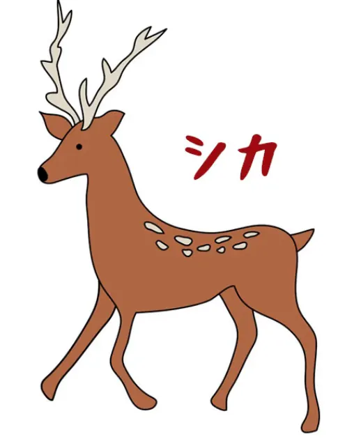
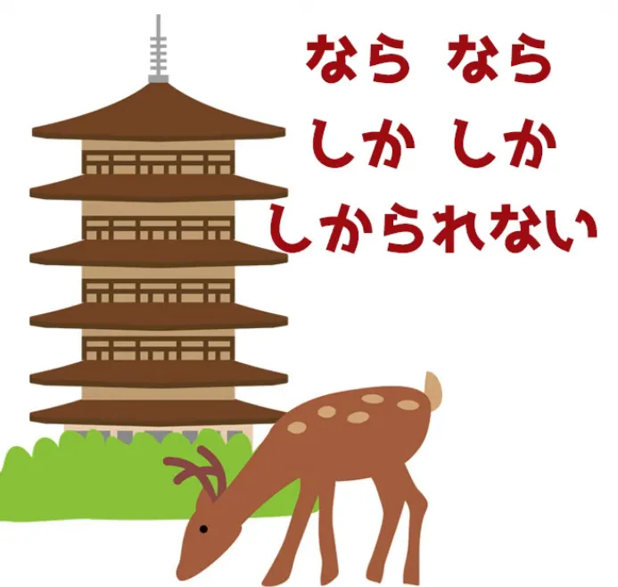
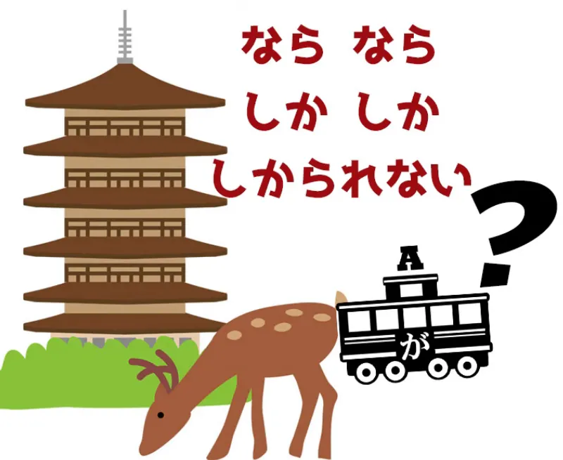
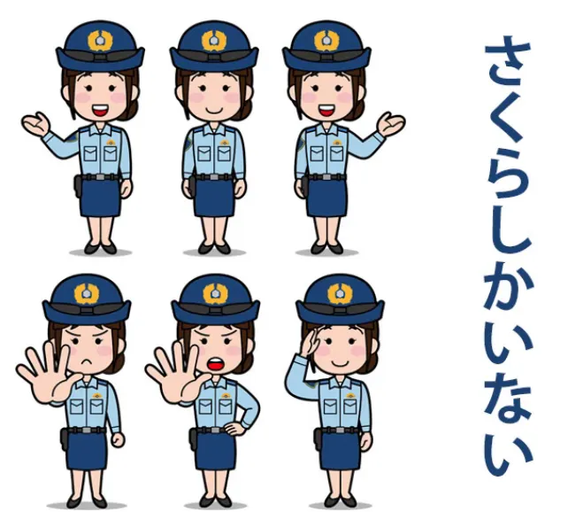
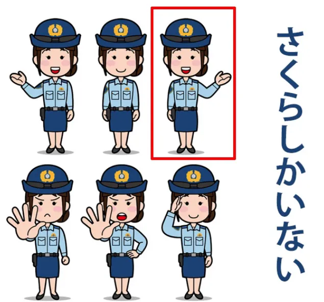
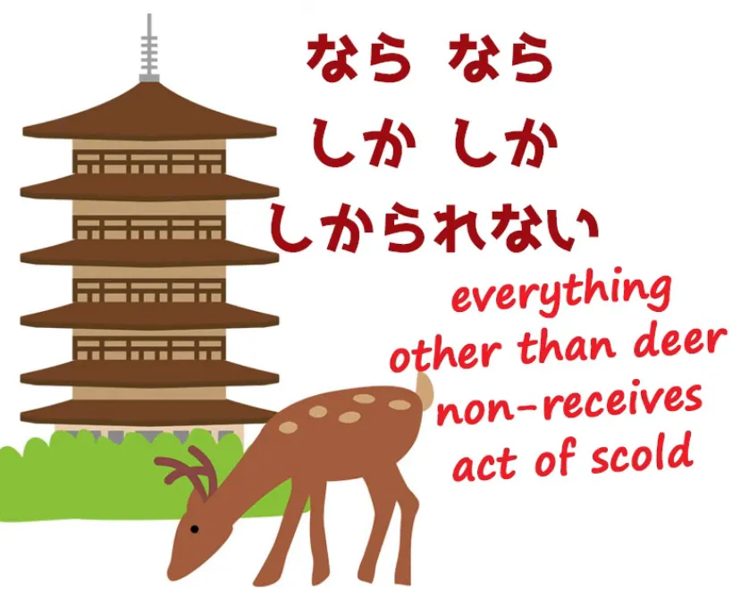
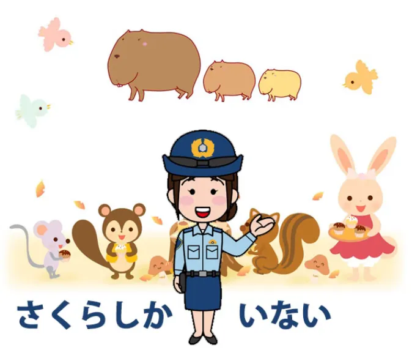
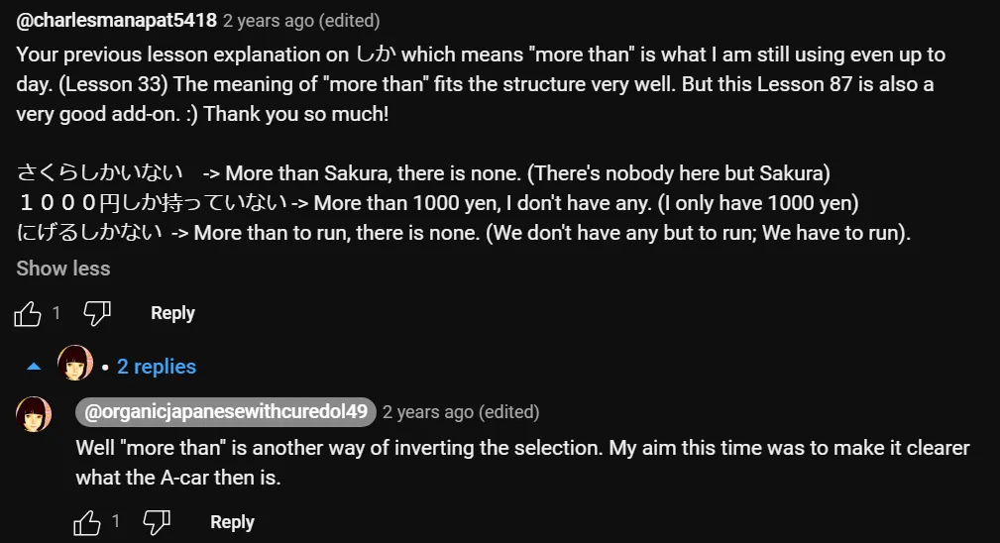
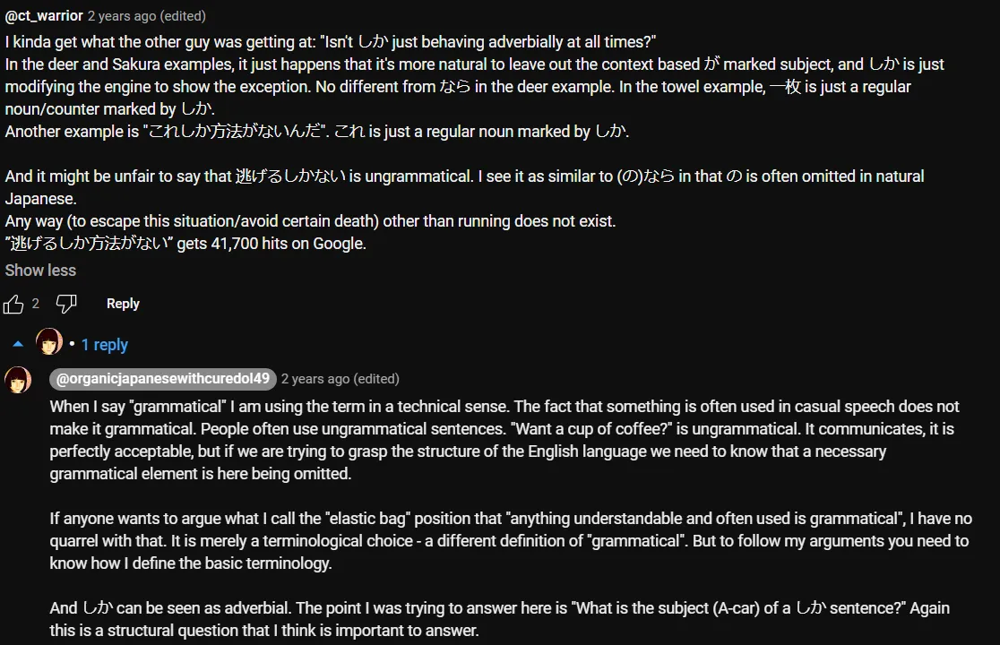

# **87. Японская структура НАИЗНАНКУ: странная жизнь しか**

[**Японская структура НАИЗНАНКУ: странная жизнь しか. Как это на самом деле работает. Урок 87**](https://www.youtube.com/watch?v=iEnUH0L6VYs&list=PLg9uYxuZf8x_A-vcqqyOFZu06WlhnypWj&index=91&ab_channel=OrganicJapanesewithCureDolly)

こんにちは。

Сегодня, боюсь, у меня для вас нет оленей Санты, но есть несколько обычных оленей. Мы поговорим о слове <code>[鹿]{シカ}</code>, которое, как вы, вероятно, знаете, означает <code>олень</code>.
::: info
На всякий случай: это <code>しか</code> отличается от частицы <code>しか</code> из этого урока, отсюда и катакана. Существует множество различных существительных <code>しか</code> и прочего со своими кандзи, но только одна частица <code>しか</code>.
:::

**Но в японском языке есть ещё один элемент <code>しか</code>, который является частицей** **и который оказывает довольно необычное влияние на структуру предложений.**

Итак, мы рассмотрим это влияние. Один из моих комментаторов напомнил мне довольно очаровательную японскую игру слов:

<code>ならならしかしかしかられない</code>, / *奈良なら鹿しか叱られない (как это может выглядеть в форме кандзи)*

и на естественном русском мы бы перевели это как **<code>В Наре ругают только оленей</code>.**

Здесь полезно знать, что **Нара в регионе Кансай славится своими оленями.** Люди ездят в Нару, чтобы посмотреть на оленей (и ради других вещей — это прекрасный исторический город).

**Строго говоря, <code>奈良なら</code> не означает <code>в Наре</code>.** **Это означает <code>если это Нара</code> или, более естественно, <code>в случае с Нарой</code>.** Но что означает остальная часть структуры?

Именно об этом и спрашивал мой комментатор. **Вопрос был: «Что является А-вагоном этого предложения?** **Есть ли у него где-то zero-А-вагон, или у него вообще нет А-вагона?»**

Что является А-вагоном такого предложения? **Проблема отчасти в том, что <code>しか</code> оказывает** **необычное влияние на структуру предложения,** **но также и в том, что здесь используется рецептивный вспомогательный глагол,** что делает его немного сложнее, чем есть на самом деле.

## Частица <code>しか</code>

Итак, давайте начнём с очень простого предложения с <code>しか</code>. <code>さくら**しか**いない。</code>

На естественном русском мы бы перевели это как: <code>Здесь никого нет, кроме Сакуры.</code>

**Так что же делает <code>しか</code> здесь?** **<code>しか</code> делает две вещи в таком предложении.** **Она выбивает частицу <code>が</code>, точно так же, как <code>か</code>,** так что это не то, с чем мы ещё не знакомы.

**Когда у вас есть <code>か</code> в предложении, где также была бы <code>が</code>,** **мы никогда не говорим <code>がか</code> или <code>かが</code>.** **<code>か</code> вытесняет <code>が</code>, но <code>が</code> всё ещё логически присутствует.** **Именно это делает и <code>しか</code>.**

---

**Но другая вещь, которую делает <code>しか</code>, немного более необычна.**

Не знаю, пользовались ли вы когда-нибудь Photoshop, но в Photoshop можно инвертировать выделение. **Что происходит: вы выделяете объект,**

**вы нажимаете клавишу выделения, чтобы инвертировать это выделение,** **и тогда выделяется всё, что находится за пределами этого объекта.**

**Объект — это единственное, что теперь не выделено.**

---

**Именно это и делает <code>しか</code>.** **В то время как <code>が</code>, можно сказать, выделяет объект, существительное,** **и помечает его как А-вагон, подлежащее предложения,** **<code>しか</code> выделяет это существительное, инвертирует выделение** **и помечает *это* как А-вагон предложения.**

**Таким образом, всё, кроме этого выделенного существительного,** **теперь является А-вагоном предложения.**

Итак, <code>さくら**しか**いない</code> буквально означает <code>**Все, кроме** Сакуры, здесь нет</code>.

В предложении про оленей, которое выглядит немного сложнее, всё то же самое: <code>奈良なら鹿**しか**叱られない</code> (если это Нара, **все, кроме** оленей, не ругаются).

**Итак, снова мы выделяем оленей,** **инвертируем выделение на всё, кроме оленей,** **и затем это становится А-вагоном предложения, которое является <code>не ругаются</code>.**

---

Теперь, **здесь также есть неявное условие релевантности**, поэтому, когда мы говорим <code>さくらしかいない</code>, **мы не имеем в виду, что здесь нет ничего, кроме Сакуры:** ни деревьев, ни кустов, ни летающих тарелок.

**Мы имеем в виду, что здесь никого нет, кроме Сакуры.**

**Теперь, <code>いない</code> отчасти говорит нам об этом**, но дело не только в этом, потому что **это также **не означает**, что здесь нет кроликов**, **нет птиц, нет капибар** (правильно ли я это произнесла?)

::: info
Это должно просто выбирать релевантность того, что **никакой другой Сакуры / никаких других людей** там нет. 
:::

**Итак, <code>しか</code> инвертирует выделение, но это также** **то, что можно назвать <code>умной инверсией</code>: она выделяет по релевантности.**

## <code>しか</code> в предложениях с подлежащим, отмеченным <code>が</code>

**Однако, в некоторых предложениях с <code>しか</code> на самом деле есть** **подлежащее, отмеченное <code>が</code>, так что же здесь происходит?**

Давайте рассмотрим одно из них. Предположим, мы говорим: <code>タオル**が**一枚**しか**ありません</code>.

Опять же, на естественном русском: <code>Здесь **только** одно полотенце.</code>
::: info
Обратите внимание, как в японском здесь используется <code>ありません</code> после <code>しか</code>.
:::
**Подлежащее, отмеченное <code>が</code>, — это <code>полотенце</code> или <code>полотенца</code>.** **В японском, конечно, нет различия между этими двумя вещами.**

И, как я объясняла в своём уроке о счётных суффиксах[[71]](./71-japanese-counters-3-simple-rules.md), **счётный суффикс в такого рода предложении работает как наречие.** **Он сообщает нам больше о локомотиве предложения, глаголе.**

Итак, если мы говорим <code>泥棒が**三人**いる</code>, мы говорим <code>грабители*(=подлежащее)* существуют **трёх-человечно**</code>. Если мы говорим <code>タオルが**一枚**ある</code>, мы говорим <code>полотенце*(=подлежащее)* **одно-плоско-предметно** существует</code>.

Если мы говорим <code>タオルが**二枚**ある</code>, мы говорим <code>полотенце*(=подлежащее)* **двух-плоско-предметно** существует</code>.

Итак, когда мы говорим <code>タオルが**一枚**しかありません</code>, **подлежащее — это <code>полотенца</code>**, **затем у нас есть счётный суффикс <code>一枚</code>, и он отмечен <code>しか</code>.** **Таким образом, мы выделяем один плоский предмет, одно полотенце,** **а затем инвертируем выделение на все полотенца.**

---

**Не все плоские предметы, потому что мы уже отметили подлежащее как <code>полотенце</code>.** **Таким образом, мы инвертируем счётный суффикс, который работает наречно,** **от одного полотенца до каждого полотенца, кроме этого одного полотенца.**

Итак, мы говорим: <code>полотенца, **всё, кроме одного**, не существуют</code>. На естественном русском: <code>Здесь **только одно** полотенце</code>.

*<code>タオルが**一枚しか**ありません</code>*

И вот так работает то, что мы могли бы назвать структурой обратного выделения предложения с <code>しか</code>.

## <code>しかない</code> (Разговорное)

**И в конце я должна добавить, что** **существует более разговорное использование <code>しか</code>.** **И это когда мы говорим <code>しかない</code>.**

В обычном предложении с <code>しか</code> мы, очевидно, просто говорим <code>この古い車**しかない**</code>, что на естественном русском означает <code>Есть только эта старая машина.</code>

**Мы выделяем машину, инвертируем выделение:** <code>**все машины, кроме** этой старой машины, **не существуют**</code>.

---

**Но мы также можем поставить <code>しかない</code> в конце логического придаточного предложения** **или глагола, заменяющего логическое придаточное предложение.** **Строго говоря, это не грамматично, но в разговорной речи это часто встречается.**

Так что, если вы слышите в аниме, как кто-то говорит <code>逃げる**しかない!**</code>, они говорят <code>(нам) **нужно** бежать!</code> на естественном русском. Буквально они говорят: **мы берём это <code>逃げる</code>,** **мы отмечаем его частицей <code>しか</code>, так что то, что мы выделяем,** **это не <code>逃げる</code> (бежать), а всё остальное, кроме бега.**

И снова, **здесь вступает в игру умное выделение по релевантности.** То, что мы на самом деле говорим, это <code>**любой другой образ действий, кроме** бегства, **не существует**</code>.

Ну, конечно, он существует, **это очень разговорная форма**, но, насколько нам известно, он не существует: **ничего не остаётся, кроме как бежать**.

---

**В английском** мы могли бы сказать <code>**It's run or nothing**</code> (Либо бежать, либо ничего), и опять же, **это неграмматично, и по той же причине,** **по которой японский вариант неграмматичен: <code>run</code> здесь не существительное.**

**Но, когда за вами что-то гонится, кого волнует грамматика?.**

::: info
Несколько полезных комментариев, я полагаю, под видео…

*Одно замечание о <code>くせに</code> (<code>癖に</code>?), для полного урока она сделала [**это видео**](https://www.youtube.com/watch?v=QvuNXIYqFNM&pp=ugMICgJqYRABGAHKBRRjdXJlIGRvbGx5IOOBj-OBm-OBqw%3D%3D)* */ Урок 93*
:::