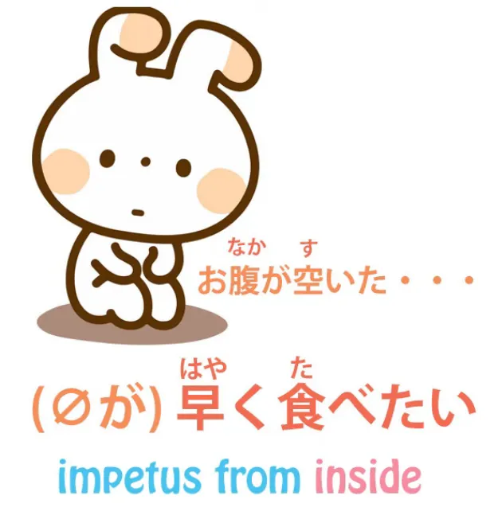
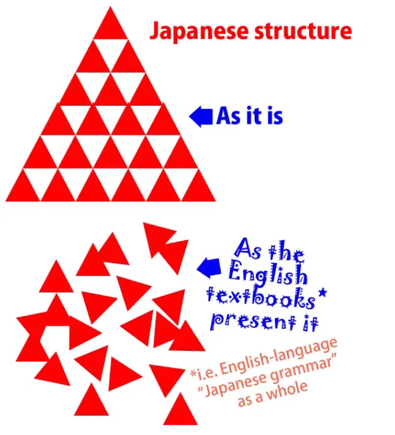
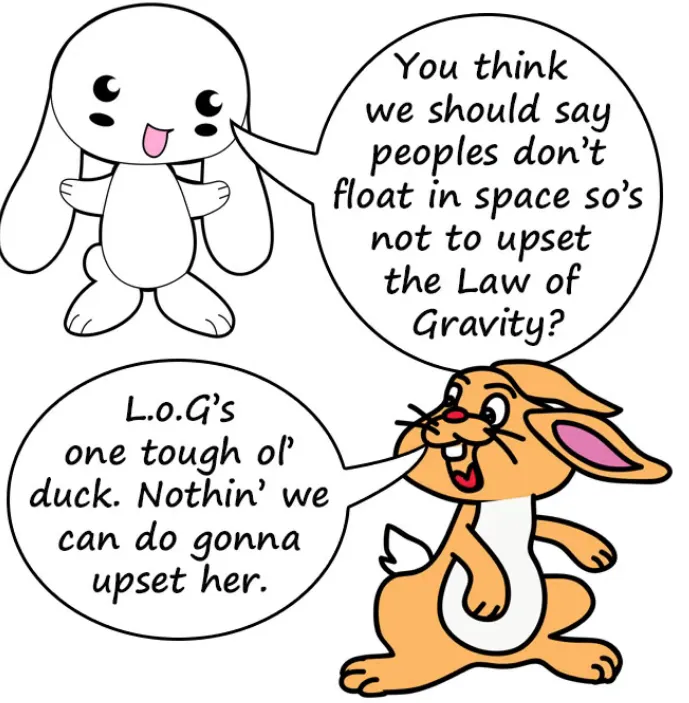
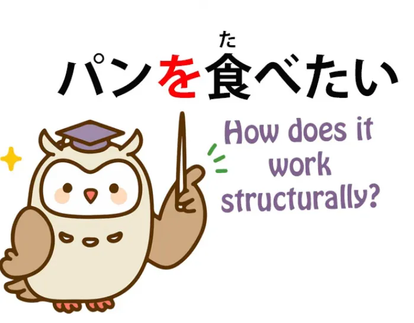
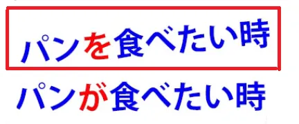
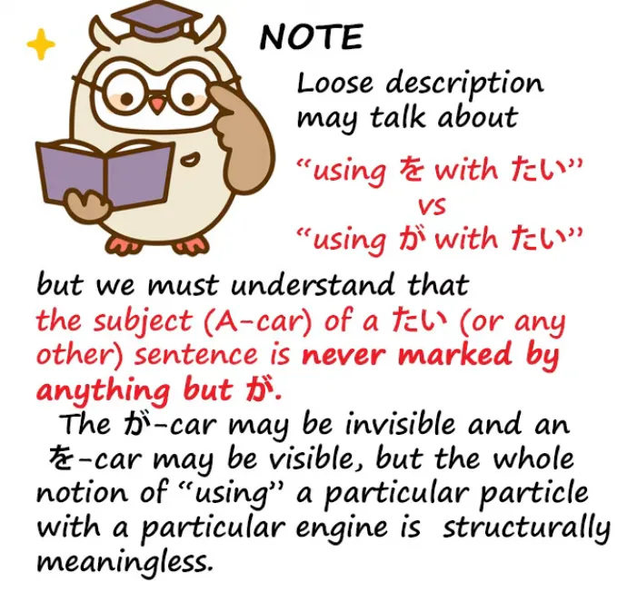
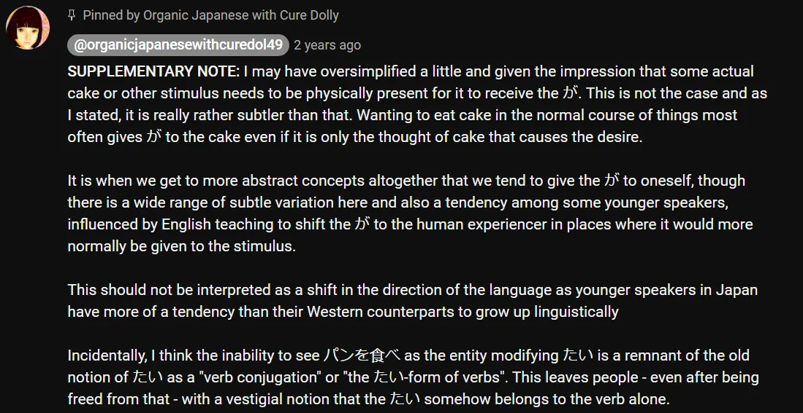

# **88. Xをしたい vs Xがしたい**

[**Неразрушимое ядро японского языка. Как логика никогда не подводит. Xをしたい vs Xがしたい | Урок 88**](https://www.youtube.com/watch?v=Gi3BmIRZZPs&list=PLg9uYxuZf8x_A-vcqqyOFZu06WlhnypWj&ab_channel=OrganicJapanesewithCureDolly)

こんにちは。

Сегодня мы поговорим об основной фундаментальной структуре японского языка и о проблеме, которая беспокоит некоторых людей, и которую я пыталась развеять[[43]](./43-paradigm-shift-cut-through-the-confusion.md), но, думаю, всё ещё есть некоторые трудности, поэтому я постараюсь разобраться с этим вопросом, надеюсь, в последний раз, сегодня. И при этом мы рассмотрим головоломку, которую ставит название очень популярного произведения.

Это была манга, аниме, фильм с живыми актёрами: <code>**君の膵臓を**食べたい</code>, что буквально означает <code>Я хочу съесть **твою поджелудочную железу**</code>, и мы поговорим о том, почему это буквально означает именно это, через минуту. Я на самом деле не знала, что такое поджелудочная железа. Я думала, это железнодорожная станция в Лондоне. Но, видимо, это компонент, который находится внутри человеческого тела, и без него дела идут не очень хорошо. Я не очень хорошо понимаю, что вы найдёте, если снимете переднюю и заднюю панели человеческого тела, так что мы каждый день узнаём что-то новое! Вот почему это классифицируется как образовательный канал, я полагаю.

Итак, вопрос, который возникнет в уме любого, кто хоть немного понимает реальную структуру японского языка, при виде этого названия:

## Почему здесь используется частица を вместо частицы が?

**Почему здесь используется частица <code>を</code>, а не частица <code>が</code>?**

Если мы хотим сказать то, что в английском было бы  
<code>I want to eat that **bread**</code> (Я хочу съесть этот **хлеб**) или <code>I want to eat that **cake**</code> (Я хочу съесть этот **торт**), мы бы сказали  
<code>パン**が**食べたい</code>, <code>ケーキ**が**食べたい</code>.

И, как мы видим, **прилагательное <code>たい</code>**,  
**прилагательное желания <code>たい</code>, указывает не на меня, а на торт.**

**Торт несёт частицу <code>が</code>, так что именно это прилагательное и описывает.**

---

И путаница возникает[[9]](./9-the-subject-of-the-japanese-sentence-expressing-desire-ほしい-たい-たがる.md), когда мы на самом деле переводим это как буквально означающее **<code>Я хочу есть торт</code>, потому что это не то, что оно означает.**

**Это означает** <code>торт вызывает желание (у меня)</code>. *(私は) ケーキが食べたい。*

---

**Но мы также знаем, что это прилагательное субъективности, как и другие прилагательные субъективности,**

**такие как <code>怖い</code> (пугающий), а также потенциалы, такие как <code>できる</code> или <code>食べられる</code> —**

**потому что потенциал — это тоже своего рода субъективность.**

---

**Это нечто, свойственное индивидууму, могут ли они или не могут сделать что-то конкретное.**

**Это не присуще самой вещи.**

**Это было бы <code>可能性</code>.**

---

**Мы знаем, что все они обычно указывают на то, что возможно, на то, что**

**вызывает желание есть, на то, что страшно, и так далее.**

**Но также полярность может быть перевёрнута.**

**И она переворачивается особенно тогда, когда нет фактической, видимой или**

**осязаемой причины субъективности.**

## Переворот полярности

Итак, если мы говорим: <code>お腹が空いた、 *(zeroが)* 早く食べたい</code>, — *кажется, здесь два предложения, я полагаю?*

мы говорим: <code>Живот пуст, я хочу есть скорее</code>.

**Теперь этот <code>たい</code> указывает на меня, а не на какой-либо конкретный предмет, вроде торта или чего-то ещё.**

Теперь, это тот момент, которому некоторые люди на самом деле сопротивлялись и говорили:  
«Ну, разве мы не можем сказать, что это на самом деле не означает «Я хочу есть»,  
это означает «еда в целом заставляет меня хотеть есть»?»

**Ну, на самом деле нет.**

**Это ваш пустой живот заставляет вас хотеть есть.**

И мы рассмотрим сегодня некоторые конструкции, и та, о которой мы только что говорили,  
является одной из них, которые на 100% ясно показывают, что **не только в случаях, когда нет**  
**причины субъективности, но в некоторых случаях, когда она есть, прилагательное субъективности всё ещё может переворачивать свою полярность.**

Теперь, почему люди сопротивляются этой идее?

**На самом деле, это не является чем-то неизвестным даже в английском языке.**

Мы можем сказать: <code>*We* were **happy** that day</code> (Мы были **счастливы** в тот день), в этом случае **прилагательное <code>happy</code> указывает на нас**  
(мы те, кто был счастлив), или мы можем сказать:

<code>That was a **happy** *day*</code> (Это был **счастливый** *день*), и теперь **прилагательное субъективности указывает на день, который является причиной нашего счастья.**

Мы можем сказать: <code>*I* am **suspicious** of her behavior</code> (Я **подозреваю** её поведение), и **прилагательное <code>suspicious</code> указывает на меня**  
(я тот, кто подозревает),

или <code>*her behavior* is **suspicious**</code> (её поведение **подозрительно**), и теперь **прилагательное <code>suspicious</code> указывает на её поведение как на причину моей субъективности.**

Так что это не то, чего не происходит даже в английском языке.

Причина, по которой, я думаю, люди так взволнованы этим и так решительно ищут  
довольно маловероятные способы выкрутиться из этого, совершенно понятна.

Это потому, что они, возможно, провели месяцы или даже годы в этом ужасно запутанном мире,  
где частицы просто меняют своё значение в зависимости от того, с какой ноги они встали этим утром.

::: info
(Долли здесь 👇 приводит пример запутанной попытки навязать английский язык японскому)  
:::

Итак, «<code>が</code> обычно отмечает подлежащее предложения, но оно также может отмечать и дополнение предложения,  
как в случае с <code>パンが食べたい</code>, где очевидно, что хлеб не является подлежащим предложения;  
это я, «Я хочу есть хлеб».»

**Ну, мы знаем, что это не так.**

**Мы знаем, что в этих случаях подлежащим является хлеб; это хлеб заставляет меня хотеть есть.**

---

И если мы начнём говорить:  
«То, что полярность может переворачиваться, разве это не разрушает модель японской структуры,  
которая избавляет от всех этих двусмысленностей, или не вводит ли это новые двусмысленности,

так что, о, есть особые правила, что иногда оно указывает так, а иногда эдак», ну, ответ на это — нет, это не имеет значения для модели.

**Это совершенно не имеет отношения к модели.**

**Неважно, выберем ли мы сказать** <code>パン**が**食べたい</code> (хлеб заставляет меня хотеть есть) или

<code>パン**を**食べたい</code> (я хочу есть хлеб).

**Единственное, что имеет значение для модели, это то, что частицы всегда делают одно и то же.**

Если мы говорим <code>**パンが**食べたい</code>, мы говорим: <code>**Хлеб** ***(=Подлежащее)*** заставляет меня хотеть есть</code>.

*против*

Если мы говорим <code> *(zeroが)* **パンを**食べたい</code>, мы говорим, что <code>(я) хочу есть **хлеб**</code> *(=Прямое дополнение).*

::: info
Здесь <code>zeroが</code> — это подразумеваемое/скрытое подлежащее «я», а <code>パンを</code> — это прямое дополнение = хлеб.
:::

**И модели всё равно, как мы это скажем.**

**Модель делает одно и то же в любом случае.**

**Все частицы делают абсолютно одно и то же.**

## Как обосновать модель грамматически?

Теперь, можем ли мы обосновать это грамматически?

Итак, если мы говорим, например, <code>パン**を**食べたい</code>, конечно, проблема здесь в том, что  
**с <code>たい</code> у нас прилагательное, то есть у нас прилагательное предложение,  
а прилагательное, как мы знаем, не может иметь прямого дополнения.**

Так как же мы можем сказать <code>パンを食べたい</code>?

И ответ на это очень прост.

**Японский язык, как мы знаем, очень искусен в склеивании глагольных элементов, чтобы превращать их в один элемент, или в их разделении по желанию.**

**И то, что происходит в предложении вроде <code>パンを食べたい</code>, это то, что  
<code>たい</code> больше не присоединяется просто к глаголу <code>食べる</code>.**

---

**Мы не говорим <code>パンを</code>, а затем <code>食べたい</code>,**

**мы говорим <code>パンを食べ...</code> и <code>たい</code> присоединяется ко всей этой единице.**

**То, что мы хотим, это действие <code>パンを食べる</code>, поэтому мы можем присоединить <code>たい</code> ко всей этой единице.**

**Вот что объясняет эти конструкции.**

---

И хотя <code>パン**を**食べたい</code> **является менее распространённым способом выражения**, и в целом

<code>何々**を**食べたい</code> является менее распространённым способом выражения,  
**есть некоторые виды предложений, в которых мы всегда используем именно его.**

Например, <code>助けたい</code> (хочу помочь) или <code>守りたい</code> (хочу защитить).

**Мы не говорим** <code>さくら**が**守りたい</code>,

**мы говорим** <code>さくら**を**守りたい</code>.

**И если мы говорим о <code>正義</code> (справедливость) или <code>平和</code> (мир) или даже <code>国</code> (страна), то же самое.**

**Мы не говорим, что Сакура заставляет меня хотеть её защищать, мы не говорим, что страна заставляет меня  
хотеть её защищать, мы не говорим, что справедливость заставляет меня хотеть её защищать, или мир заставляет меня хотеть его защищать.**

Мы всегда говорим: <code>Я хочу защитить **Сакуру**</code>, <code>Я хочу защитить **справедливость**</code>,  
<code>Я хочу защитить **мир**</code>, <code>Я хочу защитить **страну**</code>.  
*(все как прямые дополнения вместо подлежащих, как показано выше, поскольку они используются с частицей <code>を</code>)*

Почему так?

Ну, по сути, **я думаю, причина в том, что мы не говорим об импульсивном желании.**

**Если мы смотрим на хлеб и хотим его съесть**, <code>Ах, パン**が**食べたい</code>

(**хлеб заставляет меня хотеть его съесть**).

---

**Но здесь мы говорим о более абстрактных вещах, о вещах, которые менее импульсивны.**

**А в случае с людьми более уважительно сказать**

<code>さくら**を**守りたい</code>, чем <code>さくら**が**守りたい</code>,

**потому что мы не говорим, что Сакура — это объект** *(подразумеваемо, грамматически она им является :D)*

**который заставляет меня хотеть её защищать, как кусок хлеба, который мы могли бы захотеть съесть,**

**мы говорим, что действие по её защите — это то, что я хочу сделать,**

**что более достойно в случае с человеком.**

---

**Но в случае, скажем, со страной, или миром, или справедливостью, или даже домом или парком,**

**мы говорим о чём-то менее импульсивном и более о нашем собственном решении,**

**если не о сознательном решении, то об образе мышления, который является нашим.**

**Поэтому мы говорим об этом действии как о нашем собственном, а не как о чём-то, вызванном внешней причиной.**

---

Если мы всё же говорим <code>パン**を**食べたい</code>,

**это, вероятно, происходит в условиях, когда мы говорим немного более обобщённо,**

**мы не говорим о том конкретном прекрасном запахе хлеба, из-за которого**

**хлеб заставляет нас хотеть его съесть.**

**Мы не говорим о какой-то конфете, которую мы только что увидели и которая заставляет нас хотеть её съесть.**

**Мы говорим об общем желании есть хлеб.**

---

Так что **мы с большей вероятностью скажем** <code>**パンを**食べたい時</code> (когда я хочу есть **хлеб***=Прямое дополнение*)
::: info
В предложении выше «я» должно быть подлежащим, которое в японском языке скрыто как <code>zeroが</code>.
:::
**чем** <code>**パンが**食べたい時</code> (когда **хлеб***=Подлежащее* заставляет меня хотеть его съесть).

**И это не твёрдое и определённое правило, но это своего рода тенденция, своего рода причина, нюанс, который решает, каким образом мы, вероятно, перевернём это прилагательное желания, в данном случае, <code>たい</code>.**

## Так почему же を используется в 君の膵臓を食べたい?

Итак, если мы вернёмся к <code>君の膵臓**を**食べたい</code>, **почему здесь используется <code>を</code>?**

Ну, по сути, **потому что опять же это не импульс к еде.**

**Мы не смотрим на поджелудочную железу девушки и не думаем, какая она вкусная.**

Это было бы довольно трудно сделать в любом случае.

**Здесь говорится о чём-то более тонком, более абстрактном, более глубоком, о желании по какой-то эмоциональной и довольно сложной причине съесть чью-то поджелудочную железу.**

Так что, надеюсь, на этот раз мы действительно положили конец последнему вопросу о переключении полярности (из Урока 43).

**Это не угрожает модели. И это действительно происходит.**

**И это происходит по причинам, которые немного тонки, которые, вероятно, потребуют времени для усвоения**

**и погружения для усвоения, потому что вы не можете выучить всё через голую структуру.**

::: info

Прочитайте [**ЭТО ДЕРЕВО КОММЕНТАРИЕВ**](https://www.youtube.com/watch?v=Gi3BmIRZZPs&lc=UgyOhoQLaj1rzfKcTWV4AaABAg&ab_channel=OrganicJapanesewithCureDolly), где Долли даёт полезную информацию об использовании <code>が</code>.  
Оно также немного затрагивает случаи, когда в одном предложении есть две видимые логические частицы, такие как <code>が</code> или <code>を</code>, поскольку это иногда может происходить, например, со сложным прилагательным, таким как <code>頭がいい</code>.
*Также, [**этот**](https://www.youtube.com/watch?v=Gi3BmIRZZPs&lc=UgziEAPSnr0SnhrQT8Z4AaABAg.9I_i6CnMTAb9I_ko3FwzJU&ab_channel=OrganicJapanesewithCureDolly) может быть полезен, если использование <code>たい</code> с <code>を</code> немного сбивает с толку, [**то же самое для <code>ない</code>**](https://www.youtube.com/watch?v=Gi3BmIRZZPs&lc=UgzdlJPBSPKfEnC5CTt4AaABAg.9KGUKbPabp79KHKmr1rRl_&ab_channel=OrganicJapanesewithCureDolly).*

*Надеюсь, это можно достаточно хорошо прочитать/понять и это не слишком раздуто, но здесь было упомянуто так много важного, что у меня действительно не было другого выбора, до такой степени, что мне даже пришлось иногда прибегать к выделению жирным шрифтом, чтобы сделать это яснее. Определённо рекомендую прочитать комментарии.*
:::