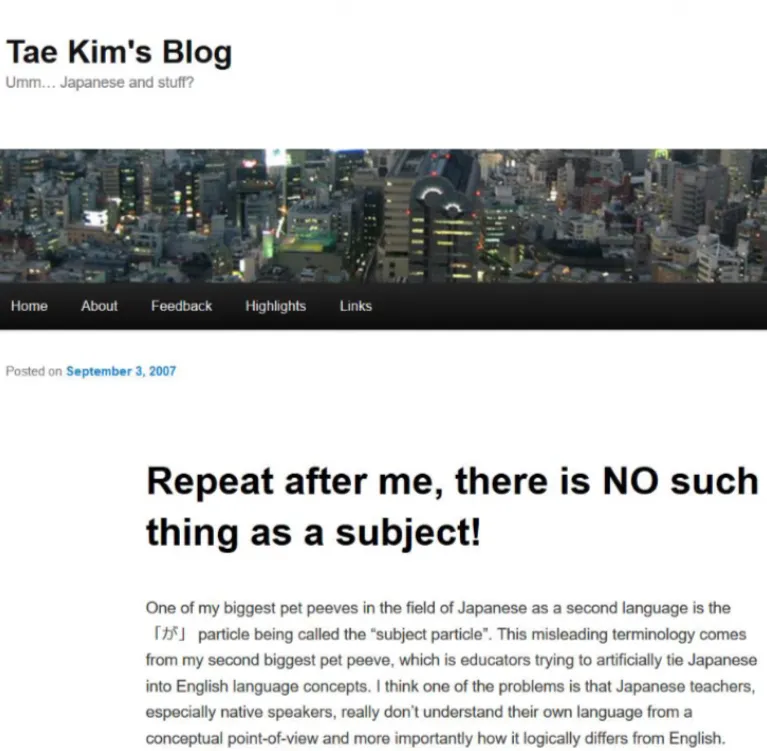
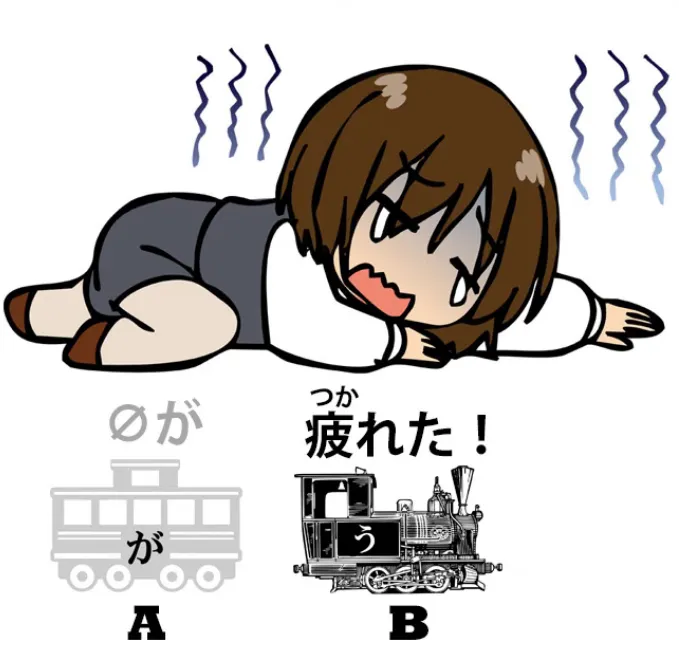
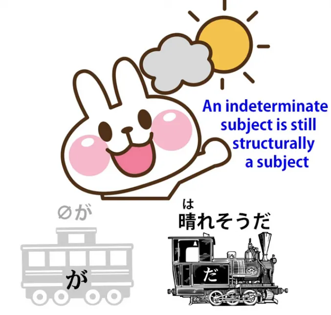
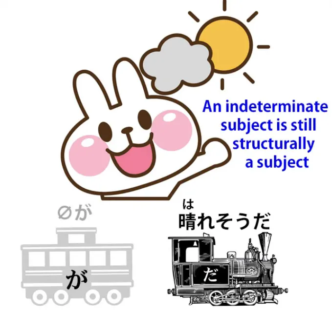
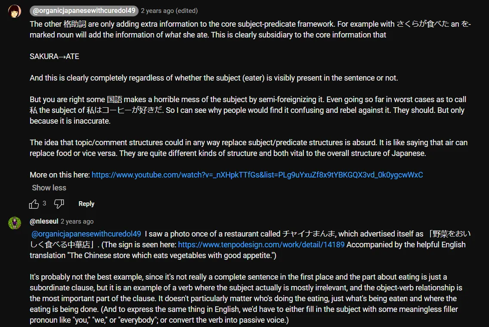

# **89. Развенчивая мифы о японском языке. Универсальное подлежащее**

[**Развенчивая мифы о японском языке. Пусть сияет самый логичный язык в мире! Универсальное подлежащее. Урок 89**](https://www.youtube.com/watch?v=CEgGnitwXGA&list=PLg9uYxuZf8x_A-vcqqyOFZu06WlhnypWj&ab_channel=OrganicJapanesewithCureDolly)

こんにちは。

Сегодня мы поговорим о том, что является самой основой японского языка и о чём мы говорили с самого первого урока. **И это — грамматическое подлежащее, то, что мы называем, на языке поезда, <code>А-вагоном</code>.**

И, как мы знаем, каждое японское предложение должно иметь **<code>А-вагон</code>, подлежащее, <code>主語</code> на японском**, и **<code>Б-локомотив</code> — это сказуемое, или <code>述語</code> на японском.**

**Иными словами, каждое предложение что-то говорит о чём-то.**

Некоторые люди утверждают, что в японском языке нет подлежащего; так делают некоторые учителя, включая Тэ Ким-сэнсэя, и

::: info
Опять же, это просто из-за различий в моделях, точно так же, как Долли утверждает, что нет спряжения или пассива. Обычно, с точки зрения лингвистики японской грамматики, основанной на носителях языка, если что-то называется X, это лингвистически жизнеспособно для описания языка, но некоторые модели имеют свои собственные системы, которые либо согласуются с ними, либо нет, по разным причинам.
Как Долли говорит ниже, эти модели существуют лишь для того, чтобы описывать язык в некоем связном виде, находя общие точки соприкосновения, но они могут отличаться в некоторых случаях.
Вам решать, какую модель вы будете использовать; в конечном итоге вы достигнете беглости в любом случае, как только вам больше не понадобятся объяснения и терминология, и вы автоматизируете язык, но это помогает изучать общий консенсус в большинстве (особенно нативных) лингвистических моделей.

:::

**Как я уже говорила, грамматика, структура, модели, как бы вы их ни называли, не являются исходным кодом языка. Они являются средствами описания языка постфактум.** Так что, возможно, можно разработать модель для японского языка, которая не использует идею подлежащего, но на самом деле это будет просто перетасовка терминологии.

Один японец довольно сердито пришёл в мои комментарии и сказал, что я вестернизирую японский язык, вводя концепцию подлежащего. Ну, я думаю, если вы знакомы с моей работой, вы знаете, что я не вестернизирую японский язык.

Я преподаю японский как японский. **Действительно ли модели без подлежащего валидны или нет, я не знаю. Я их не изучала.**

**Но что нам действительно нужно показать, так это то, что модель с подлежащим, которую мы используем и которую использует большинство японских лингвистов, работает и работает всегда, полностью, надёжно и предсказуемо.**

## Нулевое подлежащее

**Некоторые языки в лингвистике называются <code>языками с нулевым подлежащим</code>, что на самом деле не означает, что у них нет подлежащих, а означает, что их подлежащие не всегда видимы, что именно то, что мы имеем в японском языке.**
::: info
Эту невидимую штуку с подлежащим гораздо легче понять в японском, если в вашем родном языке тоже так (очевидно). Вот почему носители английского языка (очевидно) испытывают с этим трудности из-за того, что английский язык в основном требует прямо озвученного/видимого подлежащего, и почему существуют эти запутанные объяснения, которые пытаются навязать японскому языку английский подход <code>Подлежащее должно быть озвучено/видимо</code>.
:::

В испанском, например, **мы обычно не говорим** <code>**Yo** soy Americana</code>, хотя учебники учат нас так делать. **И причина, по которой мы этого не делаем, в том, что <code>yo</code> избыточно.**

**<code>Soy</code> подразумевает <code>I</code>, поэтому, если мы просто скажем <code>Soy Americana</code>, этого достаточно. Всё остальное избыточно. То же самое верно и в английском.**

Если мы говорим <code>I am American</code>, нам на самом деле не нужно <code>I</code>, потому что <code>am</code> подразумевает <code>I</code>. **Мы не используем <code>am</code> ни с чем, кроме <code>I</code>, поэтому <code>I</code> избыточно.**

**Просто английский язык не позволяет его опускать. Так что это просто вопрос правил.** Японский язык так не работает, потому что в японском нет спряжений, таких как <code>am / is / are</code>. На самом деле, в нём вообще нет никаких спряжений, несмотря на то, что говорят учебники.

**В японском языке нулевое подлежащее определяется исключительно из контекста. И когда контекст не делает его ясным, оно обычно по умолчанию означает <code>я</code>.**

---

**Это почти то же самое, что делает английское <code>it</code>, за исключением того, что <code>it</code> в английском не опускается.**

Так что, если я скажу <code>**It** fell from the sky / **It** ate my breakfast / **It**'s half the size of the other one</code>, **вы понятия не имеете, что такое <code>it</code>, если только контекст не даёт ответа.**
**Вот как работает нулевое местоимение в японском языке.**

**Тот факт, что мы можем видеть и слышать <code>it</code>, а нулевое местоимение не можем видеть или слышать, не имеет никакого значения для всего этого.**

Итак, если мы возьмём тип предложения, которое люди пытаются назвать <code>без подлежащего</code>, давайте возьмём предложение вроде <code> *(zeroが)* 疲れた</code>.

**Буквально это просто означает <code>Устал(а)</code>, так что его можно было бы назвать предложением без подлежащего, но это абсолютно не так** — если только вы не хотите избегать термина <code>подлежащее</code> по своим собственным причинам.

Когда мы говорим <code>疲れた</code>, **мы не говорим, что кролик на луне устал. Мы не говорим, что Микки Маус устал.**

**Мы не говорим, что усталость оседает, как фиолетовая дымка, над известной вселенной. Мы говорим <code>Я устал(а)</code>.** Если бы это было не так, японский язык не был бы языком, потому что мы не могли бы делать то основное, что должен делать язык, а именно — делать Утверждение Б о Вещи А.

Если я смотрю на девушку и говорю <code> *(zeroが)* 綺麗なのね?</code>

**опять же, я не говорю, что кролик на луне красив или что жизнь в целом прекрасна. У меня есть очень ясное подлежащее, известное как мне, так и слушателю.**

## Неопределённое подлежащее

**Теперь, есть случаи, когда у нас есть неопределённое подлежащее**, и некоторые люди могут попытаться утверждать, что это, по крайней мере, наши мистические японские предложения без подлежащего. **Но на самом деле они ничем не отличаются от их английских эквивалентов.**

Так что мы можем сказать <code> *(zeroが)* 晴れそうだ</code>, что означает <code>*(***it***)* похоже, будет ясно</code>.

И вы можете спросить <code>What looks like being fine? The weather, the day, this part of the world?</code> **Точного ответа нет.**

**И, конечно, это то же самое в английском и японском. Подлежащее неопределённо. В английском мы знаем, что подлежащее есть, потому что его место занимает <code>it</code>.**

**А как насчёт японского? Мы просто втискиваем подлежащее? Нет, не втискиваем. Обратите внимание на <code>だ</code>, связку <code>だ</code>.**

Мы все знаем, что такое <code>だ</code>[[79]](./79-deeper-secret-of-the-copula.md) (& если вы не знаете, [**я дам ссылку на видео**](https://www.youtube.com/watch?v=euHYPcMoao4), чтобы вы могли это изучить).

---

**Связка говорит нам, что одна вещь является другой вещью.**

Если мы говорим <code>Roses **are** flowers / Mary **is** an artist / Today **is** Saturday</code>, **мы соединяем одну вещь (подлежащее) с другой вещью (сказуемым), или <code>А-вагон</code> с <code>Б-локомотивом</code>.**

**Вот что делает <code>だ</code>, и это всё, что оно делает.**

**Итак, мы знаем, что это предложение имеет нулевое подлежащее, хотя оно и не обозначено местоимением <code>it</code>.**

**Мы не можем его видеть, мы не можем его слышать, но мы точно знаем, что оно там, потому что без него <code>だ</code> вообще не имеет смысла.**

## Действительно предложения без подлежащего в японском языке

**На самом деле, в японском языке есть один вид предложений, который действительно является предложением без подлежащего.** Вы можете найти его и в английском, но в японском он встречается немного чаще — хотя и не так уж часто.

И **это предложение вроде** <code>大阪にたどり着いた桜たち</code> **или** <code>恥ずかしくなったハナコ</code>.

::: info
Я написала имя Ханако катаканой во втором примере предложения.
:::

**На самом деле это не предложения, и большинство лингвистов в японском языке не сочли бы их предложениями.** **Что они собой представляют, так это простые модифицированные существительные.** Так что мы говорим <code>Прибывшие-в-Осаку Сакура и друзья</code>.

**Мы не говорим <code>Сакура и друзья прибыли в Осаку</code>. Мы просто говорим <code>Сакура и друзья</code> и модифицируем их модификатором <code>прибывшие-в-Осаку</code>.**

::: info
Или, я полагаю, <code>Ханако, **которая смутилась**…</code>

:::
::: info
Извините за плохой зум, снова проблемы с YouTube. Этот вид модификации можно в основном перевести на английский как своего рода относительное придаточное предложение. Ссылка Долли отсылает к Уроку 46.
:::

Когда мы используем такие <code>предложения</code>?

Ну, не очень часто, но **они могут использоваться в повествовании, потому что по сути они либо подытоживают что-то, что было раньше** — вы особенно часто видите это, например, в играх, где при загрузке вам дают краткое изложение того, что уже произошло — либо описывают результат чего-то, что произошло: <code>И результатом была, **смущённая Ханако**</code>.

**Это, я думаю, действительно единственный пример того, что можно было бы назвать предложением без подлежащего, но на самом деле это не предложение без подлежащего, потому что это не предложение.** **Это просто существительное с небольшой модификацией.**

**Так что, если вы столкнётесь с такими,** а вы будете сталкиваться с ними время от времени, если погружаетесь в язык, **вы нашли не предложение без подлежащего, вы нашли особую повествовательную технику, которая иногда используется в японском языке.**

Это, конечно, не добавляет силы аргументам людей, которые говорят, что в японском языке нет подлежащего, потому что это очень небольшое меньшинство так называемых предложений, и они, конечно, не влияют на тот факт, что **настоящее предложение, которое что-то говорит нам о чём-то, всегда имеет <code>А-вагон</code> и <code>Б-локомотив</code>, подлежащее и сказуемое.**

Если у вас есть какие-либо вопросы или комментарии, пожалуйста, оставьте их в комментариях ниже, и я отвечу, как обычно. Я хотела бы поблагодарить моих золотых патронов Кокеши, которые делают эти видео возможными, а также всех моих патронов и сторонников на Patreon и везде.

Спасибо всем за то, что сделали это возможным, и за то, что помогли нам развеять мифы, путаницу и общий туман, который окружает японский язык.

Я думаю, на Западе существует ощущение, что японский язык каким-то образом является туманным языком, который не работает как другие языки, и есть один или два японца, которые, возможно, по националистическим причинам, желая подчеркнуть уникальность японского языка, подыгрывают этой идее.

Ну, это не имеет особого значения, потому что их аудитория — это, по сути, японцы, чей японский язык не будет испорчен странной моделью языка.

Ваш же, с другой стороны, лучше всего держать на прямом и узком пути простого субъектно-предикатного анализа. Спасибо за просмотр этого урока…

::: info
Это интересно, хотя и трудночитаемо, посмотрите это [**здесь**](https://www.youtube.com/watch?v=CEgGnitwXGA&lc=UgxdWaF1pzid_StWEB14AaABAg&ab_channel=OrganicJapanesewithCureDolly). Рекомендую прочитать все комментарии.

:::