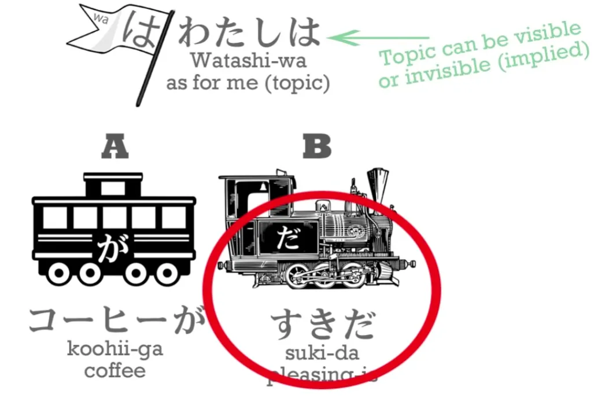
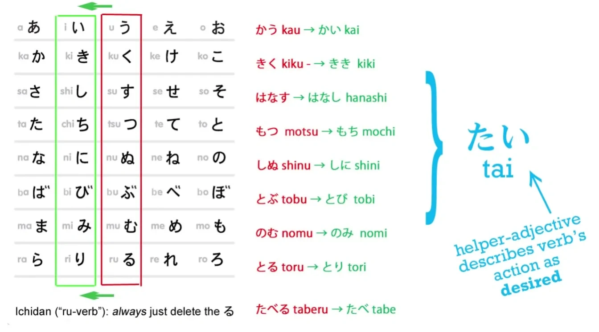
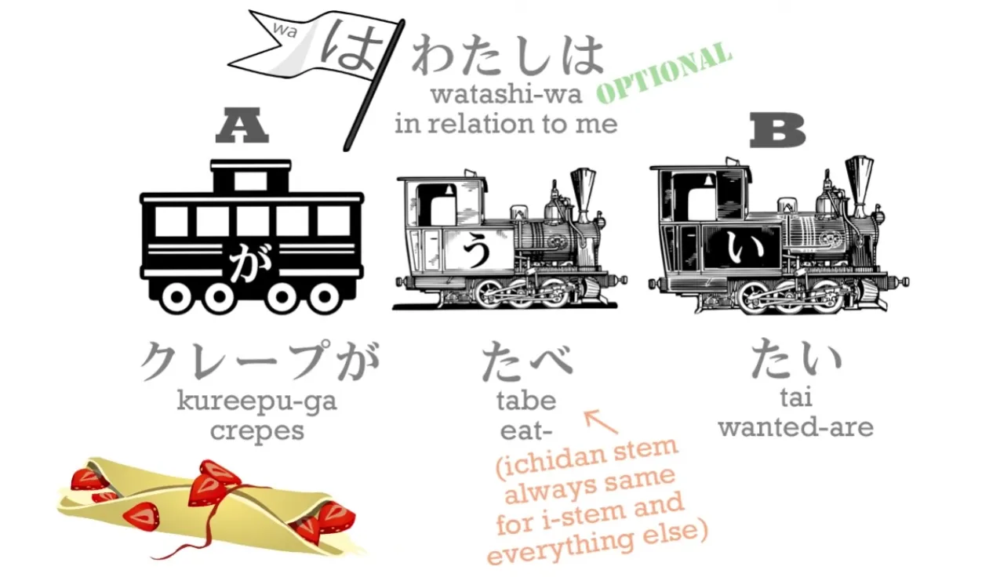
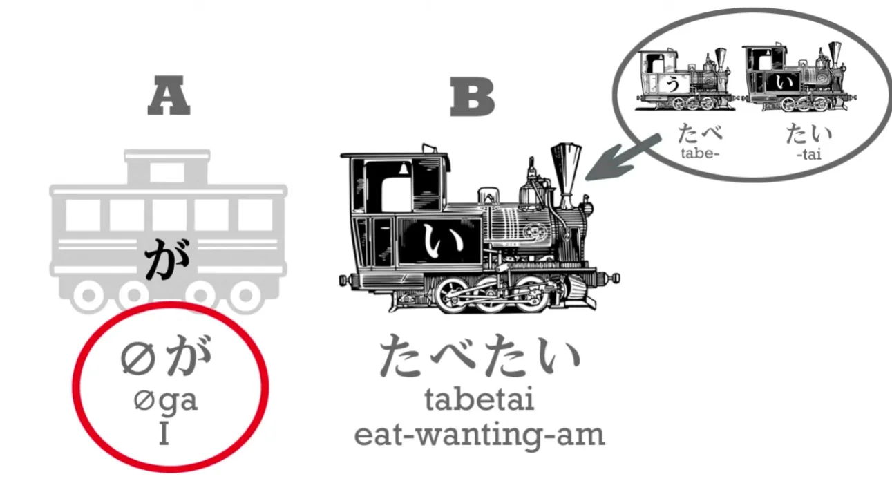
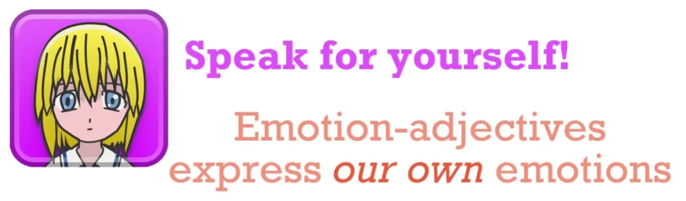

# **9. Подлежащее японского предложения и выражение желания: ほしい, たい, たがる**

[**Урок 9: Как учебники УНИЧТОЖАЮТ ваш японский: Секрет №1! + Выражение желания: hoshii, tai, tagaru**](https://www.youtube.com/watch?v=vk3aKqMQwhM&list=PLg9uYxuZf8x_A-vcqqyOFZu06WlhnypWj&index=11)

## Подлежащее и эго в японском против английского

Японский и английский языки имеют очень разные мировоззрения. В некоторых аспектах они диаметрально противоположны.

**Английский — очень эгоцентричный язык.** И это не какое-то моральное суждение: **я говорю о грамматике.** **Английский хочет иметь <code>эго</code> в качестве главного действующего лица, центра каждого предложения, если это возможно.** Желательно <code>я</code>, если не <code>я</code>, то кто-то другой, а если не человек, то хотя бы животное. Это должен быть какой-то <code>эго</code>-актор.

::: info
**Долли, кажется, иногда называет подлежащее «актором» и использует эти термины взаимозаменяемо, так что имейте в виду, что под «актором» она ДОЛЖНА подразумевать подлежащее.** Это использование может стать запутанным позже в пассивном/рецептивном залоге, если вы знаете базовую лингвистику… но, возможно, это просто моя проблема…
:::

**Японский язык так не работает. Он очень рад иметь неодушевлённые существа в качестве главного действующего лица предложения. Вы могли бы назвать это более анимистическим взглядом на язык.** Возможно, это звучит довольно абстрактно, но на самом деле это совсем не абстрактно. Давайте перейдём к конкретным примерам. Я начну со своего любимого примера, и если вы слышали его раньше, не уходите, потому что на этот раз мы углубимся гораздо сильнее.

Мой любимый пример: <code>わたしは**コーヒーが**すきだ.</code> Мы можем использовать <code>わたし</code>, а можем и не использовать *(или, скорее, не обязательно использовать)*; это будет понятно, скажем мы это или нет.

Учебники, школы и все остальные говорят вам, что это означает <code>Я люблю кофе</code>. И <code>Я люблю кофе</code> вполне может быть тем, что мы сказали бы по-английски, если бы хотели сказать что-то похожее, **но это не то, что означает это предложение.** И если вы следили за курсом до этого момента, вы можете понять, почему это не так.

---

**Первый и самый важный момент здесь — посмотрите, где находится <code>が</code>. <code>が</code> отмечает кофе.** **Мы знаем, что главное действующее лицо** *(подлежащее в активном залоге)*, **тот, кто совершает действие или является чем-то, всегда отмечается частицей <code>が</code>**, поэтому мы знаем, что главное действующее лицо этого предложения **— не <code>わたし</code> – <code>я</code>**, **а кофе, который отмечен частицей <code>が</code>.**

**После <code>わたし</code> могла бы быть невидимая <code>が</code>, но в данном случае её быть не может**, потому что **мы уже знаем, что такое <code>が</code> — это кофе. Значит, кофе что-то делает или является чем-то.** **В английском** нам говорят, что это предложение типа <code>А **делает** Б</code>, но нам достаточно просто посмотреть, чтобы увидеть, что **это не так.** **Оно заканчивается на <code>だ</code>** — это предложение типа <code>А **есть** Б</code>, не так ли?

**Кофе — <code>すき</code>.** Итак, что означает <code>すき</code>? **<code>すき</code> — это существительное, и это одно из тех адъективных существительных, о которых мы говорили раньше.** Оно сообщает нам что-то о природе или состоянии кофе. В данном случае **оно говорит нам, что кофе приятен. Это ядро предложения: <code>Кофе приятен.</code>**

**<code>わたしは</code>, неявное или явное, говорит нам, в чьём случае это приятно:** <code>**Что касается меня**, кофе приятен.</code> **Теперь, это очень-очень-очень важно.** **Потому что если мы этого не знаем, если мы действительно верим, что это предложение означает <code>Я люблю кофе</code>, наше понимание <code>が</code> и <code>を</code> полностью нарушено.**

---

**Если бы действующим лицом этого предложения было <code>わたし</code>, оно должно было бы быть отмечено частицей <code>が</code>.** **Если бы объектом, на который действовал актор, выражая свою симпатию, был кофе, то он должен был бы быть отмечен частицей <code>を</code>.** Таким образом, у нас две частицы, и две самые фундаментальные частицы, полностью спутаны в нашем сознании. Теперь мы верим, что иногда <code>が</code> может отмечать объект предложения вместо подлежащего, то, на что совершается действие, вместо того, кто является или делает что-то. И теперь мы верим, что объект предложения, то, на что совершается действие, иногда может быть отмечен частицей <code>が</code> вместо <code>を</code>. **И ничего из этого неправда. Этого никогда не может быть. Этого никогда не произойдёт. И если бы это могло произойти, японский язык превратился бы в хаос. И именно в это он и превращается в умах многих студентов.**

---

Итак, как мы видим в этом предложении, **<code>わたし</code> — это нелогическая тема предложения.** **Она отмечена частицей <code>は</code>. Это не актор. Это не подлежащее.** **<code>コーヒー</code> — это не объект, который был бы отмечен частицей <code>を</code>, если бы это было так.** **Это подлежащее.** **И <code>すき</code> — это не глагол, означающий <code>любить</code>; это прилагательное, означающее <code>быть приятным</code>.**

---

Таким образом, каждое слово в этом предложении неверно описывается стандартным объяснением. И такого рода недопонимание ввергает японский язык в полный хаос. Теперь, много ли таких случаев в японском?

Честно говоря, неважно, много их или нет. Как только ваше понимание частиц нарушено, оно нарушено. Но так уж получилось, что их много. Всевозможные различные структуры предложений в японском языке вызывают одно и то же недопонимание.

---

Например, если мы говорим <code>ほんがわかる</code> или <code>わたしはほんがわかる</code>, мы говорим, что **книга понятна**, но английские тексты говорят вам, что это означает <code>Я понимаю книгу</code>, и в этом случае это ещё менее простительно, потому что в английском нет настоящего эквивалента <code>すき</code>, но есть эквивалент <code>わかる</code>. Он означает <code>понятный</code> или <code>ясный</code>.

Мы могли бы сказать: <code>По отношению ко мне, или просто для меня, книга понятна</code>, **и тогда мы не стали бы полностью путать то, что делает <code>が</code>, или думать, что существительное, которое должно быть отмечено частицей <code>を</code>, может быть отмечено частицей <code>が</code>, случайным образом.**

---

Так почему же, по крайней мере в этом случае, школы и учебники просто не переводят это так, как оно есть на самом деле? <code>**Для меня книга понятна / Что касается меня, книга понятна.**</code> **Потому что это предубеждение ставить эго в центр каждого предложения настолько сильно, что оно превалирует над правильным изучением японского языка.** И это не просто несколько случайных случаев.

Позже мы рассмотрим потенциальную форму[[10]](./10-helper-verbs-the-potential-helper-verb.md) и рецептивную форму[[13]](./13-passive-conjugation-receptive-helper-verb.md), которая ошибочно описывается как пассивная, и обе они будут вызывать формы этой же проблемы. Поскольку обе эти темы довольно обширны сами по себе, я не буду говорить о них сейчас. Но давайте поговорим о том, как мы выражаем желания в японском языке. Давайте поговорим о том, как японский язык справляется с желаниями. Хотим ли мы что-то или хотим что-то сделать, как мы говорим об этом по-японски?

## Выражение желания с ほしい

Итак, предположим, мы что-то хотим. Скажем, <code>こねこがほしい</code>.

<code>こねこ</code> — это котёнок: <code>[子]{こ}</code> — это ребёнок или маленькая вещь, а <code>ねこ</code> — это кошка. А <code>ほしい</code> переводится на английский как <code>want</code>. Теперь, если вы посмотрите на это, первое, что вы увидите, это то, что **это не глагол. Это прилагательное.** Оно заканчивается на <code>い</code>, а не на <code>う</code>. И второе, что вы увидите, что является самым важным, это то, что **актор этого предложения, отмеченный частицей <code>が</code>, — это не я, кто хочет кошку. Это кошка, которая желанна.**

Итак, что означает <code>ほしい</code>? Ну, довольно просто, это означает <code>является желанным</code>.
::: info
Это прилагательное.
:::
<code>По отношению ко мне, кошка желанна.</code>
::: info
<code>わたしはねこがほしい.</code>
:::
И снова, если мы всерьёз верим, что это означает <code>Я хочу кошку</code>, мы думаем, что <code>が</code> может отмечать объект предложения, объект действия, то, на что мы это делаем. Так что снова, **мы путаемся в роли, которую <code>が</code> играет в предложении, мы путаемся в роли, которую <code>を</code> играет в предложении, потому что кошка должна была бы быть отмечена частицей <code>を</code>, если бы это означало** <code>Я хочу кошку</code>. **И мы путаемся между глаголами и прилагательными.** Так что снова **японский язык превращается в странную игру в угадайку, в которой частицы и типы слов могут менять своё значение случайным образом.**

## Выражение желания что-то сделать с たい

Теперь, предположим, мы хотим что-то сделать. В японском языке мы выражаем желание что-то сделать иначе, чем желание что-то иметь. **И мы делаем это, снова используя <code>い-основу</code>.** <code>い-основа</code>, как я уже говорила, очень важная основа. Итак, чтобы сказать, что мы что-то хотим, мы должны добавить **прилагательное желания**, которое есть <code>**たい**</code>. **Таким образом, теперь у нас есть прилагательное.**

И что означает это прилагательное? **Оно не означает <code>хотеть</code> в английском смысле.** **Оно не может, потому что <code>want</code> — это глагол, а <code>たい</code>, заканчивающееся на <code>い</code>, — это прилагательное, не так ли?** Итак, давайте возьмём пример. Это немного известный пример.

<code>わたしはクレープがたべたい</code>.

Теперь, стандартный английский перевод этого — <code>Я хочу есть блины</code>. Но, как вы видите, шаблон здесь такой же, как и в других случаях, которые мы рассматривали. **Актор, отмеченный частицей <code>が</code>, — это не <code>わたし</code>, это не <code>я</code>, это блины.** **Желательность блинов — это не глагол, это прилагательное.** И нам нужно это понять, потому что если мы этого не сделаем, это не просто испортит этот тип предложений — это испортит всё наше понимание японских слов, японских частиц и японской структуры.

Теперь, **нет действительно хорошего способа перевести это на английский.** Нам пришлось бы сказать что-то вроде <code>По отношению ко мне, блины вызывают желание</code>. И это очень неловко.
::: info
Можно использовать <code>want/wanting</code> в качестве перевода. Просто помните, что <code>たい</code> — это не глагол, как <code>want</code> в английском, а скорее прилагательное. Переводы не имеют значения, понимание имеет.
:::
Иногда люди спрашивают меня: «Действительно ли я должен использовать все эти неловкие дословные переводы, которые вы даёте, вместо того чтобы использовать естественный английский?» И ответ на это — <code>Нет</code>. **Вы не должны думать в терминах моих неловких объяснений или думать в терминах естественного английского. Вы должны думать о японском языке в терминах — угадайте что — японского.** Я объясняю это на английском, чтобы дать вам толчок к этому. **Но эти неестественные переводы или объяснения существуют, чтобы помочь вам понять структуру японского языка, а не дать вам способ перевода японского.**

Итак, как я уже сказала, шаблон во всех этих случаях одинаков, и я не думаю, что его очень трудно понять. Но теперь мы рассмотрим нечто, что может показаться немного запутанным, и я обещаю вам, что это не так, если вы просто внимательно последуете тому, что я собираюсь сказать. У нас есть это предложение: <code>クレープがたべたい</code>, но что, если бы у нас здесь не было блинов? Что, если бы мы просто сказали <code>(zeroが)たべたい</code>? **Теперь в этом предложении больше нет того, что английский хочет назвать объектом желания, что на самом деле является подлежащим желания, вызывающим желание, и, очевидно, должен быть нулевой вагон, отмеченный частицей <code>が</code>, иначе, как вы знаете, у нас нет предложения.** Но что это за нулевой вагон в данном случае?

Что ж, ирония в том, что в этом случае нулевой вагон — это то, чем, по мнению английских учебников, он был всё это время. **Это <code>я</code>.**

На этот раз я действительно являюсь актором предложения, и это может быть частью причины большой путаницы, которая возникает по этому поводу. <code>わたしがたべたい</code> означает <code>Я хочу есть</code> — я не обязательно хочу есть блины или обенто Сакуры, я просто хочу есть. *(Я есть-хотящий-есть)* И поскольку здесь нет субъекта, вызывающего желание есть, желание есть приписывается непосредственно мне.

И вы можете спросить — вы должны спросить — «Так что же это за <code>-たい</code>? Это прилагательное, описывающее состояние чего-то, что заставляет вас что-то хотеть, или это прилагательное, описывающее моё желание?» **И ответ таков: это может быть и то, и другое.** **Очевидно, когда оно описывает торт, оно также косвенно описывает мои чувства к торту, оно описывает чувства, которые торт вызывает во мне.** А когда нет торта, или нет блинов, или нет обенто Сакуры, мы просто описываем мои чувства напрямую. И это часто бывает в японском языке с прилагательными желания. Например, <code>こわい</code>, что означает либо <code>напуганный</code>, либо <code>страшный</code>. Если я говорю <code>おばけがこわい</code>, я говорю <code>Призраки страшные</code>, но если я говорю просто <code>こわい</code>, я говорю <code>Я напуган</code>.

Теперь, это сбивает с толку? Это не сбивает с толку, потому что у нас есть ориентир, который каждый раз подсказывает нам, что делать. И этот ориентир — <code>が</code>. **В этих предложениях и в гораздо более сложных предложениях, если мы будем следить за <code>が</code> и за другими логическими частицами, мы никогда не ошибёмся, потому что логические частицы никогда-никогда-никогда не меняют свою функцию.** Так что мы можем использовать их как наш компас. **Именно поэтому так разрушительно заставлять людей верить, что они могут менять свою функцию, как это делают учебники.**

Если у вас есть компас, и я скажу вам: «Ах, ну, большую часть времени компас указывает на север, но иногда указывает на юг, а на самом деле довольно часто он также указывает на восток», вы могли бы и вовсе не иметь компаса. Я уничтожила ценность вашего компаса для вас. **И то же самое с логическими частицами. Они абсолютно надёжны. Они всегда указывают на север.** *(Или, я полагаю, они всегда указывают туда, куда должны указывать, в одном направлении)* **Они никогда не меняют свою функцию.**

Итак, **если <code>が</code> отмечает блины, то мы знаем, что подлежащее предложения, то, о чём нам говорит локомотив, — это блины, и ничто иное.** **Но если у нас нет подлежащего, отмеченного частицей <code>が</code>, мы знаем, что по умолчанию нулевое местоимение обычно означает <code>я</code>, если нет причины думать иначе.** Это то же самое, что и в примере с угрём, который мы приводили в уроке о <code>は</code>.

Теперь я расскажу вам ещё одну вещь, и надеюсь, что не перегружаю вас информацией в этом уроке, но это даст вам ещё больше уверенности в том, что такое нулевое местоимение в этих случаях. И это то, что **вы не можете использовать эти прилагательные желания, чувства, ни о ком, кроме себя.**

Итак, **если я говорю <code>たべたい</code> и в предложении или контексте нет ничего, что можно было бы <code>たべたい</code>, то я должен говорить о себе, я не могу говорить о вас и не могу говорить о Сакуре.** Почему нет? Потому что японский язык не позволяет нам этого делать. **Вы не можете использовать <code>-たい</code> о ком-то другом, или <code>こわい</code>, или <code>ほしい</code> — мы не можем использовать ничего из этого о ком-то другом.**

Что, если мы хотим сказать, что кто-то другой что-то хочет? Ну, **поскольку японский язык очень логичен, он не позволяет нам делать определённые утверждения о том, чего мы не можем знать наверняка,** так что, видите, он очень отличается от западных языков. **Одно, чего мы не можем знать наверняка, — это внутренние чувства другого человека.**

Так что я могу подумать, что Сакура хочет съесть торт, но я этого не знаю. Всё, что я знаю, это как она себя ведёт, я знаю, что она говорит, я знаю, что она делает, я знаю, как она выглядит, но я не знаю, каковы её внутренние чувства.

::: info
Обратите внимание на слово «утверждение» здесь: <code>たい</code> нельзя использовать, когда <code>демонстрируется фактическое знание субъективности другого человека</code>, как Долли выражается в [**комментариях**](https://www.youtube.com/watch?v=vk3aKqMQwhM&lc=UgwE8cByEhTfyfe0e3h4AaABAg.9Kr0u3ynAsW9KrNJyZGL-o), рекомендую прочитать это.
:::

**Поэтому, если я хочу говорить о её желании съесть торт, я не могу использовать <code>-たい</code>. И я не могу использовать <code>こわい</code>, чтобы описать её страх, и я не могу использовать <code>ほしい</code>, чтобы описать вещь, которую она может хотеть.**

## Выражение утверждений о желании других людей с たがる

Так что же мне делать? **Я должна добавить к прилагательному желания вспомогательный глагол. Я убираю <code>い</code> с <code>い-прилагательного</code> и добавляю вспомогательный глагол <code>がる</code>.** А <code>がる</code> означает <code>показывать признаки / выглядеть так, как будто это так</code>. Итак, если я говорю <code>さくらがケーキをほしがる</code>, то я говорю, что Сакура проявляет признаки желания торта. Это то, что я говорю буквально.

**И даже если она на самом деле сказала мне, что хочет торт, я всё равно так говорю, потому что я не могу чувствовать её чувства.** Я знаю только, что она делает и говорит.

Теперь, почему мы используем глагол в случае с другими людьми, когда это прилагательное в случае с нами самими? Опять же, это очень логично. **Я не могу описывать чувства другого человека, потому что я не могу их чувствовать.** **Я не знаю о них.** **Я могу говорить только об их действиях, а их действия, очевидно, должны быть глаголом.** Так что это полезно знать, но это также помогает нам быть очень ясными, когда мы говорим <code>たべたい</code> или что-либо ещё на <code>-たい</code>, или что-либо <code>ほしい</code>, что если нет причины для этой эмоции, то нулевое местоимение должно быть <code>わたし</code>, потому что это не может быть кто-либо другой. Мы на самом деле не можем использовать это для кого-либо другого.

::: info
Как уже упоминалось выше, у Долли есть интересный [**комментарий**](https://www.youtube.com/watch?v=vk3aKqMQwhM&lc=UgwE8cByEhTfyfe0e3h4AaABAg.9Kr0u3ynAsW9KrNJyZGL-o) по поводу <code>たい</code> против <code>がる</code>.
:::

Итак, это довольно много информации для одного урока, но понимание этого позволит вам быстро преодолеть огромную область путаницы и недопонимания, которая годами беспокоит многих изучающих японский язык.

::: info
Это одно из первых <code>Больших Откровений о Японском</code> от Долли, поэтому оно довольно насыщенное. Не волнуйтесь, не торопитесь, перечитайте, проверьте комментарии к [**видео**](https://www.youtube.com/watch?v=vk3aKqMQwhM&list=PLg9uYxuZf8x_A-vcqqyOFZu06WlhnypWj&index=13) и при достаточном количестве повторений это в конце концов закрепится. Однако, очевидно, как я уже говорила в своём длинном примечании к Уроку 7.5, имейте в виду, что Долли здесь просто для того, чтобы дать вам базовое представление, и, конечно, это означает, что она упрощает вещи, чтобы они соответствовали её модели и потому что это для основ, но если вы углубитесь, всё не так просто, и существует много нюансов, грамматика и лингвистика часто могут быть довольно запутанными и сложными, и вещи не так просты, как иногда подразумевает Долли, но ради её метода это нормально для базового понимания.

Если вы хотите узнать, почему, посмотрите [**это обсуждение в Discord MoeWay**](https://discord.com/channels/617136488840429598/1170582570161950752) от [**Морга**](https://morg.systems/) (КРУТАЯ страница, кстати!). Также, проверьте комментарии Морга [**в этой ветке о は и が**](https://discord.com/channels/617136488840429598/1151956209100927117/1152970825583054859), так как <code>が</code> не всегда является только маркером подлежащего. Так что не воспринимайте Долли как истину в последней инстанции, а просто как полезный способ освоить основы японского, которые подтолкнут вас к погружению = что действительно важно. Долли по-прежнему отличный источник объяснений! Просто вещи не так просты, если вы углубляетесь, однако не беспокойтесь об этом, всё встанет на свои места, как только вы погрузитесь в язык на тонны и тонны…
:::