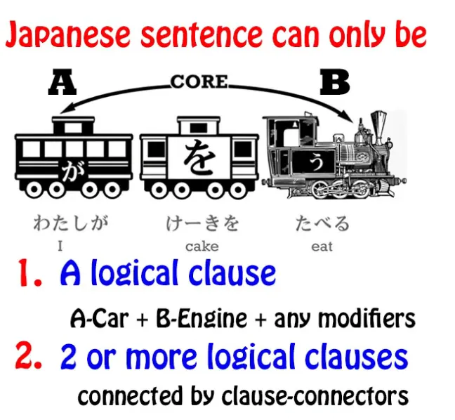
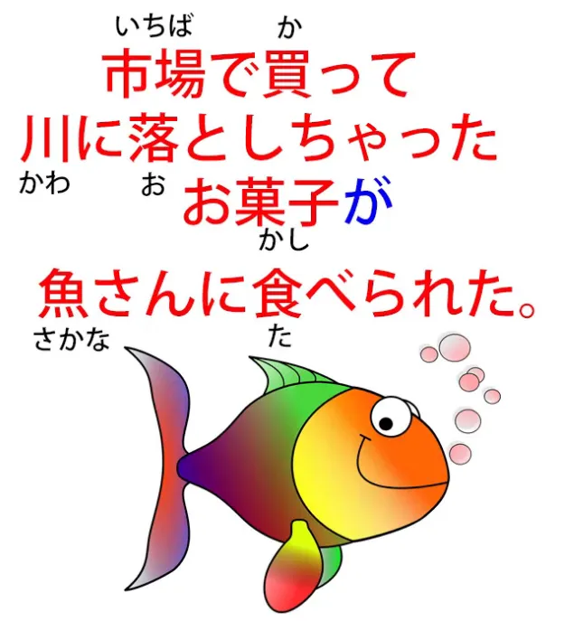
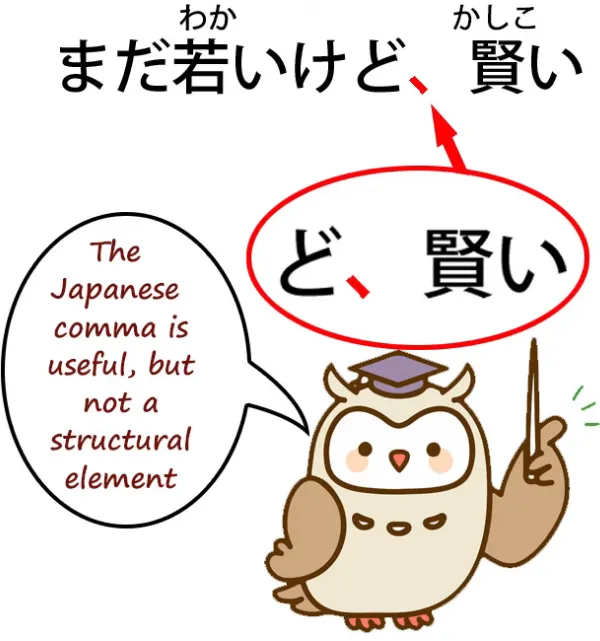
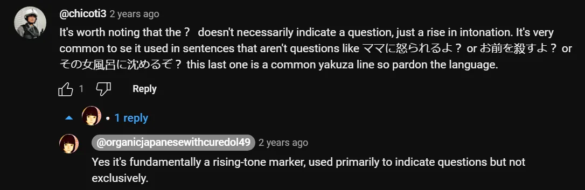
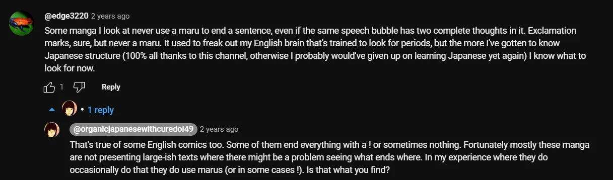
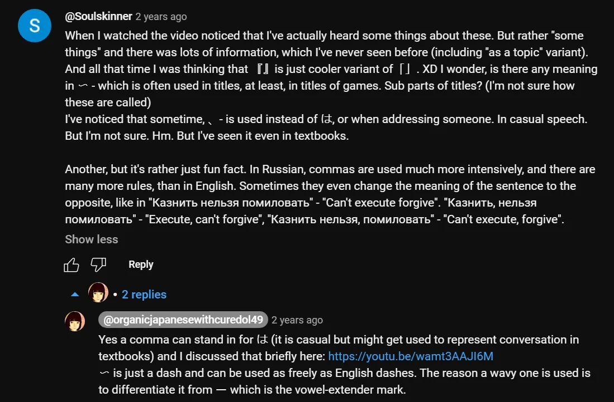

# **90. Японская пунктуация: Как она работает.**

[**Japanese Punctuation: How it REALLY works. Lesson 90**](https://www.youtube.com/watch?v=LDQlGnqElTU&list=PLg9uYxuZf8x_A-vcqqyOFZu06WlhnypWj&index=92&ab_channel=OrganicJapanesewithCureDolly)

こんにちは。

Сегодня мы поговорим о японской пунктуации.

**Итак, первое, что нам нужно знать о японской пунктуации, это то, что большая её часть появилась в японском языке относительно поздно.** **Большая её часть пришла во время эпохи Мэйдзи, около ста пятидесяти лет назад.**

**Это было время, когда Япония модернизировалась, и во многом пунктуация появилась, чтобы помочь в переводе западной литературы.**

---

Итак, **это означает, что в большинстве случаев японская пунктуация не имеет таких фиксированных и структурных значений, как эквивалентная пунктуация в английском и других европейских языках.** Поэтому нам нужно знать, что делает пунктуация, а что нет.

## Точка / 。

Итак, первый знак, который мы рассмотрим, это японская точка или <code>まる / 。</code>, **которая выглядит как маленький кружок у подножия <code>буквы</code>.**

И **это действительно исключение из правила, потому что она действительно структурно чёткая.** **Что она делает, так это завершает предложение.**

**И это очень важно для нас в понимании того, как структурированы сложные японские предложения.**

Почему так? Что ж, **японский — это язык, очень ориентированный на модификацию.** **То есть, многое из того, что другие языки делают с помощью других стратегий, японский делает с помощью модификации**, то есть, **используя придаточные предложения для модификации существительных или других элементов предложения.**

**Большая часть основной работы в японской структуре, которая не выполняется логическими частицами, выполняется этой структурой модификации.**

**Таким образом, целые логические придаточные предложения могут использоваться не как логические придаточные предложения, а для модификации существительного или какого-либо другого элемента.**

Итак, давайте посмотрим, как это работает.

<code>**市場で買って川に落としちゃった**お菓子。</code>

И это означает <code>Конфета, **которую я купил(а) на рынке и уронил(а) в реку**</code>.

::: info
Я полагаю, «done» в переводе используется для указания на более буквальный перевод <code>ちゃった</code>.
:::

Итак, **проблема с этим при чтении сложного предложения заключается в том, что мы можем запутаться, является ли что-то логическим придаточным предложением или нет.**

Итак, **говорим ли мы здесь, что я что-то купил(а) на рынке? Нет, мы этого не говорим.** **Говорим ли мы, что я что-то уронил(а) в реку? Нет, это не то, что мы говорим в этом предложении.**

---

**Обе эти вещи просто модифицируют <code>お菓子</code>.** **Они говорят нам, что это была за <code>お菓子</code>: та, которую я купил(а) на рынке и уронил(а) в реку.**

**Итак, всё, что у нас здесь есть, это одно существительное, <code>お菓子</code>, которое было сильно модифицировано логическими придаточными предложениями, не работающими как полные логические придаточные предложения.**

---

**Затем мы можем добавить логическую частицу к этому <code>お菓子</code> и превратить его в целое логическое придаточное предложение.**

Итак, мы могли бы сказать: <code>市場で買って川に落としちゃったお菓子**が**魚さんに食べられた。</code>

Конфета*(**=подлежащее**)*, которую (я) купил(а) на рынке и уронил(а) в реку, была съедена рыбой.

::: info
Если я правильно понимаю, поскольку мы отметили <code>お菓子</code> частицей <code>が</code> (подлежащее), мы теперь можем построить из него другое придаточное предложение, следовательно, мы получаем ещё одно логическое придаточное предложение <code>お菓子が魚さんに食べられた</code>.
:::
*Хотя <code>お菓子</code> также модифицируется модифицирующими придаточными предложениями перед ним, в частности <code>市場で買って川に落としちゃった</code>, они служат здесь просто модификатором, который описывает <code>お菓子</code>, а не являются полными (автономными?) логическими придаточными предложениями. Хотя это всего лишь моё предположение, исходя из того, как я это понимаю.*

**Но как нам убедиться при чтении такого предложения, смотрим ли мы на логическое придаточное предложение или на модификатор?**

## Как узнать, является ли это логическим придаточным предложением или модификатором?

Итак, **важно понимать, что в любом виде японского письма**
(за исключением, возможно, Твиттера или чего-то подобного)
**логическое придаточное предложение должно заканчиваться одним из двух способов**, **либо на <code>まる / 。</code>, что говорит нам о том, что это конец полного предложения —**

(после него может быть пара частиц-окончаний предложения, но это очень строгое правило японского языка, что **любое логическое придаточное предложение заканчивается B-локомотивом, помимо любых частиц-окончаний предложения**) —

---

**либо оно должно заканчиваться соединителем придаточных предложений, который завершает придаточное предложение и ведёт к следующему.** **Это может быть て-форма, это может быть слово вроде <code>から</code> или <code>けれど</code>,** но, вооружившись этой информацией, мы можем понять, что происходит.

Итак, давайте посмотрим на <code>市場で買って川に落としちゃった</code>.

**Это полная пара логических придаточных предложений.**

::: info
Моё предположение здесь состоит в том, что оно теоретически состоит из двух логических придаточных предложений, если, как говорит Долли ниже, мы предполагаем наличие скрытого подлежащего и скрытого прямого дополнения, если бы мы рассматривали оба глагола как отмечающие их отдельные логические придаточные предложения — <code>市場で(私がお菓子を)買った</code> и <code>(私がお菓子を)川に落としちゃった</code>, которые затем соединяются с помощью て-формы. Здесь <code>お菓子</code> должно быть прямым дополнением, поэтому <code>を</code>, поскольку <code>落とす</code> и <code>買う</code> — это глаголы движения, требующие подлежащего, действующего на прямое дополнение. Очевидно, маркер темы также может быть там, как <code>私は</code> в начале.
:::
*Но вместо этого эти придаточные предложения объединены, и поскольку за ними следует существительное, они служат модификатором для этого существительного, поэтому они больше не являются логическими придаточными предложениями и не содержат скрытых элементов, где вместо этого они являются одним большим модификатором для существительного, которое следует за ними, в данном случае <code>お菓子</code>. Жаль, что я не могу спросить Долли об этом, так как чувствую, что это очень помогло бы.
Однако я осознаю, что моё предположение, скорее всего, неверно, поэтому, пожалуйста, отнеситесь к нему с большой долей скептицизма.*

**Оно не говорит нам, что именно мы купили на рынке и уронили в реку, но, возможно, это подразумевается.**

**Но мы знаем, что это на самом деле не логическое придаточное предложение, потому что оно не заканчивается соединителем придаточных предложений и не заканчивается на <code>まる / 。</code>.** **Оно переходит прямо в существительное.**

---

**И вот как мы можем отличить модификатор от логического придаточного предложения.** **И мы знаем, когда вся последовательность, всё предложение, закончено, потому что у него будет эта <code>まる / 。</code>.**

И я сделала видео об этом методе анализа японских предложений, и я дам ссылку на него, чтобы вы могли посмотреть его позже[[34]](./34-understand-any-sentence.md).

**Но <code>まる / 。</code> здесь жизненно важна.**

## Запятая / 、

Итак, следующий знак, который мы рассмотрим, это японская запятая, которая выглядит как маленькая диагональная линия у подножия буквы.

**И это своего рода противоположность <code>まる / 。</code>, потому что это действительно не логический элемент в предложении.** **Она была заимствована в японский язык, но, в отличие от английской запятой или других европейских запятых, у неё нет логических правил.**

**Идеи вроде выделения придаточного предложения запятыми с обеих сторон — такого в японском не существует.** **Вы просто ставите запятую там, где хотите обозначить паузу. И это всё, что она делает.**

В японских школах учеников отговаривают от использования слишком большого количества запятых, и причина этого не в неправильном использовании запятых, **потому что в японском языке не существует такого понятия, как неправильное использование запятых.**

**Причина в том, что запятые не являются структурной частью японского языка, поэтому учеников отговаривают использовать их как костыль для передачи своего смысла.** **Если вы не можете передать свой смысл без запятых, значит, вы не пишете на хорошем японском.**

## Вопросительный знак / ？(はてな)

Итак, следующий знак, который мы рассмотрим, это вопросительный знак или <code>はてな</code>.

Итак, **в английском языке вопросительный знак подчиняется правилу.** **Если у вас есть вопрос, вы должны закончить его вопросительным знаком.**

**А также в английском языке вопросы структурно отличаются от утверждений.**

Так, если мы говорим <code>The coffee is hot</code>, это утверждение, но если мы говорим <code>Is the coffee hot?</code>, это вопрос.

---

**В японском языке у нас нет такого различия.** **Утверждения и вопросы структурированы абсолютно одинаково.**

Итак, **в формальном японском языке** у нас есть **частица-маркер вопроса <code>か</code>**, **которая говорит нам, что это вопрос.**

Но **в неформальном японском мы можем использовать <code>か</code>, но в основном не используем.** **Иногда мы используем маркер вопроса <code>の</code>, но это неоднозначно, потому что <code>の</code> также может быть маркером утверждения.**

---

**Единственный способ отличить вопрос от утверждения в японском языке — это восходящая интонация, которую, конечно, нельзя услышать в тексте.**

**И поэтому вопросительный знак стал очень полезным инструментом для обозначения этой восходящей интонации, для того, чтобы сказать нам, что это вопрос, а не утверждение.**

::: info

:::

**В английском языке вы обязаны использовать вопросительный знак в конце вопроса, если пишете на правильном английском. В японском языке такого правила нет.**

**Если маркер <code>か</code> присутствует, вы не используете вопросительный знак, но если вы хотите устранить двусмысленность того, что что-то является вопросом, а не утверждением, вы просто ставите вопросительный знак, если хотите.**

## Кавычки / 「　」

Следующее, что мы рассмотрим, это кавычки.

**Они выглядят как маленькие квадратные скобки в конце утверждения, и работают точно так же, как английские кавычки.**

**Они просто говорят нам, что что-то является цитатой: это то, что кто-то говорит.** **Мы не используем их для того, что кто-то думает, как иногда делаем в английском.**

---

Итак, иногда вы увидите **двойные кавычки** вот так, 『　』 **и они отмечают цитату, которая находится внутри другой цитаты.**

## <code>Боковые отметки</code>

Итак, последнее, о чём я хочу поговорить, это то, что довольно сильно озадачивает людей.

**В японском языке, особенно в японских книгах**, вы иногда увидите, **особенно в вертикальном тексте, набор маленьких отметок, которые немного похожи на японские запятые, идущие вдоль левой стороны слова или фразы.**

Что же это такое?

Никто, кажется, вам не говорит.

**На самом деле это либо подчёркивает это слово или фразу, либо говорит нам, что оно используется в особом смысле.**

---

**Итак, эти маленькие отметки на самом деле делают нечто вроде выделения курсивом в английском языке.**

И я подозреваю, что они появились в японском языке в первую очередь для передачи курсива при переводе западной литературы.

**На самом деле нет способа писать японские символы курсивом.** **Для японского языка нет курсивного формата, поэтому вместо него используется это.**

---

**Это выделение и указание на то, что что-то используется в особом смысле, также может быть обозначено катаканой, но вы будете время от времени видеть это в японских текстах, и это то, что это означает.**

::: info

*Ссылка Долли на Урок 80.*
:::