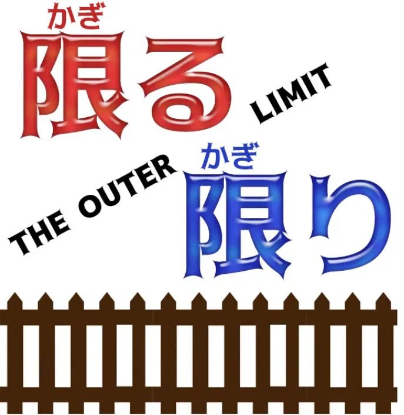
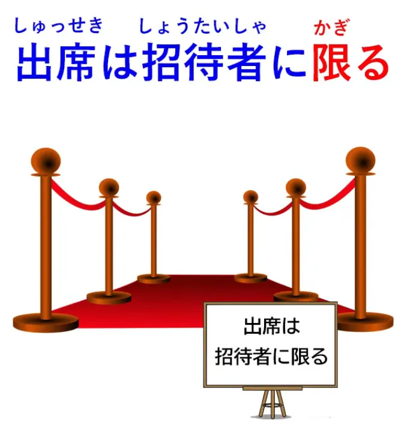
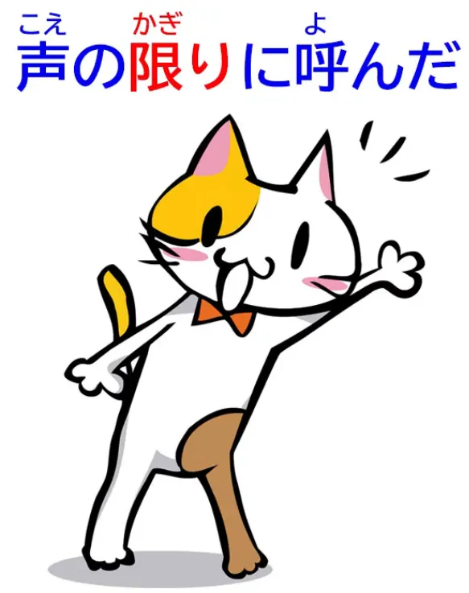
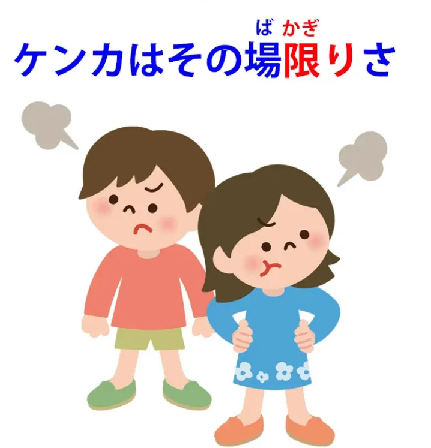
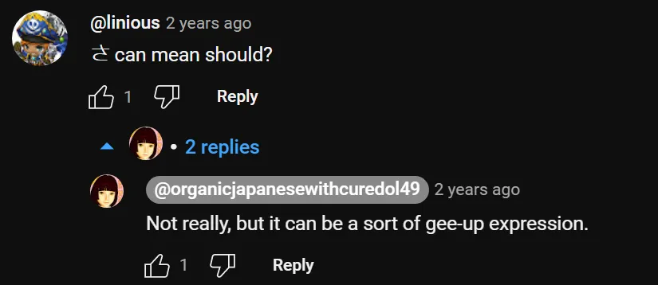

# **91. Внешние пределы! 限る & 限り: Множество значений и как они работают 知っている限り、とは限らない и многое другое**

[**Outer Limits! 限る Kagiru 限り Kagiri - Its many meanings and how they work 知っている限り、とは限らない and more**](https://www.youtube.com/watch?v=jWCLPJwZS5E&list=PLg9uYxuZf8x_A-vcqqyOFZu06WlhnypWj&index=96&ab_channel=OrganicJapanesewithCureDolly)

こんにちは。

Сегодня мы поговорим о <code>限る</code> и <code>限り</code>. **<code>限る</code> — это глагол, означающий <code>ограничивать</code> или <code>запрещать</code>,** а **<code>限り</code> — это い-основа, а значит, существительная форма этого глагола.**

Если вы не знаете, как い-основы образуют существительные формы, я прикреплю видео над головой, которое раскроет вам все секреты таинственной い-основы.[[72]](./72-the-great-connector-い-stem-magic.md)

Итак, **японский язык любит выражения, связанные с ограничениями и границами.** [**Я делала видео**](https://www.youtube.com/watch?v=56sy0qfY0Js) об <code>うち</code>[[97]](./97-the-meanings-of-うち-home-self-social-boundary-time-marker-いまのうち-そのうち.md) некоторое время назад, и я оставлю ссылку над головой и в разделе информации ниже. <code>うち</code> фокусируется на замкнутом пространстве, на области, в которой мы находимся, и всё остальное находится за её пределами.

**<code>限り</code>, с другой стороны, фокусируется на границах этого замкнутого пространства,** **на краях, за которые это пространство не простирается.** И это порождает целый ряд выразительных стратегий, некоторые из которых довольно буквальны, другие же очень метафоричны и могут сбивать с толку, если не понимать, откуда они берутся.

## 限る

**Итак, давайте начнём с очень простого использования <code>限る</code>.**

<code>出席は招待者に**限る**</code>

**<code>出席</code> — это посещение любого мероприятия.** **Оно ограничено <code>招待者</code> (приглашёнными лицами).** **За пределами этого ограничения <code>出席</code> не существует.** **Вы не можете посетить собрание или что-то ещё, если вы не приглашённое лицо.**

Ещё одно, в основном буквальное, использование — <code>声の**限りに**呼んだ</code> (Я звал(а) **на пределе** своего голоса).

В английском мы могли бы сказать <code>the top of my voice</code> (во весь голос).

**Здесь мы говорим о пределе громкости, на которую мог пойти мой голос.**

Итак, эти примеры довольно буквальны и легко понятны. Но затем мы переходим к выражениям, которые, я думаю, большинство из вас когда-либо слышали и которые, возможно, немного более запутаны.

Итак, <code>夏はアイスクリイムに**限る**</code> — в вольном переводе на английский это означает <code>In summer, ice cream **is the best thing**</code> (Летом мороженое — **лучше всего**).

На самом деле мы говорим: <code>Говоря о лете, когда дело доходит до лета, оно **достигает своего предела** в мороженом</code>, другими словами, мороженое **— это вершина того, что можно получить от** лета / мороженое **— это кульминация** лета / **нет ничего лучше** мороженого, когда мы говорим о лете.

::: info
Конечно, это просто естественный английский перевод, поэтому здесь трудно точно определить <code>限る</code>.
:::
---

И это может использоваться во всевозможных выражениях, например:

<code>運動なら水泳に**限る**</code>
(если это упражнение / если мы говорим об упражнениях, оно **достигает своего предела** в плавании [<code>水泳</code>] / плавание **— это абсолютно лучший вид** упражнений).

И, продолжая эту мысль, мы получаем выражения вроде <code>彼女に**限って**そんなことはしない</code>.

И снова, в вольном переводе на английский это будет «She **of all people** wouldn't do such a thing / she'd be **the last person** to do such a thing» (Уж кто-кто, а она такого не сделает / она будет **последним человеком**, кто сделает такое).

На самом деле мы говорим: <code>Она — **самый предел** людей, которые не стали бы делать такое</code>.

---

Так же, как мороженое — **лучшее, что есть** летом, или крик **на самом пределе** вашего голоса, она — **максимум, крайность** среди людей, которые не стали бы делать такое.

**Другие люди, возможно, могли бы это сделать, даже если вы думаете, что нет,** **но она — самый предел того типа человека, который не стал бы делать такое.**

## 限る используется в отрицании (не ограничивается x)

Теперь, **концепция <code>限る</code> (предел) часто используется в отрицании, чтобы показать, что** **что-то не ограничивается конкретным утверждением, конкретным понятием.**

Итак, <code>辞書に書いてあることが常に正しいとは限らない</code>.

**И это <code>-とは限らない</code> по сути суммирует предыдущее утверждение** и говорит, что это **не обязательно так.**

Итак, мы говорим: <code>То, что написано в словаре, всегда верно</code> — **это утверждение, затем мы цитируем это <code>-とは限らない</code>:** <code>**Не обязательно так, что** то, что написано в словаре, всегда верно.</code>

И я думаю, мы убедились в этом на различных примерах.

## 限り

Теперь, опять же, это <code>限り</code> может использоваться для обозначения пределов чьих-либо знаний, и очень часто используется именно так, например: <code>私の知っている**限り**ではそんな言葉はない</code>.

Итак, в английском мы бы сказали <code>As far as I know, there's no such word</code> (Насколько я знаю, такого слова нет), но здесь стратегия выражения заключается в модификации существительного <code>限り</code> — <code>私の知っている**限り**</code> (**предел** того, что я знаю): <code>**До предела** того, что я знаю, такого слова нет.</code>

И на самом деле в этом случае это довольно похоже на английский: <code>**as far as** I know / **to the limit of** what I know</code> (насколько я знаю / до предела того, что я знаю).

И здесь интересно, что **в то время как английский говорит** <code>**as far as** I know</code>, **японский достигает того же широкого шаблона, модифицируя существительное <code>限り</code> (предел).**

И, как мы говорили на прошлой неделе[[90]](./90-japanese-punctuation-how-it-works.md), **модификация выполняет огромную часть основной работы в японском языке,** **которая в английском выполняется другими стратегиями.**

---

Теперь, ещё одно распространённое выражение, которое может быть немного запутанным, это выражение, которое мы находим в <code>急いでいる時に**限って**バスが遅れる</code> (**ограничено** временем, когда мы спешим, автобус опаздывает).

Конечно, **это не буквально, но оно выражает часто испытываемое чувство,** **что автобус или что-то ещё, что делает то, чего мы не хотим, делает это** **именно тогда, когда мы очень не хотим или не можем себе позволить, чтобы это произошло.**

Так что на самом деле это выражение, которое поначалу может показаться немного запутанным, является очень естественным видом выражения, которое, я думаю, вы иногда встречаете и в английском. **Это происходит только тогда, когда нам это действительно нужно, что этого не происходит.**

### その場限り

Теперь, ещё одно выражение — <code>その場限り</code>.

Итак, <code>その場限りことを言う</code> означает, что она говорит вещи **сгоряча** / она говорит первое, что приходит в голову.

**<code>その場</code>**, которое мы обсуждали в другом видео, на которое я дам ссылку[[75]](./75-japanese-is-not-english-how-expression-strategies-differ-polite-英本語-rude-japanese.md), буквально означает **<code>то самое место / подходящее место / место, где кто-то оказался в данный момент</code>**, но **конечно, в японском, как и в других языках, <code>место</code> также может означать время или случай.**

---

Итак, <code>**その場限り**ことを言う</code> означает, что она говорит вещи, которые **просто возникают из конкретного случая и ничего более** — **ограничены этим конкретным случаем / не имеют реального значения вне этого конкретного случая.**

Так что подразумевается, что это просто пустые слова, которые приходят ей в голову.

### その場限りさ

И очень распространённое выражение, связанное с этим, это <code>喧嘩はその場限りさ</code> – ケンカ, и **это популярное выражение, это не совсем полное предложение.**

::: info
Я использовала форму кандзи для ケンカ (喧嘩), но обе формы приемлемы.
:::
**<code>さ</code> здесь скорее превращает это в <code>должно</code>.** **<code>さ</code> здесь говорит: <code>так и должно быть / да ладно, так и должно быть</code>.**

И на английский это переводится как <code>quarrels should not be continued</code> (ссоры не должны продолжаться).

::: info

:::

Иногда это даже переводится как <code>let not the sun settle on your wrath</code> (да не зайдёт солнце во гневе вашем), что, конечно, не имеет ничего общего с тем, что это на самом деле означает.

**Но суть здесь в том, что ссоры должны быть ограничены <code>その場</code>** **(случаем, событием, в котором они возникают).** **Так что, если вы поссорились с кем-то сегодня, вы не должны продолжать эту ссору завтра.**

Очень хороший совет.

Итак, это ряд обстоятельств, в которых концепция <code>限り / 限る</code> применяется в японском языке.

Есть и другие, конечно, но с этой информацией, я думаю, вы будете в лучшем положении, чтобы понять, что происходит.

::: info

Упомянутые ссылки: [**くらい vs ほど**](https://www.youtube.com/watch?v=6PEQTcDnbBk&ab_channel=OrganicJapanesewithCureDolly) и Урок 68 для わけ. Как обычно, вы можете проверить другие комментарии под видео.
В любом случае, на этом плейлист Dolly по грамматике из 93 видео официально заканчивается. Мы приближаемся к концу. Ниже есть ещё несколько конвертированных видео от Dolly.
:::