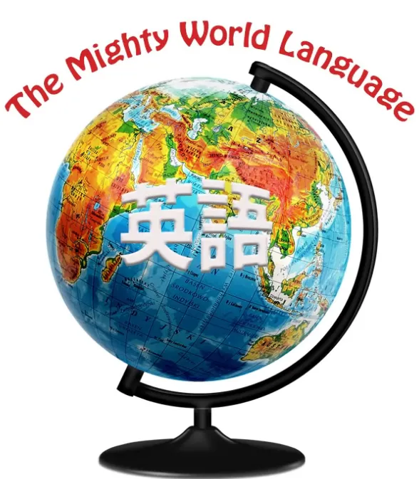
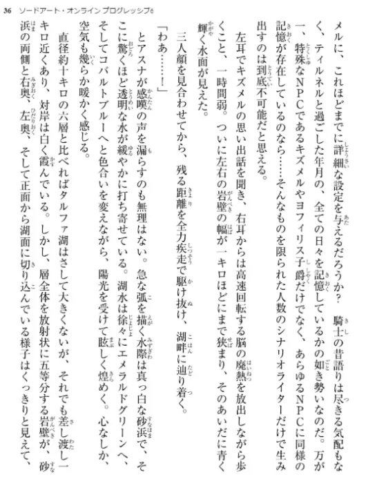
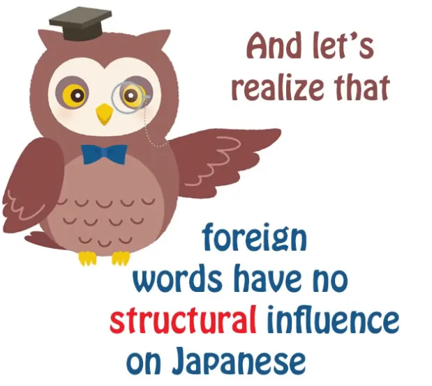

# **92. Съест ли английский японский? Вторжение заимствованных слов — действительно ли это угроза?**

[**Съест ли английский японский? Вторжение заимствованных слов — действительно ли это угроза?**](https://www.youtube.com/watch?v=bPWt-8Ecd7Y&ab_channel=OrganicJapanesewithCureDolly)

こんにちは。

Сегодня мы поговорим о том, о чём некоторые люди говорили со мной с самого начала этого канала, и можно встретить серьёзные и полусерьёзные статьи на эту тему, обычно написанные иностранцами, предупреждающие японцев об ужасной опасности для их языка из-за притока английского и беспокоящиеся о том, что японцы, похоже, не осознают ущерба, который это может нанести языку, и того, как это может сделать его менее японским.

Итак, сегодня я хочу рассмотреть, что на самом деле здесь происходит, что, вероятно, случится, а что — вряд ли.

## Причины существования такого количества английских слов в современном японском языке

**Прежде всего, абсолютно верно, что существует приток английских слов в японский язык, и для этого есть четыре основные причины.**

---

**Первая причина в том, что английский, конечно, является международным языком.** Большинство людей изучают его в школе, потому что это самый полезный язык для изучения, если вы его ещё не знаете.

**И это, конечно, затрагивает не только японский.** **Французские туристы жалуются на такие слова, как <code>le weekend</code> и <code>le football</code>, уже более полувека, и я не думаю, что это нанесло большой вред французскому языку.**

---

**Во-вторых, английский стал языком технологий, и технологии, в частности цифровые, радикально изменили жизнь людей за последние несколько десятилетий и ввели множество новой терминологии в их жизнь.**

И поскольку большая часть этих технологий была разработана в Америке, язык, на котором существует новая терминология, в основном английский.

---

**И ещё одна причина — опять же, все они взаимосвязаны — заключается в том, что английский, будучи международным языком, обладает высоким престижем в различных аспектах.** **Он может считаться крутым. Он может считаться милым.**

**И если вы видите волшебную надпись на японском, она, вероятно, будет основана на латинском алфавите** и, возможно, будет перекликаться с английскими словами, **потому что английский — это нечто чужое для японцев, но в то же время то, что они на самом деле немного знают, так что это своего рода дружелюбная частичка иностранного.**

**И использование английских слов может иметь различные эффекты:** **это может казаться милым, это может казаться умным, это может казаться крутым.** **И это распространённое явление.**

---

**Когда французский был более престижным языком, и большинство англоговорящих людей изучали его, наблюдалось очень похожее явление.** Люди вставляли французские словечки в разговор, авторы использовали французские фрагменты в книгах, и это делалось, чтобы выглядеть немного умнее, иногда — чтобы выглядеть забавно.

**Языки с высоким престижем, как правило, заимствуют слова у других языков.**

---

**Итак, ничего из этого, как вы видите, на самом деле не уникально для японского языка.** Если вы путешествуете по неанглоязычной стране, вы почти всегда видите английские слова на вывесках, на товарах в магазинах, и тому подобное.

Английский повсюду, потому что, ну, люди изучали его в школе, они немного знают английский, и **это международный язык, поэтому вещи часто называют на английском.**

## Почему некоторые люди беспокоятся о <code>«вторжении»</code> английского в японский?

Так почему же люди беспокоятся об этом больше в японском, чем в других языках?

**Я думаю, отчасти причина в том, что английский на катакане бросается в глаза.** **Если вы заимствуете английские слова, скажем, во французский или немецкий, они пишутся тем же шрифтом, что и остальной язык.**

**И для иностранцев, в частности, английский, записанный катаканой, звучит странно.** **Им приходится искажать английский различными способами, потому что им приходится добавлять много слогов.** Так что всё это довольно сильно бросается в глаза, гораздо больше иностранцам, чем самим носителям японского.

---

**Но здесь следует иметь в виду, что в целом английские заимствования не заменяют свои японские эквиваленты, если таковые изначально существовали.** **Они, как правило, существуют параллельно, возможно, имеют немного другое значение или просто другую эмоциональную окраску.**

---

**Есть несколько исключений, например, слово <code>ライオン</code>, которое сейчас, как правило, является основным словом для обозначения льва в японском языке.**

**В японском есть своё слово для льва — <code>[獅子]{しし}</code>, но в наши дни оно звучит немного литературно, немного старомодно,** и если мы собираемся говорить о льве, мы, как правило, говорим <code>ライオン</code>. **Это небольшое исключение.**

**Если мы говорим о слоне, мы говорим <code>[象]{ぞう}</code>.** **Если мы говорим о тигре, мы говорим <code>[虎]{とら}</code>.** **Большинство диких животных известны под своими японскими названиями, даже если английское название также известно в Японии.**

**Есть бейсбольная команда под названием 阪神タイガース,**

**но это типичный случай использования иностранного слова, потому что оно звучит довольно круто.** **Обычно, если вы просто говорите о тигре, вы говорите <code>[虎]{とら}</code>.**

## В какой степени английский действительно проникает в японский?

Теперь, если вы хотите провести небольшой эксперимент, чтобы увидеть, в какой степени английский действительно проникает в японский и заменяет язык, ну, просто взгляните на японскую книгу.

**Если у вас есть японские книги — я не имею в виду учебники или книги для чтения для иностранцев, но если у вас просто есть японские книги** либо на книжной полке, либо на мобильном устройстве, **откройте их и посмотрите на несколько страниц из нескольких книг и посчитайте, сколько слов на всей странице написано катаканой.**

**И вы увидите, что это действительно очень малая доля, возможно, одно или два слова на большинстве страниц, часто вообще ни одного.** **А затем посмотрите, сколько из них на самом деле являются именами людей или мест, или выдуманными словами, написанными катаканой: это не заимствованные слова.**

**Количество фактических заимствованных слов в процентном соотношении к средней странице текста или разговору обычного человека очень мало.** Растёт ли оно? Ну, вероятно, немного, но оно не делает очень значительных успехов.

---

**И ещё одна вещь, которую следует помнить, это то, что в японском языке иностранные слова приходят как существительные.**

Почти всегда.

**Есть одно или два небольших исключения, такие как слово <code>サボる</code>, которое означает <code>не посещать школу или работу</code>, и это на самом деле иностранное слово, основанное на французском <code>sabotage</code>** — <code>サボ</code>, сокращение от <code>サボタージュ</code>*, **и оно имеет хирагану -る и фактически рассматривается как глагол.** Но это действительно очень большое исключение. Вы можете найти лишь крошечную горстку слов, которые так делают в японском.

---

**Почти все английские слова, которые приходят, как и китайские слова, пришедшие в прошлом, приходят как существительные, независимо от того, чем они были в исходном языке.** **Так что, если вы хотите использовать их как глаголы, вам нужно добавить <code>する</code>.** **Если вы хотите использовать их как прилагательные, они должны быть адъективными существительными, или вам просто нужно использовать <code>の</code>.**

---

Таким образом, структурно, даже если бы английские слова увеличивались экспоненциально, что на самом деле не очень вероятно, они не оказали бы никакого влияния на структуру японского языка.

**Даже китайские слова, которые сейчас составляют около 60 процентов японского словарного запаса, практически не оказали влияния на фактическую структуру языка, на то, как на самом деле работают предложения.** И здесь есть интересная параллель: когда нормандские французы правили Англией, они дали английскому языку огромное, огромное, огромное количество словарного запаса, но опять же, они почти не повлияли на структуру языка.

## Продолжит ли английский <code>«вторгаться»</code> в японский?

Теперь мы можем спросить, будет ли это продолжаться, это так называемое английское вторжение?

**И мы не можем точно ответить на этот вопрос, потому что это зависит от продолжающегося престижа английского языка, который может сохраниться или не сохраниться в будущем.** **Похоже, нет кандидата на роль международного языка, но с другой стороны, культурный престиж английского может снизиться.** Мы не знаем.

---

**Но дело в том, что японский легко ассимилирует иностранные слова.** **Он не интегрирует их в структуру, но делает их частью языка и <code>«японизирует»</code> их.**

**Английский как культурный феномен на удивление мало проникает в японское сознание.** Японцы известны тем, что не учат английский.

**Японцы хуже владеют английским, чем большинство других языковых групп.** **Большинство японцев, если вы с ними поговорите, будут иметь на удивление большой английский словарный запас, но на удивление слабое понимание самого английского языка.**

---

И я думаю, что для этого есть причина, **и она заключается в том, что японский язык ближе, чем любой другой неанглийский язык, к культурной самодостаточности.**

::: info
Это действительно так, большинство японцев в интернете общаются исключительно с японским контентом и людьми, поэтому у них мало необходимости изучать или использовать английский, это может быть одной из причин, почему японцы меньше знают английский, несмотря на его присутствие там, поскольку я бы сказал, что большинство иностранцев изучают английский через интернет, потребляя контент и общаясь с людьми на английском — как интенсивный ввод, так и вывод, потому что большинство школьных систем искусственны и устарели.
Я имею в виду, что я освоил подавляющее большинство английского через интернет, книги и т.д., а не в школе, и это причина, по которой я свободно заговорил по-английски; только со школой это было бы почти невозможно.
Конечно, школа была полезна для освоения основ, что позволило мне потреблять контент.
Конечно, европейцы осваивают английский легче, чем японцы, но это всё ещё актуально, я считаю.
Окружение себя языком как можно больше означает, что вы сможете освоить его быстрее, поэтому погружение, особенно в зарубежных странах, работает так хорошо, если вы стараетесь медленно понимать весь этот иностранный язык вокруг вас (и изучать его) и медленно использовать его.
Важно то, что вы прилагаете активные усилия для понимания и использования языка.
:::

**Большинство людей, даже если они говорят на таких крупных языках, как французский или немецкий, в некотором роде нуждаются в английском для культурного поддержания:** **для использования интернета, для участия в популярной культуре современного мира.**

---

**Итак, популярная культура современного мира, как мы знаем, безусловно, доминирует на английском языке.**

**Но вторым по силе языком и нацией в популярной культуре являются Япония и японский язык.** **Японские манга и аниме популярны во всём мире,** и ничто не может с ними сравниться.

Если вы спросите кого-то, кто не интересуется Японией или японским языком, слышали ли они о японских персонажах и явлениях, таких как Марио, Сейлор Мун, некоторые фильмы Гибли, Зельда, Покемон и так далее, большинство из них слышали о них.

Сколько персонажей из любого другого языка знают большинство людей? Сколько немецких? Сколько французских? А ведь это крупные языки. Сколько испанских? Это самый большой язык в мире после английского.

**Япония — это культурная сверхдержава в такой степени, которая превосходит только английский язык и не достигается никаким другим языком.** **Это делает их культурно самодостаточными таким образом, каким не является ни одна другая языковая группа (за возможным исключением китайского).**

---

**Итак, когда же японский превратится в некий гибрид английского?** **Этого не произойдёт.** **На самом деле этого не произойдёт с большинством других языков, в которые поступает приток английского.**

**Но японский на самом деле безопаснее остальных.**

::: info
Как всегда, рекомендую прочитать [**комментарии**](https://www.youtube.com/watch?v=bPWt-8Ecd7Y&ab_channel=OrganicJapanesewithCureDolly).

:::
