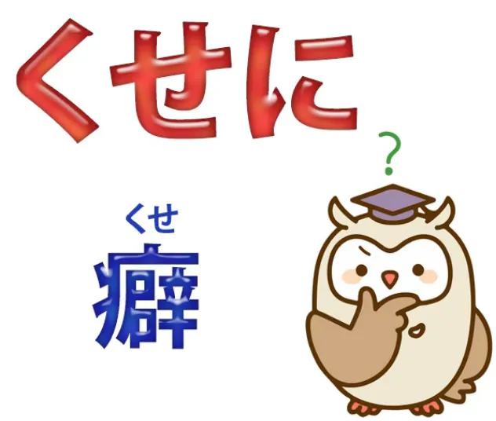
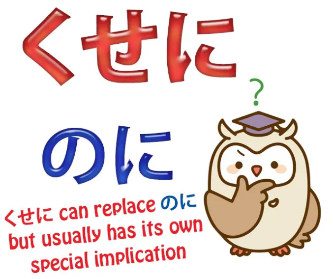
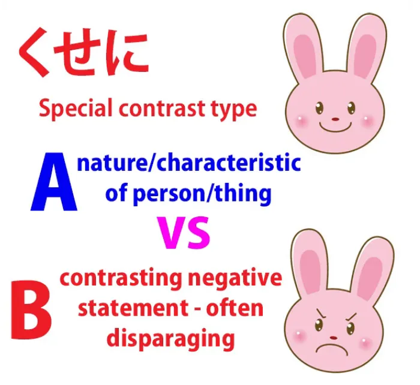
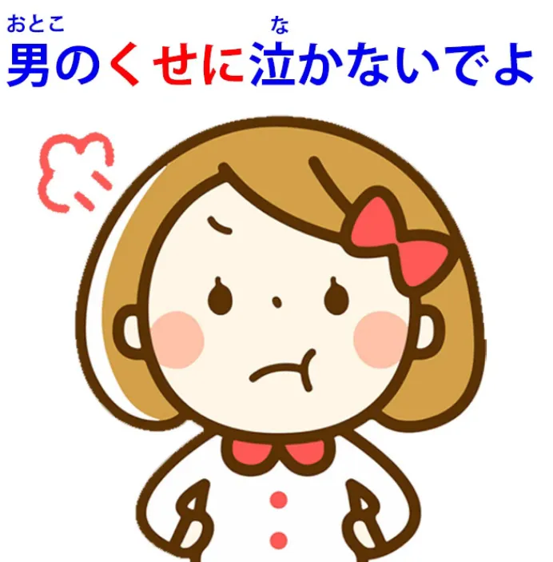
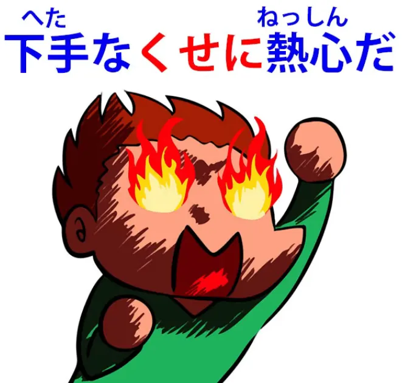
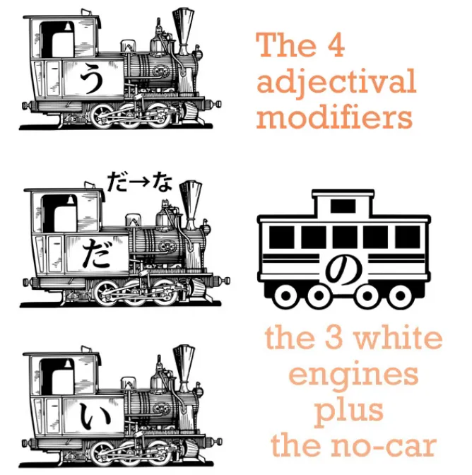

# **93. Отчитываем их с помощью くせに. Как это работает.**

[**Отчитываем их с помощью Kuse ni くせに. Как это на самом деле работает.**](https://www.youtube.com/watch?v=QvuNXIYqFNM&ab_channel=OrganicJapanesewithCureDolly)

こんにちは。

Сегодня мы поговорим о выражении, которое вы постоянно видите в аниме, манге, ранобэ и так далее, и которое может сбивать с толку по двум причинам. Одна из них заключается в том, что очевидная этимология, очевидная основа слова очень ясна, но она совершенно сбивает с толку. А другая — в том, что из-за способа его использования часто бывает неясно, на что оно указывает и что на самом деле делает. Однако, как только мы разберёмся с этим, его будет очень, очень легко понять.

**Это выражение — <code>くせに</code>.**

Итак, этимологическая проблема заключается в том, что хотя мы все знаем, что означает <code>[癖]{くせ}</code> **— это означает <code>привычка или особенность</code> —** **но не очень ясно, какое это имеет отношение к выражению <code>くせに</code>.** **И ответ: никакого.**

**Некоторые японские этимологические источники говорят нам, что** **это <code>くせ</code> изначально было другим <code>くせ</code>,** **но никто на самом деле не знает наверняка.** **Но суть в том, что оно действительно** **имеет очень мало общего с современным использованием.**

---

**Всё, что нам действительно нужно знать, это то, что <code>くせに</code>** **является противительным союзом, как <code>のに</code>.**

Я [**делала видео**](https://www.youtube.com/watch?v=Au5JOtcwE7A) о <code>のに</code>, и я оставлю здесь ссылку, но я буду исходить из того, что вы в основном знаете, что это такое и что оно делает. **<code>のに</code> и <code>くせに</code> — это противительные союзы, что означает,** **что они похожи на <code>でも</code> или <code>けれど</code>.** **Они соединяют два придаточных предложения таким образом, что это означает** **<code>несмотря на Придаточное А, Придаточное Б / хотя Придаточное А, Придаточное Б</code>.**

---

**Итак, <code>くせに</code> имеет две общие черты с <code>のに</code>.** **Одна из них заключается в том, что оно обычно имеет негативный подтекст,** **а другая — в том, что второе придаточное предложение довольно часто опускается.** **Таким образом, мы говорим: <code>хотя Придаточное А...</code>** **и затем не продолжаем говорить, что такое Придаточное Б.** **Мы просто подразумеваем это.** **<code>のに</code> делает это довольно часто, и <code>くせに</code> тоже.**

## Разница между のに и くせに

**Разница между <code>のに</code> и <code>くせに</code> заключается в том, что** **<code>くせに</code> не только имеет негативный подтекст,** **но и в большинстве случаев имеет очень специфический вид негативного подтекста.**

**И это особое использование по сути** **берёт природу, характер или положение человека** **и затем противопоставляет им его действия таким образом,** **что это крайне неблагоприятно,** **поэтому мы могли бы использовать <code>のに</code> в этих ситуациях,** **но <code>のに</code> звучало бы более сожалеюще.** **<code>くせに</code> звучит гораздо более напористо.** **Оно часто звучит как суровая критика.**

**И, как мы говорим, оно создаёт такой контраст,** **контраст между тем, что мы ожидаем от определённого типа [людей],** **и тем, что они на самом деле делают, и это негативный контраст.**

---

Так, например, мы могли бы сказать: <code>お金持ちの**くせに**ケチだ</code> (**несмотря на то, что** она состоятельна / богата, она скупа).

<code>女の**くせに**部屋が目茶苦茶だ</code> (**несмотря на то, что** она девушка, в её комнате беспорядок).

<code>男の**くせに**泣いている</code> (**несмотря на то, что** он мужчина, он плачет).

**И это обычно имеет оскорбительный характер.** **Они призваны выразить суровую критику.** **Таким образом, мы берём положение человека** **и то, что мы ожидаем от такого рода человека,** **а затем говорим что-то, что контрастирует с этим.**

**Но очень часто мы также опускаем это.**

Так, например, предположим, что какие-то плохие люди или монстры врываются в дом, и героиня противостоит им, а герой прячется в углу. Героиня может просто сказать: <code>男の**くせに**</code>, что буквально означает <code>**Несмотря на то, что** ты мужчина</code>, **но затем ничего об этом не говорит.**

В английском, вероятно, неструктурным, но естественным переводом было бы <code>And you're supposed to be a man</code> (А ты ещё называешься мужчиной).

---

**И это может вызвать путаницу, потому что** **это может приводить к конструкциям, которые сбивают нас с толку относительно того, что на самом деле происходит,** **и в каком направлении указывает <code>くせに</code>.**

---

Так, например, <code>男の**くせに**泣かないでよ</code>. Что здесь происходит? <code>**Несмотря на то, что** ты мужчина, перестань плакать</code>?

**Это то, что оно говорит? Ну, нет, это не так.** <code>男の**くせに**</code> **используется как бы вдогонку, как в предыдущем примере.** **А затем <code>泣かないでよ</code> добавляется к этому оскорблению вдогонку,** **так сказать, и это команда.**

Я делала видео о командах.[[83]](./83-three-levels-of-command-in-japanese-て-form-commands-なさい-な-commands-imperative-form.md)

**Итак, <code>泣かないでよ</code> — это не предложение, это просто команда: <code>Перестань плакать!</code>** Точно так же, как в английском <code>Stop crying</code> не является предложением с подлежащим и сказуемым. Это просто команда.

**Так что на самом деле эти два утверждения** **должны быть разделены точкой (или в японском <code>まる / 。</code>),** **потому что они не являются частью одного и того же предложения,** но они не обязательно будут разделены, когда вы увидите их написанными, и не обязательно будет большая пауза, когда вы услышите их произнесёнными.

<code>男のくせに泣かないでよ</code>: **это два отдельных утверждения,** и если мы этого не понимаем, это может сбить нас с толку относительно использования <code>くせに</code>.

---

Ещё одна вещь, которая может сбивать с толку, это то, что **связь может идти в обратном направлении.**

Вообще говоря, **мы берём качества человека,** **которые являются фундаментально хорошими качествами** — быть мужчиной, быть девушкой, быть богатым — **а затем добавляем к ним что-то негативное:** **Несмотря на то, что** ты девушка, в комнате беспорядок / **Несмотря на то, что** ты мужчина, ты прячешься в углу / **Несмотря на то, что** ты богат, ты скуп.

---

**Но это может работать и в обратном направлении.**

Например, мы могли бы сказать <code>下手な**くせに**熱心だ</code>. Это означает <code>**несмотря на то, что** он неумелый / бесполезный, он полон энтузиазма</code>.

**Однако это обычно не используется в положительном смысле.** Это означает:
«Вот этот человек ходит такой воодушевлённый, а он бесполезен, ничего не может сделать».

---

**Так что это тоже может работать таким образом, и нам нужно это осознавать,** потому что это снова может обмануть нас. **В большинстве случаев противительный союз** **работает так, как мы обсуждали,** **но это не обязательно.**

---

Теперь, если бы это был учебник или инструкция JLPT, мы бы говорили о том, что они называют <code>接続</code> (союзы):
::: info
<code>接続</code> — это сокращение, которое может использоваться для обозначения термина «союз», полная версия — <code>接続語</code>
:::
как <code>くせに</code> присоединяется к тому, что стоит перед ним?

**Мы знаем, как оно присоединяется к тому, что стоит после него:** **это просто соединитель придаточных предложений,** **поэтому то, что стоит после него, — это второе придаточное предложение, которое может быть опущено.**

Но стандартные учебники будут говорить о том, как оно соединяется с тем, что стоит перед ним: с существительным вы используете <code>の</code>, с адъективным существительным вы используете <code>-な</code>, с прилагательным вы ничего не используете. **Конечно, ничего из этого не нужно, если вы изучали структурный японский.**

---

**<code>くせ</code>, что бы это ни было, какова бы ни была её этимология, является существительным.** **Мы это прекрасно знаем, потому что** **всё, что не является глаголом или прилагательным, является существительным в японском языке.**

**То, что стоит перед <code>くせ</code>, модифицирует <code>くせ</code>,** **оно говорит нам, о каком <code>くせ</code> мы говорим.**

---

**И это происходит точно так же, как любой модификатор всегда модифицирует существительное.**

**Итак, если это существительное, что чаще всего и бывает,** **тогда мы используем <code>の</code> для модификации другого существительного,** которое следует за ним, как мы всегда это делаем: <code>男**の**くせ / 女**の**くせに</code>. **Если это адъективное существительное,** **тогда, очевидно, мы используем <code>-な</code>,** как мы делали с <code>下手**な**くせに</code>. **И если это прилагательное, очевидно, нам больше ничего не нужно** — **прилагательные модифицируют существительные напрямую.** Вот что делает прилагательное.

---

Так что мы могли бы сказать <code>**若い**くせにお年寄りに席を譲らない</code> (хотя она **молода**, она не уступает место пожилым людям). **Если бы это был глагол, очевидно, мы бы просто использовали глагол для модификации существительного, как мы всегда это делаем.**

Так что, я думаю, теперь у вас не будет никаких проблем с <code>くせに</code>.

---

Если у вас есть какие-либо проблемы или вопросы по этому поводу или по чему-либо ещё, пожалуйста, оставьте их в комментариях ниже, и я отвечу, как обычно.

Я хотела бы поблагодарить моих патронов Золотым Кокеши, моих ангелов-продюсеров, которые делают эти видео возможными, и всех моих патронов и сторонников. Одна из вещей, которую делает наша революция в японском языке, это не просто показывает нам методы применения, но и показывает, что нам нужно применять их гибко.

Некоторые методы применимы иногда, а иногда нет. История и этимология слов могут быть очень полезны иногда, и я делала видео об этом. И всякий раз, когда я делаю видео об этом, даже если я указываю, что история и этимология не всегда очень полезны, люди начинают спрашивать меня: <code>Знаете ли вы историю этого, знаете ли вы историю того?</code>

И, конечно, в большинстве случаев я могу просто посмотреть это. Вы не всегда можете найти это на английском, но обычно можете найти на японском.

**Но суть в том, что бывают случаи,** **когда этимология чрезвычайно нам помогает,** **бывают случаи, когда она совсем нам не помогает,** **бывают случаи, когда она могла бы помочь нам в некоторой степени,** **но это довольно окольный путь,** **и мы можем сократить его, изучая вещи другим методом.** **Часть нашей революции здесь** **— это отход от жёсткого подхода учебников.** **Но всегда применяя фундаментальные структурные знания,** **потому что структурные знания дают нам ядро, которое нам нужно,** **чтобы избавиться от зубрежки того и этого.**

Спасибо всем за вашу помощь в этой революции.