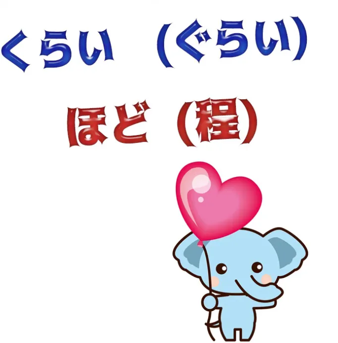
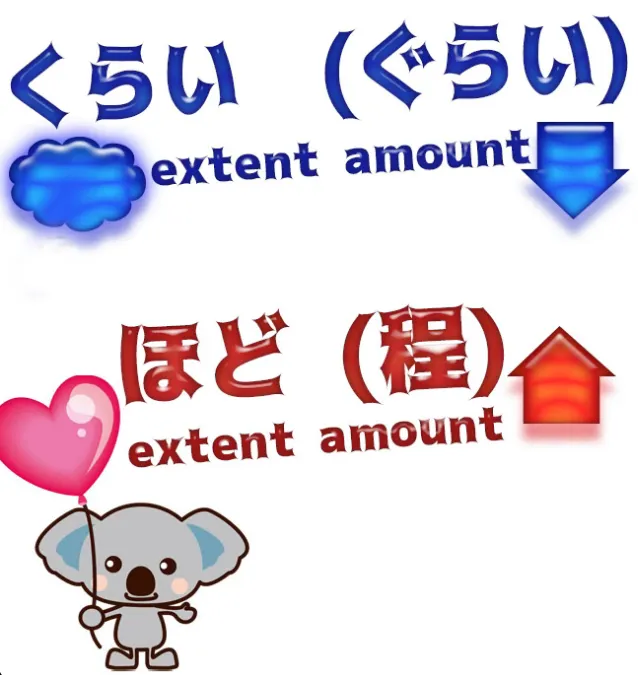
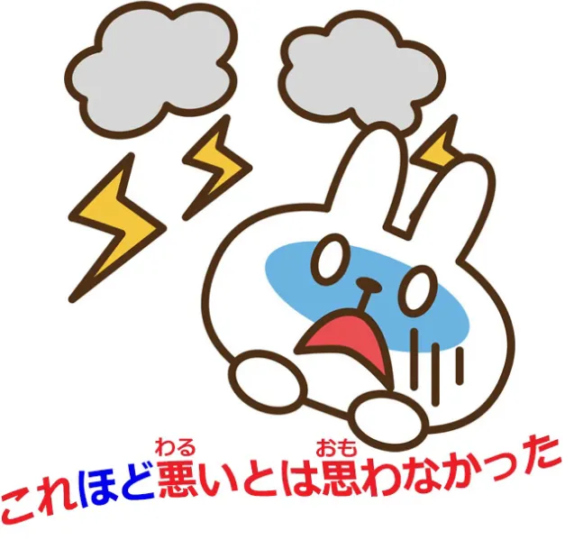
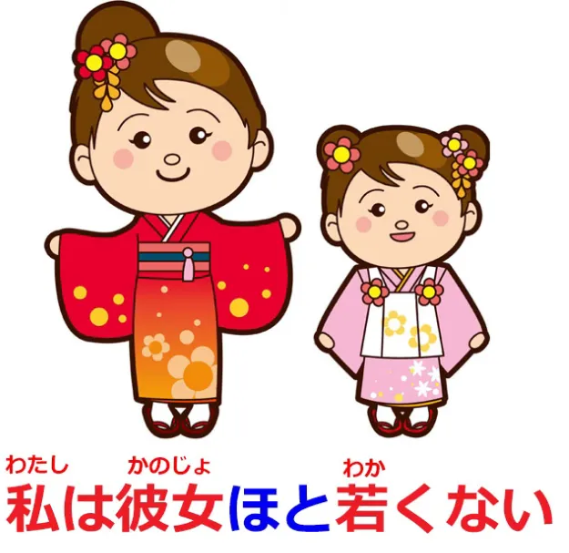
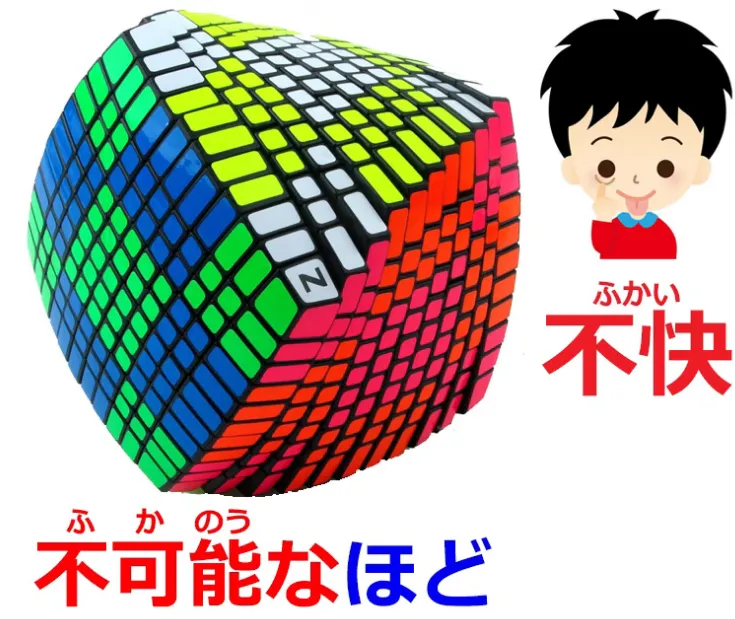
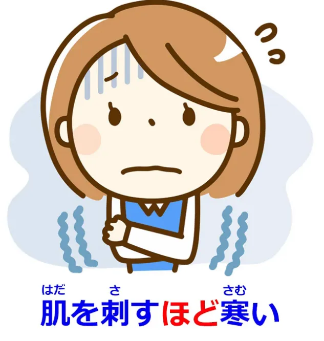
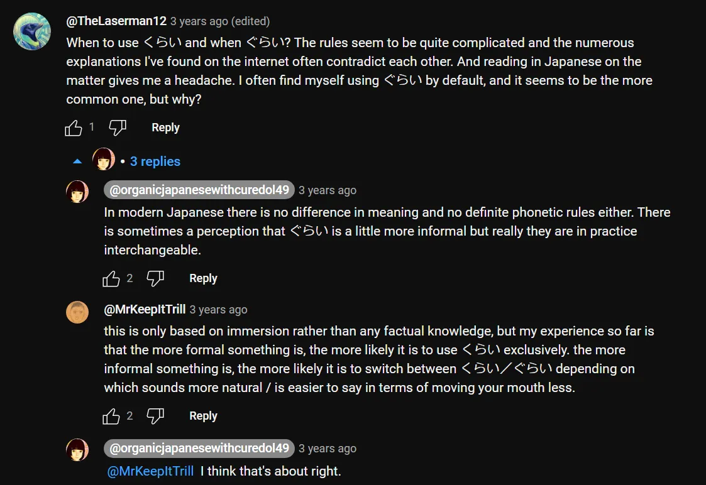

# **94. くらい VS ほど**

[**くらい (kurai) VS ほど (hodo) Что они означают и почему они это означают.**](https://www.youtube.com/watch?v=6PEQTcDnbBk&ab_channel=OrganicJapanesewithCureDolly)

こんにちは。

Сегодня мы поговорим о двух словах, которые часто вызывают у людей трудности и путаницу при погружении в язык, потому что их часто объясняют не очень ясно, поэтому иногда бывает трудно понять, что именно они делают.

**Эти два слова — <code>くらい</code> и <code>ほど</code>.**

Я получила много запросов на <code>くらい</code>, здесь и на моём Patreon, и довольно много запросов на <code>ほど</code>. И я собираюсь рассмотреть их вместе, потому что, думаю, они могут пролить свет друг на друга. И прежде чем мы начнём, я просто скажу, что если у вас есть какие-либо слова, которые доставляют вам проблемы, мешают вам понимать что-то при погружении в язык, пожалуйста, оставьте их в комментариях ниже, и я либо отвечу сразу, либо добавлю их в свой список тем для рассмотрения.

---

Итак, <code>ほど</code> и <code>くらい</code>. **Они оба, конечно, существительные.**

**Практически всё в японском языке, что не является глаголом или прилагательным, как мы знаем, на практике является существительным или существительно-подобной сущностью.**

Так что же такое <code>ほど</code>? Что такое <code>くらい</code>?

**Оба они представляют собой степень или количество чего угодно: времени, денег, расстояния и т.д.**

**Однако главное различие между ними заключается в том, что <code>ほど</code> имеет тенденцию подразумевать, что задействованное количество или степень велики,**

---

**а <code>くらい</code> либо отмечает это как неопределённое, как то, в чём мы не уверены, либо, в некоторых случаях, о которых мы поговорим чуть позже, как малое, как меньшее, чем мы могли бы ожидать или надеяться.**

Итак, чтобы проиллюстрировать это различие, давайте рассмотрим их оба в очень простой конструкции. **<code>これくらい</code> означает: примерно столько, примерно такое количество, примерно так далеко, примерно так быстро, примерно такая температура, что угодно.**

**<code>これほど</code> означает: столько, такое количество, так жарко, так холодно, но это подчёркивает, что это большая степень, большое количество.**

## ほど

Итак, если мы говорим <code>**これほど悪い**とは思わなかった</code>, мы говорим: <code>Я не думал(а), что это **настолько плохо**</code>.

**Таким образом, <code>これ</code> (это), модифицирующее <code>ほど</code>, не просто говорит <code>настолько плохо</code>, оно говорит, что <code>настолько плохо</code> — это много, это больше, чем мы могли бы ожидать или желать.**

**В отрицательном смысле**, если мы говорим <code>**それほど**悪くない</code>, мы говорим: <code>это не **так уж** плохо</code>.

Теперь, **на что ссылается <code>それ</code> в таком случае?**

**Оно может ссылаться на что-то, на что мы уже ссылались, на степень или объём, которые мы уже обсуждали,** но также, как и в английском, **<code>それ</code> (или <code>that</code>) может просто означать количество, которое мы могли бы ожидать.**

---

**Итак, опять же, то, что модифицирует <code>ほど</code>, <code>それ</code>, представляет собой большое количество, верхний предел, и затем мы не достигаем этого верхнего предела, отмеченного <code>ほど</code>.**

Итак, <code>**それほど**悪くない</code> означает <code>не **так уж** плохо</code> — **либо не так уж плохо**, как мы обсуждали или как подразумевается в разговоре, **либо просто <code>не так уж плохо</code>**, что работает точно так же, как и в английском — **<code>that</code>, когда нет точки отсчёта, просто означает то, что мы могли бы ожидать или чем это могло бы быть.**

Так что, если мы говорим по-английски <code>it's not that bad</code>, мы имеем в виду, **это не очень плохо, это не так плохо, как могло бы быть.**

---

И то же самое с <code>**それほど**悪くない</code>. **Если мы не ссылаемся на конкретное, определённое <code>that</code>, то мы говорим: <code>это не **очень** плохо / это не **настолько уж** плохо</code>.**

И опять же, **<code>ほど</code> часто используется для обозначения одной стороны сравнения, и снова <code>ほど</code> представляет собой большую сторону, верхний предел.**

Так что, если мы говорим <code>私は彼女**ほど**若くない</code>, мы говорим: <code>Я не **так** молода, **как** она</code>,

Я не молода **в той степени, в какой** молода она, и **её степень** — **это более высокая степень**, **и поэтому именно она модифицирует <code>ほど</code>.**

### ほど как существительное

Теперь, **<code>ほど</code> может использоваться как почти независимое существительное, представляющее верхний предел чего-либо.**

Так что, если мы говорим <code>不可能**なほど**</code>, мы говорим (<code>不可能</code>: <code>可能</code> означает возможно; <code>不可能</code> означает невозможно) <code>不可能な**ほど**</code> означает **верхний предел** невозможности.

**Это не просто <code>不可能</code>, не просто невозможно, это <code>ほど</code> от <code>不可能</code>, это верхний предел <code>不可能</code>, это вершина невозможности.**

Или <code>不快**なほど**失礼</code> — <code>不快</code> — это неприятный, нелюбимый; <code>失礼</code>, конечно, это грубость. Это грубость **до верхнего предела** неприятности / неприязни.

---

И эти **<code>ほど</code>, где мы используем адъективное существительное и добавляем <code>なほど</code>** — **верхний предел этого адъективного существительного, используя это адъективное существительное для модификации <code>ほど</code>** — **очень часто они имеют тенденцию быть негативными вещами, но они могут быть и более нейтральными,** например, мы могли бы сказать <code>不思議**なほど**</code> — **верхний предел** таинственности, абсолютно таинственный.

::: info
Эта фраза выше, по-видимому, является выражением, которое также может означать <code>чудесный/изумительный</code>.
:::

**И ещё одно часто используемое выражение с <code>ほど</code> — это <code>ほどがある</code>, и это действительно означает, что существует верхний предел.**

**И это обычно используется при жалобах на что-либо.**

Так что мы говорим <code>冗談にも**ほどがある**</code>, что буквально означает, что даже у шутки **есть верхний предел**, и обычно это означает, что то, что вы говорите / делаете, **выходит за рамки** шутки.

::: info

:::

У шуток есть **верхний предел**, и вы его превысили. <code>バカにも**ほどがある**</code> (у глупости **есть верхний предел**), что немного похоже на то, как если бы мы сказали: <code>Даже ты не можешь быть настолько глупым</code> или вы превысили **верхний предел** глупости.

### ほど для образования сравнений

**И, возможно, самое распространённое использование <code>ほど</code>,** то, которое вы, вероятно, будете видеть постоянно, **это его использование для образования сравнений.**

Теперь, **в японском языке существуют различные виды сравнений, но <code>ほど</code> используется особенно тогда, когда мы подчёркиваем крайнее качество чего-либо.**

**Оно часто используется для сравнений, которые по сути являются преувеличениями, но подчёркивают, что что-то очень сильно является тем, что мы о нём говорим.**

Так, мы могли бы сказать: <code>死ぬ**ほど**暑い</code> (жарко **до такой степени, что** можно умереть); <code>肌を刺す**ほど**寒い</code> (холодно **до такой степени, что** пронзает кожу);

<code>信じられない**ほど**美しい景色</code> (пейзаж, который красив **до такой степени, что** невероятен).

---

**И это <code>ほど</code>, которое используется для преувеличения, для литературных целей, просто для очень сильного подчёркивания, вероятно, является тем <code>ほど</code>, которое вы будете видеть чаще всего.**

**Это очень распространённое использование <code>ほど</code>.**

## くらい

Итак, давайте посмотрим на <code>くらい</code>. **<code>くらい</code> чаще всего используется для приближения.**

Так что мы могли бы сказать: <code>到着するのは八時**ぐらい**です</code> — мы говорим, что прибываем **примерно** в восемь часов.

<code>八百円**ぐらい**です</code> (это **около** восьмисот иен). И это очень просто.

::: info
<code>くらい</code>, как вы видите, иногда может менять звучание на <code>ぐらい</code> в некоторых фразах.  
*Что касается того, когда это происходит, это, по-видимому, уже не так ясно, как можно прочитать [**здесь**](https://japanese.stackexchange.com/questions/433/is-there-a-rule-for-when-to-use-%E3%81%8F%E3%82%89%E3%81%84-vs-%E3%81%90%E3%82%89%E3%81%84). Но не стоит сильно беспокоиться.*

:::

**Мы используем его всякий раз, когда хотим говорить о количестве, степени, объёме и сделать это расплывчатым, дать понять, что мы не говорим о точном количестве или точной степени.**

---

**И единственное, что здесь нужно иметь в виду, это то, что иногда японцы будут использовать это, когда на самом деле речь идёт о чём-то точном.**

Так, например, мы могли бы сказать: <code>どの**くらい**掛かりますか?</code> (**примерно** сколько это будет стоить?) **И мы можем спрашивать об оценке, если это тот случай, когда вы спрашиваете об оценке, но мы также можем спрашивать цену в случае, когда мы можем ожидать, что продавец знает точную цену, но почему-то кажется менее настойчивым спрашивать приблизительную цену, а не точную.**

---

**И люди также иногда будут делать это, когда говорят о времени прибытия или... о чём угодно.**

**И это отчасти потому, что японцы в целом очень точны, поэтому, если они думают, что есть хоть малейший шанс, что время или какой-либо факт могут немного отличаться от того, что они говорят, им кажется немного безопаснее сделать это немного расплывчатым, чтобы не брать на себя обязательства по поводу чего-то точного, что может оказаться не совсем правдой.**

### くらい как малая степень чего-либо = <code>по крайней мере</code>

Теперь, **другое использование <code>くらい</code> (или <code>ぐらい</code>)**, как я уже упоминала, **говорит о степени и подчёркивает, что эта степень является той, которую мы считаем малой, а не большой, которую подразумевает <code>ほど</code>.**

Так что, если мы говорим <code>今日**くらい**家族と過ごそう</code>, мы говорим: <code>Сегодня, **по крайней мере**, давайте проведём время с семьёй</code>.

**И именно это <code>くらい</code> даёт нам значение <code>по крайней мере</code>.**

**Оно показывает, что когда мы говорим <code>сегодня</code>, мы не просто говорим <code>сегодня</code>, мы подразумеваем, что, возможно, мы не проводим много времени с семьёй, возможно, мы не сможем провести время с семьёй снова, но сегодня, по крайней мере, давайте проведём время с семьёй.**

#### くらい как жалоба на что-либо

**И очень часто это <code>くらい</code> используется, когда кто-то жалуется на что-то и когда кто-то действительно говорит, что не только <code>くらい</code> мало, но даже это малое <code>くらい</code> не было получено.**

**И когда оно используется таким образом, оно часто сопровождается другим выражением <code>по крайней мере</code>, таким как <code>少なくとも</code> или <code>せめて</code>, и часто в конце отмечается маркером сожаления, таким как <code>のに</code>.**

---

Итак, мы могли бы сказать: <code>少なくとも「ありがとう」**ぐらい**言ってくれてもいいのに</code>, что буквально означает: <code>по крайней мере **хотя бы** спасибо, если бы вы любезно сказали, было бы хорошо, но...</code>

В естественном русском языке мы, вероятно, сказали бы: <code>Вы могли бы хотя бы сказать спасибо</code>.

То, что мы здесь говорим, это то, что **хотя бы** спасибо, если бы вы любезно сказали, было бы хорошо, **и мы добавляем <code>のに</code>, которое,** как [**я объясняла в другом месте**](https://www.youtube.com/watch?v=Au5JOtcwE7A), **на самом деле является соединителем контрастных придаточных предложений.**

**Оно используется для соединения одного логического придаточного предложения с другим, чтобы составить полное предложение с подразумеваемым <code>но</code>, что второе придаточное предложение несколько контрастирует или противоречит первому, но оно часто используется таким образом как окончание предложения.**

И здесь подразумевается: было бы хорошо, если бы вы сказали **хотя бы** спасибо, **но** (вы даже этого не делаете).

Итак, я надеюсь, это проясняет <code>くらい</code> и <code>ほど</code>.