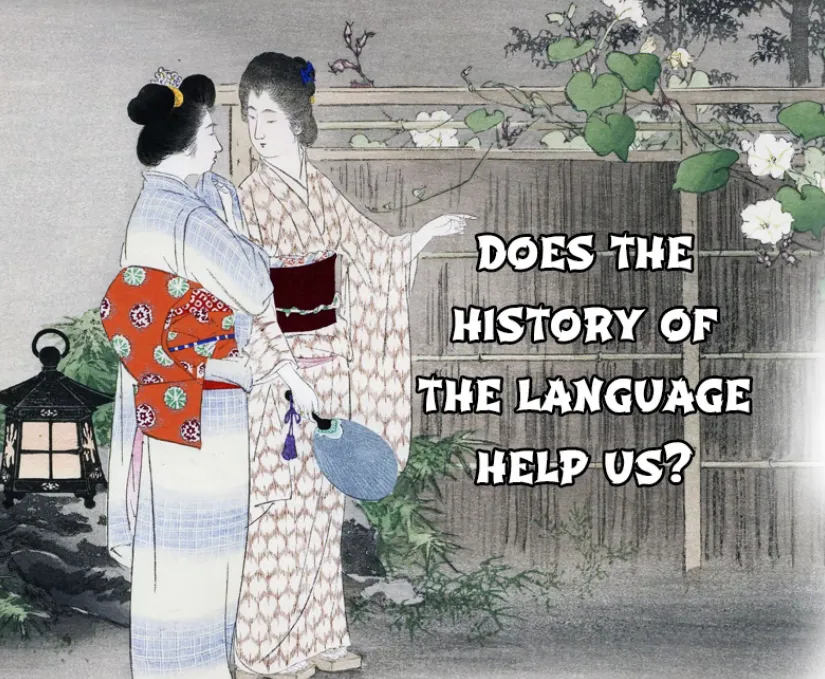
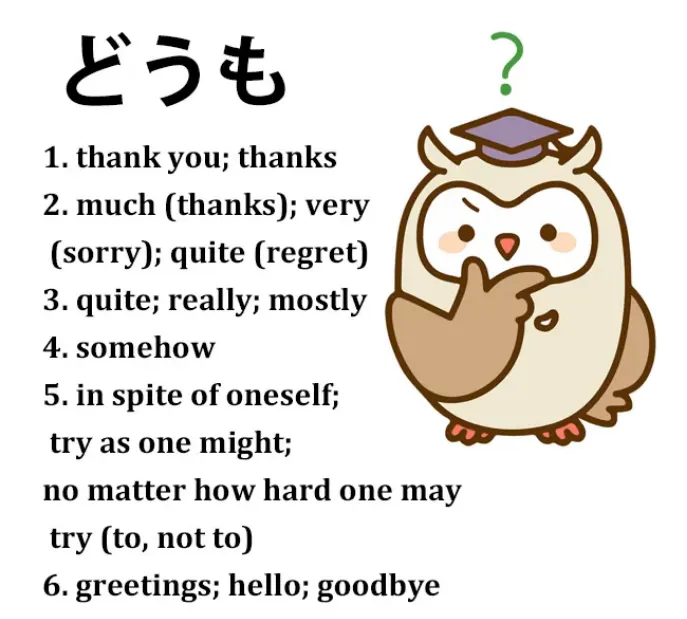
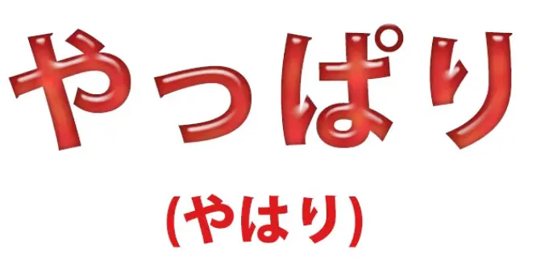
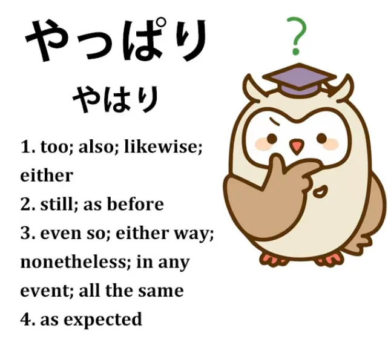
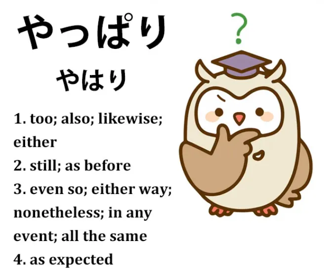
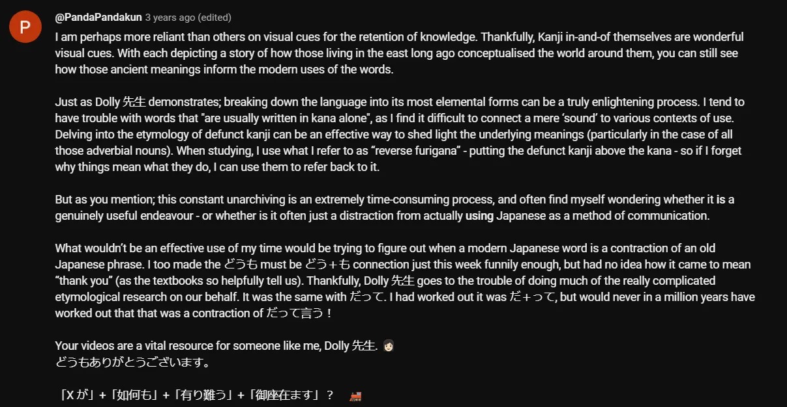

# **95. Использование истории слов с умом: どうも, やっぱり, やはり**

[**Подробный словарный запас — Использование истории слов с умом どうも (doumo), やっぱり (yappari), やはり (yahari)**](https://www.youtube.com/watch?v=WUmByRnrx_U&ab_channel=OrganicJapanesewithCureDolly)

こんにちは。

Сегодня мы рассмотрим вопрос, который иногда возникает, потому что я подхожу к японскому языку структурно, и люди иногда спрашивают: **«Помогает ли пониманию гранулярной структуры языка знание его истории, знание того, откуда берутся слова?»**

И мой ответ на это прагматичен, потому что весь мой подход прагматичен, и ответ таков: **<code>Я бы сказала, в большинстве случаев нет, но иногда да.</code>** Я предполагаю, что большинство людей, смотрящих эти видео, хотят научиться использовать японский язык, читать его, слышать, говорить, писать, и не заинтересованы фундаментально в истории языка. **Если нас интересует история языка, это другое дело.**

**Чисто с точки зрения освоения языка, это загромождает наш разум информацией, которая нам не особенно нужна.** **Но бывают моменты, когда знание истории языка становится очень полезным, и моменты, когда структурные головоломки не могут быть полностью решены без неё.** И я постараюсь предупредить вас, когда это так, и дать необходимую информацию.

**Бывают также моменты,** что может показаться странным, **когда не столько реальная история языка, сколько народная история, этимологические идеи, которые на самом деле неверны, могут быть очень полезны.**

Звучит странно, я знаю, но почему? Ну, потому что **одна из причин, почему история языка часто не очень полезна, заключается в том, что она не рассказывает нам о том, как язык работает сейчас, она рассказывает нам о том, как язык работал несколько сотен лет назад.** И нам это не особенно нужно знать.

**С другой стороны, народная этимология, идеи о происхождении слов, которые на самом деле не соответствуют исторической правде, как правило, отражают представления более современных людей о том, как язык действительно работает сейчас.** **И поскольку эти народные этимологии исходят от японоговорящих людей в японской среде, они, как правило, окрашены пониманием японцами того, как язык работает сейчас, а не того, как он работал раньше, когда слова формировались.**

Итак, мы рассмотрим пару примеров, и начнём с того, в котором реальная история языка полезна для нас. И я возьму комментарий от Algirion-san, который прокомментировал: *«Одно из слов, которое меня немного сбивает с толку, это **<code>どうも</code>**.* *Оно часто используется как приветствие.* *Однако я предполагаю, что его буквальное значение примерно соответствует «любым способом».* *Вероятно, это не такой уж критический вопрос, но мне всё равно интересно, как оттуда оно доходит до **приветствия**.»*

## どうも

Итак, это интересный вопрос, и он не так уж критичен, когда мы говорим о более обычных значениях <code>どうも</code>, когда оно означает <code>спасибо</code> или что-то в этом роде. **Это становится более критическим вопросом, когда мы рассматриваем другое его значение, которое кажется совершенно несвязанным, но на самом деле таковым не является.**

---

**Когда мы заглядываем в словарь, мы находим множество определений для <code>どうも</code>:**
спасибо, благодарность, очень, весьма, а также такие вещи, как почему-то, невольно, как ни старайся, как бы ни пытался что-то сделать или не сделать.

**И, как видите, они кажутся совершенно несвязанными с более распространёнными значениями слова, и нам очень помогает знание того, откуда на самом деле произошло <code>どうも</code>.**

Одна из причин, по которой я процитировала комментарий Algirion-san, заключается в том, что он на самом деле правильно понял структуру. *<code>Я предполагаю, что буквальное значение примерно соответствует «любым способом».</code>* И это так.

**Проблема здесь в том, что если мы не знаем немного больше об истории, это не продвинет нас достаточно далеко.**

---

**<code>どうも</code> на самом деле берёт начало в эпоху Эдо и является сокращением выражения <code>どうも言えぬ</code>.** **И это означает <code>любым способом</code> — часть <code>どうも</code> означает <code>любым способом</code> — а <code>言えぬ</code> означает <code>невозможно сказать</code>.**

Это отрицательное -ぬ — это то, о чём [**я говорила в недавнем видео**](https://www.youtube.com/watch?v=E7Qop8dwP4w), так что если вы об этом не знаете, я оставлю ссылку над головой.

**И в большинстве более распространённых случаев это использовалось в период Эдо вместе со словом <code>ほど</code>.** И я также сделала недавнее видео о <code>ほど</code>, так что я оставлю ссылку.[[94]](./94-くらい-vs-ほど.md)

**Итак, <code>どうも言えぬほど</code>:**

<code>どうも言えぬ</code> означает <code>Я никоим образом не могу сказать</code>; **<code>どうも言えぬほど</code> означает <code>до такой степени, что я никоим образом не могу сказать</code>.**

---

**И теперь мы начинаем видеть, как это применимо к наиболее распространённым использованиям <code>どうも</code>.**

**<code>どうもありがとうございます</code> означает не просто <code>Спасибо</code>, а <code>Я благодарен до такой степени (ほど), что не могу выразить никакими средствами / Я невыразимо благодарен</code>.**

<code>**どうも**すみません</code>: <code>Я **невыразимо** сожалею</code>.

**Конечно, это гипербола, и, как всегда бывает с гиперболами, когда они закрепляются в языке как обычные выражения, она теряет большую часть своей силы, поэтому в итоге просто означает <code>очень</code>.**

Итак, <code>**どうも**すみません</code> (Я **очень** сожалею); <code>**どうも**ありがとうございます</code> (Спасибо **большое**).

---

**И это присоединяется к базовым устойчивым выражениям, таким как <code>挨拶</code> (приветствие), до такой степени, что может использоваться для замены <code>挨拶</code> даже в тех случаях, когда неясно, что именно является <code>挨拶</code>.**

**Так что мы можем использовать <code>どうも</code> для замены прощания и приветствия <code>挨拶</code>.**

**Мы просто говорим <code>очень</code>:** <code>Я **очень** рад(а) вас видеть</code>; <code>Я **очень** жду новой встречи</code>. **Это просто стало своего рода общим заменителем <code>挨拶</code>.**

---

**И это очень полезное выражение, потому что, будучи несколько экспрессивным, оно кажется приятным и вежливым, не слишком формальным, не слишком неформальным, это просто очень полезное выражение, которое можно вставить вместо <code>挨拶</code>.**

**Конечно, оно заменяет те, где это имеет больше логического смысла, поэтому мы можем сказать <code>どうも</code> для <code>Извините</code> и <code>どうも</code> для <code>Спасибо</code>.**

Итак, это более распространённые использования.

---

Теперь, другие значения в словаре: почему-то, невольно, как бы ни старался или ни пытался не делать — такого рода вещи.

**Мы видим, что это на самом деле <code>どうも言えぬ</code> без <code>ほど</code>.** Мы просто говорим **<code>どうも言えぬ</code>** (Я не могу **никак** выразить).

Итак, если мы говорим <code>**どうも**落ち付かない</code> (**почему-то** я просто не могу успокоиться, не могу устроиться).

**<code>どうも</code>** (почему-то), что изначально является <code>どうも言えぬ</code>: Я не могу **никак** сказать почему, но я не могу успокоиться.

<code>**どうも**呼吸が合わない</code> (**почему-то** мы просто не ладим).

Наши дыхания не сходятся, буквально.

**Почему-то** мы просто не ладим — я не могу сказать, почему это так, но **почему-то** это так.

---

**И отсюда, если мы не можем что-то сделать или в итоге не делаем что-то, и как бы мы ни старались это сделать или не сделать, это не происходит...**

<code>**どうも**言えぬ</code> (Я не могу сказать почему, **но так уж получилось**).

**Вот как <code>どうも</code> приобретает такой широкий спектр значений.** И если мы свяжем это с концепцией невозможности выразить что-либо каким-либо образом, мы увидим, как всё это произошло, и, я думаю, это значительно облегчает понимание и использование.

## やっぱり / やはり

Теперь, **один случай, когда мы поговорим о ложной этимологии, это <code>やっぱり</code>, которое также имеет чуть более формальную форму <code>やはり</code>.**

Это похоже на <code>[日本]{にほん}</code>, которое также может произноситься как <code>にっぽん</code>. **<code>やはり</code> может произноситься как <code>やっぱり</code>.**

---

**И наиболее распространённый способ, которым мы слышим это, означает <code>именно так, как мы думали, именно так, как мы понимали</code>.**

Итак, если Сакура делает что-то очень глупое, мы можем сказать: <code>**やっぱり**さくらはバカなのね</code> (**Именно так, как мы и думали**, Сакура — идиотка).

Теперь, **другой способ**, которым мы часто слышим это в погружении, аниме, других местах, **это когда чувство поднимается внутри нас и очень часто меняет наше мнение.**

Так, например, если наша героиня смотрит на страшный дом и говорит: <code>Ой, это очень страшно, я туда не пойду</code>, а затем она принимает решение, собирается с духом и говорит: <code>Ладно, я иду</code> (よし行くぞ), и она входит, открывает дверь, оглядывается и говорит <code>**やっぱり**怖い</code> *(Как и ожидалось, (это) страшно)* и в итоге решает не заходить.

Что здесь происходит?

Словарь снова даёт ему довольно широкий спектр значений, некоторые из которых мы слышим реже, но все они являются частью значения слова, такие как **<code>still</code> (всё ещё), <code>as before</code> (как и прежде), <code>even so</code> (тем не менее), <code>either way</code> (в любом случае), <code>nonetheless</code> (тем не менее), и так далее.**

Как всё это вписывается в <code>やっぱり</code>?

Итак, существует народная этимология для <code>やっぱり</code>.

<code>やっぱり</code> пишется иероглифами вот так.
*(или, скорее, <code>やはり</code>, поскольку у вас не будет варианта с <code>やっぱり</code>)*

**Не пишите так, потому что вы будете выглядеть как человек, который изучал Хейсига и понятия не имеет, что пишется иероглифами, а что нет.**

*Примечание: Это действительно хороший совет, поскольку одна из особенностей японского языка — это знание того, когда выражение имеет устаревшую/ненужную форму кандзи, которая больше не используется в обычной речи. Обычно, по крайней мере при использовании японской клавиатуры, то, что вам предлагается в первую очередь, скорее всего, является наиболее распространённой версией; распространённые выражения и служебные слова, как правило, не используют кандзи, и написание каждого слова кандзи может показаться излишним. Вы поймёте, какие слова не склонны использовать свои формы кандзи, чем больше вы будете читать.*

*Хотя некоторые авторы могут использовать устаревшие/избыточные формы кандзи для имитации архаичных настроек и т. д.*

**Но это иероглифы: <code>やはり</code>.**

**Как видите, у нас есть стрела и иероглиф, означающий натяжение, напряжение или затягивание.**

---

**И эти иероглифы на самом деле не являются оригинальными и, по-видимому, использовались только для звучания.**

Так что народная этимология здесь не является исторически точной.

Но она утверждает, что иероглифы, которые означают натягивание стрелы на луке — что происходит, когда мы натягиваем стрелу на луке?

Ну, в этот момент мы фокусируемся, не так ли, на цели. И в дзен-стрельбе из лука — а японская стрельба из лука довольно сильно основана на дзен — мы должны видеть только эту цель.

Теперь, предположим, мы отвлеклись. Предположим, мы оглядываемся, что-то видим, слышим шорох, кто-то говорит с нами.

**Если мы хорошие лучники, сразу после этого мы возвращаемся к <code>やはり</code>, к натянутой тетиве, к цели, за пределами которой мы ничего не видим.**

**Итак, идея заключается в возвращении к нашему первоначальному фокусу.** Это то, что мы имеем в виду, когда говорим о Сакуре.

**Мы всегда думали, что она идиотка, и <code>やっぱり</code> она идиотка.**

**Это также работает с чувствами, которые в некотором смысле являются более сильным фокусом, чем мысли.**

Итак, **если что-то изначально казалось страшным, затем мы решаем пойти и встретиться с этим, а затем, когда мы туда приходим, <code>やっぱり</code> это страшно, нас возвращает к нашему первоначальному фокусу.**

**Теперь, что мы с этим делаем, зависит от нас.** **Мы можем тогда решить не заходить; мы можем решить зайти.** **Но в любом случае, нас вернуло к этому <code>やっぱり</code>, к этому первоначальному фокусу.**

---

Так что насчёт этих других словарных определений?

**Как это часто бывает с английскими словарными определениями, это не столько то, что на самом деле означает <code>やはり / やっぱり</code>, сколько английские выражения, чей спектр значений в определённых точках пересекается со спектром значений <code>やはり</code>.**

---

Итак, **когда мы берём слова <code>either</code> (тоже, также) и <code>also</code> (тоже, также),** которые на самом деле означают одно и то же **в определённых контекстах** в английском... **Просто английский использует одно слово для отрицания, а другое для утверждения, чего нет в японском.**

Так, например, если мы говорим <code>やはり...</code> (и в таких случаях это обычно <code>やはり</code>) <code>**やはり**僕も見ない</code> (Я **тоже** этого не вижу).

Что там делает это <code>やはり</code>?

**Ну, конечно, мы не говорим <code>Я тоже этого не видел</code>, если другой человек не сказал, что он этого не видел.**

**Итак, что мы здесь делаем, это возвращаемся к первоначальному фокусу разговора:**

А: «Вы этого не видели?»

Б: Ну... (подчёркивая, что мы возвращаемся к этому фокусу)
Я **тоже** этого не видел.

---

<code>僕も**やはり**行きました</code> (Я **тоже** пошёл / Я **также** пошёл).

Опять же, **другой человек сказал, что он пошёл, и мы подчёркиваем <code>も</code>, говоря <code>やはり</code>**, **возвращаясь к первоначальному фокусу этой части разговора, к тому факту, что вы пошли,** <code>ну, ****やはり**** — **первоначальный фокус** — я **тоже** пошёл.</code>

---

И оно может использоваться для понятий, выходящих даже за рамки того, что указывают словари.

Например, **оно может означать <code>предсказуемо</code>:**

<code>**やっぱり**雨が降り出した.</code>

Теперь, **в этом случае мы, возможно, не думали конкретно, что пойдёт дождь, но мы говорим, что, ну, все знают, что в таких случаях идёт дождь.**

Итак, **возвращаясь к тому, что могло быть нашим первоначальным фокусом, если бы он у нас был,** <code>**やっぱり**雨が降り出した</code> или, как вы могли бы сказать по-английски, <code>**Как и следовало ожидать**, пошёл дождь</code>.

---

Итак, я надеюсь, это поможет с этими очень распространёнными словами.

И **к счастью, я бы сказала, не так уж часто нам нужно знать историческую информацию, выходящую за рамки обычной структуры слова, чтобы понять его.**

Но, очевидно, бывают случаи, **особенно с выражениями, взятыми из пословиц и тому подобного, когда полезно знать пословицу, а в некоторых случаях с такими словами, как это, когда полезно знать, что изначально означало <code>どうも</code>.**

**А в случае с <code>やっぱり</code> это концепция, которой у нас на самом деле нет в английском, эта концепция первоначального фокуса, и хотя это народная этимология, а не историческая, она действительно помогает нам понять, как японцы видят и понимают это выражение.**

::: info
Как всегда, вы можете проверить [**комментарии**](https://www.youtube.com/watch?v=WUmByRnrx_U&ab_channel=OrganicJapanesewithCureDolly) к видео, чтобы найти интересные моменты.

:::