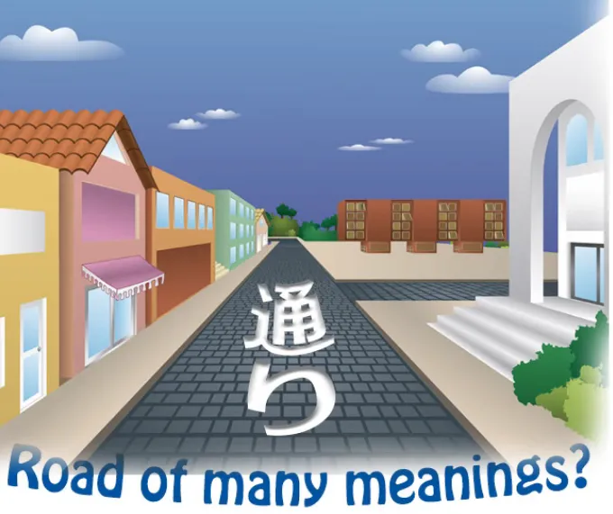
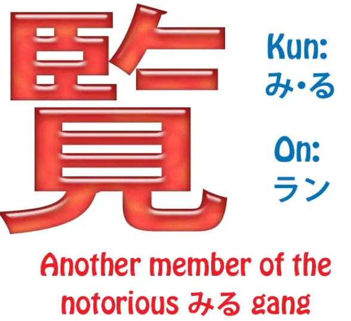
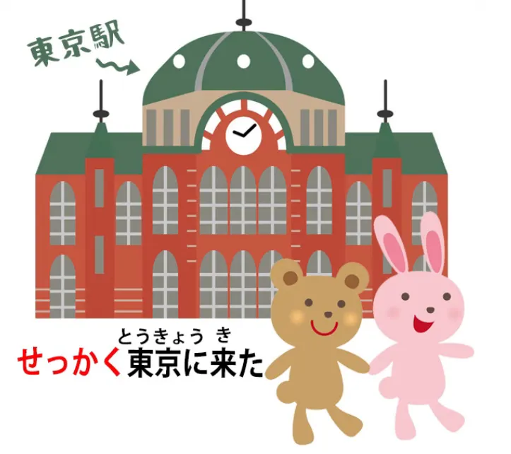
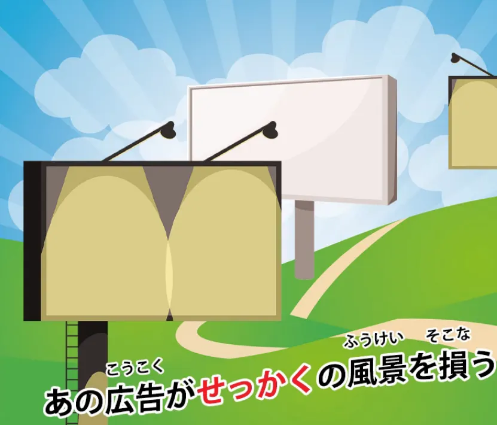
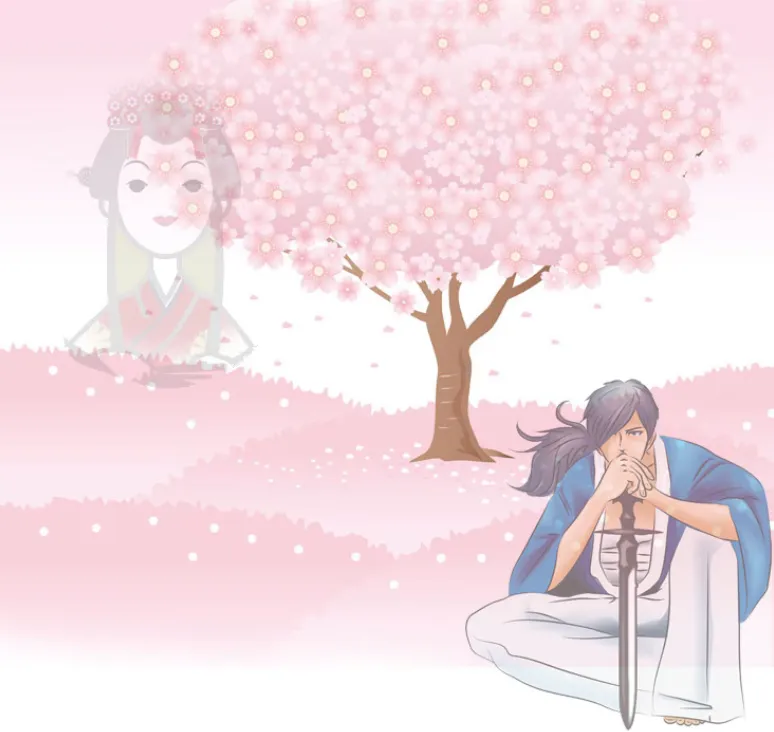

# **96. 通り и せっかく: Метафорическая дорога и непереводимое слово.**

[**通り and せっかく: A metaphorical road and an untranslatable word.**](https://www.youtube.com/watch?v=G3qc0esEbvE&ab_channel=OrganicJapanesewithCureDolly)

こんにちは, и добро пожаловать в <code>令和三年</code> (2021).

Менее двух лет назад (видео 2021 года) началась эра <code>Рэйва</code> (2019) с приливом надежды на чудесную новую эру. А затем наступил <code>Рэйва 2</code> (2020), который быстро оказался довольно катастрофическим годом. Это должен был быть год Токийской Олимпиады, и мы все знаем, что с ней случилось.

Но я всё ещё верю, что <code>Рэйва</code> будет чудесной новой эрой, и, возможно, <code>令和三年</code> начнёт нам это показывать. Сегодня мы поговорим о двух словах, о которых меня недавно спрашивали.

## 通り

**Первое — это <code>通り</code> в его присоединении к другим словам.**

**<code>通り</code>, конечно, само по себе, является <code>い-основой</code> глагола <code>通る</code> (проходить насквозь).**

**А как существительное оно означает <code>дорогу</code> или <code>путь</code>, или <code>акт прохождения насквозь</code>.**

### その通り

**Затем оно используется в выражениях вроде <code>その通り</code>**, и буквально это означает **<code>та дорога, или тот способ передвижения, тот способ прохождения насквозь</code>**.

**А на самом деле это означает <code>это верно / вы абсолютно правы</code>.**

Как же оно приобретает такое значение?

**Ну, это действительно означает, что ваш образ мышления, дорога, путь, проход, по которому вы мыслите, является правильным: <code>その通り</code>.**

Немного похоже на английское выражение <code>you're on the right track</code> (вы на правильном пути), за исключением того, что <code>you're on the right track</code> в английском подразумевает, что вы ещё не совсем там, **но <code>その通り</code> означает, что вы мыслите абсолютно в правильном направлении, вы там, вы поняли, вы правы.**

### ごらんの通り / ご覧の通り

**Ещё одно выражение, использующее <code>通り</code>, это <code>ごらんの通り</code>.**

Итак, <code>ごらん</code>, когда оно пишется кандзи, пишется вот так.

::: info
<code>御覧</code> — это полная версия <code>кандзи</code> для <code>ごらん</code>, даже с почтительным префиксом <code>ご</code> в форме <code>кандзи</code>, но чрезмерное использование <code>кандзи</code> для всего тоже не очень жизнеспособно, хотя это зависит от слов и использования.
:::
Итак, **вы видите, что <code>ご</code> — это почтительный префикс; <code>覧</code> — это на самом деле ещё один способ написания слова <code>見る</code>.**

Некоторое время назад [**я делала видео**](https://www.youtube.com/watch?v=6Kh1AJx77Ng) о слове <code>見る</code> (видеть, смотреть или наблюдать) и пяти различных <code>кандзи</code>, которыми оно может быть написано.

<code>見る, 観る, 看る, 診る, 視る</code>

**И я тогда сказала, что на самом деле их больше.** Я не стала их представлять, потому что они не так уж распространены, и этот (<code>覧る</code>) тоже не является распространённым способом написания <code>見る</code>.

Но с его <code>он-чтением</code> <code>らん</code> оно используется, и **<code>ご[覧]{らん}</code> — это почтительный способ сказать <code>акт смотрения или видения</code>.**

**Итак, <code>ご覧の通り</code>, очень похоже на <code>その通り</code>**, означает **<code>как вы можете видеть / в соответствии с вашим видением это правильно</code>,** точно так же, как в соответствии с вашим высказыванием или мышлением это правильно.

**<code>ご覧の通り</code> (как вы можете видеть).**

### 思い通り

**Ещё одно выражение с <code>通り</code> — это <code>[思]{おも}い[通]{どお}り</code>.**

Итак, **здесь, конечно, мы используем <code>い-основу</code> глагола <code>思う</code>,** который переводится как <code>думать</code> в английском, **но на самом деле означает больше, чем это, он означает <code>чувствовать</code>.**

**Но <code>思い</code> часто также означает <code>свою волю, своё желание</code>,** и я упоминала это в предыдущем видео[[42]](./42-basic-word-confusion-まま.md), когда объясняла, как **<code>思いのまま</code>** означает **<code>в неизменном состоянии своей воли или желания</code>.** И я оставлю ссылку на это, если вы захотите продолжить изучение.

**<code>思い通り</code> означает <code>на дороге, пути, курсе своей воли или желания</code>, поэтому это означает, что всё идёт или хочется, чтобы всё шло в соответствии со своей волей / в соответствии со своими желаниями.**

---

**И это может быть что угодно: от эгоистичного желания до, когда вы в воде, возможно, желания, чтобы ваше тело двигалось так, как вы хотите,** чего оно не всегда делает, когда вы в воде.

## せっかく

**Теперь, другое слово, о котором меня спрашивали, это <code>せっかく</code>.**

Итак, <code>せっかく</code> имеет целый ряд определений, если вы посмотрите в словаре.

**Оно определяется как <code>с трудом, с большими усилиями; редкий, ценный, драгоценный, долгожданный; добрый, щедрый; специально, нарочно</code>,** что довольно много для одного слова.

**Но по сути все они сводятся к одному и тому же, а именно к понятию, что что-то ценно и в некотором смысле незаменимо.**

### せっかく как <code>делать x с большим усилием / трудом и слишком ценно, чтобы заменить</code>

Итак, **вероятно, наиболее распространённое значение — это то, что на это было потрачено много усилий.**

Так, если мы говорим <code>せっかくの努力が水の泡だ</code>, **мы говорим <code>Мои **せっかく** усилия сошли на нет</code>,** буквально <code>...это пена на воде / пузыри на воде</code>.

Таким образом, мы видим, что это, очевидно, наиболее распространённое употребление, употребление, о котором люди, вероятно, думают чаще всего, **а именно <code>с большим усилием / с большим трудом / приложив усилия (чтобы что-то сделать)</code>.**

---

Мы могли бы сказать <code>**せっかく**東京に来た, we ought to go to Sanrio Puroland</code>,

**потому что если вы приложили столько усилий, чтобы добраться до Токио, это будет пустой тратой времени, если вы не попадёте в Sanrio Puroland** и не увидите Hello Kitty, My Melody, Pom Pom Purin и всех замечательных персонажей, которые там живут, Little Twin Stars.

**Если вы когда-нибудь <code>せっかく</code> доберётесь до Токио, вы действительно должны туда пойти.**

---

Но вернёмся к предмету разговора.

**Однако суть <code>せっかく</code> не только в затраченных усилиях, но и в том, что что-то редко, ценно и труднозаменимо.**

**Поездка в Токио труднозаменима, потому что, как только вы уехали, вам придётся снова приложить все усилия, чтобы вернуться туда.**

Но вы также можете сказать <code>**せっかく**の休日も雨で潰れた</code> (<code>**せっかく**</code> выходной / праздник был испорчен дождём).

**И это <code>せっかく</code>, потому что это относительно редко. Вы не так часто получаете выходные.**

Так же, как поездка в Токио или все эти усилия, чтобы что-то сделать, **это <code>せっかく</code>, это ценно, это редко, это труднозаменимо.**

<code>あの広告が**せっかく**の風景を損なう</code> (эти рекламные щиты портят <code>**せっかく**</code> пейзаж).

**И опять же, <code>せっかく</code> в данном случае не означает тяжёлый труд, оно не означает редкость в смысле нечастого появления, оно просто означает, что этот пейзаж — нечто прекрасное, уникальное и незаменимое, и его портят рекламные щиты.**

---

**И в английском языке нет слова, которое могло бы заменить <code>せっかく</code>.**

Я бы сказала, что это слово в некотором смысле находится под влиянием японской культуры. **Идея ценности <code>сакуры</code>** (дерева), потому что **она цветёт лишь короткое время и быстро сдувается ветрами или сбивается дождём.**

Грусть, мимолётность, <code>儚い</code> природа жизни и необходимость ценить то, что редко и драгоценно, пока оно проходит, пока мы можем.

::: info
Это звучит совсем иначе, когда мы понимаем, что Долли скончалась в том же году… Покойся с миром. 🙁
:::
.