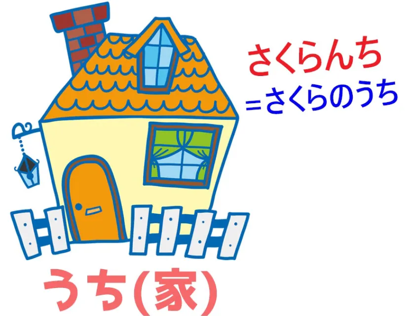
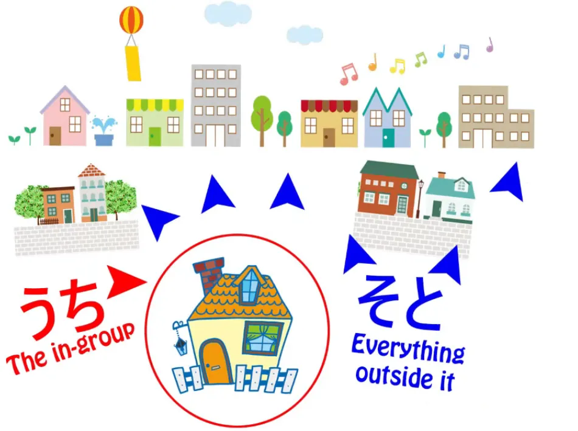
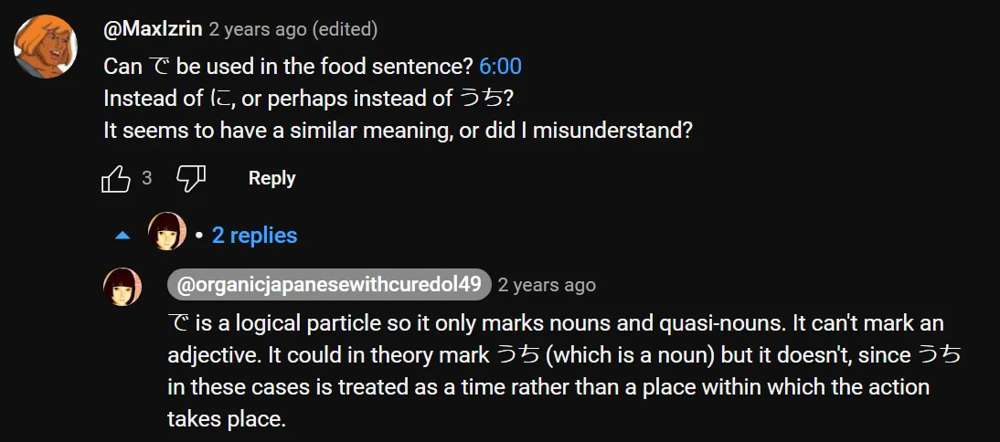
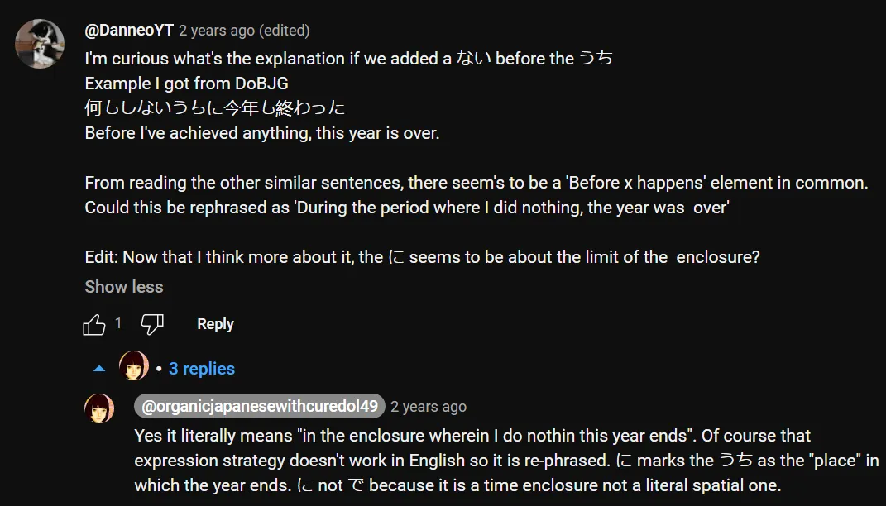
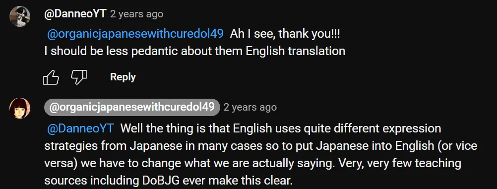

# **97. Значения うち: Дом, Я, Социальная граница, Маркер времени: いまのうち、そのうち**

[**Language and Culture: The meanings of うち: Home, Self, Social boundary, Time marker: いまのうち、そのうち**](https://www.youtube.com/watch?v=56sy0qfY0Js&ab_channel=OrganicJapanesewithCureDolly)

こんにちは。

Сегодня мы поговорим о слове, у которого в словаре целый длинный список определений, многие из которых, кажется, не имеют ничего общего друг с другом. Я даже не буду углубляться в этот список. Мы просто разберём это слово и то, что оно на самом деле означает, и посмотрим, как оно приобретает так много других расширенных значений.

**Это слово — <code>うち</code>, и это одно из слов, которые вы изучаете на ранних этапах японского языка.**

**Вероятно, первый контекст, в котором вы его узнаёте, это то, что оно является альтернативным способом произношения этого кандзи** *(家)*. **Это может быть <code>いえ</code>, но также может быть и <code>うち</code>, и оба они означают <code>дом</code>.**

**Это единственный способ, которым мы можем использовать этот кандзи.**

---

**Другое <code>うち</code> — это вот это — 内, и я не думаю, что мы должны рассматривать их как совершенно разные слова, потому что это исконно японское слово, к которому китайский кандзи был добавлен позже, и, как это часто бывает, кандзи немного помогает дифференцировать точное значение.** Но здесь лишь немного.

---

Итак, **когда <code>うち</code> означает <code>дом</code> *(家)*, разница между <code>いえ</code> и <code>うち</code> заключается в том, что <code>いえ</code> относится к физическому зданию, к самому <code>house</code>.** **<code>うち</code> относится к тому, что можно назвать духовной сутью <code>home</code>:** **семье, жизни, которая происходит в доме.**

В небольшой степени можно сказать, что это чем-то похоже на разницу в английском языке между словами <code>house</code> и <code>home</code>. **Если мы говорим, что навещаем чей-то <code>house</code>, мы обычно говорим <code>うち</code>, потому что это <code>house</code> в смысле их семьи, их <code>home</code>.** **Именно это мы и навещаем. Мы не навещаем физическое здание.**

И просто как небольшое примечание, **вы можете иногда встретить выражения вроде <code>さくらんち</code>.** **Это очень распространённое сокращение от <code>さくらのうち</code>.**

**Таким образом, это действительно даёт нам основу для всех других значений <code>うち</code>,** независимо от того, каким кандзи оно написано: **это понятие духовной сути, ограниченного пространства, определённого, так сказать, его содержимым.**

## うち как значение <code>я</code> / 私 и т.д.

Теперь, в следующий раз вы можете столкнуться с <code>うち</code>, когда увидите, например, в аниме, девушку, которая **использует <code>кансай-бэн</code>, и обычно она будет говорить <code>うち</code> вместо <code>私</code>.**

**Итак, <code>うち</code> может означать <code>я</code>, особенно в женской речи,** **особенно в кансайском диалекте, хотя этим не ограничивается.**

---

**И это очень интересно, потому что это довольно похоже на то, когда** **<code>こちら</code> используется для обозначения <code>я</code>;** **опять же, <code>こちら</code> означает <code>эта сторона (сторона, которая включает меня)</code>.**

И это действительно нужно понимать в свете того факта, что **различие между индивидуумом и семьёй или группой, к которой принадлежит индивидуум, гораздо менее выражено в японской культуре, чем в западной, а в прошлом было ещё менее выражено, чем сейчас.**

---

**Когда японцы говорят, например, о <code>моей младшей сестре</code>, как правило, они не скажут <code>僕の妹</code> или <code>私の妹</code>.** Они, скорее, скажут <code>**うち**の妹</code> (младшая сестра **нашего дома** / младшая сестра **нашей семьи** / младшая сестра **нашей группы**).

И даже <code>**うち**のきょう</code>, что означает <code>религия **нашего дома**, **нашей семьи**, **нашей группы**</code>, **потому что религия в Японии до сих пор в значительной степени рассматривается как нечто унаследованное, нечто, являющееся частью семейной группы,** **а не индивидуальное решение или обязательство.**

## うち против そと

**Теперь, из этого мы получаем очень фундаментальное различие в японском языке,** **которое заключается в понятиях <code>[内]{うち}</code> и <code>[外]{そと}</code>.** **<code>うち</code> относится к группе, к которой человек принадлежит, к своей группе;** **<code>そと</code> относится ко всему, что находится за пределами этой группы.**

И это имеет далеко идущие последствия для японской культуры, а также для японского языка.

---

**Например, слова вроде <code>くれる</code> и <code>あげる</code>, которые обычно** **объясняются как передача чего-то от себя или** **получение чего-то для себя,** **не строго ограничены самим собой.**

---

**На самом деле они относятся к <code>うち</code>, которое может** **быть самим собой, но также может быть и группой, к которой человек принадлежит.** **Итак, когда мы говорим о том, что кто-то <code>くれる</code>-ит вашей сестре или вашему другу,** **это потому, что мы рассматриваем сестру или друга как часть нашего <code>うち</code>,** следовательно, это передача <code>нам</code>.

**И вы иногда увидите, что <code>くれる</code> используется даже там, где** **нет строгой связи между говорящим и получателем,** **но если говорящий отождествляет себя с этим человеком, рассматривая его в данный момент** **по крайней мере как более <code>うち</code>, чем <code>そと</code>, то <code>くれる</code> уместно.**

---

Таким образом, мы видим, что вся эта концепция <code>うち / そと</code>, которая имеет далеко идущие культурные последствия, в которые я не буду углубляться, также имеет последствия для используемых нами грамматических структур.

## うち используется для определения группы, частью которой является x

Теперь, развивая эту мысль, **<code>うち</code> может использоваться для определения группы, частью которой является что угодно.** Так, мы можем сказать <code>多くの**うち**から選ぶ</code>, что означает <code>выбрать из большого количества</code> или, строго говоря, <code>выбрать из **группы, состоящей** из большого количества</code>.

**Итак, <code>うち</code> здесь относится к группе, из которой производится выбор.**

---

**И это может стать немного более абстрактным.** **Оно может относиться к <code>うち</code> времени, к ограниченному пространству времени,** **и опять же, к ограниченному пространству, определённому его содержимым.**

Так, мы можем сказать <code>温かい**うち**に食べる</code>, что означает <code>съесть это, **пока** оно тёплое</code>. <code>Съесть это, **пока** оно горячее</code>, как мы бы сказали по-английски. <code>**温かいうち**</code> — это то <code>うち</code>, **то ограниченное пространство, тот период, в течение которого еда тёплая.**

Итак, **это ограниченное пространство, определённое его содержимым, как и другие виды <code>うち</code>.** **Когда заканчивается <code>うち</code>? Оно заканчивается, когда еда перестаёт быть тёплой.**

::: info

:::

Аналогично, <code>若い**うち**</code> (**пока** молод) — следует делать то-то и то-то, **пока** молод. **<code>うち</code>, ограниченное пространство времени, определяется его содержимым.**

**Пока** человек молод, он находится в <code>若い**うち**</code>. **Когда он перестаёт быть молодым, там и лежат границы этого ограниченного пространства.**

### 今のうち

И **это может распространяться на употребления, которые поначалу могут немного сбивать с толку.** Например, <code>**今のうち**</code>, фразу, которую вы часто услышите в аниме и тому подобном. Например, когда враг обезврежен и настало время для магического очищения, кто-то может крикнуть <code>**今のうち**!</code>

И это буквально означает <code>**в доме сейчас** / **в ограниченном пространстве сейчас**</code>. **Это не обязательно означает <code>этот абсолютный миг</code>,** **но это означает <code>пока продолжается «сейчас»</code>.**

---

Что означает <code>сейчас</code> в данном случае? Ну, **<code>сейчас</code> означает ситуацию, как она есть в настоящее время,** в данном случае, **пока** злодей всё ещё поддаётся очищению, **пока** он обезврежен, **пока** мы можем сделать то, что нам нужно.

Это может означать, **пока** мы ещё можем убежать. Это может означать, **пока** Великая Дверь ещё не закрылась. Другими словами, <code>**今のうち**</code> — это <code>**пока обстоятельства, преобладающие в данный момент, продолжают преобладать**</code>.

**Как только они перестанут преобладать, вы больше не будете в <code>今のうち</code>.**

### そのうち

И ещё одно, что может показаться запутанным, это <code>そのうち</code>.

Итак, **<code>そのうち</code>** переводится как, и действительно означает, **<code>рано или поздно / когда-нибудь в будущем / это в конечном итоге произойдёт / со временем</code>.** Так почему же <code>そのうち</code> означает это?

Чтобы понять это, нам нужно не только понять <code>うち</code>, но и немного больше о <code>その</code>.

#### Что означает その

Итак, я сделала видео[[75]](./75-japanese-is-not-english-how-expression-strategies-differ-polite-英本語-rude-japanese.md), в котором объясняю различные вещи об использовании <code>その</code> в японском языке. **Оно очень часто заменяет то, что в английском было бы местоимениями.** Так что если мы говорим <code>さくらと**その**犬</code>, мы **не** говорим <code>Sakura и та собака</code>.

Мы говорим <code>Сакура и **её** собака</code>.

**<code>その</code> часто подразумевает что-то, связанное с тем, о чём мы говорим.** **И это одна из стратегий, которая используется** **ввиду того факта, что японский язык не так уж часто использует местоимения.**

---

Несколько более абстрактное употребление, например, в словарном определении, таком как <code>**立ち会う**</code>, что означает <code>**находиться в месте в качестве свидетеля**</code>, а японское определение — <code>証人として**その**場に出る</code>, что означает <code>в качестве свидетеля, появиться в **том** месте, выйти в **том** месте</code>. **Но что означает <code>то место</code> в этой ситуации?** **Что на самом деле означает <code>その</code>?**

**Это означает просто любое подходящее место, место, соответствующее текущей ситуации.**

#### Итак, что означает そのうち?

И **это тот вид <code>その</code>, который используется в <code>そのうち</code>.** **<code>そのうち</code> означает в течение ограниченного пространства времени, которое является подходящим** **для того, о чём мы говорим (это произойдёт).**

**<code>そのうち</code> означает, что это произойдёт в течение периода времени,** **который является разумным для этого,** что может показаться немного расплывчатым, но это не более расплывчато, чем эквивалентные английские выражения, такие как <code>однажды / рано или поздно / вскоре</code>. **Оно немного более конкретно в том смысле, что оно, как правило, подразумевает** **время, которое не слишком поздно, чтобы быть полезным.**

Таким образом, именно так <code>うち</code> расширяет своё значение от довольно конкретных до всё более и более абстрактных, все из которых тесно связаны с фундаментальным значением.

::: info

**Если вы дошли до этого места, то я благодарю вас, и вы потрясающие!**

*Таким образом, мы наконец-то достигли конца… Мне потребовалось примерно 1,5 года на редактирование, так что скоро я немного отдохну, успел как раз к 2024 году :D Хотя мне ещё нужно будет обновить уроки 26-78, думаю, позже.
Действительно, довольно долгое путешествие, я полагаю (\*^ω^)八(⌒▽⌒)
У Долли всего 204 видео, так что осталось ещё около 100 с лишним видео, но, увы, это выходит за рамки моих нынешних сил, я могу время от времени добавлять некоторые видео, если захочу, если найду хороший способ скопировать субтитры и всё такое (эти 97 уроков были здесь до того, как я стал редактором).*

*Я хотел бы добавить некоторые из [**видео Долли по погружению**](https://www.youtube.com/watch?v=xhEnMieHtec&list=PLg9uYxuZf8x_iLm90ie4ewro0lFedXncO&ab_channel=OrganicJapanesewithCureDolly) и [**видео по изучению лексики / кандзи**](https://www.youtube.com/watch?v=3rT1zaHSmog&list=PLg9uYxuZf8x-W5kcce4zVNwK_JHjxHK5x&ab_channel=OrganicJapanesewithCureDolly) в особенности, так как считаю их очень полезными. Хотя сейчас я хотел бы сосредоточиться на большом количестве ввода.
В любом случае, этот Транскрипт должен хорошо охватить общие вещи, которые вы затем сможете закрепить самостоятельно, основы у вас к этому моменту уже должны быть заложены довольно хорошо.*

*---
Продолжайте в том же духе и потребляйте тонны и тонны реального японского контента, и если можете, используйте язык на практике. Именно так его и приобретают. Просто продолжайте, и станет легче.*

*Очевидно, что все виды ресурсов вы можете найти в [**моём документе с ресурсами**](https://docs.google.com/document/d/1kxYa53a2UjnpMZyHdU-YNuctkq6wHT3cJ00Z5poj2hY/edit#heading=h.pl6re36m6uy2) на первой странице.
Ещё раз, единственный способ <code>Git Gud</code> — это вложить время и АКТИВНЫЕ усилия! 頑張ります!
Вы можете связаться со мной в [**Discord**](https://discord.com/users/501133947044888605) или по почте, если что.*

*Особенно если вы найдёте опечатку или неверную информацию / примечание, или если у вас есть какие-либо советы и т.д.*

***Я благодарю людей, которые обращались ко мне с добрыми словами, сообщали об ошибках и т.д., обратная связь очень радует меня!***

***В завершение я хотел бы поблагодарить [**Nunko**](https://discordapp.com/users/367391904343523339) (ранее Dinuz) из [**MoeWay**](https://learnjapanese.moe/) за весь этот транскрипт и за то, что он позволил мне не только редактировать его, но и со временем стать его владельцем.
Я очень ценю это! Обязательно посетите MoeWay и присоединяйтесь к их Discord! Удивительное сообщество.
Очевидно, я также хотел бы поблагодарить каждого редактора, который работал над этим транскриптом, будь то до моего прихода или после, оказывая помощь в редактировании!
Я благодарю всех вас и спасибо за ваш вклад!***

***Fin*** *(пока что, по крайней мере…)*

:::

[1] Robert Van Valin, <code>Semantic Macroroles in Role and Reference Grammar,</code> Role and Reference Grammar, 2002, [**https://rrg.caset.buffalo.edu/rrg/vanvalin\_papers/SemMRsRRG.pdf**](https://rrg.caset.buffalo.edu/rrg/vanvalin_papers/SemMRsRRG.pdf), p. 1-3. Just in case. From that big note in Lesson 13 (for some reason pageless mode puts footnote citations here & I can’t use collapsible headings without it…)